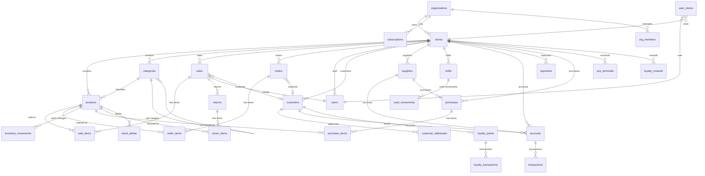

# Database Documentation / توثيق قاعدة البيانات

The Alhai platform uses a dual-database architecture: a local Drift (SQLite) database for offline operation and Supabase (PostgreSQL) as the cloud source of truth.

> For the full detailed documentation, see [docs/DATABASE.md](docs/DATABASE.md) and [docs/02-database.md](docs/02-database.md).

---

## 1. Architecture Overview / نظرة عامة

| Layer          | Technology                  | Purpose                              |
|----------------|-----------------------------|--------------------------------------|
| **Local**      | Drift 2.14 (SQLite / WASM)  | Offline storage, instant reads/writes|
| **Remote**     | Supabase (PostgreSQL 15)    | Cloud sync, multi-device, RLS        |
| **Encryption** | SQLCipher                   | AES-256 encryption on local DB       |
| **Search**     | FTS5                        | Full-text search on products         |

```
+--------------------+           +--------------------+
|  Drift (Local)     |  <-sync-> |  Supabase (Cloud)  |
|  41 tables         |           |  24+ tables        |
|  SQLite / WASM     |           |  PostgreSQL + RLS  |
|  SQLCipher encrypt |           |  Realtime + RPC    |
+--------------------+           +--------------------+
```

### File Locations

| Component        | Path                                            |
|------------------|-------------------------------------------------|
| Table definitions| `packages/alhai_database/lib/src/tables/`        |
| DAOs             | `packages/alhai_database/lib/src/daos/`          |
| FTS5 search      | `packages/alhai_database/lib/src/fts/`           |
| Seeders          | `packages/alhai_database/lib/src/seeders/`       |
| DB connection    | `packages/alhai_database/lib/src/connection*.dart`|
| Base schema      | `supabase/supabase_init.sql`                     |
| Migrations       | `supabase/migrations/`                           |

---

## 2. Key Tables / الجداول الرئيسية

### Core Business

| Table               | Purpose                                        |
|---------------------|------------------------------------------------|
| `organizations`     | Multi-tenant organizations                     |
| `stores`            | Individual store locations                     |
| `users`             | All platform users                             |
| `org_members`       | Organization membership                        |
| `store_members`     | Store membership with roles                    |

### Products and Inventory

| Table               | Purpose                                        |
|---------------------|------------------------------------------------|
| `products`          | Store-level product catalog                    |
| `org_products`      | Organization-level master catalog              |
| `categories`        | Product categories (hierarchical)              |
| `inventory_movements`| Stock adjustments (received, sold, damaged)   |
| `stock_deltas`      | Batch stock changes for sync                   |
| `stock_takes`       | Physical inventory counts                      |
| `stock_transfers`   | Inter-store stock transfers                    |

### Sales and Payments

| Table               | Purpose                                        |
|---------------------|------------------------------------------------|
| `sales`             | Completed sales transactions                   |
| `sale_items`        | Line items for each sale                       |
| `invoices`          | ZATCA-compliant invoices                       |
| `accounts`          | Customer credit/debt accounts                  |
| `held_invoices`     | Paused/held POS invoices                       |

### Orders and Delivery

| Table               | Purpose                                        |
|---------------------|------------------------------------------------|
| `orders`            | Online customer orders                         |
| `order_items`       | Line items per order                           |
| `deliveries`        | Delivery assignments                           |
| `driver_locations`  | Real-time driver GPS                           |

### Operations

| Table               | Purpose                                        |
|---------------------|------------------------------------------------|
| `shifts`            | Cashier shift open/close                       |
| `expenses`          | Store expense records                          |
| `daily_summaries`   | End-of-day aggregated stats                    |
| `audit_log`         | System audit trail                             |
| `notifications`     | In-app notifications                           |

---

## 3. Entity Relationship Diagram / مخطط العلاقات



---

## 4. Migration History / تاريخ الترحيلات

Base schema: `supabase/supabase_init.sql` (must run first).

| Version | Date       | File                                         | Description                              |
|---------|------------|----------------------------------------------|------------------------------------------|
| --      | 2026-01-15 | `20260115_add_r2_images.sql`                 | Cloudflare R2 multi-size image columns   |
| --      | 2026-01-19 | `20260119_secure_public_products.sql`        | Remove public read RLS; secure via Edge Function |
| --      | 2026-02-23 | `20260223_tighten_rls_write_policies.sql`    | Restrict INSERT/UPDATE/DELETE to admin/manager |
| v14     | 2026-03-05 | `20260305_v14_org_products_online_orders.sql`| org_products catalog, online columns, Realtime |
| v15     | 2026-03-05 | `20260305_v15_invoices.sql`                  | ZATCA-compliant invoices table           |
| v16     | 2026-03-05 | `20260305_v16_rpc_functions.sql`             | RPC: apply_stock_deltas, reserve/release stock |
| v17     | 2026-03-06 | `20260306_v17_customers_sales_tables.sql`    | Create customers, sales, sale_items      |
| v18     | 2026-03-06 | `20260306_v18_sales_payment_breakdown.sql`   | Add cash/card/credit amount columns      |
| v19     | 2026-04-01 | `20260401_v19_delivery_system.sql`           | Delivery system: driver_locations, statuses |
| v20     | 2026-04-01 | `20260401_v20_store_online_columns.sql`      | Store delivery settings, customer_addresses |

### How to Apply Migrations

```bash
# 1. Run base schema first (from Supabase SQL Editor)
supabase/supabase_init.sql

# 2. Run each migration in chronological order
supabase/migrations/20260115_add_r2_images.sql
supabase/migrations/20260119_secure_public_products.sql
# ... continue through v20
```

---

## 5. Local Schema Versions / اصدارات المخطط المحلي

The Drift database has its own schema versioning (separate from Supabase):

| Version | Description                                                    |
|---------|----------------------------------------------------------------|
| v1      | Base tables: products, sales, sale_items, inventory_movements, accounts, sync_queue |
| v2      | Add transactions table                                         |
| v3      | Add orders and order_items tables                              |
| v4      | Add audit_log table                                            |
| v5      | Add categories table                                           |
| v6      | Add loyalty tables: loyalty_points, loyalty_transactions, loyalty_rewards |
| v7      | Add FTS5 for fast product search                               |
| v8      | Add stores, users, customers, suppliers, shifts, returns, expenses |
| v9      | Add WhatsApp tables: whatsapp_messages, whatsapp_templates     |
| v10     | Add multi-tenant tables: organizations, subscriptions, org_members |
| v11     | Add sync tables: sync_metadata, stock_deltas                   |
| v12     | Add deleted_at column for soft delete support                  |
| v13     | Unify quantity columns to REAL type (support fractional quantities) |

Migration callbacks are defined in `packages/alhai_database/lib/src/app_database.dart`.

---

## 6. Sync System / نظام المزامنة

The sync engine lives in `packages/alhai_sync/` and bridges local Drift with Supabase.

### Sync Flow

```
1. App starts
   +-> initial_sync (first time: download all store data)
   +-> realtime_listener (subscribe to orders, deliveries)

2. User makes a change (e.g., creates a sale)
   +-> Write to Drift (local DB)
   +-> Enqueue in sync_queue (table_name, record_id, operation, payload)

3. Sync engine runs (periodic or on-reconnect)
   +-> Read sync_queue entries in order
   +-> POST/PATCH/DELETE to Supabase
   +-> On success: delete from sync_queue
   +-> On conflict: conflict_resolver decides winner

4. Pull sync (periodic)
   +-> GET records where updated_at > last_synced_at
   +-> Upsert into local Drift DB
   +-> Update sync_metadata with new timestamp
```

### Conflict Resolution

Default strategy is **last-write-wins** based on `updated_at`. Custom logic exists for:
- **Products**: delta-based stock_qty merging
- **Sales**: server always wins (immutable once synced)
- **Settings**: local wins (user preferences)

---

## 7. RLS Policies Summary / ملخص سياسات امن الصفوف

Every table has Row Level Security (RLS) enabled, using three helper functions:

```sql
is_super_admin()           -- true if user role = 'super_admin'
is_store_member(store_id)  -- true if user is an active member of the store
is_store_admin(store_id)   -- true if user is owner/manager OR super_admin
```

| Operation | Who Can Do It              | Typical Policy                          |
|-----------|----------------------------|-----------------------------------------|
| SELECT    | Any store member           | `USING (is_store_member(store_id))`     |
| INSERT    | Admin/Manager only         | `WITH CHECK (is_store_admin(store_id))` |
| UPDATE    | Admin/Manager only         | `USING/WITH CHECK (is_store_admin(...))`|
| DELETE    | Admin/Manager only         | `USING (is_store_admin(store_id))`      |

See [SECURITY.md](SECURITY.md) for the full RLS coverage matrix.
