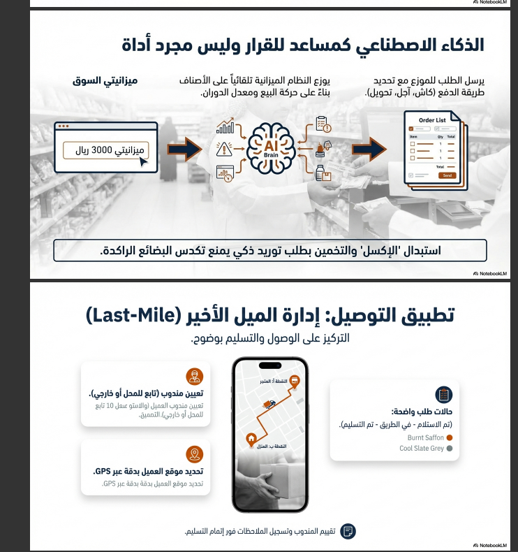

# 📊 دراسة الجدوى المالية وتوقعات الأرباح
# Alhai Smart Grocery Platform

**التاريخ**: 2026-01-16  
**الإصدار**: 1.0  
**النوع**: دراسة جدوى للمستثمرين

---

## 📋 ملخص تنفيذي

هذه الدراسة تقدم تحليلاً مالياً شاملاً لمنصة "بقالة الحي" تشمل:
- تكاليف التأسيس والتشغيل
- توقعات الإيرادات والأرباح
- نقطة التعادل (Break-Even Point)
- ثلاث سيناريوهات: متفائل، متوسط، غير متفائل

---

## 💰 تكاليف التأسيس (الاستثمار الأولي)

| البند | التكلفة | الفترة |
|-------|---------|--------|
| **التطوير البرمجي** | 20,000 ر.س | 4 أشهر |
| **تكاليف الاستضافة (4 أشهر)** | 0 ر.س | (طبقة مجانية) |
| **المجموع** | **20,000 ر.س** | - |

> **ملاحظة**: تكاليف الاستضافة في البداية تكون صفر لأن معظم الخدمات توفر طبقة مجانية كافية للانطلاق.

---

## 📊 هيكل التكاليف التشغيلية

### التكاليف الثابتة الشهرية (للبدء)

| الخدمة | التكلفة الشهرية | ملاحظات |
|--------|-----------------|---------|
| Supabase Pro | 94 ر.س | قاعدة البيانات |
| Cloudflare Pages | 94 ر.س | الاستضافة |
| **الإجمالي الثابت** | **188 ر.س** | الحد الأدنى للتشغيل |

### التكاليف المتغيرة (حسب عدد البقالات)

| الخدمة | التكلفة/بقالة/شهر |
|--------|-------------------|
| WhatsApp Business | 30 ر.س |
| Google Vision (OCR) | ~1.70 ر.س |
| Gemini AI | ~0.05 ر.س |
| Google Maps | ~1 ر.س |
| Translation API | ~0.40 ر.س |
| Cloudflare R2 | ~0.26 ر.س |
| **إجمالي/بقالة** | **~33.40 ر.س** |

---

## 💵 هيكل الإيرادات

### الباقات المقترحة

| الباقة | السعر الشهري | الميزات الرئيسية |
|--------|-------------|------------------|
| 🟢 **الأساسية** | 149 ر.س | POS + OCR محدود |
| 🟡 **الاحترافية** | 299 ر.س | كل الميزات + AI |
| 🔴 **السلاسل** | 499 ر.س | B2B + فروع متعددة |

### متوسط الإيراد لكل بقالة (ARPU)

| السيناريو | التوزيع المتوقع | متوسط ARPU |
|-----------|-----------------|------------|
| **متفائل** | 30% أساسي، 50% احترافي، 20% سلاسل | **293 ر.س** |
| **متوسط** | 40% أساسي، 45% احترافي، 15% سلاسل | **269 ر.س** |
| **غير متفائل** | 60% أساسي، 35% احترافي، 5% سلاسل | **218 ر.س** |

---

## 📈 هامش الربح لكل بقالة

```
╔══════════════════════════════════════════════════════════════╗
║                    حساب هامش الربح                           ║
╠══════════════════════════════════════════════════════════════╣
║  متوسط الإيراد (ARPU)      :  269 ر.س/شهر                   ║
║  تكلفة متغيرة/بقالة        : -33 ر.س/شهر                    ║
║  ─────────────────────────────────────────────               ║
║  صافي الربح/بقالة          :  236 ر.س/شهر                   ║
║  هامش الربح                :  87.7%                          ║
╚══════════════════════════════════════════════════════════════╝
```

---

## 🎯 نقطة التعادل (Break-Even Analysis)

### المعادلة الأساسية

```
نقطة التعادل = الاستثمار الأولي ÷ (صافي الربح/بقالة × عدد البقالات)
```

### السيناريوهات الثلاثة

---

### 🟢 السيناريو المتفائل

**الافتراضات:**
- نمو سريع: 10 بقالات/شهر
- ARPU: 293 ر.س
- صافي الربح/بقالة: 260 ر.س

| الشهر | عدد البقالات | الإيرادات | التكاليف | صافي الربح | الربح التراكمي |
|-------|-------------|-----------|----------|------------|----------------|
| 1 | 10 | 2,930 | 522 | 2,408 | 2,408 |
| 2 | 20 | 5,860 | 856 | 5,004 | 7,412 |
| 3 | 30 | 8,790 | 1,190 | 7,600 | 15,012 |
| **4** | **40** | **11,720** | **1,524** | **10,196** | **25,208** ✅ |
| 5 | 50 | 14,650 | 1,858 | 12,792 | 38,000 |
| 6 | 60 | 17,580 | 2,192 | 15,388 | 53,388 |

> 🎉 **نقطة التعادل: الشهر الرابع** (40 بقالة)
> 
> 💰 **الربح نهاية السنة الأولى**: ~175,000 ر.س

---

### 🟡 السيناريو المتوسط

**الافتراضات:**
- نمو معتدل: 5 بقالات/شهر
- ARPU: 269 ر.س
- صافي الربح/بقالة: 236 ر.س

| الشهر | عدد البقالات | الإيرادات | التكاليف | صافي الربح | الربح التراكمي |
|-------|-------------|-----------|----------|------------|----------------|
| 1 | 5 | 1,345 | 355 | 990 | 990 |
| 2 | 10 | 2,690 | 522 | 2,168 | 3,158 |
| 3 | 15 | 4,035 | 689 | 3,346 | 6,504 |
| 4 | 20 | 5,380 | 856 | 4,524 | 11,028 |
| 5 | 25 | 6,725 | 1,023 | 5,702 | 16,730 |
| **6** | **30** | **8,070** | **1,190** | **6,880** | **23,610** ✅ |
| 7 | 35 | 9,415 | 1,357 | 8,058 | 31,668 |
| 8 | 40 | 10,760 | 1,524 | 9,236 | 40,904 |

> 🎯 **نقطة التعادل: الشهر السادس** (30 بقالة)
> 
> 💰 **الربح نهاية السنة الأولى**: ~100,000 ر.س

---

### 🔴 السيناريو غير المتفائل

**الافتراضات:**
- نمو بطيء: 3 بقالات/شهر
- ARPU: 218 ر.س
- صافي الربح/بقالة: 185 ر.س

| الشهر | عدد البقالات | الإيرادات | التكاليف | صافي الربح | الربح التراكمي |
|-------|-------------|-----------|----------|------------|----------------|
| 1 | 3 | 654 | 288 | 366 | 366 |
| 2 | 6 | 1,308 | 388 | 920 | 1,286 |
| 3 | 9 | 1,962 | 488 | 1,474 | 2,760 |
| 4 | 12 | 2,616 | 588 | 2,028 | 4,788 |
| 5 | 15 | 3,270 | 689 | 2,581 | 7,369 |
| 6 | 18 | 3,924 | 789 | 3,135 | 10,504 |
| 7 | 21 | 4,578 | 889 | 3,689 | 14,193 |
| 8 | 24 | 5,232 | 989 | 4,243 | 18,436 |
| **9** | **27** | **5,886** | **1,089** | **4,797** | **23,233** ✅ |
| 10 | 30 | 6,540 | 1,190 | 5,350 | 28,583 |

> ⚠️ **نقطة التعادل: الشهر التاسع** (27 بقالة)
> 
> 💰 **الربح نهاية السنة الأولى**: ~50,000 ر.س

---

## 📊 ملخص نقاط التعادل

```
┌─────────────────────────────────────────────────────────────┐
│              ملخص نقاط التعادل - الاستثمار 20,000 ر.س       │
├─────────────────────────────────────────────────────────────┤
│                                                             │
│  🟢 متفائل      ████████░░░░░░░░░░░░░░  الشهر 4  (40 بقالة) │
│                                                             │
│  🟡 متوسط       ████████████░░░░░░░░░░  الشهر 6  (30 بقالة) │
│                                                             │
│  🔴 غير متفائل  ████████████████████░░  الشهر 9  (27 بقالة) │
│                                                             │
└─────────────────────────────────────────────────────────────┘
```

---

## 📈 توقعات الأرباح - 3 سنوات

### السيناريو المتوسط (الأكثر واقعية)

| السنة | البقالات | الإيرادات السنوية | صافي الربح السنوي | الربح التراكمي |
|-------|----------|-------------------|-------------------|----------------|
| **السنة 1** | 60 | 193,560 ر.س | 100,000 ر.س | 80,000 ر.س |
| **السنة 2** | 150 | 483,900 ر.س | 350,000 ر.س | 430,000 ر.س |
| **السنة 3** | 300 | 967,800 ر.س | 750,000 ر.س | 1,180,000 ر.س |

> 💡 **العائد على الاستثمار (ROI) بعد 3 سنوات: 5,900%**

---

## 💎 نقاط القوة للمستثمر

### 1. 🎯 سوق ضخم غير مستغل
```
┌────────────────────────────────────────────┐
│  عدد البقالات في السعودية: ~45,000 بقالة  │
│  المستهدف السنة الأولى: 60 بقالة (0.13%)  │
│  إمكانية النمو: هائلة                      │
└────────────────────────────────────────────┘
```

### 2. 🏆 لا منافس مباشر
- **لا يوجد** نظام يقدم OCR + AI + B2B معاً
- ميزة تنافسية قوية جداً
- حاجز دخول عالي للمنافسين

### 3. 📊 هامش ربح مرتفع
- هامش ربح **87.7%** لكل بقالة
- التكاليف المتغيرة منخفضة جداً
- قابلية التوسع بدون زيادة كبيرة في التكاليف

### 4. 💵 إيرادات متكررة
- نموذج اشتراك شهري (SaaS)
- إيرادات ثابتة ومتوقعة
- عملاء طويلي الأمد

### 5. 🚀 سرعة الوصول للسوق
- جاهزية الإطلاق: 4 أشهر
- استثمار أولي منخفض: 20,000 ر.س
- عائد سريع على الاستثمار

---

## ⚠️ المخاطر وخطط التخفيف

| المخاطر | الاحتمالية | التأثير | خطة التخفيف |
|---------|------------|---------|-------------|
| بطء اكتساب العملاء | متوسط | عالي | حملات تسويقية مستهدفة + تجربة مجانية |
| منافسين جدد | منخفض | متوسط | التطوير المستمر + براءة اختراع للخوارزميات |
| مشاكل تقنية | منخفض | متوسط | فريق دعم فني + نظام مراقبة |
| تغيرات أسعار APIs | منخفض | منخفض | احتياطي مالي + بدائل مجانية |

---

## 📋 خطة استخدام الاستثمار

| البند | المبلغ | النسبة |
|-------|--------|--------|
| التطوير البرمجي | 17,000 ر.س | 85% |
| التصميم والـ UX | 2,000 ر.س | 10% |
| احتياطي طوارئ | 1,000 ر.س | 5% |
| **الإجمالي** | **20,000 ر.س** | 100% |

---

## 🎯 ملخص للمستثمر

```
╔══════════════════════════════════════════════════════════════╗
║                  فرصة استثمارية - بقالة الحي                 ║
╠══════════════════════════════════════════════════════════════╣
║                                                              ║
║  💰 الاستثمار المطلوب      : 20,000 ر.س                     ║
║                                                              ║
║  ⏱️ فترة التطوير           : 4 أشهر                         ║
║                                                              ║
║  🎯 نقطة التعادل (متوسط)   : 6 أشهر (30 بقالة)              ║
║                                                              ║
║  📈 الربح السنة الأولى     : ~100,000 ر.س                   ║
║                                                              ║
║  💎 الربح بعد 3 سنوات      : ~1,180,000 ر.س                 ║
║                                                              ║
║  🚀 ROI بعد 3 سنوات        : 5,900%                         ║
║                                                              ║
║  ⭐ الميزة التنافسية       : لا منافس مباشر في السعودية      ║
║                                                              ║
╚══════════════════════════════════════════════════════════════╝
```

---

## 📞 معلومات التواصل

| | |
|---|---|
| **أصحاب المشروع** | باسم محمد الحجري |
| | عبدالحافظ محمد على المغربي |
| **البريد الإلكتروني** | basem902@gmail.com |

---

**📅 تاريخ إعداد الدراسة**: 2026-01-16  
**✍️ المُعد**: باسم محمد الحجري  
**📌 الحالة**: جاهزة للعرض على المستثمرين ✅

---

> **تنويه**: هذه التوقعات مبنية على افتراضات معقولة وقد تختلف النتائج الفعلية حسب ظروف السوق والتنفيذ.
