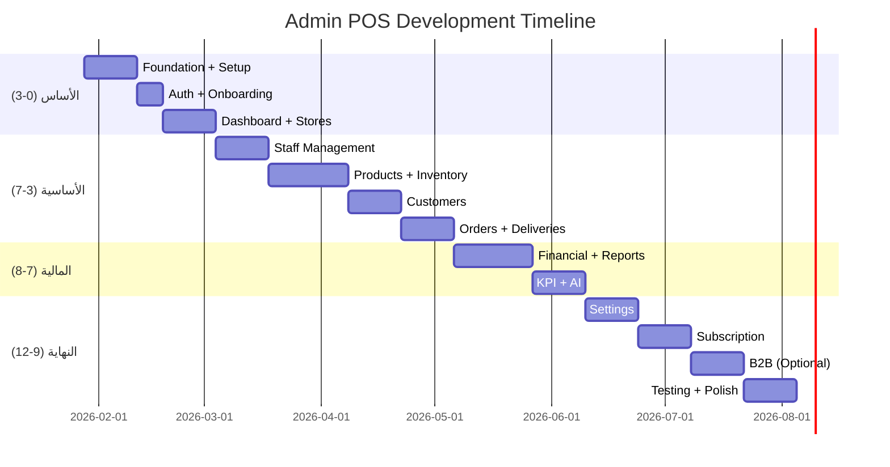

# 🏢 Admin POS - Implementation Plan

> **Version:** 1.0.0 | **Date:** 2026-01-28 | **Status:** 📋 Planning Complete

---

## 📌 نظرة عامة

**التطبيق:** نظام إدارة البقالات SaaS Multi-Tenant  
**المنصات:** Mobile (iOS/Android) + Web + Desktop (Windows/macOS)  
**إجمالي الشاشات:** 106 شاشة (94 أساسية + 12 B2B)  
**إجمالي المهام:** 100+ مهمة  
**المدة الإجمالية:** 24 أسبوع  
**إجمالي الساعات:** ~720 ساعة  

---

## 🎯 الأهداف الرئيسية

1. ✅ SaaS Multi-Tenant لأصحاب البقالات
2. ✅ إدارة عدة فروع (Stores)
3. ✅ إدارة الموظفين (Managers/Cashiers/Drivers)
4. ✅ إدارة المخزون والمستودعات
5. ✅ التقارير المالية وKPI
6. ✅ نقل المخزون والموظفين بين الفروع
7. ✅ نظام الاشتراكات (Basic/Pro/Enterprise)
8. ✅ AI Insights

---

## 📅 الجدول الزمني

---

## 💳 الاشتراكات

| الخطة | السعر | البقالات | الموظفين | AI | النقل |
|-------|-------|---------|---------|-----|-------|
| **Basic** | 99 ر.س/شهر | 1 | 3 | ❌ | ❌ |
| **Pro** | 249 ر.س/شهر | 3 | 10 | ✅ | ✅ |
| **Enterprise** | Custom | ∞ | ∞ | ✅+ | ✅ |

---

## 📱 قائمة الشاشات (106)

### Phase 1: Auth (6 شاشات) - P0

| # | الشاشة | Route |
|---|--------|-------|
| 1 | Splash | `/splash` |
| 2 | Onboarding | `/onboarding` |
| 3 | Login | `/login` |
| 4 | Sign Up | `/signup` |
| 5 | Pending Approval | `/pending-approval` |
| 6 | Forgot Password | `/forgot-password` |

### Phase 2: Dashboard & Stores (14 شاشة)

| P0 (7) | P1 (4) | P2 (3) |
|--------|--------|--------|
| Dashboard | Analytics | Map View |
| Stores List | QR Code | Performance |
| Create Store | Hours | Branding |
| Store Details | Zones | |
| Settings | Comparison | |

### Phase 3: Staff (10 شاشات)

| P0 (5) | P1 (2) | P2 (3) |
|--------|--------|--------|
| Staff List | Permissions | Attendance |
| Add Cashier | Transfer | Performance |
| Add Driver | | Payroll |
| Add Manager | | |
| Details | | |

### Phase 4: Products (14 شاشة)

| P0 (7) | P1 (4) | P2 (3) |
|--------|--------|--------|
| Products List | Transfer | Scanner |
| Add Product | Transfer History | Bulk Import |
| Details | Stock Alerts | Audit |
| Edit | Expiry | |
| Categories | | |
| Warehouses | | |
| Warehouse Details | | |

### Phase 5: Customers (8 شاشات)

| P0 (3) | P1 (3) | P2 (2) |
|--------|--------|--------|
| List | Map | Shared |
| Details | Segments | Analytics |
| Accounts | Loyalty | |

### Phase 6: Orders (9 شاشات)

| P0 (3) | P1 (4) | P2 (2) |
|--------|--------|--------|
| Orders List | Deliveries Map | Refunds |
| Order Details | Tracking | Heatmap |
| Assign Driver | States | |
| | Returns | |

### Phase 7: Financial (12 شاشة)

| P0 (5) | P1 (3) | P2 (4) |
|--------|--------|--------|
| Dashboard | VAT | Commission |
| Sales Report | Profit/Loss | Trends |
| Debts Dashboard | Cashier | Expenses |
| Debts Report | | Tax |
| Payments | | |

### Phase 8: KPI & AI (7 شاشات)

| P1 (4) | P2 (3) |
|--------|--------|
| KPI Dashboard | Optimization |
| AI Insights | Predictions |
| Sales Trends | Recommendations |
| Customer Behavior | |

### Phase 9: Settings (8 شاشات)

| P0 (1) | P1 (2) | P2 (5) |
|--------|--------|--------|
| General | Notifications | Backup |
| | Payment Gateway | API Keys |
| | | Webhooks |
| | | Integrations |
| | | Security |

### Phase 10: Account (6 شاشات)

| P0 (4) | P1 (1) | P2 (1) |
|--------|--------|--------|
| Profile | Referrals | Earnings |
| Subscription | | |
| Billing | | |
| Upgrade | | |

---

## 👥 المستخدمون

| الدور | الصلاحيات |
|-------|----------|
| **Super Admin** | إدارة Owners, Marketers |
| **Marketer** | Referral codes, commissions |
| **Owner** | كل شيء في بقالاته |
| **Manager** | إدارة بقالة واحدة |
| **Cashier** | pos_app فقط |
| **Driver** | driver_app فقط |

---

## 🔗 التكاملات

| التطبيق | التكامل |
|---------|---------|
| `customer_app` | مراقبة الطلبات |
| `pos_app` | إنشاء Stores + Cashiers |
| `driver_app` | تعيين Deliveries |
| `alhai_core` | Models مشتركة |

---

## ✅ المعالم (Milestones)

| الأسبوع | المعلم |
|---------|--------|
| Week 4 | Auth + Dashboard + Create Store ✓ |
| Week 8 | Staff + Products + Customers ✓ |
| Week 12 | Orders + Financial Reports ✓ |
| Week 16 | KPI + AI (Pro plan) ✓ |
| Week 20 | Settings + Subscription ✓ |
| Week 24 | Testing + Release ✓ |

---

## 📚 المراجع

- [PRD_FINAL.md](./PRD_FINAL.md) - 106 شاشة
- [ADMIN_POS_SPEC.md](./ADMIN_POS_SPEC.md) - المواصفات التقنية
- [ADMIN_ARCHITECTURE.md](./ADMIN_ARCHITECTURE.md) - الهيكلة
- [ADMIN_UX_WIREFRAMES.md](./ADMIN_UX_WIREFRAMES.md) - التصميمات
- [PROD.json](./PROD.json) - قائمة المهام

---

**آخر تحديث:** 2026-01-28
