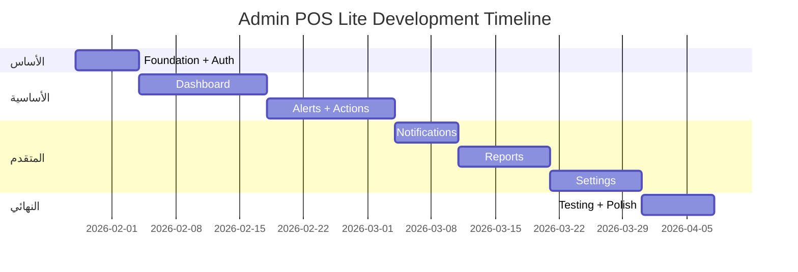

# 📱 Admin POS Lite - Implementation Plan

> **Version:** 1.0.0 | **Date:** 2026-01-28 | **Status:** 📋 Planning Complete

---

## 📌 نظرة عامة

**التطبيق:** نسخة خفيفة من Admin POS للقرارات السريعة  
**المنصة:** Mobile Only (iOS + Android)  
**إجمالي الشاشات:** 20 شاشة  
**إجمالي المهام:** 35 مهمة  
**المدة الإجمالية:** 8 أسابيع  
**إجمالي الساعات:** ~200 ساعة  

---

## 🎯 المفهوم الأساسي

### قاعدة 3-Tap:
```
أي معلومة أو action لازم ما تزيد عن 3 taps:

Tap 1: فتح التطبيق (بصمة)
Tap 2: Dashboard → Alert
Tap 3: Action (Approve/Reject)
Done! ✅
```

### الفرق عن admin_pos:

| admin_pos | admin_pos_lite |
|-----------|----------------|
| 106 شاشة | **20 شاشة** |
| Web + Mobile + Desktop | **Mobile Only** |
| إدارة كاملة | **قرارات سريعة** |
| 30-60 دقيقة | **2-5 دقائق** |

---

## 📅 الجدول الزمني



---

## 📱 قائمة الشاشات (20)

### Phase 1: Auth (2 شاشات) - P0

| # | الشاشة | Route |
|---|--------|-------|
| 1 | Splash | `/splash` |
| 2 | Login | `/login` |

### Phase 2: Dashboard (5 شاشات)

| # | الشاشة | Route | الأولوية |
|---|--------|-------|----------|
| 3 | Main Dashboard | `/dashboard` | P0 |
| 4 | Stores Snapshot | `/stores` | P0 |
| 5 | Store Details | `/stores/:id/details` | P0 |
| 6 | Financial Summary | `/financial/summary` | P1 |
| 7 | Performance Comparison | `/stores/compare` | P1 |

### Phase 3: Alerts & Actions (5 شاشات)

| # | الشاشة | Route | الأولوية |
|---|--------|-------|----------|
| 8 | Alerts List | `/alerts` | P0 |
| 9 | Alert Details | `/alerts/:id` | P0 |
| 10 | Quick Approvals | `/approvals` | P0 |
| 11 | Approval Details | `/approvals/:id` | P0 |
| 12 | Quick Actions | `/quick-actions` | P1 |

### Phase 4: Notifications (2 شاشة)

| # | الشاشة | Route | الأولوية |
|---|--------|-------|----------|
| 13 | Notifications Center | `/notifications` | P0 |
| 14 | Notification Details | `/notifications/:id` | P1 |

### Phase 5: Reports (2 شاشة)

| # | الشاشة | Route | الأولوية |
|---|--------|-------|----------|
| 15 | Today's Performance | `/reports/today` | P1 |
| 16 | Quick Reports | `/reports/quick` | P2 |

### Phase 6: Settings (4 شاشات)

| # | الشاشة | Route | الأولوية |
|---|--------|-------|----------|
| 17 | Profile | `/profile` | P0 |
| 18 | Notification Settings | `/settings/notifications` | P1 |
| 19 | Quick Settings | `/settings` | P1 |
| 20 | About & Help | `/about` | P2 |

---

## ⚡ الميزات الفريدة

| الميزة | الوصف |
|--------|-------|
| **3-Tap Rule** | أي action في 3 نقرات كحد أقصى |
| **Real-time** | Dashboard يتحدث كل 5 ثواني |
| **Biometric** | بصمة/Face ID للدخول السريع |
| **Swipe** | اسحب يمين/يسار للموافقة/الرفض |
| **Push** | إشعارات حسب الأولوية |

---

## 🚀 أهداف الأداء

| المعيار | الهدف |
|---------|-------|
| حجم التطبيق | < 15 MB |
| وقت الإطلاق | < 1 ثانية |
| تحميل Dashboard | < 2 ثانية |
| استجابة API | < 300ms |
| معدل الإطارات | 60 FPS |
| استخدام الذاكرة | < 150 MB |

---

## 🔗 التكامل

### يشارك مع admin_pos:
- ✅ نفس قاعدة بيانات Supabase
- ✅ نفس RLS policies
- ✅ نفس حسابات المالكين

### يستخدم من الحزم:
- `alhai_core` - Models مشتركة
- `alhai_design_system` - UI Components

---

## ✅ المعالم (Milestones)

| الأسبوع | المعلم |
|---------|--------|
| Week 1 | Auth + Dashboard skeleton ✓ |
| Week 3 | Dashboard + Stores complete ✓ |
| Week 4 | Alerts + Approvals complete ✓ |
| Week 5 | Notifications complete ✓ |
| Week 6 | Reports + Settings ✓ |
| Week 8 | Testing + Release ✓ |

---

## 📚 المراجع

- [PRD_FINAL.md](./PRD_FINAL.md) - 20 شاشة
- [ADMIN_LITE_SPEC.md](./ADMIN_LITE_SPEC.md) - المواصفات التقنية
- [AI_SMART_REORDER.md](./AI_SMART_REORDER.md) - ميزة AI
- [PROD.json](./PROD.json) - قائمة المهام

---

**آخر تحديث:** 2026-01-28
