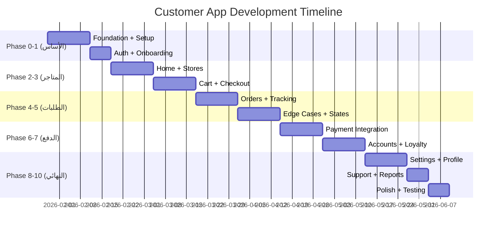

# 📱 Customer App - Implementation Plan

> **Version:** 1.0.0 | **Date:** 2026-01-28 | **Status:** 📋 Planning Complete

---

## 📌 نظرة عامة

**التطبيق:** تطبيق العملاء للطلب من البقالات  
**المنصة:** Mobile (iOS + Android)  
**إجمالي الشاشات:** 80 شاشة  
**إجمالي المهام:** 96 مهمة  
**المدة الإجمالية:** 16 أسبوع  
**إجمالي الساعات:** ~420 ساعة  

---

## 🎯 الأهداف الرئيسية

1. ✅ عميل واحد → عدة بقالات في الحي
2. ✅ ديون منفصلة لكل بقالة
3. ✅ طلبات منفصلة لكل بقالة
4. ✅ تتبع الطلبات real-time
5. ✅ نظام ولاء ونقاط
6. ✅ دعم RTL + Dark Mode

---

## 📅 الجدول الزمني

---

## 🔢 تفاصيل المراحل

### Phase 0: Foundation + Setup (الأسبوع 1-2)
**الساعات:** 40h | **الأولوية:** P0

| المهمة | الساعات | الاعتماديات |
|--------|---------|--------------|
| Project setup + DI + Router | 8h | - |
| Supabase + Models | 8h | Setup |
| Design System | 12h | Setup |
| Location Services | 8h | Setup |
| Localization (AR/EN) | 4h | Setup |

---

### Phase 1: Auth + Onboarding (الأسبوع 2-3)
**الساعات:** 32h | **الأولوية:** P0

| المهمة | الساعات |
|--------|---------|
| Onboarding screens (3 slides) | 6h |
| Signup screen | 8h |
| Login screen | 6h |
| OTP Verification | 6h |
| Global Customer creation | 4h |
| Auth state management | 2h |

---

### Phase 2: Home + Stores (الأسبوع 3-4)
**الساعات:** 40h | **الأولوية:** P0

| المهمة | الساعات |
|--------|---------|
| Home - Nearby Stores | 12h |
| Store card component | 4h |
| Store Details screen | 10h |
| Products List screen | 10h |
| Product Detail screen | 6h |
| Bottom Navigation | 4h |
| Global Search | 6h |
| Products Filter | 4h |

---

### Phase 3: Cart + Checkout (الأسبوع 5-6)
**الساعات:** 48h | **الأولوية:** P0

| المهمة | الساعات |
|--------|---------|
| Cart screen | 10h |
| Cart state management | 6h |
| Checkout screen | 12h |
| Schedule Delivery | 8h |
| Order Confirmation | 6h |
| Create Order API | 6h |

---

### Phase 4: Orders + Tracking (الأسبوع 6-7)
**الساعات:** 40h | **الأولوية:** P0/P1

| المهمة | الساعات |
|--------|---------|
| Orders List | 8h |
| Order Details | 10h |
| Order Tracking (map) | 12h |
| Real-time status updates | 6h |
| Cancel Order flow | 4h |
| Rate Driver screen | 4h |

---

### Phase 5: Edge Cases + States (الأسبوع 8-9)
**الساعات:** 48h | **الأولوية:** P0/P1

| المهمة | الساعات |
|--------|---------|
| No Stores state | 4h |
| Credit Unavailable state | 4h |
| Credit Limit Exceeded state | 6h |
| Price Changed state | 6h |
| Min Order Not Met state | 6h |
| Out of Delivery Area state | 4h |
| Store Closed state | 6h |
| No Slots Available state | 4h |
| Item Unavailable state | 6h |
| UI States (loading, error, empty) | 8h |

---

### Phase 6: Payment Integration (الأسبوع 9-10)
**الساعات:** 40h | **الأولوية:** P0/P1

| المهمة | الساعات |
|--------|---------|
| Payment Failed screen | 6h |
| Payment Pending screen | 6h |
| Refund Status screen | 6h |
| Payment Receipt screen | 4h |
| Pay Debt screen | 8h |
| Payment gateway integration | 12h |

---

### Phase 7: Accounts + Loyalty (الأسبوع 11-12)
**الساعات:** 36h | **الأولوية:** P1/P2

| المهمة | الساعات |
|--------|---------|
| My Accounts screen | 8h |
| Account Details screen | 6h |
| Transactions screen | 6h |
| Loyalty Dashboard | 8h |
| Challenges screen | 6h |
| Points History | 4h |
| Chat screens | 14h |
| Rate Store screen | 4h |

---

### Phase 8: Settings + Profile (الأسبوع 13-14)
**الساعات:** 32h | **الأولوية:** P1

| المهمة | الساعات |
|--------|---------|
| Profile Settings | 6h |
| Addresses management | 8h |
| Payment Methods | 6h |
| Notifications Settings | 4h |
| Substitution Preferences | 4h |
| Favorites screen | 6h |
| General Settings | 4h |
| Delete Account | 4h |
| Location screens | 10h |
| Notifications screen | 6h |

---

### Phase 9: Support + Reports (الأسبوع 15-16)
**الساعات:** 32h | **الأولوية:** P1/P2

| المهمة | الساعات |
|--------|---------|
| Support Center | 4h |
| Create Ticket | 6h |
| Ticket Details | 4h |
| Dashboard | 8h |
| Purchases Report | 4h |
| Debts Report | 4h |
| Security screens | 8h |
| Compliance screens | 8h |

---

### Phase 10: Polish + Testing (الأسبوع 16)
**الساعات:** 32h | **الأولوية:** P1

| المهمة | الساعات |
|--------|---------|
| Unit tests | 8h |
| Widget tests | 8h |
| Integration tests | 8h |
| Final polish | 8h |

---

## 📱 قائمة الشاشات حسب الأولوية

### P0 - الأساسيات (30 شاشة)

| # | الشاشة | المسار |
|---|--------|--------|
| 1 | Onboarding | `/onboarding` |
| 2 | Signup | `/auth/signup` |
| 3 | Login | `/auth/login` |
| 4 | Home | `/home` |
| 5 | Store Details | `/stores/:storeId` |
| 6 | Products List | `/stores/:storeId/products` |
| 7 | Cart | `/cart` |
| 8 | Checkout | `/orders/new` |
| 9 | Schedule | `/orders/:orderId/schedule` |
| 10 | Confirmation | `/orders/:orderId/confirmation` |
| 11 | Orders List | `/orders` |
| 12 | Order Details | `/orders/:orderId` |
| 13-20 | Edge Cases (8) | `/states/*` |
| 21-22 | Payment States | `/payments/*` |
| ... | ... | ... |

### P1 - الوظائف الكاملة (44 شاشة)

- Tracking, Chat, Loyalty
- Settings, Profile, Addresses
- Support, Security
- Refunds, Receipts

### P2 - ميزات إضافية (6 شاشات)

- Dashboard, Reports
- Transactions, Challenges
- AI Assistant (Future)

---

## 🔗 نقاط التكامل

### مع الحزم المشتركة

| الحزمة | المهام المرتبطة |
|--------|-----------------|
| `alhai_core` | Models, Utils |
| `alhai_services` | APIs, Auth |
| `alhai_design_system` | UI, Theme |

### مع التطبيقات الأخرى

| التطبيق | نقاط التكامل |
|---------|--------------|
| `cashier` | Orders sync |
| `driver_app` | Tracking, Chat |

### مع الخدمات الخارجية

| الخدمة | الاستخدام |
|--------|----------|
| Supabase | Auth, DB, Realtime |
| Payment Gateway | mada, STC Pay, Apple Pay |
| Firebase | Push Notifications |
| Maps | Location, Tracking |

---

## ✅ معايير القبول

### MVP (Phase 0-5)
- [ ] تسجيل وتسجيل دخول
- [ ] عرض البقالات القريبة
- [ ] طلب منتجات
- [ ] تتبع الطلب
- [ ] معالجة الحالات الحرجة

### Full Release (Phase 6-10)
- [ ] دفع إلكتروني
- [ ] نظام ولاء
- [ ] دعم فني
- [ ] تقارير

---

## 📚 المراجع

- [PRD_FINAL.md](./PRD_FINAL.md) - 80 شاشة
- [CUSTOMER_APP_SPEC.md](./CUSTOMER_APP_SPEC.md) - Multi-store
- [CUSTOMER_UX_WIREFRAMES.md](./CUSTOMER_UX_WIREFRAMES.md) - UX
- [CUSTOMER_API_CONTRACT.md](./CUSTOMER_API_CONTRACT.md) - APIs
- [PROD.json](./PROD.json) - قائمة المهام

---

**آخر تحديث:** 2026-01-28
