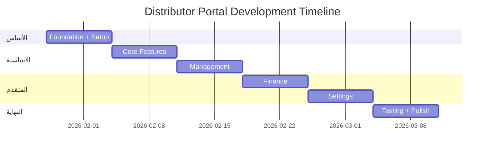

# 🏢 Distributor Portal - Implementation Plan

> **Version:** 1.0.0 | **Date:** 2026-01-28 | **Status:** 📋 Planning Complete

---

## 📌 نظرة عامة

**التطبيق:** بوابة B2B للموزعين وتجار الجملة  
**المنصة:** Web Only (Desktop Browser)  
**إجمالي الشاشات:** 25 شاشة  
**إجمالي المهام:** 35 مهمة  
**المدة الإجمالية:** 6 أسابيع  
**إجمالي الساعات:** ~160 ساعة  

---

## 🎯 المفهوم الأساسي

**Distributor Portal = منصة B2B للموزعين للبيع للبقالات**

```
فوائد للموزع:
├── الوصول لـ 150+ بقالة
├── طلبات أونلاين (حديثة)
├── فواتير تلقائية
├── تتبع المدفوعات
├── تحليلات الأداء
└── تقليل العمل اليدوي
```

---

## 📅 الجدول الزمني



---

## 📱 قائمة الشاشات (25)

### Phase 1: Core (8 شاشات) - P0

| # | الشاشة | Route |
|---|--------|-------|
| 1 | Login | `/login` |
| 2 | Dashboard | `/` |
| 3 | Product Catalog | `/products` |
| 4 | Add Product | `/products/add` |
| 5 | Edit Product | `/products/:id/edit` |
| 6 | Orders List | `/orders` |
| 7 | Order Details | `/orders/:id` |
| 8 | Analytics | `/analytics` |

### Phase 2: Management (7 شاشات)

| P0 (2) | P1 (5) |
|--------|--------|
| Create Offer | Stores Directory |
| Offers List | Store Details |
| | Inventory |
| | Pricing Tiers |
| | Categories |

### Phase 3: Finance (5 شاشات)

| P0 (4) | P1 (1) |
|--------|--------|
| Invoices | Financial Reports |
| Invoice Details | |
| Payments | |
| Payment Details | |

### Phase 4: Settings (5 شاشات)

| P0 (1) | P1 (4) |
|--------|--------|
| Company Profile | Team Members |
| | Delivery Zones |
| | Notifications |
| | Help & Support |

---

## 💰 نموذج الأعمال

### للمنصة (Alhai):
| المصدر | القيمة |
|--------|-------|
| Transaction fee | 2% per order |
| Featured listing | 500 ر.س/شهر |
| Premium tier | 1,000 ر.س/شهر |
| Enterprise | 2,500 ر.س/شهر |
| **إجمالي تقديري** | ~22,000 ر.س/شهر |

### للموزع:
| الباقة | السعر |
|--------|-------|
| Free | 0 ر.س (أساسي) |
| Pro | 500 ر.س/شهر |
| Enterprise | 1,000 ر.س/شهر |

---

## 🔗 التكامل

| التطبيق | التكامل |
|---------|---------|
| super_admin | Approval + Fees |
| admin_pos | Receive orders |
| pos_app | Delivery confirmation |

---

## ✅ المعالم (Milestones)

| الأسبوع | المعلم |
|---------|--------|
| Week 2 | Core + Dashboard ✓ |
| Week 3 | Offers + Management ✓ |
| Week 4 | Finance ✓ |
| Week 5 | Settings ✓ |
| Week 6 | Testing + Release ✓ |

---

**آخر تحديث:** 2026-01-28
