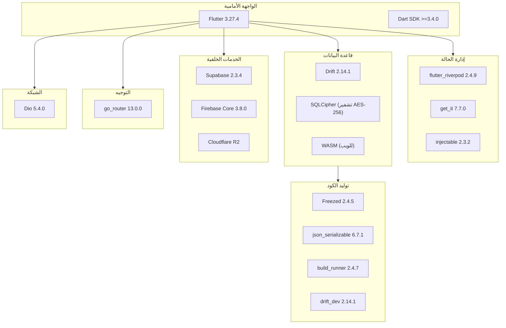
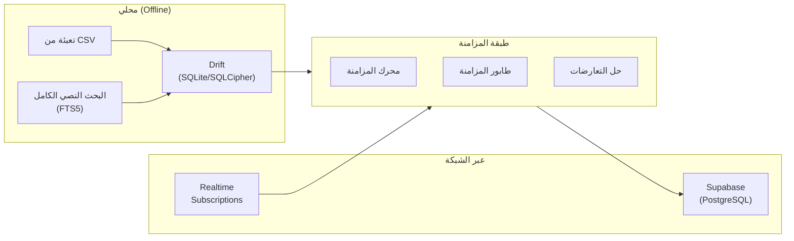
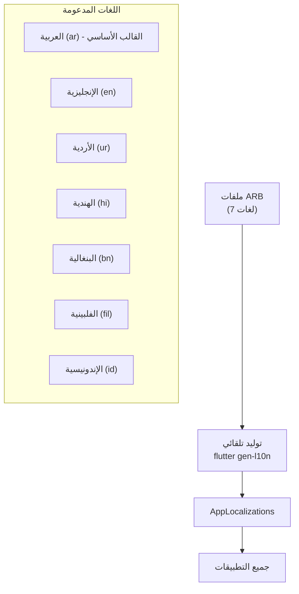
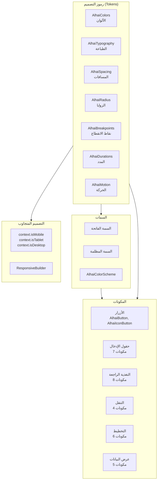
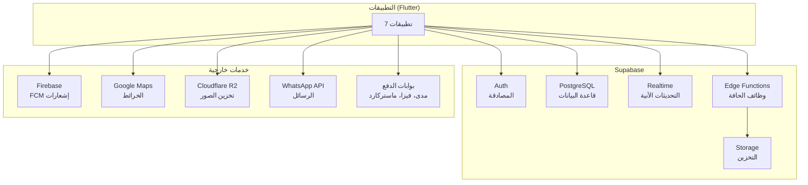
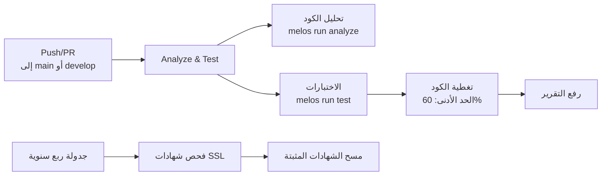
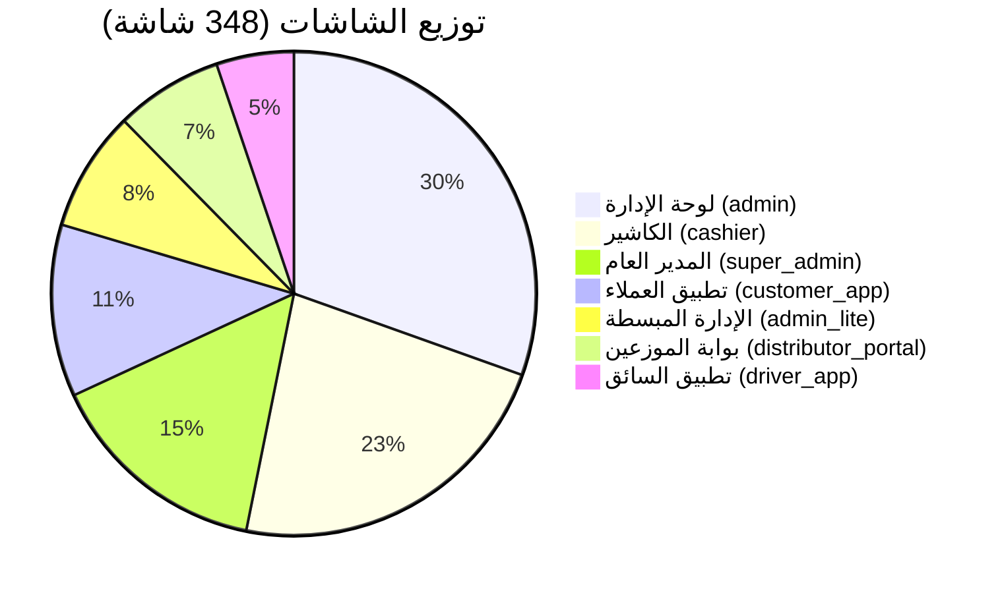

# هيكل مشروع الحي - التوثيق الشامل

**التاريخ**: 2026-02-28
**الإصدار**: 1.0.0
**الحالة**: مكتمل

---

## جدول المحتويات

1. [اسم المشروع ووصفه وهدفه](#1-اسم-المشروع-ووصفه-وهدفه)
2. [التطبيقات](#2-التطبيقات)
3. [الحزم المشتركة](#3-الحزم-المشتركة)
4. [شجرة المجلدات الرئيسية](#4-شجرة-المجلدات-الرئيسية)
5. [التقنيات المستخدمة](#5-التقنيات-المستخدمة)
6. [طريقة تشغيل المشروع](#6-طريقة-تشغيل-المشروع)
7. [متطلبات البيئة](#7-متطلبات-البيئة)
8. [مخطط العلاقات بين الحزم](#8-مخطط-العلاقات-بين-الحزم)
9. [قاعدة البيانات والجداول](#9-قاعدة-البيانات-والجداول)
10. [نظام الترجمة](#10-نظام-الترجمة)
11. [نظام التصميم](#11-نظام-التصميم)
12. [بنية الخدمات الخلفية](#12-بنية-الخدمات-الخلفية)
13. [التكامل المستمر](#13-التكامل-المستمر)
14. [إحصائيات المنصة](#14-إحصائيات-المنصة)

---

## 1. اسم المشروع ووصفه وهدفه

### الاسم
**الحي (Alhai)** - منصة البقالة الذكية

### الوصف
الحي هي منصة SaaS شاملة متعددة المستأجرين (Multi-Tenant) مصممة خصيصا لمتاجر البقالة في المملكة العربية السعودية. توفر المنصة نظاما بيئيا متكاملا يضم 7 تطبيقات تخدم جميع الأطراف المعنية: صاحب المتجر، الكاشير، العميل، السائق، الموزع، ومدير المنصة.

### الهدف
- توفير حل تقني شامل لمتاجر البقالة يغطي جميع العمليات من نقطة البيع حتى التوصيل
- دعم نظام B2B للتجارة بالجملة بين الموزعين وأصحاب المتاجر
- تقديم ميزات ذكاء اصطناعي لتحسين إدارة المخزون والتنبؤ بالطلبات
- دعم 7 لغات لخدمة القوى العاملة المتنوعة في السعودية
- توفير العمل بدون إنترنت (Offline-first) لتطبيق الكاشير

### نوع المشروع
مستودع أحادي (Monorepo) يُدار باستخدام أداة **Melos** لإدارة الحزم المتعددة.

### اسم المستودع في Melos
```yaml
name: alhai_monorepo
```

---

## 2. التطبيقات

المنصة تتكون من 7 تطبيقات رئيسية موزعة في مسارين:
- `apps/` - التطبيقات الأساسية الثلاثة (admin, admin_lite, cashier)
- الجذر - التطبيقات المستقلة (customer_app, driver_app, super_admin, distributor_portal)

### جدول ملخص التطبيقات

| التطبيق | الاسم التقني | المنصة | المستخدم | عدد الشاشات | المسار |
|---------|-------------|--------|---------|-------------|--------|
| لوحة الإدارة | `admin` | ويب + موبايل + سطح المكتب | صاحب المتجر | 106 | `apps/admin/` |
| الإدارة المبسطة | `admin_lite` | موبايل فقط | صاحب المتجر | 28 | `apps/admin_lite/` |
| الكاشير | `cashier` | سطح المكتب / تابلت | الكاشير | 79 | `apps/cashier/` |
| تطبيق العملاء | `customer_app` | موبايل | العميل | 40 | `customer_app/` |
| تطبيق السائق | `driver_app` | موبايل | سائق التوصيل | 18 | `driver_app/` |
| لوحة المدير العام | `super_admin` | ويب فقط | مدير المنصة | 52 | `super_admin/` |
| بوابة الموزعين | `distributor_portal` | ويب فقط | الموزع/تاجر الجملة | 25 | `distributor_portal/` |
| **المجموع** | | | | **348** | |

---

### 2.1 لوحة الإدارة (admin)

```
المسار: apps/admin/
الاسم التقني: admin
الوصف: Al-HAI Admin Dashboard - Full management system (all 123 screens)
الإصدار: 1.0.0+1
```

**الغرض**: نظام إدارة شامل لصاحب المتجر يتضمن إدارة المنتجات، المخزون، الطلبات، التقارير، نظام B2B للطلب من الموزعين، وميزات الذكاء الاصطناعي.

**الحزم المستخدمة**:
| الحزمة | الغرض |
|--------|--------|
| `alhai_core` | النواة المشتركة |
| `alhai_services` | طبقة الخدمات |
| `alhai_design_system` | نظام التصميم |
| `alhai_database` | قاعدة البيانات |
| `alhai_sync` | محرك المزامنة |
| `alhai_l10n` | الترجمة |
| `alhai_auth` | المصادقة |
| `alhai_shared_ui` | الواجهات المشتركة |
| `alhai_pos` | نقطة البيع |
| `alhai_ai` | الذكاء الاصطناعي |
| `alhai_reports` | التقارير |

**هيكل المجلدات الداخلي**:
```
apps/admin/lib/
├── core/           # إعدادات التطبيق الأساسية
├── data/           # طبقة البيانات المحلية
├── di/             # حقن الاعتماديات
├── providers/      # مزودات Riverpod
├── router/         # التوجيه (GoRouter)
├── screens/        # الشاشات
├── ui/             # مكونات الواجهة
└── main.dart       # نقطة الدخول
```

**الاعتماديات الخارجية الرئيسية**:
- `image_picker` - لالتقاط صور المنتجات
- `cached_network_image` - تخزين الصور مؤقتا
- `drift` - قاعدة البيانات المحلية
- `firebase_core` - خدمات Firebase

---

### 2.2 الإدارة المبسطة (admin_lite)

```
المسار: apps/admin_lite/
الاسم التقني: admin_lite
الوصف: Al-HAI Admin Lite - Quick monitoring, approvals, reports, AI
الإصدار: غير محدد
```

**الغرض**: تطبيق موبايل مبسط لصاحب المتجر للمراقبة السريعة، الموافقات، التقارير، والطلب التلقائي الذكي بالذكاء الاصطناعي. يختصر عملية الطلب من 50 دقيقة إلى 5 ثوانٍ.

**الحزم المستخدمة**: نفس حزم تطبيق الإدارة الكامل (باستثناء `alhai_pos`).

**هيكل المجلدات الداخلي**:
```
apps/admin_lite/lib/
├── core/           # إعدادات التطبيق
├── data/           # طبقة البيانات
├── di/             # حقن الاعتماديات
├── providers/      # مزودات Riverpod
├── router/         # التوجيه
├── screens/        # الشاشات
├── ui/             # مكونات الواجهة
└── main.dart       # نقطة الدخول
```

---

### 2.3 الكاشير (cashier)

```
المسار: apps/cashier/
الاسم التقني: cashier
الوصف: Al-HAI Cashier - Professional POS for cashiers (100% offline)
الإصدار: 1.0.0+1
```

**الغرض**: نظام نقطة بيع احترافي يعمل 100% بدون إنترنت. يدعم الدفع المقسم (نقدي + بطاقات متعددة + ائتمان)، مسح الباركود، الطباعة، وإرسال الإيصالات عبر واتساب.

**الحزم المستخدمة**:
| الحزمة | الغرض |
|--------|--------|
| `alhai_core` | النواة المشتركة |
| `alhai_services` | طبقة الخدمات |
| `alhai_design_system` | نظام التصميم |
| `alhai_database` | قاعدة البيانات (مشفرة بـ SQLCipher) |
| `alhai_sync` | محرك المزامنة |
| `alhai_l10n` | الترجمة |
| `alhai_auth` | المصادقة |
| `alhai_shared_ui` | الواجهات المشتركة |
| `alhai_pos` | نقطة البيع |
| `alhai_reports` | التقارير |

**هيكل المجلدات الداخلي**:
```
apps/cashier/lib/
├── core/           # إعدادات التطبيق
├── data/           # طبقة البيانات (CSV seeder)
├── di/             # حقن الاعتماديات (GetIt)
├── router/         # التوجيه (GoRouter)
├── screens/        # الشاشات
│   └── onboarding/ # شاشة الإعداد الأولي
├── ui/             # مكونات الواجهة
├── widgets/        # ودجات مخصصة
└── main.dart       # نقطة الدخول
```

**ميزات خاصة بالكاشير**:
- تشفير قاعدة البيانات المحلية باستخدام مفتاح مُخزّن في `FlutterSecureStorage`
- تحميل بيانات المتجر من ملفات CSV عند أول تشغيل
- تحليل CSV في isolate منفصل لعدم حجب واجهة المستخدم
- تشغيل Firebase + Supabase + مفتاح التشفير + SharedPreferences بالتوازي

---

### 2.4 تطبيق العملاء (customer_app)

```
المسار: customer_app/
الاسم التقني: customer_app
الوصف: Customer mobile application for Alhai grocery stores
الإصدار: 1.0.0+1
```

**الغرض**: تطبيق موبايل للعملاء لطلب البقالة عبر الإنترنت، تتبع الطلبات، برنامج الولاء، وتحديد موقع المتاجر القريبة.

**هيكل المجلدات الداخلي**:
```
customer_app/lib/
├── core/           # إعدادات وثوابت التطبيق
├── di/             # حقن الاعتماديات
├── features/       # الميزات (Feature-based architecture)
├── shared/         # مكونات مشتركة
└── main.dart       # نقطة الدخول
```

**الاعتماديات الخاصة**:
| المكتبة | الغرض |
|---------|--------|
| `google_maps_flutter` | عرض خرائط المتاجر |
| `geolocator` | تحديد الموقع الجغرافي |
| `firebase_messaging` | الإشعارات الفورية |
| `flutter_local_notifications` | الإشعارات المحلية |
| `image_picker` | رفع صور الملف الشخصي |
| `shimmer` | تأثيرات التحميل |
| `connectivity_plus` | مراقبة حالة الاتصال |

---

### 2.5 تطبيق السائق (driver_app)

```
المسار: driver_app/
الاسم التقني: driver_app
الوصف: Driver/Delivery application for Alhai grocery stores
الإصدار: 1.0.0+1
```

**الغرض**: تطبيق موبايل لسائقي التوصيل لإدارة عمليات التسليم، تتبع الموقع الجغرافي، التقاط صور إثبات التسليم، والتوقيع الإلكتروني.

**هيكل المجلدات الداخلي**:
```
driver_app/lib/
├── core/           # إعدادات التوجيه والتطبيق
├── di/             # حقن الاعتماديات
└── main.dart       # نقطة الدخول
```

**الاعتماديات الخاصة بالسائق**:
| المكتبة | الغرض |
|---------|--------|
| `google_maps_flutter` | عرض الخرائط والملاحة |
| `geolocator` | تتبع الموقع |
| `flutter_polyline_points` | رسم مسارات التوصيل |
| `flutter_background_service` | تتبع الموقع في الخلفية |
| `camera` | التقاط صور إثبات التسليم |
| `signature` | التوقيع الإلكتروني للاستلام |
| `firebase_messaging` | إشعارات الطلبات الجديدة |

---

### 2.6 لوحة المدير العام (super_admin)

```
المسار: super_admin/
الاسم التقني: super_admin
الوصف: Super Admin dashboard for Alhai Platform - Web only
الإصدار: 1.0.0+1
```

**الغرض**: لوحة تحكم ويب لمدير المنصة (God Mode) لإدارة جميع المتاجر، الاشتراكات، تحليلات الإيرادات، إدارة الموزعين، وحملات العروض.

**هيكل المجلدات الداخلي**:
```
super_admin/lib/
├── core/           # إعدادات التطبيق
├── di/             # حقن الاعتماديات
└── main.dart       # نقطة الدخول
```

**الاعتماديات الخاصة**:
| المكتبة | الغرض |
|---------|--------|
| `fl_chart` | الرسوم البيانية (مرخصة MIT) |
| `data_table_2` | جداول بيانات متقدمة |
| `alhai_auth` | المصادقة والتحكم بالوصول |

> **ملاحظة ترخيص**: يُستخدم `fl_chart` (MIT) بدلا من `syncfusion_flutter_charts` لتجنب قيود الترخيص التجاري.

---

### 2.7 بوابة الموزعين (distributor_portal)

```
المسار: distributor_portal/
الاسم التقني: distributor_portal
الوصف: Distributor Portal for Alhai Platform - Web only
الإصدار: 1.0.0+1
```

**الغرض**: بوابة ويب لتجار الجملة والموزعين لإدارة سوق B2B، الطلبات بالجملة، الفواتير التلقائية، وتصدير البيانات بصيغة Excel.

**هيكل المجلدات الداخلي**:
```
distributor_portal/lib/
├── core/           # إعدادات التوجيه
├── di/             # حقن الاعتماديات
├── screens/        # الشاشات
├── ui/             # مكونات الواجهة
└── main.dart       # نقطة الدخول
```

**الاعتماديات الخاصة**:
| المكتبة | الغرض |
|---------|--------|
| `fl_chart` | الرسوم البيانية |
| `data_table_2` | جداول البيانات |
| `file_picker` | رفع الملفات |
| `excel` | تصدير/استيراد Excel (.xlsx) |

> **ملاحظة**: حزمة `excel` مُضافة فقط في بوابة الموزعين لأنها تضيف ~2MB لحجم التطبيق ولا تحتاجها التطبيقات الأخرى.

---

## 3. الحزم المشتركة

المنصة تستخدم 11 حزمة مشتركة مقسمة إلى فئتين:

### حزم الجذر (Root-level)

| الحزمة | المسار | الوصف |
|--------|--------|--------|
| `alhai_core` | `alhai_core/` | النواة المشتركة - معمارية نظيفة |
| `alhai_services` | `alhai_services/` | طبقة منطق الأعمال |
| `alhai_design_system` | `alhai_design_system/` | نظام التصميم الموحد |

### حزم داخل packages/

| الحزمة | المسار | الوصف |
|--------|--------|--------|
| `alhai_database` | `packages/alhai_database/` | قاعدة البيانات والجداول و DAOs |
| `alhai_auth` | `packages/alhai_auth/` | المصادقة والأمان |
| `alhai_l10n` | `packages/alhai_l10n/` | الترجمة والتعريب (7 لغات) |
| `alhai_sync` | `packages/alhai_sync/` | محرك المزامنة والعمل بدون إنترنت |
| `alhai_pos` | `packages/alhai_pos/` | نقطة البيع والسلة والمدفوعات |
| `alhai_ai` | `packages/alhai_ai/` | شاشات وخدمات الذكاء الاصطناعي |
| `alhai_reports` | `packages/alhai_reports/` | التقارير وتصدير PDF |
| `alhai_shared_ui` | `packages/alhai_shared_ui/` | واجهات مشتركة بين التطبيقات |

---

### 3.1 alhai_core - النواة المشتركة

```yaml
name: alhai_core
description: Core package for Alhai application - Clean Architecture implementation
version: 1.0.0
sdk: '>=3.4.0 <4.0.0'
flutter: '>=3.10.0'
```

**الغرض**: تنفيذ المعمارية النظيفة (Clean Architecture) مع النماذج الأساسية، واجهات المستودعات، مصادر البيانات، والتكوينات.

**البنية الداخلية**:
```
alhai_core/lib/src/
├── config/              # إعدادات التطبيق
│   ├── app_endpoints.dart
│   ├── app_flavor.dart
│   ├── app_limits.dart
│   ├── environment.dart
│   ├── whatsapp_config.dart
│   └── supabase_config.dart
├── datasources/         # مصادر البيانات
│   ├── local/           # محلية
│   └── remote/          # عبر الشبكة (14 datasource)
├── di/                  # حقن الاعتماديات (GetIt + Injectable)
├── dto/                 # كائنات نقل البيانات
│   ├── analytics/
│   ├── auth/
│   ├── categories/
│   ├── debts/
│   ├── inventory/
│   ├── orders/
│   ├── products/
│   ├── purchases/
│   ├── reports/
│   ├── shared/
│   ├── stores/
│   └── suppliers/
├── exceptions/          # الاستثناءات المخصصة
├── models/              # نماذج المجال (Freezed)
│   ├── product.dart
│   ├── order.dart
│   ├── customer_account.dart
│   ├── cart.dart
│   ├── shift.dart
│   ├── store.dart
│   ├── supplier.dart
│   ├── wholesale_order.dart
│   └── ... (30+ نموذج)
├── monitoring/          # المراقبة
│   └── production_logger.dart
├── networking/          # طبقة الشبكة (Dio)
├── repositories/        # واجهات المستودعات (29 واجهة)
│   ├── auth_repository.dart
│   ├── products_repository.dart
│   ├── orders_repository.dart
│   ├── inventory_repository.dart
│   ├── wholesale_orders_repository.dart
│   └── ... (29 مستودع)
├── services/            # خدمات النواة
│   └── image_service.dart
└── utils/               # أدوات مساعدة
```

**النماذج الرئيسية** (جميعها تستخدم Freezed لتوليد الكود):

| النموذج | الملف | الوصف |
|---------|--------|--------|
| `Product` | `product.dart` | المنتج مع الباركود والسعر والمخزون |
| `Order` | `order.dart` | الطلب مع الحالة والعناصر |
| `Cart` | `cart.dart` | سلة التسوق |
| `Store` | `store.dart` | المتجر مع الإعدادات |
| `Shift` | `shift.dart` | وردية الكاشير |
| `Debt` | `debt.dart` | الديون والحسابات الآجلة |
| `Supplier` | `supplier.dart` | المورد |
| `WholesaleOrder` | `wholesale_order.dart` | طلب الجملة B2B |
| `Delivery` | `delivery.dart` | التوصيل |
| `CustomerAccount` | `customer_account.dart` | حساب العميل |

**مصادر البيانات عبر الشبكة (Remote Datasources)**:
- `auth_remote_datasource.dart` - المصادقة
- `products_remote_datasource.dart` - المنتجات
- `orders_remote_datasource.dart` - الطلبات
- `inventory_remote_datasource.dart` - المخزون
- `purchases_remote_datasource.dart` - المشتريات
- `suppliers_remote_datasource.dart` - الموردين
- `analytics_remote_datasource.dart` - التحليلات
- `debts_remote_datasource.dart` - الديون
- `categories_remote_datasource.dart` - التصنيفات
- `stores_remote_datasource.dart` - المتاجر
- `addresses_remote_datasource.dart` - العناوين
- `delivery_remote_datasource.dart` - التوصيل
- `reports_remote_datasource.dart` - التقارير

---

### 3.2 alhai_services - طبقة الخدمات

```yaml
name: alhai_services
description: Business logic service layer for Alhai platform
version: 1.0.0
```

**الغرض**: طبقة منطق الأعمال التي تنسق بين المستودعات وتنفذ القواعد التجارية.

**الخدمات المتوفرة** (41 خدمة):

| الخدمة | الملف | الوصف |
|--------|--------|--------|
| `AuthService` | `auth_service.dart` | المصادقة وتسجيل الدخول |
| `ProductService` | `product_service.dart` | إدارة المنتجات |
| `OrderService` | `order_service.dart` | إدارة الطلبات |
| `PaymentService` | `payment_service.dart` | المدفوعات |
| `AiService` | `ai_service.dart` | خدمات الذكاء الاصطناعي |
| `AnalyticsService` | `analytics_service.dart` | التحليلات |
| `BackupService` | `backup_service.dart` | النسخ الاحتياطي |
| `BarcodeService` | `barcode_service.dart` | مسح الباركود |
| `ChatService` | `chat_service.dart` | الدردشة |
| `DebtService` | `debt_service.dart` | الديون |
| `DeliveryService` | `delivery_service.dart` | التوصيل |
| `ExportService` | `export_service.dart` | التصدير |
| `ImportService` | `import_service.dart` | الاستيراد |
| `LoyaltyService` | `loyalty_service.dart` | نقاط الولاء |
| `NotificationService` | `notification_service.dart` | الإشعارات |
| `PrintService` | `print_service.dart` | الطباعة |
| `ReceiptService` | `receipt_service.dart` | الإيصالات |
| `RefundService` | `refund_service.dart` | المرتجعات |
| `ReportService` | `report_service.dart` | التقارير |
| `SearchService` | `search_service.dart` | البحث |
| `SettingsService` | `settings_service.dart` | الإعدادات |
| `SmsService` | `sms_service.dart` | الرسائل النصية |
| `StoreService` | `store_service.dart` | إدارة المتجر |
| `StoreMemberService` | `store_member_service.dart` | أعضاء المتجر |
| `SupplierService` | `supplier_service.dart` | الموردين |
| `TransferService` | `transfer_service.dart` | التحويلات المالية |
| `WhatsappServiceImpl` | `whatsapp_service_impl.dart` | واتساب |
| `WholesaleService` | `wholesale_service.dart` | تجارة الجملة |
| `DistributorService` | `distributor_service.dart` | الموزعين |
| `PromotionService` | `promotion_service.dart` | العروض |
| `RatingService` | `rating_service.dart` | التقييمات |
| `CacheService` | `cache_service.dart` | التخزين المؤقت |
| `ConfigService` | `config_service.dart` | الإعدادات |
| `GeoNotificationService` | `geo_notification_service.dart` | إشعارات الموقع |
| `PinValidationServiceImpl` | `pin_validation_service_impl.dart` | التحقق من PIN |
| `SyncQueueServiceImpl` | `sync_queue_service_impl.dart` | طابور المزامنة |
| `AddressService` | `address_service.dart` | العناوين |
| `ActivityLogService` | `activity_log_service.dart` | سجل النشاطات |

---

### 3.3 alhai_design_system - نظام التصميم

```yaml
name: alhai_design_system
description: Production-grade design system for Alhai multi-app suite (POS/Consumer/Delivery/Merchant)
version: 1.0.0
```

**الغرض**: نظام تصميم موحد على مستوى الإنتاج لجميع تطبيقات المنصة مع دعم كامل للعربية (RTL) والوضع المظلم.

**البنية الداخلية**:
```
alhai_design_system/lib/src/
├── tokens/              # رموز التصميم (Design Tokens)
│   ├── alhai_colors.dart
│   ├── alhai_typography.dart
│   ├── alhai_spacing.dart
│   ├── alhai_radius.dart
│   ├── alhai_breakpoints.dart
│   ├── alhai_durations.dart
│   └── alhai_motion.dart
├── theme/               # السمات
│   ├── alhai_theme.dart
│   ├── alhai_color_scheme.dart
│   └── theme_extensions.dart
├── responsive/          # التصميم المتجاوب
│   ├── context_ext.dart
│   └── responsive_builder.dart
├── components/          # المكونات
│   ├── buttons/         # الأزرار (AlhaiButton, AlhaiIconButton)
│   ├── inputs/          # حقول الإدخال (7 مكونات)
│   ├── feedback/        # التغذية الراجعة (8 مكونات)
│   ├── navigation/      # التنقل (4 مكونات)
│   ├── layout/          # التخطيط (6 مكونات)
│   ├── data_display/    # عرض البيانات (5 مكونات)
│   ├── images/          # الصور
│   └── dashboard/       # لوحة المعلومات
└── utils/               # أدوات مساعدة
    ├── input_formatters.dart
    └── validators.dart
```

**الخطوط المدعومة**:
| الخط | اللغة | الأوزان |
|------|--------|---------|
| `Tajawal` | العربية | 300, 400, 500, 700 |
| `NotoSansDevanagari` | الهندية | 400, 500, 700 |
| `NotoSansBengali` | البنغالية | 400, 500, 700 |

---

### 3.4 alhai_database - قاعدة البيانات

```yaml
name: alhai_database
description: Shared Drift database, tables, DAOs, FTS, and seeders for Alhai apps
version: 1.0.0
```

**الغرض**: قاعدة بيانات Drift مشتركة مع الجداول، كائنات الوصول للبيانات (DAOs)، البحث النصي الكامل (FTS)، وأدوات التعبئة.

**البنية الداخلية**:
```
packages/alhai_database/lib/
├── app_database.dart        # تعريف قاعدة البيانات
├── app_database.g.dart      # كود مولّد
├── connection.dart          # اتصال قاعدة البيانات
├── connection_native.dart   # اتصال للهواتف
├── connection_web.dart      # اتصال للويب (WASM)
├── schema.json              # مخطط قاعدة البيانات
├── daos/                    # كائنات الوصول (29 DAO)
├── enums/                   # تعدادات قاعدة البيانات
├── fts/                     # البحث النصي الكامل
├── repositories/            # التنفيذات المحلية
├── seeders/                 # أدوات التعبئة (CSV)
├── tables/                  # تعريفات الجداول (37 جدول)
└── utils/                   # أدوات مساعدة
```

**الجداول** (37 جدول):

| الجدول | الوصف |
|--------|--------|
| `products` | المنتجات |
| `categories` | التصنيفات |
| `sales` | المبيعات |
| `sale_items` | عناصر المبيعات |
| `orders` | الطلبات |
| `order_items` | عناصر الطلبات |
| `order_status_history` | تاريخ حالة الطلبات |
| `customers` | العملاء |
| `suppliers` | الموردين |
| `purchases` | المشتريات |
| `returns` | المرتجعات |
| `expenses` | المصروفات |
| `inventory_movements` | حركات المخزون |
| `stock_deltas` | فروقات المخزون |
| `stock_takes` | الجرد |
| `stock_transfers` | تحويلات المخزون |
| `product_expiry` | تواريخ الصلاحية |
| `shifts` | الورديات |
| `transactions` | المعاملات المالية |
| `accounts` | الحسابات |
| `discounts` | الخصومات |
| `favorites` | المفضلة |
| `held_invoices` | الفواتير المعلقة |
| `loyalty` | نقاط الولاء |
| `notifications` | الإشعارات |
| `users` | المستخدمين |
| `stores` | المتاجر |
| `organizations` | المؤسسات |
| `org_members` | أعضاء المؤسسة |
| `pos_terminals` | أجهزة نقاط البيع |
| `drivers` | السائقين |
| `daily_summaries` | الملخصات اليومية |
| `settings` | الإعدادات |
| `audit_log` | سجل المراجعة |
| `sync_metadata` | بيانات المزامنة |
| `sync_queue` | طابور المزامنة |
| `whatsapp_messages` | رسائل واتساب |
| `whatsapp_templates` | قوالب واتساب |

**التشفير**: يستخدم `sqlcipher_flutter_libs` بدلا من `sqlite3_flutter_libs` لدعم تشفير AES-256 على مستوى قاعدة البيانات.

---

### 3.5 alhai_auth - المصادقة

```yaml
name: alhai_auth
description: Authentication screens, providers, and security for Alhai apps
version: 1.0.0
```

**الغرض**: شاشات المصادقة ومزودات الأمان بما في ذلك تسجيل الدخول، البصمة، رمز PIN، والتشفير.

**البنية الداخلية**:
```
packages/alhai_auth/lib/src/
├── core/               # إعدادات أساسية
├── providers/          # مزودات المصادقة
├── routes/             # مسارات التوجيه
├── screens/            # شاشات تسجيل الدخول
├── security/           # خدمات الأمان
├── services/           # خدمات المصادقة
└── widgets/            # ودجات مخصصة
```

**الاعتماديات الخاصة**:
- `local_auth` - المصادقة البيومترية (بصمة/وجه)
- `flutter_secure_storage` - التخزين المشفر
- `crypto` - التشفير

---

### 3.6 alhai_l10n - الترجمة

```yaml
name: alhai_l10n
description: Shared localization (7 languages) and locale management for Alhai apps
version: 1.0.0
```

**الغرض**: إدارة الترجمة المركزية لجميع التطبيقات مع دعم 7 لغات واتجاه النص (RTL/LTR).

**اللغات المدعومة**:

| اللغة | الرمز | الملف | الاتجاه |
|--------|-------|--------|---------|
| العربية | `ar` | `app_ar.arb` | RTL |
| الإنجليزية | `en` | `app_en.arb` | LTR |
| الأردية | `ur` | `app_ur.arb` | RTL |
| الهندية | `hi` | `app_hi.arb` | LTR |
| البنغالية | `bn` | `app_bn.arb` | LTR |
| الفلبينية | `fil` | `app_fil.arb` | LTR |
| الإندونيسية | `id` | `app_id.arb` | LTR |

**الإعدادات** (`l10n.yaml`):
```yaml
arb-dir: lib/l10n
template-arb-file: app_ar.arb        # القالب الأساسي عربي
output-localization-file: app_localizations.dart
output-class: AppLocalizations
output-dir: lib/l10n/generated
nullable-getter: false
```

> **ملاحظة**: اللغة العربية هي اللغة الأساسية (template) للترجمة.

---

### 3.7 alhai_sync - محرك المزامنة

```yaml
name: alhai_sync
description: Sync engine, strategies, offline manager, and connectivity for Alhai apps
version: 1.0.0
```

**الغرض**: محرك مزامنة يدعم العمل بدون إنترنت مع استراتيجيات مزامنة متعددة والاستماع للتغييرات الآنية.

**البنية الداخلية**:
```
packages/alhai_sync/lib/src/
├── sync_engine.dart             # محرك المزامنة الرئيسي
├── sync_manager.dart            # مدير المزامنة
├── sync_service.dart            # خدمة المزامنة
├── sync_api_service.dart        # خدمة API للمزامنة
├── sync_status_tracker.dart     # تتبع حالة المزامنة
├── sync_table_validator.dart    # التحقق من جداول المزامنة
├── sync_payload_utils.dart      # أدوات الحمولة
├── connectivity_service.dart    # مراقبة الاتصال
├── initial_sync.dart            # المزامنة الأولية
├── realtime_listener.dart       # الاستماع الآني (Supabase Realtime)
├── org_sync_service.dart        # مزامنة المؤسسة
├── json_converter.dart          # تحويل JSON
├── schema_converter.dart        # تحويل المخطط
├── strategies/                  # استراتيجيات المزامنة
├── offline/                     # إدارة العمل بدون إنترنت
└── providers/                   # مزودات Riverpod
```

---

### 3.8 alhai_pos - نقطة البيع

```yaml
name: alhai_pos
description: POS screens, cart, payments, returns for Alhai apps
version: 1.0.0
```

**الغرض**: شاشات وخدمات نقطة البيع بما في ذلك السلة، المدفوعات، المرتجعات، وطباعة الإيصالات.

**البنية الداخلية**:
```
packages/alhai_pos/lib/src/
├── core/               # إعدادات أساسية
├── models/             # نماذج POS
├── providers/          # مزودات (سلة، مدفوعات، ...)
├── routes/             # مسارات التوجيه
├── screens/            # الشاشات
│   ├── pos/            # شاشة نقطة البيع الرئيسية
│   ├── cash/           # إدارة الصندوق
│   ├── inventory/      # المخزون
│   └── returns/        # المرتجعات
├── services/           # خدمات (طباعة، PDF، ...)
└── widgets/            # ودجات مخصصة
```

**الاعتماديات الخاصة**:
- `pdf` - توليد ملفات PDF
- `printing` - الطباعة
- `qr_flutter` - توليد رموز QR
- `url_launcher` - فتح الروابط (واتساب)

---

### 3.9 alhai_ai - الذكاء الاصطناعي

```yaml
name: alhai_ai
description: AI screens, services, providers and widgets for Alhai apps
version: 1.0.0
```

**الغرض**: شاشات وخدمات الذكاء الاصطناعي بما في ذلك التنبؤ بالمبيعات، تحليل السلة، اكتشاف الاحتيال، والطلب الذكي.

**البنية الداخلية**:
```
packages/alhai_ai/lib/src/
├── providers/          # مزودات الذكاء الاصطناعي
├── routes/             # مسارات التوجيه
├── screens/            # شاشات AI
├── services/           # خدمات AI
└── widgets/            # ودجات مخصصة
```

---

### 3.10 alhai_reports - التقارير

```yaml
name: alhai_reports
description: Report screens and services for Alhai apps
version: 1.0.0
```

**الغرض**: شاشات وخدمات التقارير مع إمكانية التصدير كملفات PDF.

**البنية الداخلية**:
```
packages/alhai_reports/lib/src/
├── providers/          # مزودات التقارير
├── routes/             # مسارات التوجيه
├── screens/            # شاشات التقارير
├── services/           # خدمات التقارير
└── utils/              # أدوات مساعدة
```

---

### 3.11 alhai_shared_ui - الواجهات المشتركة

```yaml
name: alhai_shared_ui
description: Shared widgets, layout, and common screens for Alhai apps
version: 1.0.0
```

**الغرض**: مكونات واجهة مستخدم مشتركة بين جميع التطبيقات مثل Theme Notifier و Scaffold و Shell.

**البنية الداخلية**:
```
packages/alhai_shared_ui/lib/src/
├── core/               # إعدادات أساسية
├── providers/          # مزودات (Theme, Settings)
├── routes/             # مسارات مشتركة
├── screens/            # شاشات مشتركة
├── utils/              # أدوات مساعدة
└── widgets/            # ودجات مشتركة
```

---

## 4. شجرة المجلدات الرئيسية

```
Alhai/                                    # جذر المستودع الأحادي (Monorepo)
│
├── melos.yaml                            # إعدادات Melos لإدارة الحزم
├── .gitignore                            # قواعد Git
├── README.md                             # التوثيق بالإنجليزية
├── README_AR.md                          # التوثيق بالعربية
├── PLATFORM_SUMMARY.md                   # ملخص المنصة
├── MASTER_PROMPT.md                      # تعليمات المشروع
├── HANDOVER_GUIDE.md                     # دليل التسليم
│
├── .github/
│   └── workflows/
│       └── flutter_ci.yml                # التكامل المستمر (CI)
│
├── docs/                                 # التوثيق التقني
│   ├── 01-project-structure.md           # هذا الملف
│   ├── 03-auth-permissions.md            # المصادقة والصلاحيات
│   ├── DATABASE_SCHEMA.md                # مخطط قاعدة البيانات
│   ├── DRIFT_SUPABASE_SCHEMA_MAPPING.md  # ربط Drift بـ Supabase
│   ├── POS_FLOW_SPEC.md                  # مواصفات تدفق نقطة البيع
│   ├── POS_SLICES.md                     # شرائح نقطة البيع
│   ├── SERVICES_ROADMAP.md               # خارطة طريق الخدمات
│   ├── ROADMAP_90_DAYS.md                # خارطة طريق 90 يوم
│   ├── TEAM_WORKFLOW.md                  # سير عمل الفريق
│   ├── WORKFLOW.md                       # سير العمل
│   └── PRE_DEVELOPMENT_CHECKLIST.md      # قائمة ما قبل التطوير
│
├── Forms/                                # مواصفات التطبيقات
│   ├── cashier.md                        # مواصفات الكاشير
│   ├── admin_pos.md                      # مواصفات الإدارة
│   ├── admin_pos_lite.md                 # مواصفات الإدارة المبسطة
│   ├── customer_app.md                   # مواصفات تطبيق العملاء
│   ├── driver_app.md                     # مواصفات تطبيق السائق
│   ├── super_admin.md                    # مواصفات المدير العام
│   └── distributor_portal.md             # مواصفات بوابة الموزعين
│
├── apps/                                 # التطبيقات الأساسية
│   ├── admin/                            # لوحة الإدارة (106 شاشة)
│   │   ├── lib/
│   │   │   ├── core/
│   │   │   ├── data/
│   │   │   ├── di/
│   │   │   ├── providers/
│   │   │   ├── router/
│   │   │   ├── screens/
│   │   │   ├── ui/
│   │   │   └── main.dart
│   │   ├── android/
│   │   ├── ios/
│   │   ├── test/
│   │   └── pubspec.yaml
│   │
│   ├── admin_lite/                       # الإدارة المبسطة (28 شاشة)
│   │   ├── lib/
│   │   │   ├── core/
│   │   │   ├── data/
│   │   │   ├── di/
│   │   │   ├── providers/
│   │   │   ├── router/
│   │   │   ├── screens/
│   │   │   ├── ui/
│   │   │   └── main.dart
│   │   ├── android/
│   │   ├── ios/
│   │   ├── test/
│   │   └── pubspec.yaml
│   │
│   └── cashier/                          # الكاشير/نقطة البيع (79 شاشة)
│       ├── lib/
│       │   ├── core/
│       │   ├── data/
│       │   ├── di/
│       │   ├── router/
│       │   ├── screens/
│       │   ├── ui/
│       │   ├── widgets/
│       │   └── main.dart
│       ├── android/
│       ├── ios/
│       ├── assets/
│       │   └── data/                     # بيانات CSV للتعبئة
│       ├── test/
│       └── pubspec.yaml
│
├── customer_app/                         # تطبيق العملاء (40 شاشة)
│   ├── lib/
│   │   ├── core/
│   │   ├── di/
│   │   ├── features/
│   │   ├── shared/
│   │   └── main.dart
│   └── pubspec.yaml
│
├── driver_app/                           # تطبيق السائق (18 شاشة)
│   ├── lib/
│   │   ├── core/
│   │   ├── di/
│   │   └── main.dart
│   └── pubspec.yaml
│
├── super_admin/                          # لوحة المدير العام (52 شاشة)
│   ├── lib/
│   │   ├── core/
│   │   ├── di/
│   │   └── main.dart
│   └── pubspec.yaml
│
├── distributor_portal/                   # بوابة الموزعين (25 شاشة)
│   ├── lib/
│   │   ├── core/
│   │   ├── di/
│   │   ├── screens/
│   │   ├── ui/
│   │   └── main.dart
│   └── pubspec.yaml
│
├── alhai_core/                           # النواة المشتركة
│   ├── lib/src/
│   │   ├── config/
│   │   ├── datasources/
│   │   ├── di/
│   │   ├── dto/
│   │   ├── exceptions/
│   │   ├── models/
│   │   ├── monitoring/
│   │   ├── networking/
│   │   ├── repositories/
│   │   ├── services/
│   │   └── utils/
│   ├── test/
│   └── pubspec.yaml
│
├── alhai_services/                       # طبقة الخدمات
│   ├── lib/src/
│   │   ├── di/
│   │   └── services/                     # 41 خدمة
│   ├── test/
│   └── pubspec.yaml
│
├── alhai_design_system/                  # نظام التصميم
│   ├── lib/src/
│   │   ├── tokens/
│   │   ├── theme/
│   │   ├── responsive/
│   │   ├── components/
│   │   └── utils/
│   ├── assets/fonts/                     # خطوط مخصصة
│   ├── test/
│   └── pubspec.yaml
│
└── packages/                             # الحزم الداخلية
    ├── alhai_database/                   # قاعدة البيانات (37 جدول)
    ├── alhai_auth/                       # المصادقة والأمان
    ├── alhai_l10n/                       # الترجمة (7 لغات)
    ├── alhai_sync/                       # محرك المزامنة
    ├── alhai_pos/                        # نقطة البيع
    ├── alhai_ai/                         # الذكاء الاصطناعي
    ├── alhai_reports/                    # التقارير
    └── alhai_shared_ui/                  # واجهات مشتركة
```

---

## 5. التقنيات المستخدمة

### مخطط التقنيات



### جدول التقنيات المفصل

| الفئة | التقنية | الإصدار | الغرض |
|--------|---------|---------|--------|
| **إطار العمل** | Flutter | 3.27.4 (stable) | تطوير متعدد المنصات |
| **لغة البرمجة** | Dart | >=3.4.0 <4.0.0 | اللغة الأساسية |
| **إدارة الحزم** | Melos | الأحدث | إدارة المستودع الأحادي |
| **إدارة الحالة** | flutter_riverpod | ^2.4.9 | إدارة حالة تفاعلية |
| **حقن الاعتماديات** | get_it + injectable | ^7.7.0 / ^2.3.2 | حقن الاعتماديات |
| **التوجيه** | go_router | ^13.0.0 | التنقل بين الشاشات |
| **قاعدة البيانات المحلية** | Drift | ^2.14.1 | SQLite type-safe |
| **تشفير قاعدة البيانات** | sqlcipher_flutter_libs | ^0.6.5 | تشفير AES-256 |
| **الخلفية** | Supabase | ^2.3.4 | PostgreSQL, Auth, Realtime |
| **الإشعارات** | Firebase | ^3.8.0 | إشعارات فورية (FCM) |
| **الشبكة** | Dio | ^5.4.0 | طلبات HTTP |
| **توليد الكود** | Freezed | ^2.4.5 | نماذج غير قابلة للتغيير |
| **توليد JSON** | json_serializable | ^6.7.1 | تسلسل JSON |
| **التخزين الآمن** | flutter_secure_storage | ^9.0.0 | Keychain/Keystore |
| **التخزين المؤقت** | shared_preferences | ^2.2.2 | تخزين خفيف |
| **الصور** | cached_network_image | ^3.3.1 | تخزين الصور مؤقتا |
| **الخرائط** | google_maps_flutter | ^2.5.0 | خرائط Google |
| **الموقع** | geolocator | ^10.1.0 | تحديد الموقع |
| **الرسوم البيانية** | fl_chart | ^0.65.0 | رسوم بيانية (MIT) |
| **PDF** | pdf + printing | ^3.10.8 / ^5.12.0 | توليد وطباعة PDF |
| **QR Code** | qr_flutter | ^4.1.0 | توليد رموز QR |
| **الترجمة** | intl | ^0.20.2 | دعم التعريب |
| **CSV** | csv | ^6.0.0 | معالجة ملفات CSV |
| **Excel** | excel | ^4.0.2 | تصدير/استيراد XLSX |
| **UUID** | uuid | ^4.4.0 | معرفات فريدة |
| **الاتصال** | connectivity_plus | ^5.0.2 | مراقبة الشبكة |
| **الكاميرا** | camera | ^0.10.5+9 | التقاط صور |
| **التوقيع** | signature | ^5.4.1 | توقيع إلكتروني |
| **الاختبار** | mocktail | ^1.0.4 | محاكاة الاختبارات |
| **Golden Tests** | golden_toolkit | ^0.15.0 | اختبارات مرئية |
| **التشفير** | crypto | ^3.0.3 | دوال تشفير |

---

## 6. طريقة تشغيل المشروع

### 6.1 التهيئة الأولية

```bash
# 1. استنساخ المستودع
git clone <repository-url>
cd Alhai

# 2. تثبيت Melos
dart pub global activate melos

# 3. تهيئة جميع الحزم (bootstrap)
melos bootstrap
```

### 6.2 أوامر Melos المتوفرة

| الأمر | الوصف |
|--------|--------|
| `melos bootstrap` | تهيئة جميع الحزم وتثبيت الاعتماديات |
| `melos run analyze` | تحليل الكود في جميع الحزم |
| `melos run test` | تشغيل الاختبارات في جميع الحزم |
| `melos run format` | تنسيق الكود |
| `melos run format:check` | التحقق من التنسيق (للـ CI) |
| `melos run codegen` | توليد الكود (Drift, Injectable, Freezed) |
| `melos run clean` | تنظيف جميع الحزم |
| `melos run fix` | تطبيق إصلاحات dart fix |
| `melos run deps:check` | فحص الاعتماديات القديمة |
| `melos run test:coverage` | تشغيل الاختبارات مع تغطية الكود |
| `melos run test:responsive` | اختبارات التصميم المتجاوب |
| `melos run test:responsive:update` | تحديث الملفات الذهبية |

### 6.3 بناء التطبيقات

```bash
# بناء تطبيق الكاشير (APK)
melos run build:cashier:apk

# بناء لوحة الإدارة (ويب)
melos run build:admin:web

# بناء الإدارة المبسطة (APK)
melos run build:lite:apk

# بناء جميع التطبيقات
melos run build:all
```

### 6.4 تشغيل التطبيقات فرديا

```bash
# تشغيل الكاشير
cd apps/cashier
flutter run

# تشغيل لوحة الإدارة (ويب)
cd apps/admin
flutter run -d chrome

# تشغيل الإدارة المبسطة
cd apps/admin_lite
flutter run

# تشغيل تطبيق العملاء
cd customer_app
flutter run

# تشغيل تطبيق السائق
cd driver_app
flutter run

# تشغيل لوحة المدير العام (ويب)
cd super_admin
flutter run -d chrome

# تشغيل بوابة الموزعين (ويب)
cd distributor_portal
flutter run -d chrome
```

### 6.5 توليد الكود

```bash
# توليد كود Freezed + JSON + Drift + Injectable لجميع الحزم
melos run codegen

# أو لحزمة محددة:
cd packages/alhai_database
dart run build_runner build --delete-conflicting-outputs
```

### 6.6 بناء الكاشير للويب (بدون tree-shaking للأيقونات)

```bash
cd apps/cashier
flutter build web --no-tree-shake-icons
```

---

## 7. متطلبات البيئة

### 7.1 متطلبات البرمجيات

| البرنامج | الإصدار المطلوب | ملاحظات |
|----------|---------------|---------|
| **Flutter** | 3.27.4 (stable) | محدد في CI |
| **Dart SDK** | >=3.4.0 <4.0.0 | محدد في جميع pubspec.yaml |
| **Flutter SDK** | >=3.10.0 | الحد الأدنى |
| **Melos** | الأحدث | `dart pub global activate melos` |
| **Android SDK** | API 21+ | الحد الأدنى لـ Android |
| **Xcode** | 15+ | لتطوير iOS |
| **Chrome** | الأحدث | لتطوير الويب |
| **Git** | 2.x+ | إدارة الإصدارات |

### 7.2 متطلبات النظام

| النظام | الاستخدام | المتطلبات |
|--------|---------|-----------|
| Windows 10/11 | التطوير العام + Android | 8GB RAM (16GB موصى به) |
| macOS 13+ | iOS + Android + Web | Xcode 15+ |
| Linux | Android + Web | Flutter SDK |

### 7.3 خدمات خارجية مطلوبة

| الخدمة | الغرض | الإعداد |
|--------|--------|---------|
| **Supabase** | قاعدة البيانات + المصادقة + Realtime | يتطلب URL و anon key |
| **Firebase** | الإشعارات الفورية (FCM) | يتطلب `google-services.json` |
| **Google Maps** | الخرائط في تطبيقات العملاء والسائق | يتطلب API Key |
| **Cloudflare R2** | تخزين الصور والملفات | تكوين في `alhai_core` |

### 7.4 ملفات البيئة

الملفات التالية مطلوبة ولكنها **غير مُضمّنة** في المستودع (مذكورة في `.gitignore`):

```
.env
.env.local
.env.*.local
.dart_define.env
*.dart_define.env
config/dev.env
config/staging.env
config/prod.env
*.key
*.pem
key.properties
*.keystore
*.jks
```

---

## 8. مخطط العلاقات بين الحزم

### مخطط الاعتمادية

```mermaid
graph TD
    subgraph Apps["التطبيقات"]
        Admin["admin<br/>(لوحة الإدارة)"]
        AdminLite["admin_lite<br/>(الإدارة المبسطة)"]
        Cashier["cashier<br/>(الكاشير)"]
        CustomerApp["customer_app<br/>(العملاء)"]
        DriverApp["driver_app<br/>(السائق)"]
        SuperAdmin["super_admin<br/>(المدير العام)"]
        DistPortal["distributor_portal<br/>(الموزعين)"]
    end

    subgraph RootPkgs["حزم الجذر"]
        Core["alhai_core"]
        Services["alhai_services"]
        DesignSystem["alhai_design_system"]
    end

    subgraph InternalPkgs["packages/"]
        DB["alhai_database"]
        Auth["alhai_auth"]
        L10n["alhai_l10n"]
        Sync["alhai_sync"]
        POS["alhai_pos"]
        AI["alhai_ai"]
        Reports["alhai_reports"]
        SharedUI["alhai_shared_ui"]
    end

    %% حزم الجذر - العلاقات
    Services --> Core

    %% الحزم الداخلية - العلاقات
    DB --> Core
    Auth --> Core
    Auth --> DB
    Auth --> L10n
    Auth --> DesignSystem
    Sync --> DB
    SharedUI --> Core
    SharedUI --> Services
    SharedUI --> DesignSystem
    SharedUI --> L10n
    SharedUI --> DB
    SharedUI --> Sync
    SharedUI --> Auth
    POS --> Core
    POS --> Services
    POS --> DesignSystem
    POS --> L10n
    POS --> DB
    POS --> Sync
    POS --> Auth
    POS --> SharedUI
    AI --> Core
    AI --> Services
    AI --> DesignSystem
    AI --> L10n
    AI --> DB
    AI --> SharedUI
    AI --> Auth
    Reports --> Core
    Reports --> Services
    Reports --> DesignSystem
    Reports --> L10n
    Reports --> DB
    Reports --> SharedUI
    Reports --> Auth

    %% التطبيقات - العلاقات (مبسطة)
    Admin --> Core
    Admin --> Services
    Admin --> DesignSystem
    Admin --> DB
    Admin --> Sync
    Admin --> L10n
    Admin --> Auth
    Admin --> SharedUI
    Admin --> POS
    Admin --> AI
    Admin --> Reports

    AdminLite --> Core
    AdminLite --> Services
    AdminLite --> DesignSystem
    AdminLite --> DB
    AdminLite --> Sync
    AdminLite --> L10n
    AdminLite --> Auth
    AdminLite --> SharedUI
    AdminLite --> AI
    AdminLite --> Reports

    Cashier --> Core
    Cashier --> Services
    Cashier --> DesignSystem
    Cashier --> DB
    Cashier --> Sync
    Cashier --> L10n
    Cashier --> Auth
    Cashier --> SharedUI
    Cashier --> POS
    Cashier --> Reports

    CustomerApp --> Core
    CustomerApp --> Services
    CustomerApp --> DesignSystem

    DriverApp --> Core
    DriverApp --> Services
    DriverApp --> DesignSystem

    SuperAdmin --> Core
    SuperAdmin --> Services
    SuperAdmin --> DesignSystem
    SuperAdmin --> Auth

    DistPortal --> Core
    DistPortal --> Services
    DistPortal --> DesignSystem

    style Core fill:#e1f5fe
    style Services fill:#e8f5e9
    style DesignSystem fill:#fff3e0
    style DB fill:#f3e5f5
```



### مصفوفة الاعتمادية بين الحزم

| الحزمة | core | services | design | database | auth | l10n | sync | pos | ai | reports | shared_ui |
|--------|:----:|:--------:|:------:|:--------:|:----:|:----:|:----:|:---:|:--:|:-------:|:---------:|
| **alhai_services** | * | - | - | - | - | - | - | - | - | - | - |
| **alhai_database** | * | - | - | - | - | - | - | - | - | - | - |
| **alhai_auth** | * | - | * | * | - | * | - | - | - | - | - |
| **alhai_l10n** | - | - | - | - | - | - | - | - | - | - | - |
| **alhai_sync** | - | - | - | * | - | - | - | - | - | - | - |
| **alhai_shared_ui** | * | * | * | * | * | * | * | - | - | - | - |
| **alhai_pos** | * | * | * | * | * | * | * | - | - | - | * |
| **alhai_ai** | * | * | * | * | * | * | - | - | - | - | * |
| **alhai_reports** | * | * | * | * | * | * | - | - | - | - | * |

> `*` = يعتمد على، `-` = لا يعتمد على

---

## 9. قاعدة البيانات والجداول

### مخطط طبقات البيانات



### ملخص الجداول حسب الفئة

| الفئة | الجداول | العدد |
|--------|---------|--------|
| **المنتجات والتصنيفات** | products, categories, product_expiry, favorites | 4 |
| **المبيعات** | sales, sale_items | 2 |
| **الطلبات** | orders, order_items, order_status_history | 3 |
| **المخزون** | inventory_movements, stock_deltas, stock_takes, stock_transfers | 4 |
| **المالية** | transactions, accounts, expenses | 3 |
| **العملاء** | customers, loyalty | 2 |
| **الموردين والمشتريات** | suppliers, purchases | 2 |
| **المرتجعات** | returns | 1 |
| **الخصومات** | discounts | 1 |
| **الإدارة** | users, stores, organizations, org_members, pos_terminals, shifts | 6 |
| **التوصيل** | drivers | 1 |
| **التقارير** | daily_summaries | 1 |
| **الإشعارات** | notifications | 1 |
| **واتساب** | whatsapp_messages, whatsapp_templates | 2 |
| **النظام** | settings, audit_log, held_invoices | 3 |
| **المزامنة** | sync_metadata, sync_queue | 2 |
| **المجموع** | | **37** |

---

## 10. نظام الترجمة

### مخطط تدفق الترجمة



### الملفات والمسارات

```
packages/alhai_l10n/
├── l10n.yaml                           # إعدادات التوليد
├── lib/
│   ├── alhai_l10n.dart                 # الملف التصديري
│   ├── l10n/
│   │   ├── app_ar.arb                  # العربية (القالب الأساسي)
│   │   ├── app_en.arb                  # الإنجليزية
│   │   ├── app_ur.arb                  # الأردية
│   │   ├── app_hi.arb                  # الهندية
│   │   ├── app_bn.arb                  # البنغالية
│   │   ├── app_fil.arb                 # الفلبينية
│   │   ├── app_id.arb                  # الإندونيسية
│   │   └── generated/                  # الكود المُولّد
│   │       └── app_localizations.dart
│   └── src/
│       └── locale_provider.dart        # مزود اللغة (Riverpod)
```

### طريقة الاستخدام في التطبيقات

```dart
// في main.dart:
import 'package:alhai_l10n/alhai_l10n.dart';

MaterialApp.router(
  localizationsDelegates: const [
    AppLocalizations.delegate,
    GlobalMaterialLocalizations.delegate,
    GlobalWidgetsLocalizations.delegate,
    GlobalCupertinoLocalizations.delegate,
  ],
  supportedLocales: SupportedLocales.all,
  locale: localeState.locale,
);

// في الشاشات:
final l10n = AppLocalizations.of(context);
Text(l10n.productName); // نص مترجم
```

---

## 11. نظام التصميم

### مكونات نظام التصميم



### قائمة المكونات المتوفرة

| الفئة | المكون | الملف |
|--------|--------|--------|
| **الأزرار** | `AlhaiButton` | `alhai_button.dart` |
| | `AlhaiIconButton` | `alhai_icon_button.dart` |
| **حقول الإدخال** | `AlhaiTextField` | `alhai_text_field.dart` |
| | `AlhaiSearchField` | `alhai_search_field.dart` |
| | `AlhaiDropdown` | `alhai_dropdown.dart` |
| | `AlhaiQuantityControl` | `alhai_quantity_control.dart` |
| | `AlhaiCheckbox` | `alhai_checkbox.dart` |
| | `AlhaiSwitch` | `alhai_switch.dart` |
| | `AlhaiRadioGroup` | `alhai_radio_group.dart` |
| **التغذية الراجعة** | `AlhaiBadge` | `alhai_badge.dart` |
| | `AlhaiEmptyState` | `alhai_empty_state.dart` |
| | `AlhaiSnackbar` | `alhai_snackbar.dart` |
| | `AlhaiBottomSheet` | `alhai_bottom_sheet.dart` |
| | `AlhaiDialog` | `alhai_dialog.dart` |
| | `AlhaiStateView` | `alhai_state_view.dart` |
| | `AlhaiInlineAlert` | `alhai_inline_alert.dart` |
| | `AlhaiSkeleton` | `alhai_skeleton.dart` |
| **التنقل** | `AlhaiAppBar` | `alhai_app_bar.dart` |
| | `AlhaiTabs` | `alhai_tabs.dart` |
| | `AlhaiBottomNavBar` | `alhai_bottom_nav_bar.dart` |
| | `AlhaiTabBar` | `alhai_tab_bar.dart` |
| **التخطيط** | `AlhaiCard` | `alhai_card.dart` |
| | `AlhaiSection` | `alhai_section.dart` |
| | `AlhaiScaffold` | `alhai_scaffold.dart` |
| | `AlhaiListTile` | `alhai_list_tile.dart` |
| | `AlhaiAvatar` | `alhai_avatar.dart` |
| | `AlhaiDivider` | `alhai_divider.dart` |
| **عرض البيانات** | `AlhaiPriceText` | `alhai_price_text.dart` |
| | `AlhaiProductCard` | `alhai_product_card.dart` |
| | `AlhaiCartItem` | `alhai_cart_item.dart` |
| | `AlhaiOrderStatus` | `alhai_order_status.dart` |
| | `AlhaiOrderCard` | `alhai_order_card.dart` |
| **الصور** | `ProductImage` | `product_image.dart` |
| **لوحة المعلومات** | `Dashboard` | `dashboard.dart` |

---

## 12. بنية الخدمات الخلفية

### مخطط البنية الخلفية



### واجهات المستودعات (Repository Interfaces)

جميع المستودعات مُعرّفة كواجهات مجردة في `alhai_core` مع تنفيذات في `alhai_core/lib/src/repositories/impl/`:

| المستودع | الوصف |
|----------|--------|
| `AuthRepository` | المصادقة وإدارة الجلسات |
| `ProductsRepository` | المنتجات (CRUD + بحث + باركود) |
| `OrdersRepository` | الطلبات |
| `CategoriesRepository` | التصنيفات |
| `InventoryRepository` | المخزون |
| `PurchasesRepository` | المشتريات |
| `SuppliersRepository` | الموردين |
| `DebtsRepository` | الديون |
| `DeliveryRepository` | التوصيل |
| `AnalyticsRepository` | التحليلات |
| `ReportsRepository` | التقارير |
| `StoresRepository` | المتاجر |
| `ShiftsRepository` | الورديات |
| `RefundsRepository` | المرتجعات |
| `NotificationsRepository` | الإشعارات |
| `LoyaltyRepository` | نقاط الولاء |
| `PromotionsRepository` | العروض |
| `DistributorsRepository` | الموزعين |
| `WholesaleOrdersRepository` | طلبات الجملة |
| `StoreSettingsRepository` | إعدادات المتجر |
| `StoreMembersRepository` | أعضاء المتجر |
| `TransfersRepository` | التحويلات |
| `CashMovementsRepository` | حركات النقد |
| `OrderPaymentsRepository` | مدفوعات الطلبات |
| `RatingsRepository` | التقييمات |
| `ChatsRepository` | الدردشة |
| `AddressesRepository` | العناوين |
| `ActivityLogsRepository` | سجل النشاطات |

---

## 13. التكامل المستمر

### مخطط سير العمل (CI Pipeline)



### تفاصيل سير العمل

**الملف**: `.github/workflows/flutter_ci.yml`

| المرحلة | الوصف | الأمر |
|---------|--------|--------|
| Checkout | استنساخ الكود | `actions/checkout@v4` |
| Setup Flutter | تثبيت Flutter 3.27.4 | `subosito/flutter-action@v2` |
| Install Melos | تثبيت Melos | `dart pub global activate melos` |
| Bootstrap | تهيئة الحزم | `melos bootstrap` |
| Analyze | تحليل الكود | `melos run analyze` |
| Test | الاختبارات + تغطية | `melos run test -- --coverage` |
| Coverage Check | فحص التغطية (60%) | `lcov --summary` |

**الأحداث المُفعِّلة**:
- `push` إلى فرعي `main` و `develop`
- `pull_request` إلى فرع `main`
- جدولة ربع سنوية لفحص انتهاء شهادات SSL

---

## 14. إحصائيات المنصة

### ملخص عام

| المقياس | القيمة |
|---------|--------|
| إجمالي التطبيقات | 7 |
| إجمالي الشاشات | 348 |
| إجمالي الحزم المشتركة | 11 |
| إجمالي الجداول | 37 |
| إجمالي النماذج (Models) | 30+ |
| إجمالي المستودعات (Repositories) | 29 |
| إجمالي الخدمات (Services) | 41 |
| إجمالي مكونات التصميم | 30+ |
| إجمالي كائنات الوصول (DAOs) | 29 |
| اللغات المدعومة | 7 |

### توزيع الشاشات حسب التطبيق



### نموذج الإيرادات

| الفئة | القيمة |
|--------|--------|
| **الاشتراكات الشهرية** | |
| - خطة أساسية (Basic) | 49 ر.س/شهر |
| - خطة احترافية (Pro) | 499 ر.س/شهر |
| - خطة مؤسسات (Enterprise) | 1,999 ر.س/شهر |
| **رسوم B2B** | |
| - رسوم المعاملات | 2% |
| - قائمة مميزة | 500 ر.س/شهر |
| - فئة متميزة | 1,000 ر.س/شهر |
| **الإيرادات الشهرية المتكررة (MRR)** | 106,358 ر.س |
| **الإيرادات السنوية (ARR)** | ~1,276,296 ر.س |

---

## اصطلاحات مسارات الاعتمادية

وفقا لإعدادات Melos، تتبع مسارات الاعتمادية الأنماط التالية:

### من تطبيق داخل apps/<app>/pubspec.yaml

```yaml
alhai_core:      { path: ../../alhai_core }
alhai_database:  { path: ../../packages/alhai_database }
```

### من حزمة داخل packages/<pkg>/pubspec.yaml

```yaml
alhai_core:           { path: ../../alhai_core }
<حزمة شقيقة>:        { path: ../<sibling> }
```

### من تطبيق في الجذر (customer_app, driver_app, super_admin, distributor_portal)

```yaml
alhai_core:      { path: ../alhai_core }
alhai_database:  { path: ../packages/alhai_database }
```

---

## ملاحظات مهمة للمطورين

1. **استخدم `withValues(alpha: X)` بدلا من `withOpacity(X)`** - هذا الأخير مهمل في Flutter الحديث.

2. **معرف المتجر التجريبي**: `store_demo_001` - يُستخدم في التطوير والاختبار.

3. **تشفير قاعدة البيانات**: تطبيق الكاشير يستخدم SQLCipher لتشفير قاعدة البيانات المحلية. المفتاح يُخزّن في `FlutterSecureStorage` على الهواتف و `SharedPreferences` على الويب.

4. **التحميل من CSV**: عند أول تشغيل لتطبيق الكاشير، يتم تحميل بيانات المنتجات والتصنيفات من ملفات CSV في `assets/data/`.

5. **ترخيص الرسوم البيانية**: يُستخدم `fl_chart` (MIT) فقط. لا تُضِف `syncfusion_flutter_charts` بسبب قيود الترخيص التجاري.

6. **حزمة Excel**: مُضافة فقط في `distributor_portal` لأنها تضيف ~2MB ولا تحتاجها التطبيقات الأخرى.

7. **الإستراتيجية الإصدارية**: جميع التطبيقات حاليا بالإصدار 1.0.0+1. يُخطط لاستخدام Melos versioning مع conventional commits قبل الإطلاق.

---

**آخر تحديث**: 2026-02-28
**الحالة**: مكتمل
