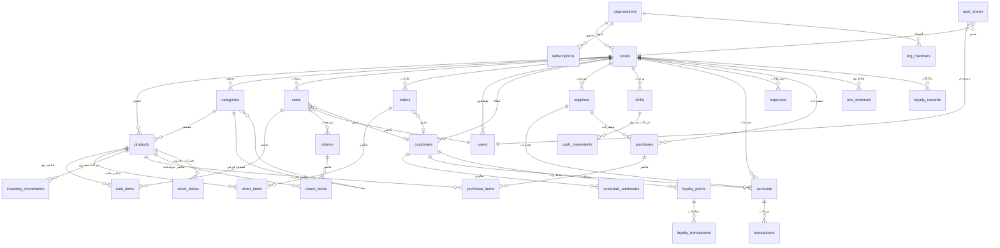
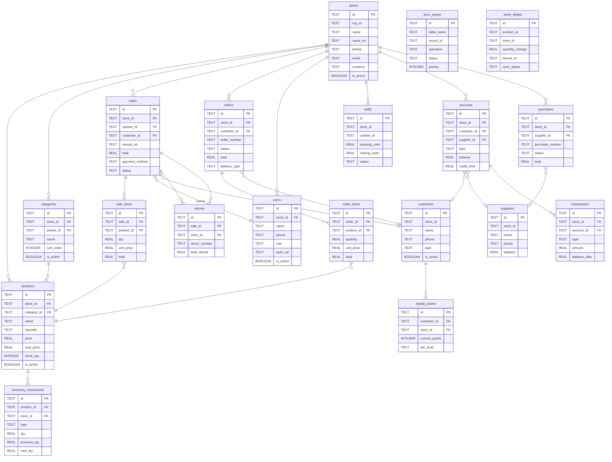

# توثيق قاعدة البيانات - منصة الحي

> الإصدار: 2.4.0 | آخر تحديث: 2026-02-28 | إصدار المخطط المحلي: v13

---

## 1. نظرة عامة على قاعدة البيانات

تعتمد منصة الحي على معمارية مزدوجة لقواعد البيانات تتيح العمل بدون إنترنت مع المزامنة التلقائية عند توفر الاتصال:

| الطبقة | التقنية | الاستخدام |
|--------|---------|-----------|
| **محلية (Local)** | Drift (SQLite) / WASM للويب | التخزين المحلي والعمل بدون إنترنت |
| **سحابية (Remote)** | Supabase (PostgreSQL) | المزامنة، تطبيق العملاء، لوحة الإدارة |

### البنية العامة

```
packages/alhai_database/
  lib/src/
    app_database.dart          # تعريف قاعدة البيانات والترحيل
    tables/                    # تعريفات الجداول (Drift)
      tables.dart              # ملف التصدير الرئيسي
      products_table.dart
      sales_table.dart
      ...
    daos/                      # طبقة الوصول للبيانات
      daos.dart                # ملف التصدير الرئيسي
      products_dao.dart
      sales_dao.dart
      ...
    fts/
      products_fts.dart        # البحث النصي الكامل FTS5
    seeders/
      database_seeder.dart     # بيانات تجريبية
    repositories/
      local_products_repository.dart
      local_categories_repository.dart
    connection.dart             # إعدادات الاتصال
    connection_native.dart      # اتصال الأجهزة المحلية
    connection_web.dart         # اتصال الويب (WASM)

supabase/
  supabase_init.sql            # المخطط الأساسي للسحابة
  sync_rpc_functions.sql       # دوال RPC للمزامنة
  storage_policies.sql         # سياسات التخزين
  migrations/                  # ترحيلات قاعدة البيانات
```

### إصدارات المخطط المحلي (Schema Versions)

| الإصدار | الوصف |
|---------|-------|
| v1 | الجداول الأساسية: products, sales, sale_items, inventory_movements, accounts, sync_queue |
| v2 | إضافة جدول transactions |
| v3 | إضافة جداول orders و order_items |
| v4 | إضافة جدول audit_log |
| v5 | إضافة جدول categories |
| v6 | إضافة جداول نظام الولاء: loyalty_points, loyalty_transactions, loyalty_rewards |
| v7 | إضافة FTS5 للبحث السريع في المنتجات |
| v8 | إضافة جميع الجداول الجديدة (stores, users, customers, suppliers, shifts, returns, expenses, الخ) |
| v9 | إضافة جداول واتساب: whatsapp_messages, whatsapp_templates |
| v10 | إضافة جداول متعددة المستأجرين: organizations, subscriptions, org_members, user_stores, pos_terminals + عمود org_id |
| v11 | إضافة جداول المزامنة المتقدمة: sync_metadata, stock_deltas |
| v12 | إضافة عمود deleted_at للحذف الناعم (Soft Delete) |
| v13 | توحيد أنواع أعمدة الكميات إلى REAL لدعم الكسور (مثل 0.5 كجم) |

### الإعدادات المهمة

```sql
-- تفعيل المفاتيح الأجنبية (يُنفذ عند فتح قاعدة البيانات)
PRAGMA foreign_keys = ON;
```

---

## 2. جداول قاعدة البيانات

### 2.1 جدول المنتجات (`products`)

> يتطابق مع Product model من alhai_core

| العمود | النوع | وصف | قيود |
|--------|-------|-----|------|
| `id` | TEXT | المعرف الفريد | PRIMARY KEY |
| `org_id` | TEXT | معرف المؤسسة | nullable |
| `store_id` | TEXT | معرف المتجر | NOT NULL, FK → stores(id) ON DELETE RESTRICT |
| `name` | TEXT | اسم المنتج | NOT NULL |
| `sku` | TEXT | رمز المنتج | nullable |
| `barcode` | TEXT | الباركود | nullable |
| `price` | REAL | سعر البيع | NOT NULL |
| `cost_price` | REAL | سعر التكلفة | nullable |
| `stock_qty` | INTEGER | كمية المخزون | DEFAULT 0 |
| `min_qty` | INTEGER | الحد الأدنى للمخزون | DEFAULT 0 |
| `unit` | TEXT | وحدة القياس | nullable |
| `description` | TEXT | وصف المنتج | nullable |
| `image_thumbnail` | TEXT | صورة مصغرة (300x300) | nullable, محلي فقط |
| `image_medium` | TEXT | صورة متوسطة (600x600) | nullable, محلي فقط |
| `image_large` | TEXT | صورة كبيرة (1200x1200) | nullable, محلي فقط |
| `image_hash` | TEXT | هاش الصورة (SHA-256, 8 أحرف) | nullable, محلي فقط |
| `category_id` | TEXT | معرف التصنيف | nullable, FK → categories(id) ON DELETE SET NULL |
| `is_active` | BOOLEAN | هل المنتج نشط | DEFAULT true |
| `track_inventory` | BOOLEAN | تتبع المخزون | DEFAULT true, محلي فقط |
| `created_at` | DATETIME | تاريخ الإنشاء | NOT NULL |
| `updated_at` | DATETIME | تاريخ التحديث | nullable |
| `synced_at` | DATETIME | تاريخ المزامنة | nullable, محلي فقط |
| `deleted_at` | DATETIME | تاريخ الحذف الناعم | nullable |

**الأعمدة المحلية فقط (لا تُزامن مع Supabase):**
- `stock_qty`, `min_qty`: يُدار المخزون محلياً؛ Supabase يستخدم جدول inventory منفصل
- `image_thumbnail`, `image_medium`, `image_large`, `image_hash`: بيانات التخزين المؤقت للصور
- `track_inventory`: إعداد محلي لنقطة البيع
- `synced_at`, `deleted_at`: أعمدة إدارة المزامنة

### 2.2 جدول المبيعات / الفواتير (`sales`)

| العمود | النوع | وصف | قيود |
|--------|-------|-----|------|
| `id` | TEXT | المعرف الفريد | PRIMARY KEY |
| `org_id` | TEXT | معرف المؤسسة | nullable |
| `receipt_no` | TEXT | رقم الإيصال | NOT NULL |
| `store_id` | TEXT | معرف المتجر | NOT NULL, FK → stores(id) ON DELETE RESTRICT |
| `cashier_id` | TEXT | معرف الكاشير | NOT NULL, FK → users(id) ON DELETE RESTRICT |
| `terminal_id` | TEXT | معرف نقطة البيع | nullable |
| `customer_id` | TEXT | معرف العميل | nullable, FK → customers(id) ON DELETE SET NULL |
| `customer_name` | TEXT | اسم العميل | nullable |
| `customer_phone` | TEXT | هاتف العميل | nullable |
| `subtotal` | REAL | المجموع الفرعي | NOT NULL |
| `discount` | REAL | الخصم | DEFAULT 0 |
| `tax` | REAL | الضريبة | DEFAULT 0 |
| `total` | REAL | الإجمالي | NOT NULL |
| `payment_method` | TEXT | طريقة الدفع | NOT NULL (cash, card, mixed, credit) |
| `is_paid` | BOOLEAN | هل مدفوعة | DEFAULT true |
| `amount_received` | REAL | المبلغ المستلم | nullable |
| `change_amount` | REAL | الباقي | nullable |
| `notes` | TEXT | ملاحظات | nullable |
| `channel` | TEXT | قناة البيع | DEFAULT 'POS' (POS, ONLINE) |
| `status` | TEXT | الحالة | DEFAULT 'completed' (completed, voided, refunded) |
| `created_at` | DATETIME | تاريخ الإنشاء | NOT NULL |
| `updated_at` | DATETIME | تاريخ التحديث | nullable |
| `synced_at` | DATETIME | تاريخ المزامنة | nullable |
| `deleted_at` | DATETIME | تاريخ الحذف الناعم | nullable |

### 2.3 جدول عناصر البيع (`sale_items`)

| العمود | النوع | وصف | قيود |
|--------|-------|-----|------|
| `id` | TEXT | المعرف الفريد | PRIMARY KEY |
| `sale_id` | TEXT | معرف الفاتورة | NOT NULL, FK → sales(id) ON DELETE CASCADE |
| `product_id` | TEXT | معرف المنتج | NOT NULL, FK → products(id) ON DELETE RESTRICT |
| `product_name` | TEXT | اسم المنتج وقت البيع | NOT NULL |
| `product_sku` | TEXT | SKU وقت البيع | nullable |
| `product_barcode` | TEXT | الباركود وقت البيع | nullable |
| `qty` | REAL | الكمية | NOT NULL |
| `unit_price` | REAL | سعر الوحدة | NOT NULL |
| `cost_price` | REAL | سعر التكلفة | nullable |
| `subtotal` | REAL | المجموع الفرعي | NOT NULL |
| `discount` | REAL | الخصم على مستوى العنصر | DEFAULT 0 |
| `total` | REAL | الإجمالي | NOT NULL |
| `notes` | TEXT | ملاحظات | nullable |

### 2.4 جدول حركات المخزون (`inventory_movements`)

| العمود | النوع | وصف | قيود |
|--------|-------|-----|------|
| `id` | TEXT | المعرف الفريد | PRIMARY KEY |
| `org_id` | TEXT | معرف المؤسسة | nullable |
| `product_id` | TEXT | معرف المنتج | NOT NULL, FK → products(id) |
| `store_id` | TEXT | معرف المتجر | NOT NULL, FK → stores(id) |
| `type` | TEXT | نوع الحركة | NOT NULL (sale, purchase, adjustment, return, transfer, waste) |
| `qty` | REAL | الكمية (موجب أو سالب) | NOT NULL |
| `previous_qty` | REAL | الكمية السابقة | NOT NULL |
| `new_qty` | REAL | الكمية الجديدة | NOT NULL |
| `reference_type` | TEXT | نوع المرجع | nullable (sale, purchase_order, adjustment) |
| `reference_id` | TEXT | معرف المرجع | nullable |
| `reason` | TEXT | السبب | nullable |
| `notes` | TEXT | ملاحظات | nullable |
| `user_id` | TEXT | معرف المستخدم | nullable |
| `created_at` | DATETIME | تاريخ الإنشاء | NOT NULL |
| `synced_at` | DATETIME | تاريخ المزامنة | nullable |

### 2.5 جدول الحسابات (`accounts`)

| العمود | النوع | وصف | قيود |
|--------|-------|-----|------|
| `id` | TEXT | المعرف الفريد | PRIMARY KEY |
| `org_id` | TEXT | معرف المؤسسة | nullable |
| `store_id` | TEXT | معرف المتجر | NOT NULL, FK → stores(id) |
| `type` | TEXT | نوع الحساب | NOT NULL (receivable=عميل, payable=مورد) |
| `customer_id` | TEXT | معرف العميل | nullable, FK → customers(id) |
| `supplier_id` | TEXT | معرف المورد | nullable, FK → suppliers(id) |
| `name` | TEXT | اسم صاحب الحساب | NOT NULL |
| `phone` | TEXT | رقم الهاتف | nullable |
| `balance` | REAL | الرصيد | DEFAULT 0 |
| `credit_limit` | REAL | حد الائتمان | DEFAULT 0 |
| `is_active` | BOOLEAN | هل الحساب نشط | DEFAULT true |
| `last_transaction_at` | DATETIME | آخر حركة | nullable |
| `created_at` | DATETIME | تاريخ الإنشاء | NOT NULL |
| `updated_at` | DATETIME | تاريخ التحديث | nullable |
| `synced_at` | DATETIME | تاريخ المزامنة | nullable |
| `deleted_at` | DATETIME | تاريخ الحذف الناعم | nullable |

### 2.6 جدول طابور المزامنة (`sync_queue`)

| العمود | النوع | وصف | قيود |
|--------|-------|-----|------|
| `id` | TEXT | المعرف الفريد | PRIMARY KEY |
| `table_name` | TEXT | اسم الجدول المتأثر | NOT NULL |
| `record_id` | TEXT | معرف السجل | NOT NULL |
| `operation` | TEXT | نوع العملية | NOT NULL (CREATE, UPDATE, DELETE) |
| `payload` | TEXT | البيانات بصيغة JSON | NOT NULL |
| `idempotency_key` | TEXT | مفتاح منع التكرار | NOT NULL |
| `status` | TEXT | حالة المزامنة | DEFAULT 'pending' (pending, syncing, synced, failed, conflict, resolved) |
| `retry_count` | INTEGER | عدد محاولات إعادة المحاولة | DEFAULT 0 |
| `max_retries` | INTEGER | الحد الأقصى للمحاولات | DEFAULT 3 |
| `last_error` | TEXT | آخر خطأ | nullable |
| `priority` | INTEGER | الأولوية | DEFAULT 1 (1=منخفضة, 2=عادية, 3=عالية) |
| `created_at` | DATETIME | تاريخ الإنشاء | NOT NULL |
| `last_attempt_at` | DATETIME | آخر محاولة | nullable |
| `synced_at` | DATETIME | تاريخ المزامنة | nullable |

### 2.7 جدول حركات الحسابات (`transactions`)

| العمود | النوع | وصف | قيود |
|--------|-------|-----|------|
| `id` | TEXT | المعرف الفريد | PRIMARY KEY |
| `store_id` | TEXT | معرف المتجر | NOT NULL, FK → stores(id) |
| `account_id` | TEXT | معرف الحساب | NOT NULL, FK → accounts(id) |
| `type` | TEXT | نوع الحركة | NOT NULL (invoice, payment, interest, adjustment) |
| `amount` | REAL | المبلغ | NOT NULL |
| `balance_after` | REAL | الرصيد بعد الحركة | NOT NULL |
| `description` | TEXT | الوصف | nullable |
| `reference_id` | TEXT | معرف المرجع | nullable |
| `reference_type` | TEXT | نوع المرجع | nullable (sale, purchase) |
| `period_key` | TEXT | فترة الفائدة | nullable (YYYY-MM) |
| `payment_method` | TEXT | طريقة الدفع | nullable (cash, card, transfer) |
| `created_by` | TEXT | المستخدم المنشئ | nullable |
| `created_at` | DATETIME | تاريخ الإنشاء | NOT NULL |
| `synced_at` | DATETIME | تاريخ المزامنة | nullable |

### 2.8 جدول الطلبات (`orders`)

| العمود | النوع | وصف | قيود |
|--------|-------|-----|------|
| `id` | TEXT | المعرف الفريد | PRIMARY KEY |
| `org_id` | TEXT | معرف المؤسسة | nullable |
| `store_id` | TEXT | معرف المتجر | NOT NULL, FK → stores(id) |
| `customer_id` | TEXT | معرف العميل | nullable, FK → customers(id) |
| `order_number` | TEXT | رقم الطلب (ORD-YYYYMMDD-XXX) | NOT NULL |
| `channel` | TEXT | قناة الطلب | DEFAULT 'app' (app, pos) |
| `status` | TEXT | حالة الطلب | DEFAULT 'created' |
| `subtotal` | REAL | المجموع الفرعي | DEFAULT 0 |
| `tax_amount` | REAL | مبلغ الضريبة | DEFAULT 0 |
| `delivery_fee` | REAL | رسوم التوصيل | DEFAULT 0 |
| `discount` | REAL | الخصم | DEFAULT 0 |
| `total` | REAL | الإجمالي | DEFAULT 0 |
| `payment_method` | TEXT | طريقة الدفع | nullable (cash, card, online) |
| `payment_status` | TEXT | حالة الدفع | DEFAULT 'pending' (pending, paid, refunded) |
| `delivery_type` | TEXT | نوع التوصيل | DEFAULT 'delivery' (delivery, pickup) |
| `delivery_address` | TEXT | عنوان التوصيل | nullable |
| `delivery_lat` | REAL | خط العرض | nullable, محلي فقط |
| `delivery_lng` | REAL | خط الطول | nullable, محلي فقط |
| `driver_id` | TEXT | معرف السائق | nullable, محلي فقط |
| `notes` | TEXT | ملاحظات | nullable |
| `cancel_reason` | TEXT | سبب الإلغاء | nullable, محلي فقط |
| `order_date` | DATETIME | تاريخ الطلب | NOT NULL |
| `confirmed_at` | DATETIME | تاريخ التأكيد | nullable |
| `preparing_at` | DATETIME | تاريخ بدء التحضير | nullable |
| `ready_at` | DATETIME | تاريخ الجاهزية | nullable |
| `delivering_at` | DATETIME | تاريخ بدء التوصيل | nullable, محلي فقط |
| `delivered_at` | DATETIME | تاريخ التسليم | nullable, محلي فقط |
| `cancelled_at` | DATETIME | تاريخ الإلغاء | nullable |
| `created_at` | DATETIME | تاريخ الإنشاء | NOT NULL |
| `updated_at` | DATETIME | تاريخ التحديث | nullable |
| `synced_at` | DATETIME | تاريخ المزامنة | nullable |
| `deleted_at` | DATETIME | تاريخ الحذف الناعم | nullable |

**حالات الطلب:** `created` → `confirmed` → `preparing` → `ready` → `out_for_delivery` → `delivered` / `picked_up` → `completed` | `cancelled` | `refunded`

### 2.9 جدول عناصر الطلب (`order_items`)

| العمود | النوع | وصف | قيود |
|--------|-------|-----|------|
| `id` | TEXT | المعرف الفريد | PRIMARY KEY |
| `order_id` | TEXT | معرف الطلب | NOT NULL, FK → orders(id) ON DELETE CASCADE |
| `product_id` | TEXT | معرف المنتج | NOT NULL, FK → products(id) ON DELETE RESTRICT |
| `product_name` | TEXT | اسم المنتج بالعربية | NOT NULL |
| `product_name_en` | TEXT | اسم المنتج بالإنجليزية | nullable |
| `barcode` | TEXT | الباركود | nullable |
| `quantity` | REAL | الكمية | NOT NULL |
| `unit_price` | REAL | سعر الوحدة | NOT NULL |
| `discount` | REAL | الخصم | DEFAULT 0 |
| `tax_rate` | REAL | نسبة الضريبة | DEFAULT 15 |
| `tax_amount` | REAL | مبلغ الضريبة | DEFAULT 0 |
| `total` | REAL | الإجمالي | NOT NULL |
| `notes` | TEXT | ملاحظات | nullable |
| `is_reserved` | BOOLEAN | هل تم حجز المخزون | DEFAULT false |

### 2.10 جدول سجل التدقيق (`audit_log`)

| العمود | النوع | وصف | قيود |
|--------|-------|-----|------|
| `id` | TEXT | المعرف الفريد | PRIMARY KEY |
| `org_id` | TEXT | معرف المؤسسة | nullable |
| `store_id` | TEXT | معرف المتجر | NOT NULL |
| `user_id` | TEXT | معرف المستخدم | NOT NULL |
| `user_name` | TEXT | اسم المستخدم | NOT NULL |
| `action` | TEXT | نوع العملية | NOT NULL |
| `entity_type` | TEXT | نوع الكيان | nullable (sale, product, customer, ...) |
| `entity_id` | TEXT | معرف الكيان | nullable |
| `old_value` | TEXT | القيمة القديمة (JSON) | nullable |
| `new_value` | TEXT | القيمة الجديدة (JSON) | nullable |
| `description` | TEXT | وصف العملية | nullable |
| `ip_address` | TEXT | عنوان IP | nullable |
| `device_info` | TEXT | معلومات الجهاز | nullable |
| `created_at` | DATETIME | تاريخ الإنشاء | NOT NULL |
| `synced_at` | DATETIME | تاريخ المزامنة | nullable |

**أنواع العمليات (action):** `login`, `logout`, `sale_create`, `sale_cancel`, `refund`, `price_change`, `stock_adjust`, `payment_record`, `shift_open`, `shift_close`, `settings_change`

### 2.11 جدول التصنيفات (`categories`)

| العمود | النوع | وصف | قيود |
|--------|-------|-----|------|
| `id` | TEXT | المعرف الفريد | PRIMARY KEY |
| `org_id` | TEXT | معرف المؤسسة | nullable |
| `store_id` | TEXT | معرف المتجر | NOT NULL, FK → stores(id) |
| `name` | TEXT | اسم التصنيف بالعربية | NOT NULL |
| `name_en` | TEXT | اسم التصنيف بالإنجليزية | nullable |
| `parent_id` | TEXT | معرف التصنيف الأب | nullable, FK → categories(id) |
| `image_url` | TEXT | رابط الصورة | nullable |
| `color` | TEXT | اللون | nullable |
| `icon` | TEXT | الأيقونة | nullable |
| `sort_order` | INTEGER | ترتيب العرض | DEFAULT 0 |
| `is_active` | BOOLEAN | هل نشط | DEFAULT true |
| `created_at` | DATETIME | تاريخ الإنشاء | NOT NULL |
| `updated_at` | DATETIME | تاريخ التحديث | nullable |
| `synced_at` | DATETIME | تاريخ المزامنة | nullable |
| `deleted_at` | DATETIME | تاريخ الحذف الناعم | nullable |

### 2.12 جداول نظام الولاء

#### جدول نقاط الولاء (`loyalty_points`)

| العمود | النوع | وصف | قيود |
|--------|-------|-----|------|
| `id` | TEXT | المعرف الفريد | PRIMARY KEY |
| `org_id` | TEXT | معرف المؤسسة | nullable |
| `customer_id` | TEXT | معرف العميل | NOT NULL, FK → customers(id) |
| `store_id` | TEXT | معرف المتجر | NOT NULL, FK → stores(id) |
| `current_points` | INTEGER | النقاط الحالية | DEFAULT 0 |
| `total_earned` | INTEGER | إجمالي النقاط المكتسبة | DEFAULT 0 |
| `total_redeemed` | INTEGER | إجمالي النقاط المستبدلة | DEFAULT 0 |
| `tier_level` | TEXT | مستوى العميل | DEFAULT 'bronze' (bronze, silver, gold, platinum) |
| `created_at` | DATETIME | تاريخ الإنشاء | NOT NULL |
| `updated_at` | DATETIME | تاريخ التحديث | nullable |
| `synced_at` | DATETIME | تاريخ المزامنة | nullable |

**قيد فريد:** (`customer_id`, `store_id`) - عميل واحد لكل متجر

#### جدول معاملات النقاط (`loyalty_transactions`)

| العمود | النوع | وصف | قيود |
|--------|-------|-----|------|
| `id` | TEXT | المعرف الفريد | PRIMARY KEY |
| `org_id` | TEXT | معرف المؤسسة | nullable |
| `loyalty_id` | TEXT | معرف سجل الولاء | NOT NULL, FK → loyalty_points(id) |
| `customer_id` | TEXT | معرف العميل | NOT NULL, FK → customers(id) |
| `store_id` | TEXT | معرف المتجر | NOT NULL, FK → stores(id) |
| `transaction_type` | TEXT | نوع المعاملة | NOT NULL (earn, redeem, expire, adjust) |
| `points` | INTEGER | عدد النقاط | NOT NULL |
| `balance_after` | INTEGER | الرصيد بعد المعاملة | NOT NULL |
| `sale_id` | TEXT | معرف البيع المرتبط | nullable, FK → sales(id) |
| `sale_amount` | REAL | مبلغ البيع | nullable |
| `description` | TEXT | الوصف | nullable |
| `created_at` | DATETIME | تاريخ الإنشاء | NOT NULL |
| `cashier_id` | TEXT | معرف الكاشير | nullable, FK → users(id) |
| `synced_at` | DATETIME | تاريخ المزامنة | nullable |

#### جدول المكافآت (`loyalty_rewards`)

| العمود | النوع | وصف | قيود |
|--------|-------|-----|------|
| `id` | TEXT | المعرف الفريد | PRIMARY KEY |
| `org_id` | TEXT | معرف المؤسسة | nullable |
| `store_id` | TEXT | معرف المتجر | NOT NULL, FK → stores(id) |
| `name` | TEXT | اسم المكافأة | NOT NULL |
| `description` | TEXT | الوصف | nullable |
| `points_required` | INTEGER | النقاط المطلوبة | NOT NULL |
| `reward_type` | TEXT | نوع المكافأة | NOT NULL (discount_percentage, discount_fixed, free_item) |
| `reward_value` | REAL | قيمة المكافأة | NOT NULL |
| `min_purchase` | REAL | الحد الأدنى للشراء | DEFAULT 0 |
| `required_tier` | TEXT | المستوى المطلوب | DEFAULT 'all' |
| `is_active` | BOOLEAN | هل نشطة | DEFAULT true |
| `expires_at` | DATETIME | تاريخ الانتهاء | nullable |
| `created_at` | DATETIME | تاريخ الإنشاء | NOT NULL |
| `synced_at` | DATETIME | تاريخ المزامنة | nullable |

### 2.13 جدول المتاجر (`stores`)

| العمود | النوع | وصف | قيود |
|--------|-------|-----|------|
| `id` | TEXT | المعرف الفريد | PRIMARY KEY |
| `org_id` | TEXT | معرف المؤسسة | nullable |
| `name` | TEXT | اسم المتجر | NOT NULL |
| `name_en` | TEXT | الاسم بالإنجليزية | nullable |
| `phone` | TEXT | رقم الهاتف | nullable |
| `email` | TEXT | البريد الإلكتروني | nullable |
| `address` | TEXT | العنوان | nullable |
| `city` | TEXT | المدينة | nullable |
| `logo` | TEXT | رابط الشعار | nullable |
| `tax_number` | TEXT | الرقم الضريبي | nullable |
| `commercial_reg` | TEXT | السجل التجاري | nullable |
| `currency` | TEXT | العملة | DEFAULT 'SAR' |
| `timezone` | TEXT | المنطقة الزمنية | DEFAULT 'Asia/Riyadh' |
| `is_active` | BOOLEAN | هل نشط | DEFAULT true |
| `created_at` | DATETIME | تاريخ الإنشاء | NOT NULL |
| `updated_at` | DATETIME | تاريخ التحديث | nullable |
| `synced_at` | DATETIME | تاريخ المزامنة | nullable |
| `deleted_at` | DATETIME | تاريخ الحذف الناعم | nullable |

### 2.14 جدول المستخدمين (`users`) وجدول الأدوار (`roles`)

#### جدول المستخدمين (`users`)

| العمود | النوع | وصف | قيود |
|--------|-------|-----|------|
| `id` | TEXT | المعرف الفريد | PRIMARY KEY |
| `org_id` | TEXT | معرف المؤسسة | nullable |
| `store_id` | TEXT | معرف المتجر | NOT NULL |
| `name` | TEXT | الاسم الكامل | NOT NULL |
| `phone` | TEXT | رقم الهاتف | nullable |
| `email` | TEXT | البريد الإلكتروني | nullable |
| `pin` | TEXT | رمز PIN | nullable |
| `auth_uid` | TEXT | معرف المصادقة (Supabase Auth) | nullable |
| `role` | TEXT | الدور | DEFAULT 'cashier' |
| `role_id` | TEXT | معرف الدور المخصص | nullable |
| `avatar` | TEXT | رابط الصورة الشخصية | nullable |
| `is_active` | BOOLEAN | هل نشط | DEFAULT true |
| `last_login_at` | DATETIME | آخر تسجيل دخول | nullable |
| `created_at` | DATETIME | تاريخ الإنشاء | NOT NULL |
| `updated_at` | DATETIME | تاريخ التحديث | nullable |
| `synced_at` | DATETIME | تاريخ المزامنة | nullable |
| `deleted_at` | DATETIME | تاريخ الحذف الناعم | nullable |

#### جدول الأدوار (`roles`)

| العمود | النوع | وصف | قيود |
|--------|-------|-----|------|
| `id` | TEXT | المعرف الفريد | PRIMARY KEY |
| `store_id` | TEXT | معرف المتجر | NOT NULL |
| `name` | TEXT | اسم الدور | NOT NULL |
| `name_en` | TEXT | الاسم بالإنجليزية | nullable |
| `permissions` | TEXT | الصلاحيات (JSON) | DEFAULT '{}' |
| `is_system` | BOOLEAN | هل دور نظامي | DEFAULT false |
| `created_at` | DATETIME | تاريخ الإنشاء | NOT NULL |
| `updated_at` | DATETIME | تاريخ التحديث | nullable |
| `synced_at` | DATETIME | تاريخ المزامنة | nullable |

### 2.15 جدول العملاء (`customers`) وعناوينهم (`customer_addresses`)

#### جدول العملاء (`customers`)

| العمود | النوع | وصف | قيود |
|--------|-------|-----|------|
| `id` | TEXT | المعرف | PRIMARY KEY |
| `org_id` | TEXT | معرف المؤسسة | nullable |
| `store_id` | TEXT | معرف المتجر | NOT NULL |
| `name` | TEXT | الاسم | NOT NULL |
| `phone` | TEXT | الهاتف | nullable |
| `email` | TEXT | البريد | nullable |
| `address` | TEXT | العنوان | nullable |
| `city` | TEXT | المدينة | nullable |
| `tax_number` | TEXT | الرقم الضريبي | nullable |
| `type` | TEXT | النوع | DEFAULT 'individual' |
| `notes` | TEXT | ملاحظات | nullable |
| `is_active` | BOOLEAN | نشط | DEFAULT true |
| `created_at` | DATETIME | تاريخ الإنشاء | NOT NULL |
| `updated_at` | DATETIME | تاريخ التحديث | nullable |
| `synced_at` | DATETIME | تاريخ المزامنة | nullable |
| `deleted_at` | DATETIME | تاريخ الحذف | nullable |

#### جدول عناوين العملاء (`customer_addresses`)

| العمود | النوع | وصف | قيود |
|--------|-------|-----|------|
| `id` | TEXT | المعرف | PRIMARY KEY |
| `org_id` | TEXT | معرف المؤسسة | nullable |
| `customer_id` | TEXT | معرف العميل | NOT NULL |
| `label` | TEXT | التسمية | DEFAULT 'home' |
| `address` | TEXT | العنوان | NOT NULL |
| `city` | TEXT | المدينة | nullable |
| `lat` | REAL | خط العرض | nullable |
| `lng` | REAL | خط الطول | nullable |
| `is_default` | BOOLEAN | هل افتراضي | DEFAULT false |
| `created_at` | DATETIME | تاريخ الإنشاء | NOT NULL |

### 2.16 جدول الموردين (`suppliers`)

| العمود | النوع | وصف | قيود |
|--------|-------|-----|------|
| `id` | TEXT | المعرف | PRIMARY KEY |
| `org_id` | TEXT | معرف المؤسسة | nullable |
| `store_id` | TEXT | معرف المتجر | NOT NULL |
| `name` | TEXT | الاسم | NOT NULL |
| `phone` | TEXT | الهاتف | nullable |
| `email` | TEXT | البريد | nullable |
| `address` | TEXT | العنوان | nullable |
| `city` | TEXT | المدينة | nullable |
| `tax_number` | TEXT | الرقم الضريبي | nullable |
| `payment_terms` | TEXT | شروط الدفع | nullable |
| `rating` | INTEGER | التقييم (0-5) | DEFAULT 0 |
| `balance` | REAL | الرصيد | DEFAULT 0 |
| `notes` | TEXT | ملاحظات | nullable |
| `is_active` | BOOLEAN | نشط | DEFAULT true |
| `created_at` - `deleted_at` | DATETIME | تواريخ الإدارة | --- |

### 2.17 جدول الورديات (`shifts`) وحركات الصندوق (`cash_movements`)

#### جدول الورديات (`shifts`)

| العمود | النوع | وصف | قيود |
|--------|-------|-----|------|
| `id` | TEXT | المعرف | PRIMARY KEY |
| `org_id` | TEXT | معرف المؤسسة | nullable |
| `store_id` | TEXT | معرف المتجر | NOT NULL |
| `terminal_id` | TEXT | معرف نقطة البيع | nullable |
| `cashier_id` | TEXT | معرف الكاشير | NOT NULL |
| `cashier_name` | TEXT | اسم الكاشير | NOT NULL |
| `opening_cash` | REAL | النقد الافتتاحي | DEFAULT 0 |
| `closing_cash` | REAL | النقد الختامي | nullable |
| `expected_cash` | REAL | النقد المتوقع | nullable |
| `difference` | REAL | الفرق | nullable |
| `total_sales` | INTEGER | عدد المبيعات | DEFAULT 0 |
| `total_sales_amount` | REAL | إجمالي المبيعات | DEFAULT 0 |
| `total_refunds` | INTEGER | عدد المرتجعات | DEFAULT 0 |
| `total_refunds_amount` | REAL | إجمالي المرتجعات | DEFAULT 0 |
| `status` | TEXT | الحالة | DEFAULT 'open' (open, closed) |
| `notes` | TEXT | ملاحظات | nullable |
| `opened_at` | DATETIME | وقت الفتح | NOT NULL |
| `closed_at` | DATETIME | وقت الإغلاق | nullable |
| `synced_at` | DATETIME | تاريخ المزامنة | nullable |

#### جدول حركات الصندوق (`cash_movements`)

| العمود | النوع | وصف | قيود |
|--------|-------|-----|------|
| `id` | TEXT | المعرف | PRIMARY KEY |
| `org_id` | TEXT | معرف المؤسسة | nullable |
| `shift_id` | TEXT | معرف الوردية | NOT NULL |
| `store_id` | TEXT | معرف المتجر | NOT NULL |
| `type` | TEXT | النوع | NOT NULL (in, out) |
| `amount` | REAL | المبلغ | NOT NULL |
| `reason` | TEXT | السبب | nullable |
| `reference` | TEXT | المرجع | nullable |
| `created_by` | TEXT | المنشئ | nullable |
| `created_at` | DATETIME | تاريخ الإنشاء | NOT NULL |
| `synced_at` | DATETIME | تاريخ المزامنة | nullable |

### 2.18 جدول المرتجعات (`returns`) وعناصرها (`return_items`)

#### جدول المرتجعات (`returns`)

| العمود | النوع | وصف | قيود |
|--------|-------|-----|------|
| `id` | TEXT | المعرف | PRIMARY KEY |
| `org_id` | TEXT | معرف المؤسسة | nullable |
| `return_number` | TEXT | رقم المرتجع | NOT NULL |
| `sale_id` | TEXT | معرف الفاتورة الأصلية | NOT NULL, FK → sales(id) ON DELETE RESTRICT |
| `store_id` | TEXT | معرف المتجر | NOT NULL, FK → stores(id) ON DELETE RESTRICT |
| `customer_id` | TEXT | معرف العميل | nullable, FK → customers(id) ON DELETE SET NULL |
| `customer_name` | TEXT | اسم العميل | nullable |
| `reason` | TEXT | سبب الإرجاع | nullable |
| `type` | TEXT | النوع | DEFAULT 'full' (full, partial) |
| `refund_method` | TEXT | طريقة الاسترداد | DEFAULT 'cash' |
| `total_refund` | REAL | إجمالي المبلغ المسترد | NOT NULL |
| `status` | TEXT | الحالة | DEFAULT 'completed' |
| `created_by` | TEXT | المنشئ | nullable |
| `notes` | TEXT | ملاحظات | nullable |
| `created_at` | DATETIME | تاريخ الإنشاء | NOT NULL |
| `synced_at` | DATETIME | تاريخ المزامنة | nullable |
| `deleted_at` | DATETIME | تاريخ الحذف | nullable |

**قيد فريد:** (`store_id`, `return_number`)

#### جدول عناصر المرتجعات (`return_items`)

| العمود | النوع | وصف | قيود |
|--------|-------|-----|------|
| `id` | TEXT | المعرف | PRIMARY KEY |
| `org_id` | TEXT | معرف المؤسسة | nullable |
| `return_id` | TEXT | معرف المرتجع | NOT NULL, FK → returns(id) ON DELETE CASCADE |
| `sale_item_id` | TEXT | معرف عنصر البيع الأصلي | nullable |
| `product_id` | TEXT | معرف المنتج | NOT NULL, FK → products(id) ON DELETE RESTRICT |
| `product_name` | TEXT | اسم المنتج | NOT NULL |
| `qty` | REAL | الكمية | NOT NULL |
| `unit_price` | REAL | سعر الوحدة | NOT NULL |
| `refund_amount` | REAL | مبلغ الاسترداد | NOT NULL |

### 2.19 جدول المصروفات (`expenses`) وفئاتها (`expense_categories`)

#### جدول المصروفات (`expenses`)

| العمود | النوع | وصف | قيود |
|--------|-------|-----|------|
| `id` | TEXT | المعرف | PRIMARY KEY |
| `org_id` | TEXT | معرف المؤسسة | nullable |
| `store_id` | TEXT | معرف المتجر | NOT NULL |
| `category_id` | TEXT | معرف الفئة | nullable |
| `amount` | REAL | المبلغ | NOT NULL |
| `description` | TEXT | الوصف | nullable |
| `payment_method` | TEXT | طريقة الدفع | DEFAULT 'cash' |
| `receipt_image` | TEXT | صورة الإيصال | nullable |
| `created_by` | TEXT | المنشئ | nullable |
| `expense_date` | DATETIME | تاريخ المصروف | NOT NULL |
| `created_at` - `deleted_at` | DATETIME | تواريخ الإدارة | --- |

### 2.20 جدول المشتريات (`purchases`) وعناصرها (`purchase_items`)

#### جدول المشتريات (`purchases`)

| العمود | النوع | وصف | قيود |
|--------|-------|-----|------|
| `id` | TEXT | المعرف | PRIMARY KEY |
| `org_id` | TEXT | معرف المؤسسة | nullable |
| `store_id` | TEXT | معرف المتجر | NOT NULL, FK → stores(id) ON DELETE RESTRICT |
| `supplier_id` | TEXT | معرف المورد | nullable, FK → suppliers(id) ON DELETE SET NULL |
| `supplier_name` | TEXT | اسم المورد | nullable |
| `purchase_number` | TEXT | رقم أمر الشراء | NOT NULL |
| `status` | TEXT | الحالة | DEFAULT 'draft' |
| `subtotal` | REAL | المجموع الفرعي | DEFAULT 0 |
| `tax` | REAL | الضريبة | DEFAULT 0 |
| `discount` | REAL | الخصم | DEFAULT 0 |
| `total` | REAL | الإجمالي | DEFAULT 0 |
| `payment_status` | TEXT | حالة الدفع | DEFAULT 'pending' |
| `payment_method` | TEXT | طريقة الدفع | nullable |
| `notes` | TEXT | ملاحظات | nullable |
| `received_at` | DATETIME | تاريخ الاستلام | nullable |
| `created_at` - `deleted_at` | DATETIME | تواريخ الإدارة | --- |

**قيد فريد:** (`store_id`, `purchase_number`)

### 2.21 جداول الخصومات والكوبونات والعروض

#### جدول الخصومات (`discounts`)

| العمود | النوع | وصف | قيود |
|--------|-------|-----|------|
| `id` | TEXT | المعرف | PRIMARY KEY |
| `store_id` | TEXT | معرف المتجر | NOT NULL |
| `name` | TEXT | الاسم | NOT NULL |
| `type` | TEXT | النوع | NOT NULL (percentage, fixed) |
| `value` | REAL | القيمة | NOT NULL |
| `min_purchase` | REAL | الحد الأدنى للشراء | DEFAULT 0 |
| `max_discount` | REAL | الحد الأقصى للخصم | nullable |
| `applies_to` | TEXT | ينطبق على | DEFAULT 'all' |
| `product_ids` | TEXT | معرفات المنتجات (JSON) | nullable |
| `category_ids` | TEXT | معرفات التصنيفات (JSON) | nullable |
| `start_date` | DATETIME | تاريخ البداية | nullable |
| `end_date` | DATETIME | تاريخ النهاية | nullable |
| `is_active` | BOOLEAN | نشط | DEFAULT true |

#### جدول الكوبونات (`coupons`)

| العمود | النوع | وصف | قيود |
|--------|-------|-----|------|
| `id` | TEXT | المعرف | PRIMARY KEY |
| `store_id` | TEXT | معرف المتجر | NOT NULL |
| `code` | TEXT | رمز الكوبون | NOT NULL |
| `type` | TEXT | النوع | NOT NULL (percentage, fixed) |
| `value` | REAL | القيمة | NOT NULL |
| `max_uses` | INTEGER | الحد الأقصى للاستخدام | DEFAULT 0 |
| `current_uses` | INTEGER | الاستخدام الحالي | DEFAULT 0 |
| `min_purchase` | REAL | الحد الأدنى للشراء | DEFAULT 0 |
| `is_active` | BOOLEAN | نشط | DEFAULT true |
| `expires_at` | DATETIME | تاريخ الانتهاء | nullable |

#### جدول العروض الترويجية (`promotions`)

| العمود | النوع | وصف | قيود |
|--------|-------|-----|------|
| `id` | TEXT | المعرف | PRIMARY KEY |
| `store_id` | TEXT | معرف المتجر | NOT NULL |
| `name` | TEXT | الاسم | NOT NULL |
| `type` | TEXT | النوع | NOT NULL (buy_x_get_y, bundle, flash_sale) |
| `rules` | TEXT | القواعد (JSON) | DEFAULT '{}' |
| `start_date` | DATETIME | تاريخ البداية | NOT NULL |
| `end_date` | DATETIME | تاريخ النهاية | NOT NULL |
| `is_active` | BOOLEAN | نشط | DEFAULT true |

### 2.22 جداول أخرى

#### الفواتير المعلقة (`held_invoices`)
تُخزن الفواتير المعلقة مؤقتاً مع عناصر السلة بصيغة JSON.

#### الإشعارات (`notifications`)
إشعارات النظام للمستخدمين مع دعم أنواع متعددة (info, warning, error, success).

#### تحويلات المخزون (`stock_transfers`)
تحويلات المخزون بين الفروع مع تتبع الحالة.

#### الإعدادات (`settings`)
إعدادات المتجر بنظام مفتاح-قيمة (key-value).

#### عمليات الجرد (`stock_takes`)
تتبع عمليات الجرد مع عناصر الجرد بصيغة JSON.

#### صلاحية المنتجات (`product_expiry`)
تتبع تواريخ صلاحية المنتجات حسب الدفعة.

#### السائقون (`drivers`)
بيانات سائقي التوصيل.

#### الملخصات اليومية (`daily_summaries`)
ملخصات المبيعات والطلبات والمصروفات اليومية للتقارير السريعة.

#### سجل حالات الطلبات (`order_status_history`)
تتبع تغييرات حالة الطلبات.

#### المفضلة (`favorites`)
المنتجات المفضلة لكل متجر. قيد فريد: (`store_id`, `product_id`).

### 2.23 جداول واتساب

#### رسائل واتساب (`whatsapp_messages`)

| العمود | النوع | وصف | قيود |
|--------|-------|-----|------|
| `id` | TEXT | المعرف | PRIMARY KEY |
| `store_id` | TEXT | معرف المتجر | NOT NULL |
| `phone` | TEXT | رقم المستلم | NOT NULL |
| `customer_name` | TEXT | اسم العميل | nullable |
| `message_type` | TEXT | نوع الرسالة | NOT NULL (text, image, document, ...) |
| `text_content` | TEXT | محتوى النص | nullable |
| `media_url` | TEXT | رابط الوسائط | nullable |
| `template_id` | TEXT | معرف القالب | nullable |
| `reference_type` | TEXT | نوع المرجع | nullable (sale, order, debt_reminder, ...) |
| `reference_id` | TEXT | معرف المرجع | nullable |
| `status` | TEXT | الحالة | DEFAULT 'pending' (pending, uploading, sending, sent, delivered, read, failed) |
| `external_msg_id` | TEXT | معرف WaSenderAPI | nullable |
| `retry_count` | INTEGER | عدد المحاولات | DEFAULT 0 |
| `priority` | INTEGER | الأولوية | DEFAULT 2 (1=عروض, 2=تذكير, 3=إيصالات) |
| `batch_id` | TEXT | معرف الدفعة | nullable |
| `created_at` - `read_at` | DATETIME | تواريخ متعددة | --- |

#### قوالب واتساب (`whatsapp_templates`)

| العمود | النوع | وصف | قيود |
|--------|-------|-----|------|
| `id` | TEXT | المعرف | PRIMARY KEY |
| `store_id` | TEXT | معرف المتجر | NOT NULL |
| `name` | TEXT | اسم القالب | NOT NULL |
| `type` | TEXT | النوع | NOT NULL (receipt, debt_reminder, promotion, ...) |
| `content` | TEXT | المحتوى مع {{placeholders}} | NOT NULL |
| `language` | TEXT | اللغة | DEFAULT 'ar' |
| `is_active` | BOOLEAN | نشط | DEFAULT true |
| `is_default` | BOOLEAN | افتراضي | DEFAULT false |
| `media_type` | TEXT | نوع الوسائط المرفقة | nullable |

### 2.24 جداول متعددة المستأجرين

#### المؤسسات (`organizations`)

| العمود | النوع | وصف | قيود |
|--------|-------|-----|------|
| `id` | TEXT | المعرف | PRIMARY KEY |
| `name` | TEXT | الاسم | NOT NULL |
| `slug` | TEXT | المعرف النصي الفريد | nullable |
| `owner_id` | TEXT | معرف المالك | nullable |
| `plan` | TEXT | الخطة | DEFAULT 'free' |
| `max_stores` | INTEGER | الحد الأقصى للمتاجر | DEFAULT 1 |
| `max_users` | INTEGER | الحد الأقصى للمستخدمين | DEFAULT 3 |
| `max_products` | INTEGER | الحد الأقصى للمنتجات | DEFAULT 100 |
| `country` | TEXT | الدولة | DEFAULT 'SA' |
| `currency` | TEXT | العملة | DEFAULT 'SAR' |
| `is_active` | BOOLEAN | نشط | DEFAULT true |
| `trial_ends_at` | DATETIME | نهاية الفترة التجريبية | nullable |

#### الاشتراكات (`subscriptions`)

| العمود | النوع | وصف | قيود |
|--------|-------|-----|------|
| `id` | TEXT | المعرف | PRIMARY KEY |
| `org_id` | TEXT | معرف المؤسسة | NOT NULL |
| `plan` | TEXT | الخطة | NOT NULL |
| `status` | TEXT | الحالة | DEFAULT 'active' |
| `amount` | REAL | المبلغ | DEFAULT 0 |
| `billing_cycle` | TEXT | دورة الفوترة | DEFAULT 'monthly' |
| `current_period_start` | DATETIME | بداية الفترة الحالية | NOT NULL |
| `current_period_end` | DATETIME | نهاية الفترة الحالية | NOT NULL |
| `features` | TEXT | الميزات (JSON) | DEFAULT '{}' |

#### أعضاء المؤسسة (`org_members`)

| العمود | النوع | وصف | قيود |
|--------|-------|-----|------|
| `id` | TEXT | المعرف | PRIMARY KEY |
| `org_id` | TEXT | معرف المؤسسة | NOT NULL |
| `user_id` | TEXT | معرف المستخدم | NOT NULL |
| `role` | TEXT | الدور | DEFAULT 'staff' |
| `is_active` | BOOLEAN | نشط | DEFAULT true |

**قيد فريد:** (`org_id`, `user_id`)

#### متاجر المستخدمين (`user_stores`)

| العمود | النوع | وصف | قيود |
|--------|-------|-----|------|
| `id` | TEXT | المعرف | PRIMARY KEY |
| `user_id` | TEXT | معرف المستخدم | NOT NULL |
| `store_id` | TEXT | معرف المتجر | NOT NULL |
| `role` | TEXT | الدور | DEFAULT 'cashier' |
| `is_primary` | BOOLEAN | هل أساسي | DEFAULT false |
| `is_active` | BOOLEAN | نشط | DEFAULT true |

**قيد فريد:** (`user_id`, `store_id`)

#### نقاط البيع (`pos_terminals`)

| العمود | النوع | وصف | قيود |
|--------|-------|-----|------|
| `id` | TEXT | المعرف | PRIMARY KEY |
| `store_id` | TEXT | معرف المتجر | NOT NULL |
| `org_id` | TEXT | معرف المؤسسة | NOT NULL |
| `name` | TEXT | الاسم | NOT NULL |
| `terminal_number` | INTEGER | رقم النقطة | DEFAULT 1 |
| `device_id` | TEXT | معرف الجهاز | nullable |
| `device_name` | TEXT | اسم الجهاز | nullable |
| `status` | TEXT | الحالة | DEFAULT 'active' |
| `current_shift_id` | TEXT | معرف الوردية الحالية | nullable |
| `current_user_id` | TEXT | معرف المستخدم الحالي | nullable |
| `settings` | TEXT | الإعدادات (JSON) | DEFAULT '{}' |

### 2.25 جداول المزامنة

#### بيانات المزامنة الوصفية (`sync_metadata`)

| العمود | النوع | وصف | قيود |
|--------|-------|-----|------|
| `table_name` | TEXT | اسم الجدول المتتبع | PRIMARY KEY |
| `last_pull_at` | DATETIME | آخر سحب ناجح | nullable |
| `last_push_at` | DATETIME | آخر دفع ناجح | nullable |
| `pending_count` | INTEGER | عدد المعلقات | DEFAULT 0 |
| `failed_count` | INTEGER | عدد الفشل | DEFAULT 0 |
| `is_initial_synced` | BOOLEAN | هل تمت المزامنة الأولية | DEFAULT false |
| `last_sync_count` | INTEGER | عدد آخر مزامنة | DEFAULT 0 |
| `last_error` | TEXT | آخر خطأ | nullable |

#### تغييرات المخزون (Delta Sync) (`stock_deltas`)

| العمود | النوع | وصف | قيود |
|--------|-------|-----|------|
| `id` | TEXT | المعرف | PRIMARY KEY |
| `product_id` | TEXT | معرف المنتج | NOT NULL |
| `store_id` | TEXT | معرف المتجر | NOT NULL |
| `org_id` | TEXT | معرف المؤسسة | nullable |
| `quantity_change` | REAL | التغيير في الكمية | NOT NULL |
| `device_id` | TEXT | معرف الجهاز | NOT NULL |
| `operation_type` | TEXT | نوع العملية | NOT NULL (sale, return, adjustment, purchase) |
| `reference_id` | TEXT | معرف المرجع | nullable |
| `sync_status` | TEXT | حالة المزامنة | DEFAULT 'pending' (pending, synced, failed) |
| `created_at` | DATETIME | تاريخ الإنشاء | NOT NULL |
| `synced_at` | DATETIME | تاريخ المزامنة | nullable |

---

## 3. العلاقات بين الجداول



---

## 4. الفهارس (Indexes)

### فهارس جدول المنتجات (`products`)

| اسم الفهرس | الأعمدة | فريد | الغرض |
|-------------|---------|------|--------|
| `idx_products_store_id` | store_id | لا | استعلامات حسب المتجر |
| `idx_products_barcode` | barcode | لا | بحث سريع بالباركود |
| `idx_products_sku` | sku | لا | بحث بـ SKU |
| `idx_products_category_id` | category_id | لا | فلترة حسب التصنيف |
| `idx_products_name` | name | لا | بحث بالاسم |
| `idx_products_synced_at` | synced_at | لا | المزامنة |
| `idx_products_is_active` | is_active | لا | فلترة المنتجات النشطة |
| `idx_products_store_barcode` | store_id, barcode | **نعم** | منع تكرار الباركود في نفس المتجر |

### فهارس جدول المبيعات (`sales`)

| اسم الفهرس | الأعمدة | فريد | الغرض |
|-------------|---------|------|--------|
| `idx_sales_store_id` | store_id | لا | استعلامات حسب المتجر |
| `idx_sales_cashier_id` | cashier_id | لا | استعلامات حسب الكاشير |
| `idx_sales_created_at` | created_at | لا | استعلامات حسب التاريخ |
| `idx_sales_status` | status | لا | فلترة حسب الحالة |
| `idx_sales_synced_at` | synced_at | لا | المزامنة |
| `idx_sales_store_created` | store_id, created_at | لا | استعلام مركب |
| `idx_sales_store_receipt_unique` | store_id, receipt_no | **نعم** | منع تكرار رقم الإيصال |

### فهارس جدول الطلبات (`orders`)

| اسم الفهرس | الأعمدة | فريد | الغرض |
|-------------|---------|------|--------|
| `idx_orders_store_id` | store_id | لا | استعلامات حسب المتجر |
| `idx_orders_customer_id` | customer_id | لا | استعلامات حسب العميل |
| `idx_orders_status` | status | لا | فلترة حسب الحالة |
| `idx_orders_order_date` | order_date | لا | استعلامات حسب التاريخ |
| `idx_orders_store_status` | store_id, status | لا | استعلام مركب |
| `idx_orders_synced_at` | synced_at | لا | المزامنة |
| `idx_orders_store_number_unique` | store_id, order_number | **نعم** | منع تكرار رقم الطلب |

### فهارس جدول المزامنة (`sync_queue`)

| اسم الفهرس | الأعمدة | فريد | الغرض |
|-------------|---------|------|--------|
| `idx_sync_status` | status | لا | العمليات المعلقة |
| `idx_sync_priority` | priority | لا | ترتيب حسب الأولوية |
| `idx_sync_created_at` | created_at | لا | الترتيب الزمني |
| `idx_sync_idempotency` | idempotency_key | **نعم** | منع التكرار |
| `idx_sync_status_priority` | status, priority | لا | استعلام مركب |

### فهارس جدول stock_deltas

| اسم الفهرس | الأعمدة | فريد | الغرض |
|-------------|---------|------|--------|
| `idx_stock_deltas_product` | product_id | لا | استعلام حسب المنتج |
| `idx_stock_deltas_sync_status` | sync_status | لا | التغييرات غير المزامنة |
| `idx_stock_deltas_device` | device_id | لا | استعلام حسب الجهاز |
| `idx_stock_deltas_product_sync` | product_id, sync_status | لا | استعلام مركب |

### فهارس جدول واتساب (`whatsapp_messages`)

| اسم الفهرس | الأعمدة | فريد | الغرض |
|-------------|---------|------|--------|
| `idx_wa_msg_status` | status | لا | الرسائل المعلقة |
| `idx_wa_msg_phone` | phone | لا | بحث برقم الهاتف |
| `idx_wa_msg_type` | message_type | لا | بحث بنوع الرسالة |
| `idx_wa_msg_created_at` | created_at | لا | الترتيب الزمني |
| `idx_wa_msg_reference` | reference_type, reference_id | لا | الربط بالكيان المصدر |
| `idx_wa_msg_batch` | batch_id | لا | تتبع الدفعات |
| `idx_wa_msg_external` | external_msg_id | لا | الربط مع WaSenderAPI |

---

## 5. طبقة الوصول للبيانات (DAOs)

### 5.1 ProductsDao

**الجداول:** ProductsTable

| الدالة | النوع | الوصف |
|--------|-------|-------|
| `getAllProducts(storeId)` | Future | جميع المنتجات (باستثناء المحذوفة) |
| `getProductById(id)` | Future | منتج بالمعرف |
| `getProductByBarcode(barcode, storeId)` | Future | منتج بالباركود |
| `searchProducts(query, storeId)` | Future | بحث (FTS أولاً، ثم LIKE) |
| `searchWithFts(query, storeId)` | Future | بحث FTS مباشر |
| `getSearchSuggestions(query, storeId)` | Future | اقتراحات البحث (autocomplete) |
| `getProductsByCategory(categoryId, storeId)` | Future | منتجات حسب التصنيف |
| `getLowStockProducts(storeId)` | Future | منتجات منخفضة المخزون |
| `getProductsPaginated(storeId, offset, limit)` | Future | منتجات مع تصفح الصفحات |
| `getProductsCount(storeId)` | Future | عدد المنتجات |
| `searchProductsPaginated(query, storeId)` | Future | بحث مع تصفح الصفحات |
| `quickFindByBarcode(barcode, storeId)` | Future | بحث سريع بالباركود |
| `getProductsByIds(ids)` | Future | تحميل دفعة بالمعرفات (L60) |
| `getProductsByBarcodes(barcodes, storeId)` | Future | تحميل دفعة بالباركود (L60) |
| `getTopSellingProducts(storeId)` | Future | الأكثر مبيعاً (JOIN مع sale_items) |
| `getProductWithCategory(id)` | Future | منتج مع اسم التصنيف (JOIN) |
| `getLowStockWithCategory(storeId)` | Future | منخفض المخزون مع التصنيف (JOIN) |
| `insertProduct(product)` | Future | إدراج منتج |
| `upsertProduct(product)` | Future | إدراج أو تحديث |
| `updateProduct(product)` | Future | تحديث منتج |
| `updateStock(productId, newQty)` | Future | تحديث المخزون |
| `deleteProduct(id)` | Future | حذف منتج |
| `markAsSynced(id)` | Future | تعيين تاريخ المزامنة |
| `getUnsyncedProducts()` | Future | المنتجات غير المزامنة |
| `watchProducts(storeId)` | Stream | مراقبة المنتجات (Stream) |
| `batchUpdateStock(stockUpdates)` | Future | تحديث دفعة للمخزون |

### 5.2 SalesDao

**الجداول:** SalesTable

| الدالة | النوع | الوصف |
|--------|-------|-------|
| `getAllSales(storeId)` | Future | جميع المبيعات |
| `getSalesByDate(storeId, date)` | Future | مبيعات بتاريخ محدد |
| `getSalesByDateRange(storeId, start, end)` | Future | مبيعات الفترة |
| `getSaleById(id)` | Future | بيع بالمعرف |
| `getSaleByReceiptNo(receiptNo, storeId)` | Future | بيع برقم الإيصال |
| `getSalesPaginated(storeId, ...)` | Future | مبيعات مع تصفح |
| `getSalesCount(storeId, ...)` | Future | عدد المبيعات |
| `getSalesStats(storeId, ...)` | Future | إحصائيات (عدد، مجموع، متوسط، أعلى، أدنى) |
| `getHourlySales(storeId, date)` | Future | مبيعات بالساعة |
| `getPaymentMethodStats(storeId)` | Future | إحصائيات طرق الدفع |
| `getSalesWithDetails(storeId)` | Future | مبيعات مع اسم العميل (JOIN) |
| `insertSale(sale)` | Future | إدراج بيع |
| `voidSale(id)` | Future | إلغاء بيع مع استعادة المخزون (Transaction) |
| `getTodayTotal(storeId, cashierId)` | Future | إجمالي مبيعات اليوم |
| `getTodayCount(storeId, cashierId)` | Future | عدد مبيعات اليوم |
| `watchTodaySales(storeId)` | Stream | مراقبة مبيعات اليوم |

### 5.3 OrdersDao

**الجداول:** OrdersTable, OrderItemsTable

| الدالة | النوع | الوصف |
|--------|-------|-------|
| `getOrders(storeId)` | Future | جميع الطلبات |
| `getOrdersPaginated(storeId, ...)` | Future | طلبات مع تصفح |
| `getOrdersByStatus(storeId, status)` | Future | طلبات حسب الحالة |
| `getPendingOrders(storeId)` | Future | الطلبات المعلقة |
| `getOrderById(id)` | Future | طلب بالمعرف |
| `createOrder(order)` | Future | إنشاء طلب |
| `updateOrderStatus(id, status)` | Future | تحديث حالة الطلب مع التواريخ المناسبة |
| `assignDriver(orderId, driverId)` | Future | تعيين سائق |
| `cancelOrder(id, reason)` | Future | إلغاء طلب |
| `getOrderItems(orderId)` | Future | عناصر الطلب |
| `addOrderItems(items)` | Future | إضافة عناصر (batch) |
| `getOrderWithItems(orderId)` | Future | طلب كامل مع العناصر (JOIN) |
| `getOrdersWithCustomer(storeId)` | Future | طلبات مع اسم العميل (JOIN) |
| `getOrdersCountByStatus(storeId)` | Future | عدد الطلبات حسب الحالة (GROUP BY) |
| `getOrdersStats(storeId)` | Future | إحصائيات شاملة |

### 5.4 CustomersDao

**الجداول:** CustomersTable, CustomerAddressesTable

| الدالة | الوصف |
|--------|-------|
| `getAllCustomers(storeId)` | جميع العملاء |
| `getCustomersPaginated(storeId, ...)` | عملاء مع تصفح |
| `getActiveCustomers(storeId)` | العملاء النشطون |
| `searchCustomers(query, storeId)` | بحث في العملاء |
| `getCustomerByPhone(phone, storeId)` | عميل بالهاتف |
| `getCustomerWithAddresses(id)` | عميل مع عناوينه |
| `getCustomerWithStats(customerId)` | عميل مع إحصائيات المشتريات (JOIN) |
| `getTopCustomers(storeId)` | أفضل العملاء حسب المشتريات (JOIN) |

### 5.5 AccountsDao

**الجداول:** AccountsTable

| الدالة | الوصف |
|--------|-------|
| `getReceivableAccounts(storeId)` | حسابات العملاء (الديون) |
| `getPayableAccounts(storeId)` | حسابات الموردين |
| `getCustomerAccount(customerId, storeId)` | حساب عميل محدد |
| `addToBalance(id, amount)` | إضافة للرصيد (atomic SQL) |
| `subtractFromBalance(id, amount)` | خصم من الرصيد (atomic SQL) |
| `getTotalReceivable(storeId)` | إجمالي الديون |
| `watchReceivableAccounts(storeId)` | مراقبة حسابات الديون (Stream) |

### 5.6 SyncQueueDao

**الجداول:** SyncQueueTable

| الدالة | الوصف |
|--------|-------|
| `getPendingItems()` | العناصر المعلقة (مرتبة بالأولوية) |
| `getPendingCount()` | عدد المعلقات |
| `enqueue(...)` | إضافة للطابور |
| `markAsSyncing(id)` | تحديث: جاري المزامنة |
| `markAsSynced(id)` | تحديث: تمت المزامنة |
| `markAsFailed(id, error)` | تحديث: فشل + زيادة retry_count |
| `markAsConflict(id, error)` | تحديث: تعارض |
| `markResolved(id)` | تحديث: تم الحل |
| `retryItem(id)` | إعادة تعيين للمحاولة |
| `findByIdempotencyKey(key)` | بحث بمفتاح Idempotency |
| `cleanupSyncedItems(olderThan)` | حذف المزامنة القديمة |
| `getConflictItems()` | العناصر المتعارضة |
| `watchPendingCount()` | مراقبة عدد المعلقات (Stream) |
| `watchConflictItems()` | مراقبة المتعارضات (Stream) |

### 5.7 DAOs أخرى

| DAO | الجداول | الوظائف الرئيسية |
|-----|---------|-----------------|
| **SaleItemsDao** | SaleItemsTable | إدارة عناصر البيع، insertItems (batch) |
| **InventoryDao** | InventoryMovementsTable | تسجيل حركات المخزون |
| **TransactionsDao** | TransactionsTable | حركات الحسابات المالية |
| **AuditLogDao** | AuditLogTable | تسجيل العمليات الحساسة |
| **CategoriesDao** | CategoriesTable | إدارة التصنيفات (شجرية) |
| **LoyaltyDao** | LoyaltyPointsTable, LoyaltyTransactionsTable, LoyaltyRewardsTable | نظام نقاط الولاء |
| **StoresDao** | StoresTable | إدارة المتاجر |
| **UsersDao** | UsersTable, RolesTable | إدارة المستخدمين والأدوار |
| **SuppliersDao** | SuppliersTable | إدارة الموردين (مع تحقق rating 0-5) |
| **ShiftsDao** | ShiftsTable, CashMovementsTable | إدارة الورديات وحركات الصندوق |
| **ReturnsDao** | ReturnsTable, ReturnItemsTable | إدارة المرتجعات |
| **ExpensesDao** | ExpensesTable, ExpenseCategoriesTable | إدارة المصروفات |
| **PurchasesDao** | PurchasesTable, PurchaseItemsTable | إدارة المشتريات |
| **DiscountsDao** | DiscountsTable, CouponsTable, PromotionsTable | إدارة الخصومات والعروض |
| **NotificationsDao** | NotificationsTable | إدارة الإشعارات |
| **WhatsAppMessagesDao** | WhatsAppMessagesTable | إدارة رسائل واتساب |
| **WhatsAppTemplatesDao** | WhatsAppTemplatesTable | إدارة قوالب واتساب |
| **OrganizationsDao** | OrganizationsTable, SubscriptionsTable | إدارة المؤسسات |
| **OrgMembersDao** | OrgMembersTable, UserStoresTable | إدارة أعضاء المؤسسة |
| **PosTerminalsDao** | PosTerminalsTable | إدارة نقاط البيع |
| **SyncMetadataDao** | SyncMetadataTable | بيانات المزامنة الوصفية |
| **StockDeltasDao** | StockDeltasTable | تتبع تغييرات المخزون (Delta Sync) |

---

## 6. العمليات المركبة (Compound Transactions)

تُنفذ في `AppDatabase` ضمن معاملة واحدة (Transaction) لضمان الاتساق:

### إنشاء عملية بيع (`createSaleTransaction`)
```
1. إدراج الفاتورة في sales
2. إدراج عناصر البيع في sale_items
3. خصم المخزون من products (stock_qty - qty)
4. تحديث حساب العميل (إذا كان بيع آجل)
```

### إنشاء عملية إرجاع (`createReturnTransaction`)
```
1. إدراج المرتجع في returns
2. إدراج عناصر المرتجع في return_items
3. إعادة المخزون إلى products (stock_qty + qty)
4. تحديث حساب العميل (إرجاع المبلغ)
```

### إلغاء عملية بيع (`voidSaleTransaction`)
```
1. تحديث حالة البيع إلى 'voided'
2. استعادة المخزون (يتم تلقائياً داخل voidSale)
3. إعادة المبلغ لحساب العميل
```

---

## 7. دوال RPC في Supabase

| الدالة | المعاملات | الوصف | الأمان |
|--------|-----------|-------|--------|
| `update_user_role` | (user_id, new_role, reason) | تغيير دور المستخدم مع سجل تدقيق | SECURITY DEFINER, super_admin فقط |
| `get_my_stores` | () | إرجاع متاجر المستخدم الحالي مع دوره | SECURITY DEFINER, authenticated |
| `get_store_categories` | (store_id) | جلب تصنيفات المتجر كـ JSONB | SECURITY DEFINER, أعضاء المتجر فقط |
| `get_store_products` | (store_id, limit, offset) | جلب منتجات المتجر كـ JSONB | SECURITY DEFINER, أعضاء المتجر فقط (حد 1000) |
| `is_super_admin` | () | هل المستخدم super_admin | SECURITY DEFINER |
| `is_store_member` | (store_id) | هل المستخدم عضو نشط بالمتجر | SECURITY DEFINER |
| `is_store_admin` | (store_id) | هل المستخدم مالك أو مدير | SECURITY DEFINER |
| `get_my_user_id` | () | إرجاع auth.uid() (لتجاوز RLS) | SECURITY DEFINER |
| `update_updated_at_column` | () | تحديث updated_at تلقائياً | TRIGGER FUNCTION |

---

## 8. المحفزات (Triggers)

### على مستوى Supabase (PostgreSQL)

| المحفز | الجدول | الحدث | الوصف |
|--------|--------|-------|-------|
| `prevent_direct_role_update` | users | BEFORE UPDATE OF role | يمنع تغيير الدور مباشرة؛ يجب استخدام RPC `update_user_role` |
| `prevent_store_id_change_products` | products | BEFORE UPDATE | يمنع تغيير store_id بعد الإنشاء |
| `prevent_store_id_change_store_members` | store_members | BEFORE UPDATE | يمنع تغيير store_id بعد الإنشاء |
| `prevent_store_id_change_debts` | debts | BEFORE UPDATE | يمنع تغيير store_id بعد الإنشاء |
| `prevent_store_id_change_purchase_orders` | purchase_orders | BEFORE UPDATE | يمنع تغيير store_id بعد الإنشاء |
| `on_order_status_change` | orders | AFTER UPDATE OF status | خصم المخزون عند تأكيد الطلب (created → confirmed/preparing) |
| `trg_*_updated_at` | 28 جدول | BEFORE UPDATE | تحديث عمود updated_at تلقائياً |

### على مستوى SQLite المحلي (FTS)

| المحفز | الجدول | الحدث | الوصف |
|--------|--------|-------|-------|
| `products_fts_insert` | products | AFTER INSERT | إدراج في جدول FTS |
| `products_fts_delete` | products | AFTER DELETE | حذف من جدول FTS |
| `products_fts_update` | products | AFTER UPDATE | تحديث في جدول FTS |

---

## 9. سياسات أمان الصفوف (RLS Policies)

تم تفعيل RLS على **جميع الجداول** في Supabase. السياسات تتبع نموذجاً هرمياً:

### مستويات الوصول

| المستوى | الوصف | الدوال المساعدة |
|---------|-------|----------------|
| **super_admin** | وصول كامل لجميع الجداول | `is_super_admin()` |
| **store_admin** | مالك أو مدير المتجر (قراءة + كتابة) | `is_store_admin(store_id)` |
| **store_member** | عضو المتجر (قراءة فقط) | `is_store_member(store_id)` |
| **customer** | العميل (بياناته فقط) | `auth.uid()` |
| **public** | الجمهور (بيانات نشطة محدودة) | --- |

### ملخص السياسات حسب الجدول

| الجدول | SELECT | INSERT | UPDATE | DELETE |
|--------|--------|--------|--------|--------|
| **users** | self + super_admin | --- | self + super_admin | --- |
| **stores** | authenticated (نشط) + admin + super_admin | owner | owner | owner |
| **store_members** | self + member + admin + super_admin | admin | admin | admin |
| **products** | member + super_admin | **admin** | **admin** | **admin** |
| **categories** | عام (نشط) + member + super_admin | **admin** | **admin** | **admin** |
| **orders** | customer + member + super_admin | customer | customer (created فقط) + member | --- |
| **order_items** | via order + super_admin | customer + member (created فقط) | member (created فقط) | member (created فقط) |
| **suppliers** | member + super_admin | **admin** | **admin** | **admin** |
| **debts** | member + super_admin | **admin** | **admin** | **admin** |
| **promotions** | عام (نشط) + member + super_admin | **admin** | **admin** | **admin** |
| **shifts** | cashier (own) + member + admin + super_admin | member (own) | cashier (open) + admin | admin |
| **notifications** | user + super_admin | --- | user | --- |
| **addresses** | user | user | user | user |

> **ملاحظة:** الجداول المميزة بـ **admin** تعني أن الكتابة مقتصرة على المالك/المدير (is_store_admin). الكاشير يمكنه القراءة فقط.

### الجداول المحمية من التعديل

| الجدول | الحماية |
|--------|---------|
| `stock_adjustments` | REVOKE UPDATE, DELETE |
| `order_payments` | REVOKE UPDATE, DELETE |
| `activity_logs` | REVOKE UPDATE, DELETE |
| `role_audit_log` | REVOKE ALL (super_admin SELECT فقط) |

---

## 10. التخزين السحابي (Storage Buckets)

| الحاوية | عام | الحد الأقصى | الأنواع المسموحة | الوصول |
|---------|-----|------------|-----------------|--------|
| `product-images` | نعم | 5 MB | JPEG, PNG, WebP | قراءة: الكل، كتابة: أعضاء المتجر |
| `store-logos` | نعم | 2 MB | JPEG, PNG, SVG, WebP | قراءة: الكل، كتابة: المالك/المدير |
| `receipts` | لا | 1 MB | PDF, PNG | أعضاء المتجر |
| `backups` | لا | 50 MB | JSON, Binary | المالك/المدير |
| `invoice-attachments` | لا | 10 MB | JPEG, PNG, PDF, WebP | أعضاء المتجر |

---

## 11. البحث النصي الكامل (FTS5)

يستخدم النظام SQLite FTS5 للبحث السريع في المنتجات:

```sql
CREATE VIRTUAL TABLE products_fts USING fts5(
    id UNINDEXED,
    store_id UNINDEXED,
    name,           -- بحث في الاسم
    barcode,        -- بحث في الباركود
    sku,            -- بحث في SKU
    description,    -- بحث في الوصف
    content='products',
    content_rowid='rowid',
    tokenize='unicode61 remove_diacritics 1'  -- دعم العربية
);
```

### الميزات
- **البحث الجزئي (Prefix Matching):** "مان" يجد "مانجو"
- **دعم العربية:** مع إزالة التشكيل
- **الترتيب حسب الصلة:** باستخدام bm25()
- **المزامنة التلقائية:** عبر محفزات INSERT/UPDATE/DELETE
- **البحث في عدة حقول:** الاسم، الباركود، SKU، الوصف

---

## 12. الأنواع المعرفة (Enums) في Supabase

| النوع | القيم |
|-------|-------|
| `user_role` | super_admin, store_owner, employee, delivery, customer |
| `store_role` | owner, manager, cashier |
| `order_status` | created, confirmed, preparing, ready, out_for_delivery, delivered, picked_up, completed, cancelled, refunded |
| `delivery_status` | assigned, accepted, picked_up, delivered, cancelled, failed |
| `payment_method` | cash, card, credit, wallet |
| `adjustment_type` | received, sold, adjustment, damaged, returned |
| `debt_type` | customer_debt, supplier_debt |
| `po_status` | draft, ordered, partial, received, cancelled |
| `promo_type` | percentage, fixed_amount, buy_x_get_y |
| `shift_status` | open, closed |

---

## 13. مخطط ER Diagram الرئيسي بالـ Mermaid



---

## 14. ملاحظات تقنية

### عدم اتساق في التسمية (Naming Inconsistency)
بعض الجداول تستخدم `created_by` بينما أخرى تستخدم `user_id` لنفس المفهوم. المعيار المفضل هو `user_id` للتوافق مع `auth.uid()` في Supabase. الأعمدة التالية تحتاج للتوحيد في ترحيل مستقبلي:
- `transactions.created_by`
- `cash_movements.created_by`
- `returns.created_by`
- `expenses.created_by`
- `stock_transfers.created_by`
- `stock_takes.created_by`

### الحذف الناعم (Soft Delete)
الجداول التالية تدعم الحذف الناعم عبر عمود `deleted_at`:
`products`, `customers`, `categories`, `suppliers`, `sales`, `orders`, `purchases`, `returns`, `expenses`, `accounts`, `discounts`, `coupons`, `promotions`, `users`, `stores`

### Delta Sync للمخزون
بدلاً من إرسال القيمة المطلقة للمخزون (التي تسبب تعارضات بين الأجهزة)، يُسجل النظام التغييرات (الدلتا) لكل جهاز. السيرفر يطبق جميع التغييرات ويرجع المخزون النهائي.

### PRAGMA foreign_keys
يتم تفعيل المفاتيح الأجنبية عند فتح قاعدة البيانات عبر `PRAGMA foreign_keys = ON` في دالة `beforeOpen`.
