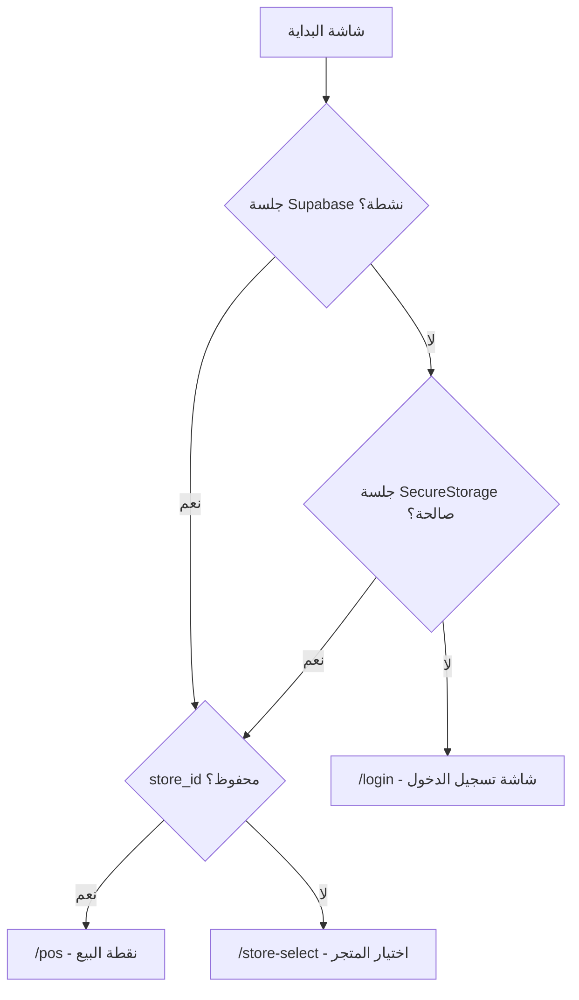
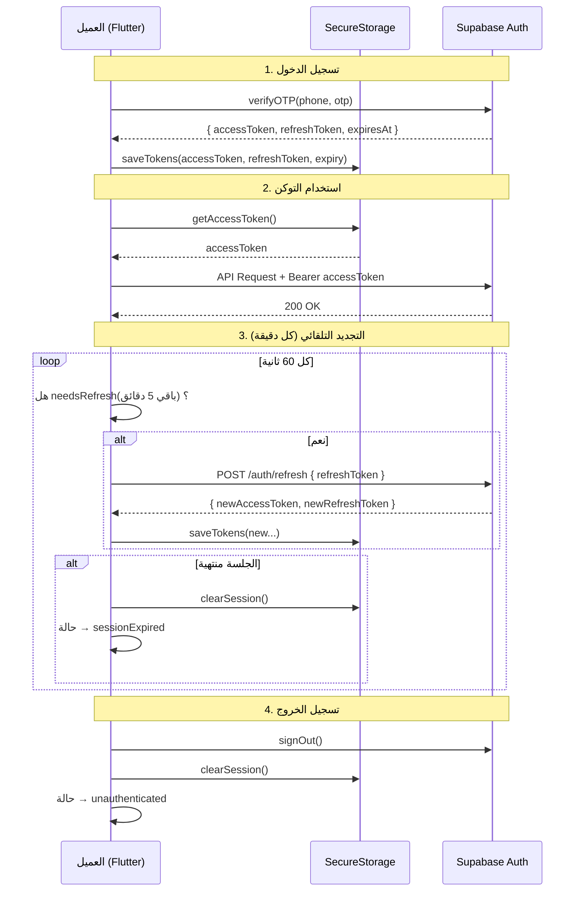
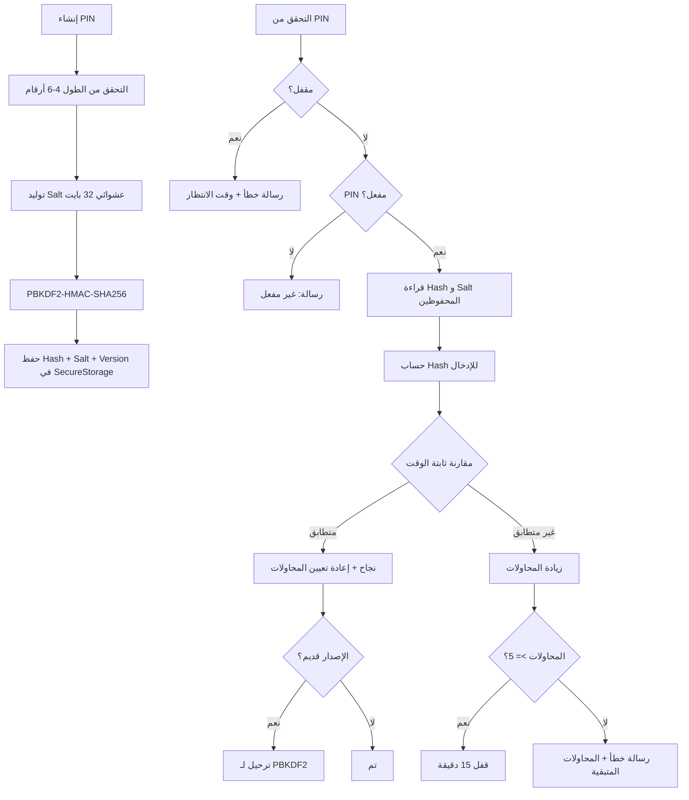
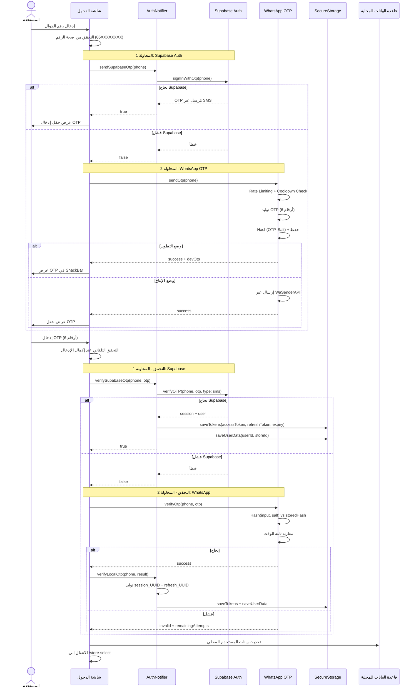
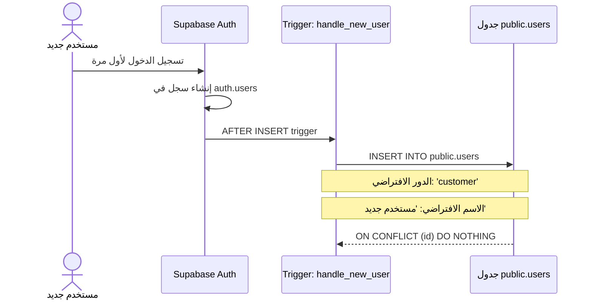
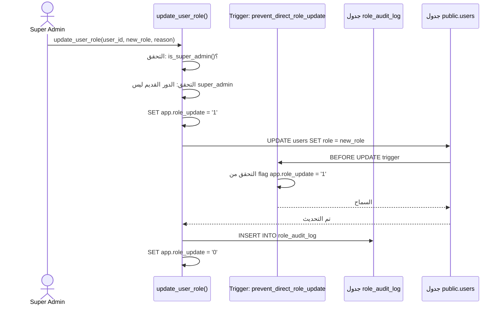
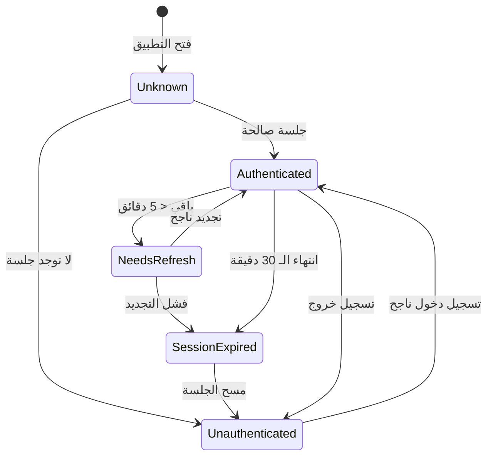
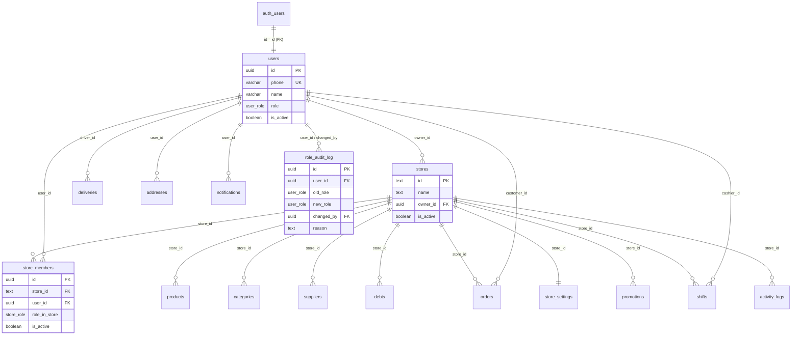

# نظام المصادقة والصلاحيات - Alhai POS Platform

> المرجع التقني الشامل لنظام المصادقة (Authentication)، إدارة الجلسات (Session Management)،
> الأدوار والصلاحيات (Roles & Permissions)، وسياسات أمن الصفوف (RLS Policies) في منصة الحي.

---

## 1. نظرة عامة على نظام المصادقة

نظام المصادقة في منصة الحي مبني على عدة طبقات متكاملة تضمن أمان التطبيق وسهولة الاستخدام:

| الطبقة | التقنية | الوصف |
|--------|---------|-------|
| **مزود المصادقة** | Supabase Auth | المصادقة عبر OTP (SMS/WhatsApp) |
| **إدارة الحالة** | Riverpod `StateNotifier` | `AuthNotifier` يدير حالة المصادقة |
| **التخزين الآمن** | FlutterSecureStorage / SharedPreferences (Web) | تخزين Tokens وبيانات الجلسة |
| **إدارة الجلسات** | `SessionManager` + Timer | مراقبة وتجديد الجلسات تلقائيا |
| **الأمان المحلي** | PIN (PBKDF2) + Biometric (local_auth) | دخول سريع للكاشير |
| **أمان قاعدة البيانات** | Supabase RLS Policies | تأمين البيانات على مستوى الصفوف |
| **أمان الشبكة** | Certificate Pinning + AuthInterceptor | حماية الاتصالات |

### الحزم المعنية

```
packages/alhai_auth/          -- حزمة المصادقة المستقلة
  lib/src/
    providers/auth_providers.dart    -- AuthNotifier, AuthState, Providers
    security/
      secure_storage_service.dart    -- تخزين آمن متعدد المنصات
      session_manager.dart           -- إدارة الجلسات مع cache
      pin_service.dart               -- نظام PIN (PBKDF2)
      biometric_service.dart         -- بصمة / Face ID
      otp_service.dart               -- خدمة OTP العامة
      security_logger.dart           -- تسجيل الأحداث الأمنية
    services/
      whatsapp_otp_service.dart      -- OTP عبر WhatsApp (WaSenderAPI)
    screens/
      splash_screen.dart             -- شاشة البداية والتوجيه
      login_screen.dart              -- شاشة تسجيل الدخول
      store_select_screen.dart       -- اختيار المتجر
      manager_approval_screen.dart   -- موافقة المدير

alhai_core/
  lib/src/
    models/
      user.dart                      -- نموذج المستخدم (Freezed)
      auth_result.dart               -- نتيجة المصادقة
      auth_tokens.dart               -- JWT Tokens
      enums/user_role.dart           -- أنواع المستخدمين
    repositories/
      auth_repository.dart           -- عقد مستودع المصادقة
      impl/auth_repository_impl.dart -- التنفيذ
    datasources/
      remote/auth_remote_datasource.dart  -- API calls
      local/auth_local_datasource.dart    -- تخزين محلي
    networking/
      interceptors/auth_interceptor.dart  -- Interceptor للـ JWT
      secure_http_client.dart             -- Certificate Pinning
    services/
      pin_validation_service.dart         -- PIN validation interface

supabase/
  supabase_init.sql              -- الجداول + RLS Policies + Helper Functions
  supabase_owner_only.sql        -- Triggers على auth.users + Bootstrap admin
  fix_auth.sql                   -- handle_new_user trigger
  fix_rls_recursion.sql          -- حل مشكلة التكرار في RLS
  fix_stores_rls.sql             -- سياسة أعضاء المتجر
  get_my_stores.sql              -- RPC للمتاجر
  storage_policies.sql           -- سياسات Storage buckets
  migrations/
    20260223_tighten_rls_write_policies.sql -- تشديد صلاحيات الكتابة
```

---

## 2. نظام المصادقة (Supabase Auth)

### 2.1 آلية المصادقة

المصادقة تتم عبر رمز OTP (كلمة مرور لمرة واحدة) يُرسل إلى رقم الجوال. يدعم النظام قناتين:

1. **Supabase Auth OTP (الأساسي):** يرسل OTP عبر SMS من خلال Supabase Auth API
2. **WhatsApp OTP (الاحتياطي):** يرسل OTP عبر WhatsApp باستخدام WaSenderAPI

```
المسار: POST /auth/send-otp  → إرسال OTP
المسار: POST /auth/verify-otp → التحقق من OTP
المسار: POST /auth/refresh    → تجديد التوكن
```

### 2.2 واجهة مستودع المصادقة

الملف: `alhai_core/lib/src/repositories/auth_repository.dart`

```dart
abstract class AuthRepository {
  Future<void> sendOtp(String phone);
  Future<AuthResult> verifyOtp(String phone, String otp);
  Future<AuthTokens> refreshToken();
  Future<void> logout();
  Future<User?> getCurrentUser();
  Future<bool> isAuthenticated();
}
```

### 2.3 نموذج نتيجة المصادقة

```dart
// AuthResult = User + AuthTokens
@freezed
class AuthResult with _$AuthResult {
  const factory AuthResult({
    required User user,
    required AuthTokens tokens,
  }) = _AuthResult;
}

// AuthTokens
@freezed
class AuthTokens with _$AuthTokens {
  const factory AuthTokens({
    required String accessToken,
    required String refreshToken,
    required DateTime expiresAt,
  }) = _AuthTokens;
}
```

### 2.4 طبقة التنفيذ

الملف: `alhai_core/lib/src/repositories/impl/auth_repository_impl.dart`

```
AuthRepositoryImpl
  ├─ AuthRemoteDataSource (Dio API calls)
  │   ├─ sendOtp(phone) → POST /auth/send-otp
  │   ├─ verifyOtp(phone, otp) → POST /auth/verify-otp → AuthResponse DTO
  │   └─ refreshToken(refreshToken) → POST /auth/refresh → AuthTokensResponse DTO
  └─ AuthLocalDataSource (SecureStorage + SharedPreferences)
      ├─ saveTokens(AuthTokensEntity) → FlutterSecureStorage
      ├─ getTokens() → AuthTokensEntity?
      ├─ clearTokens()
      ├─ saveUser(UserEntity) → SharedPreferences
      ├─ getUser() → UserEntity?
      └─ clearUser()
```

**مبدأ التصميم:** التحويل بين DTO و Domain Model يحدث فقط في Repository. الـ DataSource تتعامل مع DTOs فقط، و الـ UI تتعامل مع Domain Models فقط.

---

## 3. أنواع المستخدمين (Roles)

### 3.1 الأدوار على مستوى النظام (user_role)

يُعرّف النظام 5 أنواع من المستخدمين على مستوى النظام ككل:

الملف: `alhai_core/lib/src/models/enums/user_role.dart`

```dart
enum UserRole {
  superAdmin,   // مدير النظام الأعلى
  storeOwner,   // مالك المتجر
  employee,     // موظف / كاشير
  delivery,     // سائق توصيل
  customer,     // عميل نهائي
}
```

في قاعدة البيانات (PostgreSQL ENUM):

```sql
CREATE TYPE user_role AS ENUM (
  'super_admin', 'store_owner', 'employee', 'delivery', 'customer'
);
```

### 3.2 الأدوار على مستوى المتجر (store_role)

بالإضافة للأدوار العامة، يمتلك كل مستخدم دورا داخل كل متجر مسجل فيه:

```sql
CREATE TYPE store_role AS ENUM ('owner', 'manager', 'cashier');
```

يُخزن في جدول `store_members`:

```sql
CREATE TABLE public.store_members (
  id UUID PRIMARY KEY DEFAULT gen_random_uuid(),
  store_id TEXT NOT NULL,
  user_id UUID NOT NULL REFERENCES public.users(id),
  role_in_store store_role NOT NULL DEFAULT 'cashier',
  is_active BOOLEAN DEFAULT true,
  ...
  UNIQUE(store_id, user_id)
);
```

### 3.3 العلاقة بين الأدوار

```
user_role (عام)          store_role (داخل المتجر)
───────────────          ──────────────────────────
super_admin ─────────→   (وصول كامل لكل المتاجر)
store_owner ─────────→   owner (مالك المتجر)
employee    ─────────→   manager أو cashier
delivery    ─────────→   (لا يحتاج store_role)
customer    ─────────→   (لا يحتاج store_role)
```

---

## 4. صلاحيات كل نوع مستخدم بالتفصيل

### 4.1 جدول الصلاحيات العامة

| الصلاحية | super_admin | store_owner | employee (manager) | employee (cashier) | delivery | customer |
|----------|:-----------:|:-----------:|:------------------:|:------------------:|:--------:|:--------:|
| إدارة كل المتاجر | نعم | -- | -- | -- | -- | -- |
| تغيير أدوار المستخدمين | نعم | -- | -- | -- | -- | -- |
| عرض سجل تغيير الأدوار | نعم | -- | -- | -- | -- | -- |
| إنشاء متجر جديد | نعم | نعم | -- | -- | -- | -- |
| تعديل إعدادات المتجر | نعم | نعم | نعم | -- | -- | -- |
| إضافة/حذف موظفين | نعم | نعم | نعم | -- | -- | -- |
| إضافة/تعديل المنتجات | نعم | نعم | نعم | -- | -- | -- |
| حذف المنتجات | نعم | نعم | نعم | -- | -- | -- |
| إضافة/تعديل التصنيفات | نعم | نعم | نعم | -- | -- | -- |
| عرض المنتجات | نعم | نعم | نعم | نعم | -- | نعم (النشطة) |
| الوصول لنقطة البيع | نعم | نعم | نعم | نعم | -- | -- |
| إنشاء طلب | نعم | نعم | نعم | نعم | -- | نعم |
| تعديل طلب (حالة created) | نعم | نعم | نعم | نعم | -- | نعم |
| تحديث حالة الطلب | نعم | نعم | نعم | نعم | -- | -- |
| إدارة الموردين | نعم | نعم | نعم | -- | -- | -- |
| إدارة الديون | نعم | نعم | نعم | -- | -- | -- |
| إدارة أوامر الشراء | نعم | نعم | نعم | -- | -- | -- |
| عرض التقارير | نعم | نعم | نعم | -- | -- | -- |
| تصدير التقارير | نعم | نعم | نعم | -- | -- | -- |
| إدارة العروض الترويجية | نعم | نعم | نعم | -- | -- | -- |
| فتح/إغلاق الورديات | نعم | نعم | نعم | نعم (وردياته) | -- | -- |
| تعديل المخزون | نعم | نعم | نعم | -- | -- | -- |
| عرض/تحديث التوصيلات | نعم | نعم | نعم | -- | نعم (المسندة إليه) | -- |
| عرض بياناته الشخصية | نعم | نعم | نعم | نعم | نعم | نعم |
| عرض طلباته | -- | -- | -- | -- | -- | نعم |
| إدارة عناوينه | -- | -- | -- | -- | -- | نعم |
| عرض نقاط الولاء | -- | -- | -- | -- | -- | نعم |

### 4.2 صلاحيات PIN المطلوبة للعمليات الحساسة

الملف: `alhai_core/lib/src/services/pin_validation_service.dart`

| العملية | الاسم التقني | الدور المطلوب |
|---------|-------------|--------------|
| مرتجع | `REFUND` | SUPERVISOR |
| خصم | `DISCOUNT` | SUPERVISOR |
| إلغاء فاتورة | `VOID` | SUPERVISOR |
| سحب نقدي | `CASH_OUT` | SUPERVISOR |
| تعديل سعر | `PRICE_OVERRIDE` | MANAGER |
| إغلاق وردية | `SHIFT_CLOSE` | MANAGER |

### 4.3 نظام الصلاحيات المفصل في شاشة الإدارة

الملف: `apps/admin/lib/screens/settings/roles_permissions_screen.dart`

يُعرّف النظام 22 صلاحية مُفصّلة موزعة على 8 فئات:

| الفئة | الصلاحيات |
|-------|----------|
| **نقطة البيع** | `pos_access`, `pos_hold`, `pos_split_payment` |
| **المنتجات** | `products_view`, `products_manage`, `products_delete` |
| **المخزون** | `inventory_view`, `inventory_manage`, `inventory_adjust` |
| **العملاء** | `customers_view`, `customers_manage`, `customers_delete` |
| **المبيعات** | `discounts_apply`, `discounts_create`, `refunds_request`, `refunds_approve` |
| **التقارير** | `reports_view`, `reports_export` |
| **الإعدادات** | `settings_view`, `settings_manage` |
| **الموظفين** | `staff_view`, `staff_manage` |

#### الأدوار الافتراضية في النظام

| الدور | الصلاحيات |
|-------|----------|
| **مدير النظام** | جميع الصلاحيات الـ 22 |
| **مدير المتجر** | `pos_access`, `products_manage`, `inventory_manage`, `customers_manage`, `reports_view`, `staff_manage`, `discounts_create`, `refunds_approve` |
| **كاشير** | `pos_access`, `products_view`, `customers_view`, `discounts_apply` |
| **أمين مخزن** | `products_manage`, `inventory_manage`, `inventory_adjust`, `suppliers_view` |
| **محاسب** | `reports_view`, `reports_export`, `debts_manage`, `expenses_manage` |

---

## 5. الـ Guards والـ Middleware

### 5.1 Guard التوجيه في Splash Screen

الملف: `packages/alhai_auth/lib/src/screens/splash_screen.dart`

شاشة البداية تعمل كـ Guard رئيسي وتحدد وجهة التنقل:

```dart
Future<String> _determineDestination() async {
  // 1. التحقق من جلسة Supabase
  final session = Supabase.instance.client.auth.currentSession;
  bool isAuthenticated = session != null;

  // 2. Fallback: التحقق من SecureStorage (الوضع المحلي / Web)
  if (!isAuthenticated) {
    isAuthenticated = await SecureStorageService.isSessionValid();
  }

  // 3. إذا غير مسجل → شاشة الدخول
  if (!isAuthenticated) return '/login';

  // 4. مسجل + عنده store_id محفوظ → مباشرة POS
  final savedStoreId = await SecureStorageService.getStoreId();
  if (savedStoreId != null && savedStoreId.isNotEmpty) {
    ref.read(currentStoreIdProvider.notifier).state = savedStoreId;
    return '/pos';
  }

  // 5. مسجل بدون متجر → شاشة اختيار المتجر
  return '/store-select';
}
```



### 5.2 Guard الجلسات المتزامنة (ConcurrentSessionGuard)

الملف: `packages/alhai_auth/lib/src/providers/auth_providers.dart`

يمنع تسجيل الدخول من أكثر من 3 أجهزة في نفس الوقت:

```dart
class ConcurrentSessionGuard {
  static const int _maxConcurrentSessions = 3;

  static Future<SessionCheckResult> checkAndEnforce({
    required String phone,
    SupabaseClient? supabaseClient,
  }) async {
    // في وضع عدم الاتصال → السماح
    if (supabaseClient == null) return const SessionCheckResult(allowed: true);

    // استعلام الجلسات النشطة
    final response = await supabaseClient
        .from('active_sessions')
        .select('id')
        .eq('user_phone', phone)
        .gt('expires_at', DateTime.now().toUtc().toIso8601String());

    if ((response as List).length >= _maxConcurrentSessions) {
      return SessionCheckResult(allowed: false, ...);
    }
    return SessionCheckResult(allowed: true);
  }
}
```

جدول الجلسات المتزامنة:

```sql
CREATE TABLE active_sessions (
  id UUID DEFAULT gen_random_uuid() PRIMARY KEY,
  user_phone TEXT NOT NULL,
  device_id TEXT NOT NULL,
  created_at TIMESTAMPTZ DEFAULT now(),
  last_seen_at TIMESTAMPTZ DEFAULT now(),
  expires_at TIMESTAMPTZ NOT NULL
);
```

### 5.3 Auth Interceptor (حارس الطلبات)

الملف: `alhai_core/lib/src/networking/interceptors/auth_interceptor.dart`

يعمل كـ middleware على كل طلب HTTP:

```
┌────────────────────────────────────────────────────┐
│                 AuthInterceptor v3.1               │
├────────────────────────────────────────────────────┤
│ onRequest:                                         │
│   - تخطي مسارات /auth/*                           │
│   - إضافة Bearer Token من التخزين المحلي          │
│                                                    │
│ onError (401):                                     │
│   - تخطي مسارات /auth/*                           │
│   - التحقق من flag _retried (منع الحلقات)         │
│   - تجديد التوكن عبر Completer (طلب واحد فقط)     │
│   - إعادة الطلب الأصلي بالتوكن الجديد             │
│   - عند فشل التجديد → مسح البيانات                │
└────────────────────────────────────────────────────┘
```

**تفاصيل التنفيذ:**

- يستخدم `Completer<void>` لضمان طلب تجديد واحد فقط عند تعدد الطلبات المتزامنة
- يستخدم Dio منفصل (`refreshDio`) بدون interceptors لتجنب الحلقات اللانهائية
- يضع flag `_retried = true` في `RequestOptions.extra` لمنع المحاولة أكثر من مرة

### 5.4 Providers التحقق من الصلاحيات

```dart
// التحقق من الدور
final userRoleProvider = Provider<UserRole?>((ref) {
  return ref.watch(currentUserProvider)?.role;
});

// هل المستخدم مدير؟
final isAdminProvider = Provider<bool>((ref) {
  final role = ref.watch(userRoleProvider);
  return role == UserRole.superAdmin || role == UserRole.storeOwner;
});

// حالة الجلسة
final sessionStatusProvider = Provider<SessionStatus>((ref) {
  final authState = ref.watch(authStateProvider);
  if (authState.status == AuthStatus.unauthenticated) return SessionStatus.notAuthenticated;
  if (authState.status == AuthStatus.sessionExpired) return SessionStatus.expired;
  if (!authState.isSessionValid) return SessionStatus.expired;
  if (authState.needsRefresh) return SessionStatus.needsRefresh;
  return SessionStatus.valid;
});
```

---

## 6. نظام الـ Tokens

### 6.1 هيكل التوكن

النظام يستخدم JWT (JSON Web Tokens) عبر Supabase Auth:

```dart
@freezed
class AuthTokens with _$AuthTokens {
  const factory AuthTokens({
    required String accessToken,    // JWT - صالح لمدة 30 دقيقة
    required String refreshToken,   // للتجديد - صالح لمدة أطول
    required DateTime expiresAt,    // وقت انتهاء الصلاحية
  }) = _AuthTokens;
}
```

### 6.2 دورة حياة التوكن

```
الثوابت:
  kSessionDuration     = 30 دقيقة    // مدة الجلسة
  kTokenRefreshBuffer  = 5 دقائق     // التجديد قبل الانتهاء بـ 5 دقائق
```



### 6.3 تخزين التوكنات

الملف: `packages/alhai_auth/lib/src/security/secure_storage_service.dart`

| المفتاح | القيمة | طريقة التخزين |
|---------|--------|--------------|
| `access_token` | JWT Access Token | FlutterSecureStorage (Native) / SharedPreferences (Web) |
| `refresh_token` | Refresh Token | FlutterSecureStorage (Native) / SharedPreferences (Web) |
| `session_expiry` | ISO 8601 DateTime | FlutterSecureStorage (Native) / SharedPreferences (Web) |
| `user_id` | UUID | FlutterSecureStorage (Native) / SharedPreferences (Web) |
| `store_id` | TEXT | FlutterSecureStorage (Native) / SharedPreferences (Web) |
| `db_encryption_key` | Base64 Key (32 bytes) | FlutterSecureStorage (Native) / SharedPreferences (Web) |

**ملاحظة أمنية:** على الويب، يُستخدم SharedPreferences كبديل لعدم توفر Keychain. يجب الاعتماد على التخزين من جانب الخادم في بيئة الإنتاج.

### 6.4 آلية التخزين حسب المنصة

```dart
// Native (Android / iOS / Desktop)
class _NativeStorage implements StorageInterface {
  static const _storage = FlutterSecureStorage(
    aOptions: AndroidOptions(encryptedSharedPreferences: true),
    iOptions: IOSOptions(
      accessibility: KeychainAccessibility.first_unlock_this_device,
    ),
  );
}

// Web
class _WebStorage implements StorageInterface {
  static const String _prefix = 'secure_storage_';
  // يستخدم SharedPreferences مع بادئة مميزة
}
```

---

## 7. نظام الـ PIN

### 7.1 نظرة عامة

نظام PIN يوفر طريقة دخول سريعة للكاشير ويُستخدم لتأمين العمليات الحساسة التي تتطلب موافقة المشرف.

الملف: `packages/alhai_auth/lib/src/security/pin_service.dart`

### 7.2 الثوابت

| الثابت | القيمة | الوصف |
|--------|--------|-------|
| `kMaxPinAttempts` | 5 | الحد الأقصى للمحاولات الفاشلة |
| `kLockoutDuration` | 15 دقيقة | مدة القفل |
| `kMinPinLength` | 4 | الحد الأدنى لطول PIN |
| `kMaxPinLength` | 6 | الحد الأقصى لطول PIN |
| `kSaltLength` | 32 بايت | طول Salt |
| `kPbkdf2IterationsNative` | 100,000 | تكرارات PBKDF2 للأجهزة |
| `kPbkdf2IterationsWeb` | 10,000 | تكرارات PBKDF2 للويب |
| `kDerivedKeyLength` | 32 بايت | طول المفتاح الناتج |

### 7.3 خوارزمية التشفير

```
PIN → PBKDF2-HMAC-SHA256(pin, salt, iterations) → Base64(derivedKey)
```

- **الإصدار 1 (قديم):** SHA256 بسيط (للتوافق مع PINs القديمة)
- **الإصدار 2 (الحالي):** PBKDF2 مع Salt عشوائي (32 بايت)

يتم ترحيل PINs من الإصدار القديم تلقائيا عند التحقق الناجح.

### 7.4 دورة حياة PIN



### 7.5 نظام PIN للعمليات الحساسة

الملف: `alhai_core/lib/src/services/pin_validation_service.dart`

```dart
abstract class PinValidationService {
  // التحقق Online
  Future<PinValidationResult> validatePin(PinValidationRequest request);

  // التحقق Offline باستخدام TOTP
  Future<PinValidationResult> validatePinOffline(PinValidationRequest request);

  // أكواد الطوارئ للوضع غير المتصل
  Future<EmergencyCode> generateEmergencyCode(String supervisorId);
  Future<PinValidationResult> validateEmergencyCode(String code);

  // مزامنة أسرار TOTP من الخادم
  Future<void> syncTotpSecrets(String storeId);
}
```

### 7.6 المصادقة البيومترية

الملف: `packages/alhai_auth/lib/src/security/biometric_service.dart`

```dart
class BiometricService {
  // التحقق من التوفر
  static Future<bool> isAvailable();
  static Future<bool> hasFingerprintSupport();
  static Future<bool> hasFaceIdSupport();

  // الإعدادات
  static Future<bool> isEnabled();
  static Future<bool> enable();   // يطلب المصادقة أولا
  static Future<void> disable();

  // تسجيل الدخول
  static Future<BiometricLoginResult> login();
  static Future<bool> authenticate({
    String reason = 'قم بالمصادقة للمتابعة',
    bool sensitiveTransaction = false,
  });
}
```

---

## 8. الـ RLS Policies (سياسات أمن مستوى الصفوف)

### 8.1 الدوال المساعدة

```sql
-- هل المستخدم الحالي super_admin؟
CREATE FUNCTION public.is_super_admin() RETURNS BOOLEAN
  AS $$ SELECT EXISTS (
    SELECT 1 FROM public.users WHERE id = auth.uid() AND role = 'super_admin'
  ); $$;

-- هل المستخدم عضو نشط في المتجر؟
CREATE FUNCTION public.is_store_member(p_store_id TEXT) RETURNS BOOLEAN
  AS $$ SELECT EXISTS (
    SELECT 1 FROM public.store_members
    WHERE store_id = p_store_id AND user_id = auth.uid() AND is_active = true
  ); $$;

-- هل المستخدم مدير المتجر (owner/manager) أو super_admin؟
CREATE FUNCTION public.is_store_admin(p_store_id TEXT) RETURNS BOOLEAN
  AS $$
    SELECT is_super_admin()
    OR EXISTS (SELECT 1 FROM public.stores WHERE id = p_store_id AND owner_id = auth.uid())
    OR EXISTS (
      SELECT 1 FROM public.store_members
      WHERE store_id = p_store_id AND user_id = auth.uid()
        AND is_active = true AND role_in_store IN ('owner', 'manager')
    );
  $$;
```

### 8.2 جدول سياسات RLS لكل جدول ودور

#### جدول `users`

| السياسة | العملية | الشرط |
|---------|---------|-------|
| `users_superadmin_select` | SELECT | `is_super_admin()` |
| `users_self_select` | SELECT | `id = auth.uid()` |
| `users_self_update` | UPDATE | `id = auth.uid()` |
| `users_superadmin_update` | UPDATE | `is_super_admin()` |

#### جدول `stores`

| السياسة | العملية | الشرط |
|---------|---------|-------|
| `stores_superadmin_all` | ALL | `is_super_admin()` |
| `stores_public_read_active` | SELECT | `is_active = true AND auth.uid() IS NOT NULL` |
| `stores_staff_read_own` | SELECT | `is_store_admin(id)` |
| `stores_owner_insert` | INSERT | `owner_id = auth.uid()` |
| `stores_owner_update` | UPDATE | `owner_id = auth.uid()` |
| `stores_owner_delete` | DELETE | `owner_id = auth.uid()` |

#### جدول `store_members`

| السياسة | العملية | الشرط |
|---------|---------|-------|
| `store_members_superadmin_all` | ALL | `is_super_admin()` |
| `store_members_admin_insert` | INSERT | `is_store_admin(store_id)` |
| `store_members_admin_update` | UPDATE | `is_store_admin(store_id)` |
| `store_members_admin_delete` | DELETE | `is_store_admin(store_id)` |
| `store_members_self_read` | SELECT | `user_id = auth.uid()` |
| `store_members_staff_read` | SELECT | `is_store_member(store_id)` |

#### جداول `products` و `categories`

| السياسة | العملية | الشرط |
|---------|---------|-------|
| `*_superadmin_all` | ALL | `is_super_admin()` |
| `*_public_read_active` | SELECT | `is_active = true AND store is_active` |
| `*_staff_read_all` | SELECT | `is_store_member(store_id)` |
| `*_staff_insert` | INSERT | `is_store_admin(store_id)` |
| `*_staff_update` | UPDATE | `is_store_admin(store_id)` |
| `*_staff_delete` | DELETE | `is_store_admin(store_id)` |

**ملاحظة مهمة:** بعد migration `20260223_tighten_rls_write_policies.sql`، تم تشديد صلاحيات الكتابة (INSERT/UPDATE/DELETE) من `is_store_member` إلى `is_store_admin` للجداول: products, categories, suppliers, promotions. الكاشير يمكنه القراءة فقط.

#### جدول `orders`

| السياسة | العملية | الشرط |
|---------|---------|-------|
| `orders_superadmin_all` | ALL | `is_super_admin()` |
| `orders_customer_read` | SELECT | `customer_id = auth.uid()` |
| `orders_customer_insert` | INSERT | `customer_id = auth.uid()` |
| `orders_customer_update_created` | UPDATE | `customer_id = auth.uid() AND status = 'created'` |
| `orders_staff_read` | SELECT | `is_store_member(store_id)` |
| `orders_staff_update` | UPDATE | `is_store_member(store_id)` |

#### جدول `shifts`

| السياسة | العملية | الشرط |
|---------|---------|-------|
| `shifts_superadmin_all` | ALL | `is_super_admin()` |
| `shifts_admin_all` | ALL | `is_store_admin(store_id)` |
| `shifts_cashier_read_own` | SELECT | `cashier_id = auth.uid()` |
| `shifts_cashier_update_own_open` | UPDATE | `cashier_id = auth.uid() AND status = 'open'` |
| `shifts_staff_read` | SELECT | `is_store_member(store_id)` |
| `shifts_staff_insert` | INSERT | `is_store_member(store_id) AND cashier_id = auth.uid()` |

#### جدول `deliveries`

| السياسة | العملية | الشرط |
|---------|---------|-------|
| `deliveries_superadmin_all` | ALL | `is_super_admin()` |
| `deliveries_driver_read` | SELECT | `driver_id = auth.uid()` |
| `deliveries_driver_update` | UPDATE | `driver_id = auth.uid()` |
| `deliveries_staff_read` | SELECT | عبر join مع orders + `is_store_member` |
| `deliveries_staff_update` | UPDATE | عبر join مع orders + `is_store_member` |
| `deliveries_staff_insert` | INSERT | عبر join مع orders + `is_store_member` |

#### جداول مقيّدة (لا يمكن التعديل/الحذف)

| الجدول | القيد |
|--------|-------|
| `stock_adjustments` | INSERT فقط (لا UPDATE / DELETE) |
| `order_payments` | INSERT فقط (لا UPDATE / DELETE) |
| `activity_logs` | INSERT فقط (لا UPDATE / DELETE) |
| `role_audit_log` | SELECT فقط لـ super_admin (لا INSERT/UPDATE/DELETE من التطبيق) |

### 8.3 سياسات Storage (التخزين)

| الـ Bucket | عام؟ | القراءة | الكتابة | الحذف |
|-----------|:----:|---------|---------|-------|
| `product-images` | نعم | الجميع | أعضاء المتجر | أعضاء المتجر |
| `store-logos` | نعم | الجميع | owner / admin فقط | owner / admin فقط |
| `receipts` | لا | أعضاء المتجر | أعضاء المتجر | -- |
| `backups` | لا | owner / admin | owner / admin | owner / admin |
| `invoice-attachments` | لا | أعضاء المتجر | أعضاء المتجر | أعضاء المتجر |

---

## 9. مسارات التسجيل وتسجيل الدخول

### 9.1 مسار تسجيل الدخول بـ OTP



### 9.2 مسار التسجيل الجديد



```sql
-- Trigger: handle_new_user
CREATE OR REPLACE FUNCTION public.handle_new_user()
RETURNS TRIGGER LANGUAGE plpgsql SECURITY DEFINER AS $$
BEGIN
  INSERT INTO public.users (id, phone, email, name, role)
  VALUES (
    NEW.id,
    COALESCE(NEW.phone, NEW.raw_user_meta_data->>'phone'),
    NEW.email,
    COALESCE(NEW.raw_user_meta_data->>'name', 'مستخدم جديد'),
    'customer'    -- الدور الافتراضي لكل مستخدم جديد
  )
  ON CONFLICT (id) DO NOTHING;
  RETURN NEW;
END; $$;
```

### 9.3 مسار ترقية الدور



**حماية تغيير الأدوار:**

1. لا يمكن تغيير الدور مباشرة عبر UPDATE (محمي بـ trigger)
2. يجب استخدام RPC `update_user_role()` فقط
3. فقط `super_admin` يستطيع تغيير الأدوار
4. لا يمكن تغيير دور `super_admin` آخر
5. كل تغيير يُسجل في `role_audit_log`

---

## 10. إدارة الجلسات

### 10.1 حالات الجلسة

```dart
enum AuthStatus {
  unknown,          // جاري التحقق
  authenticated,    // مصادق عليه
  unauthenticated,  // غير مصادق
  sessionExpired,   // الجلسة منتهية
}

enum SessionStatus {
  valid,              // الجلسة صالحة
  needsRefresh,       // تحتاج تجديد (باقي أقل من 5 دقائق)
  expired,            // منتهية
  notAuthenticated,   // غير مصادق
}
```

### 10.2 AuthNotifier - مدير حالة المصادقة

الملف: `packages/alhai_auth/lib/src/providers/auth_providers.dart`

```dart
class AuthNotifier extends StateNotifier<AuthState> {
  Timer? _sessionTimer;  // مراقب كل دقيقة

  // التحقق عند بدء التطبيق
  Future<void> _checkAuthStatus() async {
    // 1. التحقق من جلسة Supabase
    // 2. التحقق من JWT expiry (M84 fix)
    // 3. محاولة تجديد الجلسة عند الانتهاء
    // 4. Fallback: التحقق من SecureStorage
    // 5. بدء مراقبة الجلسة
  }

  // مراقبة الجلسة (كل دقيقة)
  void _startSessionMonitor() {
    _sessionTimer = Timer.periodic(Duration(minutes: 1), (_) async {
      if (!state.isSessionValid) {
        await _handleSessionExpired();
      } else if (state.needsRefresh) {
        await _refreshToken();
      }
    });
  }
}
```

### 10.3 SessionManager - مدير الجلسات المتقدم

الملف: `packages/alhai_auth/lib/src/security/session_manager.dart`

```dart
class SessionManager {
  // Memory Cache للسرعة
  static bool _cacheInitialized = false;
  static String? _cachedAccessToken;
  static DateTime? _cachedExpiry;

  // بدء جلسة جديدة
  static Future<void> startSession({
    required String accessToken,
    required String refreshToken,
    required String userId,
    required String storeId,
  });

  // تجديد الجلسة
  static Future<bool> refreshSession({...});

  // إنهاء الجلسة
  static Future<void> endSession();

  // التحقق السريع من حالة الجلسة (يستخدم cache)
  static Future<SessionStatus> checkSession();

  // مراقبة الجلسة مع callbacks
  static void startSessionMonitor({
    required VoidCallback onExpired,
    VoidCallback? onNeedsRefresh,
  });
}
```

**تحسين الأداء:** SessionManager يستخدم cache في الذاكرة (`_cachedAccessToken`, `_cachedExpiry`) لتجنب قراءة SecureStorage في كل مرة. القراءة الأولى فقط تكون من التخزين، وبعدها تكون فورية.

### 10.4 دورة حياة الجلسة الكاملة



---

## 11. الأمان

### 11.1 طبقات الأمان

```
┌──────────────────────────────────────────────────────┐
│              الطبقة 1: أمان الشبكة                    │
│  - Certificate Pinning (SHA-256)                      │
│  - HTTPS فقط (ترقية HTTP تلقائيا)                    │
│  - رفض الشهادات غير الموثوقة في Release               │
│  - Retry مع Exponential Backoff                       │
│  - HTTP Cache مع ETag/Last-Modified                   │
├──────────────────────────────────────────────────────┤
│              الطبقة 2: أمان المصادقة                   │
│  - OTP عبر SMS/WhatsApp (6 أرقام)                    │
│  - Rate Limiting: 5 محاولات / 15 دقيقة لكل رقم       │
│  - Cooldown: 60 ثانية بين الإرسالات                   │
│  - حد أقصى 3 أجهزة متصلة                              │
│  - JWT مع Refresh Token                               │
│  - Token auto-refresh قبل 5 دقائق من الانتهاء         │
├──────────────────────────────────────────────────────┤
│              الطبقة 3: أمان التخزين                    │
│  - FlutterSecureStorage (Android Keystore / iOS Keychain) │
│  - تشفير قاعدة البيانات (مفتاح في SecureStorage)      │
│  - Android: EncryptedSharedPreferences                 │
│  - iOS: KeychainAccessibility.first_unlock_this_device │
├──────────────────────────────────────────────────────┤
│              الطبقة 4: أمان PIN                       │
│  - PBKDF2-HMAC-SHA256 (100K iterations native)        │
│  - Salt عشوائي (32 بايت) لكل PIN                     │
│  - مقارنة ثابتة الوقت (Constant-time comparison)      │
│  - قفل بعد 5 محاولات فاشلة (15 دقيقة)               │
│  - ترحيل تلقائي من SHA256 إلى PBKDF2                  │
├──────────────────────────────────────────────────────┤
│              الطبقة 5: أمان قاعدة البيانات             │
│  - Row Level Security (RLS) لكل جدول                  │
│  - SECURITY DEFINER functions لتجنب التكرار           │
│  - REVOKE لمنع التعديل المباشر على الجداول الحساسة     │
│  - Triggers لمنع تغيير الأدوار والـ store_id            │
│  - سجل تدقيق لتغيير الأدوار (role_audit_log)          │
├──────────────────────────────────────────────────────┤
│              الطبقة 6: أمان OTP                       │
│  - HMAC-SHA256 لتوقيع حالة OTP المخزنة               │
│  - Hash(OTP, Salt) بدلا من تخزين النص العادي           │
│  - تأخير 100ms مقاوم للـ brute-force                  │
│  - مقارنة ثابتة الوقت لمنع timing attacks             │
│  - Rate Limiting مزدوج (Client + per-phone)           │
│  - تسجيل انتهاكات Rate Limit للمراقبة                 │
├──────────────────────────────────────────────────────┤
│              الطبقة 7: تسجيل الأحداث الأمنية          │
│  - SecurityLogger يسجل كل حدث أمني                   │
│  - إخفاء أرقام الهاتف (masking)                       │
│  - آخر 100 سجل في الذاكرة                            │
│  - Listeners للمراقبة الخارجية                         │
└──────────────────────────────────────────────────────┘
```

### 11.2 Certificate Pinning

الملف: `alhai_core/lib/src/networking/secure_http_client.dart`

```dart
class SecureHttpClient {
  static Dio create({
    required String baseUrl,
    String? certificateFingerprint,  // SHA-256 fingerprint
  }) {
    // Native platforms فقط (الويب لا يدعم)
    if (!kIsWeb) {
      if (certificateFingerprint != null && certificateFingerprint.isNotEmpty) {
        _applyCertificatePinning(dio, certificateFingerprint);
      } else if (kReleaseMode) {
        _rejectBadCertificates(dio);  // Release بدون fingerprint → رفض
      }
      // Debug بدون fingerprint → السلوك الافتراضي
    }
  }
}
```

| الـ API | ثابت الـ Fingerprint | المصدر |
|---------|---------------------|--------|
| Supabase | `SUPABASE_CERT_FINGERPRINT` | Environment variable |
| WaSender | `WASENDER_CERT_FINGERPRINT` | Environment variable |

### 11.3 سجل الأحداث الأمنية (SecurityLogger)

الملف: `packages/alhai_auth/lib/src/security/security_logger.dart`

```dart
enum SecurityEventType {
  // OTP
  otpSent, otpVerifySuccess, otpVerifyFailed, otpExpired, otpRateLimited,
  // PIN
  pinVerifySuccess, pinVerifyFailed, pinLocked, pinCreated, pinChanged, pinRemoved,
  // Session
  sessionStarted, sessionEnded, sessionExpired, sessionRefreshed,
  // Biometric
  biometricSuccess, biometricFailed, biometricEnabled, biometricDisabled,
  // Auth
  loginSuccess, loginFailed, logoutSuccess,
}
```

كل حدث يُسجل مع:
- الطابع الزمني (`timestamp`)
- نوع الحدث (`type`)
- معرف المستخدم (`userId`) - اختياري
- رقم الهاتف المُخفى (`phone`) - اختياري
- التفاصيل (`details`) - اختياري
- بيانات إضافية (`metadata`) - اختياري

### 11.4 حماية تغيير الأدوار

```sql
-- Trigger يمنع التعديل المباشر على role
CREATE TRIGGER prevent_direct_role_update
  BEFORE UPDATE OF role ON public.users
  FOR EACH ROW EXECUTE FUNCTION public.prevent_direct_role_update();

-- الدالة تتحقق من flag خاص
CREATE FUNCTION public.prevent_direct_role_update() RETURNS TRIGGER AS $$
BEGIN
  IF NEW.role IS DISTINCT FROM OLD.role
     AND COALESCE(current_setting('app.role_update', true), '') != '1' THEN
    RAISE EXCEPTION 'role لا يتغير إلا عبر RPC update_user_role';
  END IF;
  RETURN NEW;
END; $$;
```

### 11.5 حماية store_id

```sql
-- Trigger يمنع تغيير store_id بعد الإنشاء
-- مطبق على: products, store_members, debts, purchase_orders
CREATE FUNCTION public.prevent_store_id_change() RETURNS TRIGGER AS $$
BEGIN
  IF OLD.store_id IS DISTINCT FROM NEW.store_id THEN
    RAISE EXCEPTION 'لا يمكن تغيير store_id بعد الإنشاء';
  END IF;
  RETURN NEW;
END; $$;
```

### 11.6 قيود REVOKE

```sql
-- منع التعديل على الجداول الحساسة
REVOKE ALL ON public.role_audit_log FROM anon, authenticated;
REVOKE UPDATE (store_id) ON public.store_members FROM authenticated, anon;
REVOKE UPDATE (store_id) ON public.products FROM authenticated, anon;
REVOKE UPDATE ON public.stock_adjustments FROM authenticated, anon;
REVOKE DELETE ON public.stock_adjustments FROM authenticated, anon;
REVOKE UPDATE ON public.order_payments FROM authenticated, anon;
REVOKE DELETE ON public.order_payments FROM authenticated, anon;
REVOKE UPDATE ON public.activity_logs FROM authenticated, anon;
REVOKE DELETE ON public.activity_logs FROM authenticated, anon;
REVOKE EXECUTE ON FUNCTION public.update_user_role FROM anon;
```

### 11.7 حماية WhatsApp OTP

الملف: `packages/alhai_auth/lib/src/services/whatsapp_otp_service.dart`

| الآلية | التفاصيل |
|--------|----------|
| **Rate Limiting (إرسال)** | حد أقصى `maxSendRequestsPerHour` لكل رقم في الساعة |
| **Rate Limiting (تحقق)** | 5 محاولات كل 15 دقيقة لكل رقم |
| **Cooldown** | `resendCooldownSeconds` ثانية بين الإرسالات |
| **Hash** | HMAC-SHA256 مع Salt عشوائي (32 بايت) لكل OTP |
| **مقارنة آمنة** | Constant-time comparison لمنع timing attacks |
| **تأخير مقاوم** | 100ms delay قبل المقارنة لإبطاء brute-force |
| **إخفاء الأرقام** | أرقام الهاتف مُخفاة في السجلات (`+966****01`) |
| **تخزين آمن** | OTP Hash في SecureStorage (ليس النص العادي) |
| **Certificate Pinning** | SHA-256 fingerprint لـ WaSender API |
| **HMAC State Signing** | توقيع حالة OTP المحفوظة لمنع التلاعب |

---

## ملحق: مسرد المصطلحات

| المصطلح | الشرح |
|---------|-------|
| **JWT** | JSON Web Token - رمز مصادقة مشفر |
| **OTP** | One-Time Password - كلمة مرور لمرة واحدة |
| **RLS** | Row Level Security - أمان على مستوى الصفوف |
| **PBKDF2** | Password-Based Key Derivation Function 2 - دالة اشتقاق المفاتيح |
| **HMAC** | Hash-based Message Authentication Code |
| **TOTP** | Time-based One-Time Password - للتحقق غير المتصل |
| **Timing Attack** | هجوم يستغل الفروق الزمنية في المقارنة |
| **Certificate Pinning** | تثبيت الشهادة لمنع هجمات MITM |
| **SECURITY DEFINER** | دالة SQL تُنفذ بصلاحيات مُنشئها (لتجاوز RLS) |
| **Completer** | آلية Dart للتحكم في Future يدويا |
| **StateNotifier** | مدير حالة من Riverpod |

---

## ملحق: مخطط العلاقات



---

> **آخر تحديث:** 2026-02-28
>
> **الملفات المرجعية:**
> - `packages/alhai_auth/lib/src/providers/auth_providers.dart`
> - `packages/alhai_auth/lib/src/security/` (جميع الملفات)
> - `alhai_core/lib/src/models/enums/user_role.dart`
> - `alhai_core/lib/src/repositories/auth_repository.dart`
> - `alhai_core/lib/src/networking/interceptors/auth_interceptor.dart`
> - `supabase/supabase_init.sql`
> - `supabase/supabase_owner_only.sql`
> - `supabase/migrations/20260223_tighten_rls_write_policies.sql`
> - `apps/admin/lib/screens/settings/roles_permissions_screen.dart`
