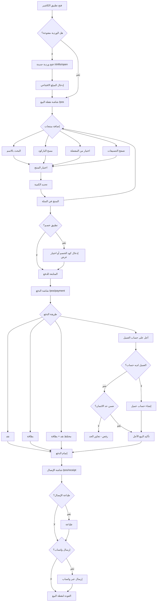
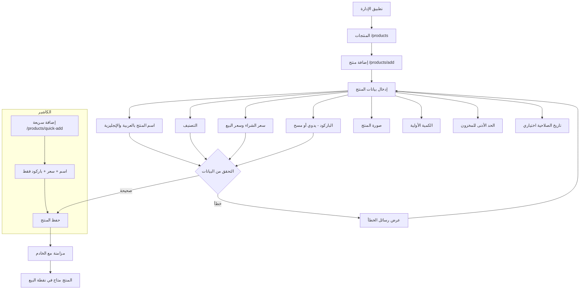
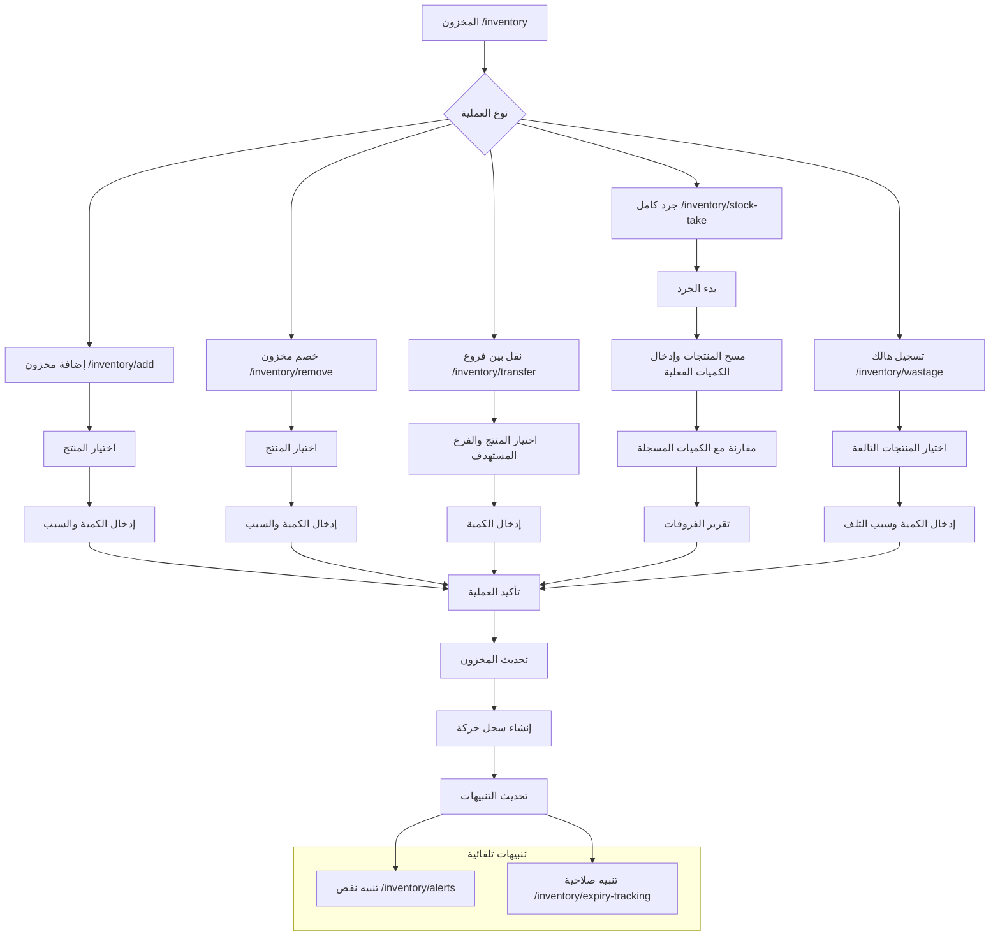
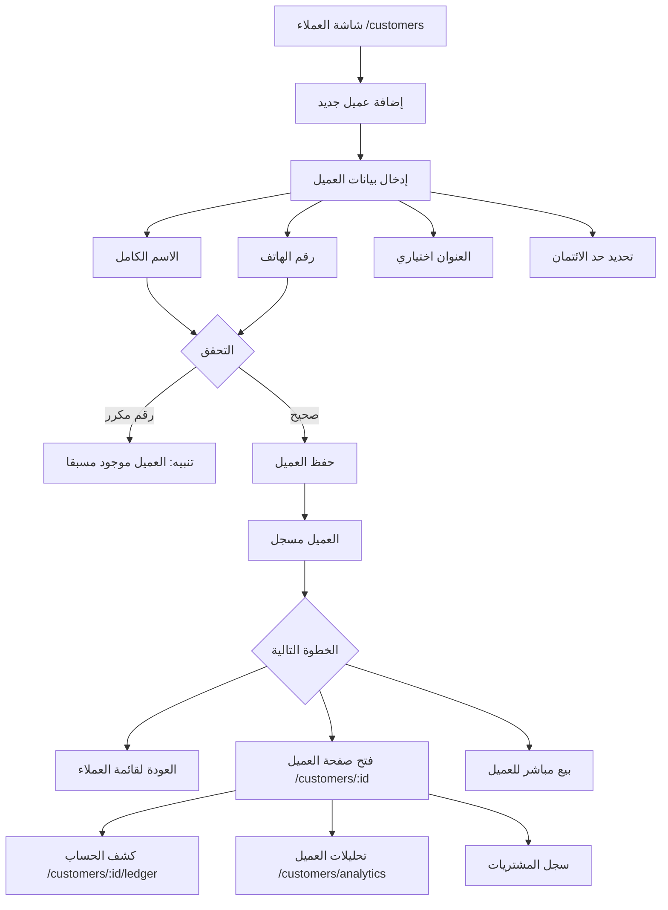
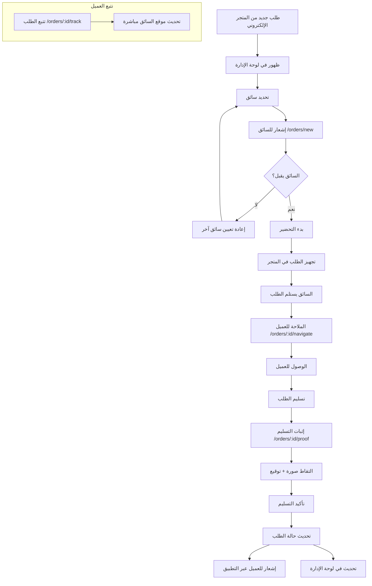
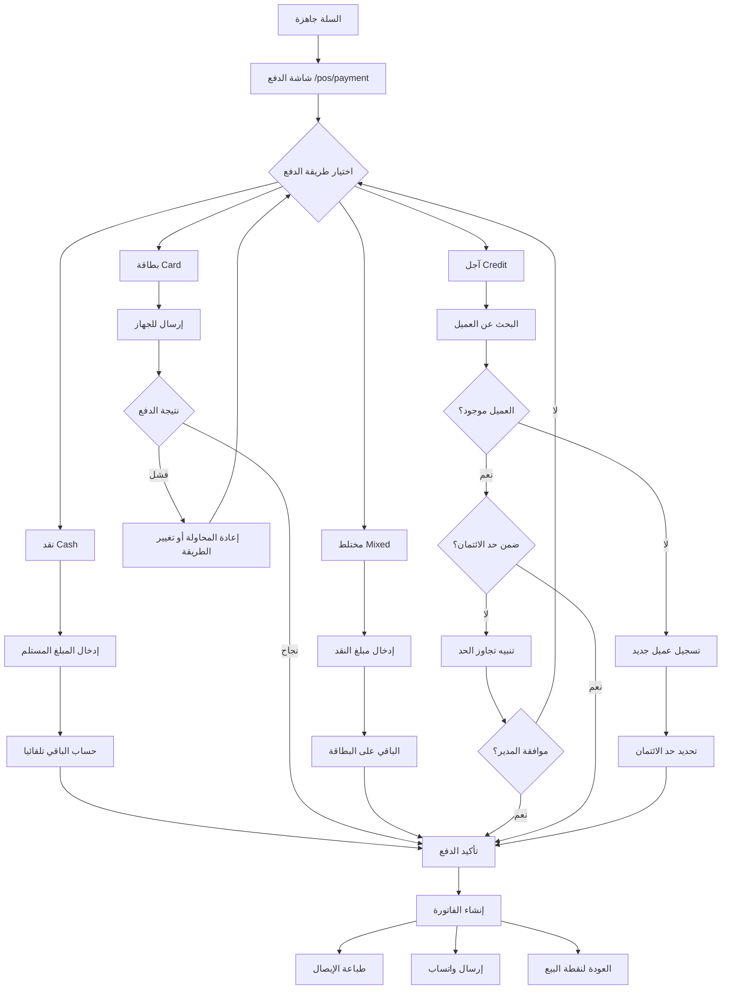

# الشاشات وواجهات المستخدم - Screens & UI

> توثيق شامل لجميع شاشات منظومة الحي (Alhai) وتدفقات المستخدم ونظام التصميم المشترك.

---

## 1. نظرة عامة على الواجهات

تتكون منظومة الحي من **6 تطبيقات** تتشارك في مكتبات أساسية:

| التطبيق | الوصف | عدد المسارات | حالة التطوير |
|---------|-------|-------------|-------------|
| تطبيق الكاشير (`apps/cashier`) | نقطة البيع للموظفين | ~80 مسار | مكتمل |
| تطبيق الإدارة (`apps/admin`) | لوحة تحكم كاملة للمدير | ~120 مسار | مكتمل |
| تطبيق الإدارة الخفيف (`apps/admin_lite`) | لوحة مراقبة مبسطة | ~55 مسار | مكتمل |
| تطبيق العميل (`customer_app`) | تطبيق التسوق للعملاء | ~20 مسار | قيد التطوير |
| تطبيق السائق (`driver_app`) | تطبيق التوصيل | ~18 مسار | قيد التطوير |
| بوابة الموزع (`distributor_portal`) | بوابة الموزعين | 7 مسارات | قيد التطوير |
| المدير العام (`super_admin`) | لوحة تحكم المدير العام | 9 مسارات | قيد التطوير |

### المكتبات المشتركة

| المكتبة | الوصف |
|---------|-------|
| `alhai_design_system` | رموز التصميم (ألوان، خطوط، مسافات) ومكونات UI مشتركة |
| `alhai_shared_ui` | شاشات مشتركة (Dashboard, Products, Customers, etc.) ومسارات `AppRoutes` |
| `alhai_auth` | شاشات المصادقة (Splash, Login, StoreSelect) وحراسة المسارات |
| `alhai_pos` | شاشات نقطة البيع (POS, Payment, Receipt, Returns) |
| `alhai_ai` | شاشات الذكاء الاصطناعي (15 شاشة) |
| `alhai_reports` | شاشات التقارير |
| `alhai_l10n` | الترجمة والتدويل (7 لغات) |

---

## 2. قائمة الشاشات لكل تطبيق

### 2.1 تطبيق الكاشير (Cashier App)

تطبيق مصمم خصيصا للكاشير/الموظف. يستخدم `ShellRoute` مع شريط جانبي (`CashierShell`).

#### شاشات المصادقة (خارج Shell - بدون شريط جانبي)

| اسم الشاشة | المسار (Route) | الوصف | المصدر |
|------------|---------------|-------|--------|
| شاشة البداية | `/splash` | شاشة التحميل الأولية | `alhai_auth` |
| تسجيل الدخول | `/login` | تسجيل الدخول بـ OTP | `alhai_auth` |
| اختيار المتجر | `/store-select` | اختيار المتجر بعد تسجيل الدخول | `alhai_auth` |
| التعريف بالتطبيق | `/onboarding` | شاشة الترحيب للمستخدم الجديد | `cashier/screens/onboarding` |
| الدفع | `/pos/payment` | شاشة الدفع (نقد/بطاقة/مختلط/آجل) | `alhai_pos` |
| الإيصال | `/pos/receipt` | عرض الإيصال بعد الدفع | `alhai_pos` |
| موافقة المدير | `/manager-approval` | شاشة موافقة المدير للعمليات الحساسة | `alhai_auth` |

#### شاشات نقطة البيع (POS)

| اسم الشاشة | المسار (Route) | الوصف | المصدر |
|------------|---------------|-------|--------|
| نقطة البيع الرئيسية | `/pos` | شاشة البيع مع البحث والسلة | `alhai_pos` |
| البيع السريع | `/pos/quick-sale` | بيع سريع بدون تفاصيل | `alhai_pos` |
| المفضلة | `/pos/favorites` | المنتجات المفضلة للوصول السريع | `alhai_pos` |
| الفواتير المعلقة | `/pos/hold-invoices` | الفواتير المحفوظة مؤقتا | `alhai_pos` |
| ماسح الباركود | `/pos/barcode-scanner` | مسح الباركود بالكاميرا | `alhai_pos` |
| درج النقود | `/cash-drawer` | إدارة درج النقود | `alhai_pos` |

#### شاشات المشتريات (الكاشير)

| اسم الشاشة | المسار (Route) | الوصف | المصدر |
|------------|---------------|-------|--------|
| استلام البضائع | `/cashier-receiving` | استلام شحنات الموردين | `cashier/screens/purchases` |
| طلب شراء | `/purchase-request` | إنشاء طلب شراء جديد | `cashier/screens/purchases` |

#### شاشات المرتجعات

| اسم الشاشة | المسار (Route) | الوصف | المصدر |
|------------|---------------|-------|--------|
| المرتجعات | `/returns` | قائمة المرتجعات | `alhai_pos` |
| طلب استرداد | `/returns/request` | تقديم طلب استرداد | `alhai_pos` |
| سبب الاسترداد | `/returns/reason` | تحديد سبب الاسترداد | `alhai_pos` |
| إيصال الاسترداد | `/returns/receipt/:id` | عرض إيصال الاسترداد | `alhai_pos` |
| إلغاء معاملة | `/void-transaction` | إلغاء معاملة بالكامل | `alhai_pos` |
| الاستبدال | `/returns/exchange` | استبدال منتج بآخر | `cashier/screens/sales` |

#### شاشات العملاء

| اسم الشاشة | المسار (Route) | الوصف | المصدر |
|------------|---------------|-------|--------|
| العملاء | `/customers` | قائمة العملاء | `alhai_shared_ui` |
| تفاصيل العميل | `/customers/:id` | بيانات العميل الكاملة | `alhai_shared_ui` |
| كشف حساب العميل | `/customers/:id/ledger` | سجل المعاملات المالية | `cashier/screens/customers` |
| ديون العملاء | `/customers/debt` | نظرة عامة على الديون | `alhai_shared_ui` |
| تحليلات العملاء | `/customers/analytics` | تحليلات سلوك العملاء | `alhai_shared_ui` |
| حسابات العملاء | `/customers/accounts` | إدارة حسابات العملاء | `cashier/screens/customers` |
| معاملة جديدة | `/customers/transaction` | إنشاء معاملة لعميل | `cashier/screens/customers` |
| تطبيق فائدة | `/customers/apply-interest` | تطبيق فوائد على الديون | `cashier/screens/customers` |
| إنشاء فاتورة | `/invoices/create` | إنشاء فاتورة يدوية | `cashier/screens/customers` |

#### شاشات الورديات

| اسم الشاشة | المسار (Route) | الوصف | المصدر |
|------------|---------------|-------|--------|
| الورديات | `/shifts` | قائمة الورديات | `alhai_shared_ui` |
| فتح وردية | `/shifts/open` | بدء وردية جديدة | `cashier/screens/shifts` |
| إغلاق وردية | `/shifts/close` | إنهاء الوردية الحالية | `cashier/screens/shifts` |
| ملخص الوردية | `/shifts/summary` | ملخص أداء الوردية | `alhai_shared_ui` |
| الملخص اليومي | `/shifts/daily-summary` | ملخص المبيعات اليومية | `cashier/screens/shifts` |
| إدخال/إخراج نقد | `/shifts/cash-in-out` | عمليات النقد خلال الوردية | `cashier/screens/shifts` |

#### شاشات المبيعات

| اسم الشاشة | المسار (Route) | الوصف | المصدر |
|------------|---------------|-------|--------|
| سجل المبيعات | `/sales` | تاريخ المبيعات | `cashier/screens/sales` |
| إعادة طباعة الإيصال | `/sales/reprint` | إعادة طباعة إيصال سابق | `cashier/screens/sales` |
| تفاصيل البيع | `/sales/:id` | تفاصيل عملية بيع | `cashier/screens/sales` |
| تقسيم الإيصال | `/sales/split-receipt/:id` | تقسيم إيصال على عدة دفعات | `cashier/screens/payment` |
| سجل المدفوعات | `/payments/history` | تاريخ جميع المدفوعات | `cashier/screens/payment` |
| تقسيم الاسترداد | `/returns/split-refund/:id` | استرداد جزئي | `cashier/screens/payment` |

#### شاشات المنتجات والمخزون

| اسم الشاشة | المسار (Route) | الوصف | المصدر |
|------------|---------------|-------|--------|
| المنتجات | `/products` | قائمة المنتجات | `alhai_shared_ui` |
| تفاصيل المنتج | `/products/:id` | بيانات المنتج الكاملة | `alhai_shared_ui` |
| إضافة منتج سريع | `/products/quick-add` | إضافة منتج جديد بسرعة | `cashier/screens/products` |
| تعديل السعر | `/products/edit-price/:id` | تعديل سعر منتج | `cashier/screens/products` |
| طباعة باركود | `/products/print-barcode` | طباعة ملصقات باركود | `cashier/screens/products` |
| عرض التصنيفات | `/products/categories-view` | تصفح حسب التصنيف | `cashier/screens/products` |
| بطاقات الأسعار | `/products/price-labels` | طباعة بطاقات أسعار | `cashier/screens/products` |
| المخزون | `/inventory` | نظرة عامة على المخزون | `alhai_shared_ui` |
| تنبيهات المخزون | `/inventory/alerts` | تنبيهات النقص | `alhai_shared_ui` |
| تتبع الصلاحية | `/inventory/expiry-tracking` | المنتجات قرب انتهاء الصلاحية | `alhai_shared_ui` |
| تعديل المخزون | `/inventory/edit/:id` | تعديل كمية منتج | `cashier/screens/inventory` |
| إضافة مخزون | `/inventory/add` | إضافة كمية للمخزون | `cashier/screens/inventory` |
| خصم مخزون | `/inventory/remove` | خصم كمية من المخزون | `cashier/screens/inventory` |
| نقل مخزون | `/inventory/transfer` | نقل بين الفروع | `cashier/screens/inventory` |
| جرد المخزون | `/inventory/stock-take` | عملية جرد كاملة | `cashier/screens/inventory` |
| الهالك | `/inventory/wastage` | تسجيل المنتجات التالفة | `cashier/screens/inventory` |

#### شاشات العروض

| اسم الشاشة | المسار (Route) | الوصف | المصدر |
|------------|---------------|-------|--------|
| العروض النشطة | `/offers/active` | العروض الحالية | `cashier/screens/offers` |
| كود الخصم | `/offers/coupon` | تطبيق كوبون خصم | `cashier/screens/offers` |
| عروض المجموعات | `/offers/bundles` | صفقات الحزم | `cashier/screens/offers` |

#### شاشات التقارير

| اسم الشاشة | المسار (Route) | الوصف | المصدر |
|------------|---------------|-------|--------|
| التقارير | `/reports` | قائمة التقارير المتاحة | `alhai_reports` |
| تقرير المبيعات اليومي | `/reports/daily-sales` | ملخص مبيعات اليوم | `alhai_reports` |
| أفضل المنتجات | `/reports/top-products` | المنتجات الأكثر مبيعا | `alhai_reports` |
| التدفق النقدي | `/reports/cash-flow` | تقرير التدفقات النقدية | `alhai_reports` |
| تقرير العملاء | `/reports/customers` | تقرير نشاط العملاء | `alhai_reports` |
| تقرير المخزون | `/reports/inventory` | تقرير حالة المخزون | `alhai_reports` |
| تقرير المدفوعات | `/reports/payments` | تقرير طرق الدفع | `cashier/screens/reports` |
| تقرير مخصص | `/reports/custom` | إنشاء تقرير مخصص | `cashier/screens/reports` |

#### شاشات الإعدادات

| اسم الشاشة | المسار (Route) | الوصف | المصدر |
|------------|---------------|-------|--------|
| الإعدادات | `/settings` | الإعدادات العامة | `cashier/screens/settings` |
| معلومات المتجر | `/settings/store` | بيانات المتجر | `cashier/screens/settings` |
| إعدادات الضريبة | `/settings/tax` | إعدادات VAT/ضريبة | `cashier/screens/settings` |
| إعدادات الإيصال | `/settings/receipt` | تخصيص قالب الإيصال | `cashier/screens/settings` |
| أجهزة الدفع | `/settings/payment-devices` | إدارة أجهزة الدفع | `cashier/screens/settings` |
| إضافة جهاز دفع | `/settings/add-payment-device` | ربط جهاز دفع جديد | `cashier/screens/settings` |
| إعدادات الطابعة | `/settings/printer` | إعدادات طابعة الإيصالات | `cashier/screens/settings` |
| اختصارات لوحة المفاتيح | `/settings/keyboard-shortcuts` | تخصيص الاختصارات | `cashier/screens/settings` |
| المستخدمين والصلاحيات | `/settings/users` | إدارة صلاحيات المستخدمين | `cashier/screens/settings` |
| النسخ الاحتياطي | `/settings/backup` | النسخ الاحتياطي للبيانات | `cashier/screens/settings` |
| اللغة | `/settings/language` | تغيير لغة التطبيق | `alhai_shared_ui` |
| المظهر | `/settings/theme` | الوضع الفاتح/الداكن | `alhai_shared_ui` |

#### شاشات عامة

| اسم الشاشة | المسار (Route) | الوصف | المصدر |
|------------|---------------|-------|--------|
| لوحة المعلومات | `/dashboard` | إحصائيات سريعة | `alhai_shared_ui` |
| الفواتير | `/invoices` | قائمة الفواتير | `alhai_shared_ui` |
| تفاصيل الفاتورة | `/invoices/:id` | تفاصيل فاتورة | `alhai_shared_ui` |
| تتبع الطلبات | `/orders/tracking` | تتبع الطلبات النشطة | `alhai_shared_ui` |
| سجل الطلبات | `/orders/history` | تاريخ الطلبات | `alhai_shared_ui` |
| الإشعارات | `/notifications` | مركز الإشعارات | `alhai_shared_ui` |
| الملف الشخصي | `/profile` | بيانات المستخدم | `alhai_shared_ui` |
| حالة المزامنة | `/sync` | حالة مزامنة البيانات | `alhai_shared_ui` |

---

### 2.2 تطبيق الإدارة (Admin App)

تطبيق الإدارة الكامل للمدير. يستخدم `ShellRoute` مع شريط جانبي (`AdminDashboardShell`). يتطلب صلاحية مدير (`UserRole != employee`).

#### شاشات خاصة بالمدير (غير موجودة في الكاشير)

| اسم الشاشة | المسار (Route) | الوصف | المصدر |
|------------|---------------|-------|--------|
| الرئيسية | `/home` | الصفحة الرئيسية للمدير | `admin/screens/home_screen` |
| إضافة منتج | `/products/add` | نموذج إضافة منتج كامل | `admin/screens/products` |
| تعديل منتج | `/products/edit/:id` | تعديل بيانات المنتج | `admin/screens/products` |
| التصنيفات | `/categories` | إدارة تصنيفات المنتجات | `admin/screens/products` |
| الموردين | `/suppliers` | قائمة الموردين | `alhai_shared_ui` |
| تفاصيل المورد | `/suppliers/:id` | بيانات المورد | `alhai_shared_ui` |
| إضافة مورد | `/suppliers/new` | نموذج إضافة مورد | `admin/screens/suppliers` |
| الطلبات | `/orders` | إدارة الطلبات | `alhai_shared_ui` |
| المصروفات | `/expenses` | تتبع المصروفات | `alhai_shared_ui` |
| تصنيفات المصروفات | `/expenses/categories` | تصنيفات المصروفات | `alhai_shared_ui` |
| إقفال شهري | `/debts/monthly-close` | الإقفال الشهري للديون | `admin/screens/debts` |

#### شاشات المشتريات (المدير)

| اسم الشاشة | المسار (Route) | الوصف | المصدر |
|------------|---------------|-------|--------|
| نموذج شراء | `/purchases/new` | إنشاء أمر شراء | `admin/screens/purchases` |
| إعادة الطلب الذكي | `/purchases/smart-reorder` | اقتراحات إعادة الطلب بالذكاء الاصطناعي | `admin/screens/purchases` |
| استيراد فاتورة بالذكاء الاصطناعي | `/purchases/ai-import` | مسح فاتورة المورد بالكاميرا | `admin/screens/purchases` |
| مراجعة الفاتورة | `/purchases/ai-review` | مراجعة الفاتورة المستخرجة | `admin/screens/purchases` |
| قائمة المشتريات | `/purchases` | سجل المشتريات | `admin/screens/purchases` |
| تفاصيل المشتريات | `/purchases/:id` | تفاصيل أمر شراء | `admin/screens/purchases` |
| استلام بضائع | `/purchases/:id/receive` | تأكيد استلام شحنة | `admin/screens/purchases` |
| إرسال للموزع | `/purchases/:id/send` | إرسال طلب للموزع | `admin/screens/purchases` |
| مرتجعات الموردين | `/purchases/supplier-returns` | إرجاع بضائع للمورد | `admin/screens/purchases` |

#### شاشات التسويق

| اسم الشاشة | المسار (Route) | الوصف | المصدر |
|------------|---------------|-------|--------|
| الخصومات | `/marketing/discounts` | إدارة الخصومات | `admin/screens/marketing` |
| الكوبونات | `/marketing/coupons` | إدارة كوبونات الخصم | `admin/screens/marketing` |
| العروض الخاصة | `/marketing/offers` | إدارة العروض | `admin/screens/marketing` |
| العروض الذكية | `/promotions` | عروض ترويجية ذكية | `admin/screens/marketing` |
| بطاقات الهدايا | `/marketing/gift-cards` | إدارة بطاقات الهدايا | `admin/screens/marketing` |

#### شاشات الذكاء الاصطناعي (15 شاشة)

| اسم الشاشة | المسار (Route) | الوصف | المصدر |
|------------|---------------|-------|--------|
| المساعد الذكي | `/ai/assistant` | مساعد ذكاء اصطناعي محادثة | `alhai_ai` |
| التنبؤ بالمبيعات | `/ai/sales-forecasting` | توقعات المبيعات المستقبلية | `alhai_ai` |
| التسعير الذكي | `/ai/smart-pricing` | اقتراحات تسعير ذكية | `alhai_ai` |
| كشف الاحتيال | `/ai/fraud-detection` | كشف العمليات المشبوهة | `alhai_ai` |
| تحليل السلة | `/ai/basket-analysis` | تحليل سلة المشتريات | `alhai_ai` |
| توصيات العملاء | `/ai/customer-recommendations` | توصيات مخصصة للعملاء | `alhai_ai` |
| المخزون الذكي | `/ai/smart-inventory` | إدارة مخزون ذكية | `alhai_ai` |
| تحليل المنافسين | `/ai/competitor-analysis` | تحليل أسعار المنافسين | `alhai_ai` |
| التقارير الذكية | `/ai/smart-reports` | تقارير مولدة بالذكاء الاصطناعي | `alhai_ai` |
| تحليل الموظفين | `/ai/staff-analytics` | تحليل أداء الموظفين | `alhai_ai` |
| التعرف على المنتجات | `/ai/product-recognition` | التعرف بالكاميرا | `alhai_ai` |
| تحليل المشاعر | `/ai/sentiment-analysis` | تحليل تقييمات العملاء | `alhai_ai` |
| التنبؤ بالمرتجعات | `/ai/return-prediction` | توقع المرتجعات | `alhai_ai` |
| تصميم العروض | `/ai/promotion-designer` | تصميم عروض بالذكاء الاصطناعي | `alhai_ai` |
| الدردشة مع البيانات | `/ai/chat-with-data` | استعلام البيانات بلغة طبيعية | `alhai_ai` |

#### شاشات الإدارة

| اسم الشاشة | المسار (Route) | الوصف | المصدر |
|------------|---------------|-------|--------|
| إدارة السائقين | `/drivers` | إدارة فريق التوصيل | `admin/screens/management` |
| إدارة الفروع | `/branches` | إدارة فروع المتجر | `admin/screens/management` |
| الموظفين | `/employees` | إدارة الموظفين | `admin/screens/settings` |
| الحضور | `/employees/attendance` | تتبع حضور الموظفين | `admin/screens/employees` |
| العمولات | `/employees/commissions` | عمولات الموظفين | `admin/screens/employees` |
| ملف الموظف | `/employees/profile/:userId` | تفاصيل الموظف | `admin/screens/employees` |

#### شاشات التجارة الإلكترونية

| اسم الشاشة | المسار (Route) | الوصف | المصدر |
|------------|---------------|-------|--------|
| التجارة الإلكترونية | `/ecommerce` | إدارة المتجر الإلكتروني | `admin/screens/ecommerce` |
| الطلبات الإلكترونية | `/ecommerce/online-orders` | طلبات المتجر الإلكتروني | `admin/screens/ecommerce` |
| مناطق التوصيل | `/ecommerce/delivery-zones` | تحديد مناطق التوصيل | `admin/screens/ecommerce` |

#### شاشات إضافية (المدير)

| اسم الشاشة | المسار (Route) | الوصف | المصدر |
|------------|---------------|-------|--------|
| برنامج الولاء | `/loyalty` | إدارة برنامج نقاط الولاء | `admin/screens/loyalty` |
| المحفظة الإلكترونية | `/wallet` | إدارة المحفظة | `admin/screens/wallet` |
| الاشتراك | `/subscription` | إدارة خطة الاشتراك | `admin/screens/subscription` |
| مكتبة الوسائط | `/media` | إدارة الصور والملفات | `admin/screens/media` |
| سجل الأجهزة | `/devices` | سجل أجهزة النقاط | `admin/screens/devices` |
| طابور الطباعة | `/print-queue` | إدارة مهام الطباعة | `admin/screens/printing` |
| المعاملات المعلقة | `/sync/pending` | المعاملات في انتظار المزامنة | `admin/screens/sync` |
| حل التعارضات | `/sync/conflicts` | حل تعارضات المزامنة | `admin/screens/sync` |
| تقرير الشكاوى | `/reports/complaints` | تقرير شكاوى العملاء | `alhai_reports` |
| قوائم الأسعار | `/products/price-lists` | إدارة قوائم أسعار متعددة | `admin/screens/products` |
| مجموعات العملاء | `/customers/groups` | تصنيف العملاء | `admin/screens/customers` |
| البضائع التالفة | `/inventory/damaged-goods` | تسجيل التلفيات | `admin/screens/inventory` |
| وضع الكيوسك | `/pos/kiosk` | الخدمة الذاتية | `alhai_pos` |

#### إعدادات تطبيق الإدارة (22 شاشة)

| اسم الشاشة | المسار (Route) | الوصف |
|------------|---------------|-------|
| الإعدادات العامة | `/settings` | القائمة الرئيسية للإعدادات |
| إعدادات المتجر | `/settings/store` | بيانات المتجر |
| إعدادات الطابعة | `/settings/printer` | الطابعات |
| إعدادات نقطة البيع | `/settings/pos` | تخصيص شاشة البيع |
| أجهزة الدفع | `/settings/payment-devices` | أجهزة مدى/فيزا |
| إعدادات الباركود | `/settings/barcode` | إعدادات الباركود |
| قالب الإيصال | `/settings/receipt` | تصميم الإيصال |
| إعدادات الضريبة | `/settings/tax` | VAT والضرائب |
| إعدادات الخصومات | `/settings/discounts` | سياسات الخصم |
| إعدادات الفائدة | `/settings/interest` | نسب الفوائد على الديون |
| الأمان | `/settings/security` | إعدادات الأمان |
| إدارة المستخدمين | `/settings/users` | المستخدمين |
| الأدوار والصلاحيات | `/settings/roles` | الصلاحيات |
| سجل النشاط | `/settings/activity-log` | تتبع العمليات |
| النسخ الاحتياطي | `/settings/backup` | نسخ البيانات |
| إعدادات الإشعارات | `/settings/notifications` | تخصيص الإشعارات |
| امتثال هيئة الزكاة | `/settings/zatca` | متطلبات ZATCA |
| المساعدة والدعم | `/settings/help` | الدعم الفني |
| بوابات الشحن | `/settings/shipping` | شركات الشحن |
| إدارة واتساب | `/settings/whatsapp` | إعدادات واتساب |
| اللغة | `/settings/language` | تغيير اللغة |
| المظهر | `/settings/theme` | الوضع الداكن/الفاتح |

---

### 2.3 تطبيق الإدارة الخفيف (Admin Lite)

تطبيق مراقبة مبسط يستخدم `BottomNavigationBar` بـ 5 تبويبات بدلا من الشريط الجانبي.

#### التبويبات الرئيسية

| التبويب | المسار | الوصف |
|---------|--------|-------|
| لوحة المعلومات | `/dashboard` | إحصائيات سريعة |
| التقارير | `/reports` | 13 تقرير متنوع |
| الذكاء الاصطناعي | `/ai/assistant` | 15 أداة ذكاء اصطناعي |
| المراقبة | `/monitoring` | تنبيهات المخزون والصلاحية |
| المزيد | `/more` | عملاء، موردين، إعدادات |

#### شاشات التقارير (13 شاشة)

| اسم الشاشة | المسار (Route) | الوصف |
|------------|---------------|-------|
| التقارير | `/reports` | القائمة الرئيسية |
| المبيعات اليومية | `/reports/daily-sales` | تقرير يومي |
| الأرباح | `/reports/profit` | تقرير الأرباح |
| الضرائب | `/reports/tax` | تقرير الضرائب |
| ضريبة القيمة المضافة | `/reports/vat` | تقرير VAT |
| المخزون | `/reports/inventory` | تقرير المخزون |
| العملاء | `/reports/customers` | تقرير العملاء |
| أفضل المنتجات | `/reports/top-products` | الأكثر مبيعا |
| تحليل المبيعات | `/reports/sales-analytics` | تحليلات متقدمة |
| أداء الموظفين | `/reports/staff-performance` | أداء الفريق |
| ساعات الذروة | `/reports/peak-hours` | أوقات الذروة |
| الديون | `/reports/debts` | تقرير الديون |
| الشكاوى | `/reports/complaints` | تقرير الشكاوى |

#### شاشات المراقبة

| اسم الشاشة | المسار (Route) | الوصف |
|------------|---------------|-------|
| مركز المراقبة | `/monitoring` | نقطة الدخول |
| تنبيهات المخزون | `/monitoring/inventory-alerts` | تنبيهات النقص |
| المخزون | `/inventory` | نظرة عامة |
| تتبع الصلاحية | `/inventory/expiry-tracking` | الصلاحيات القريبة |
| الورديات | `/shifts` | إدارة الورديات |
| المنتجات | `/products` | كتالوج المنتجات |
| مركز الموافقات | `/approvals` | موافقات معلقة |

---

### 2.4 تطبيق العميل (Customer App)

تطبيق تسوق للعملاء النهائيين. جميع الشاشات حاليا في مرحلة التطوير (Placeholder).

| اسم الشاشة | المسار (Route) | الوصف |
|------------|---------------|-------|
| شاشة البداية | `/` | شاشة التحميل |
| التعريف | `/onboarding` | شاشة الترحيب |
| الرئيسية | `/home` | الصفحة الرئيسية |
| تسجيل الدخول | `/auth/login` | تسجيل الدخول |
| التسجيل | `/auth/register` | إنشاء حساب جديد |
| التحقق OTP | `/auth/otp` | التحقق برمز OTP |
| الكتالوج | `/catalog` | تصفح المنتجات |
| تفاصيل المنتج | `/products/:id` | بيانات المنتج |
| البحث | `/search` | البحث عن منتجات |
| سلة المشتريات | `/cart` | عرض السلة |
| الدفع | `/checkout` | إتمام الشراء |
| طريقة الدفع | `/checkout/payment` | اختيار طريقة الدفع |
| الطلبات | `/orders` | سجل الطلبات |
| تفاصيل الطلب | `/orders/:id` | تفاصيل طلب |
| تتبع الطلب | `/orders/:id/track` | تتبع مباشر |
| الملف الشخصي | `/profile` | بيانات الحساب |
| العناوين | `/profile/addresses` | إدارة العناوين |
| الإعدادات | `/profile/settings` | إعدادات التطبيق |
| تفاصيل المتجر | `/store/:id` | بيانات المتجر |
| المتاجر القريبة | `/stores/nearby` | البحث عن متاجر |

---

### 2.5 تطبيق السائق (Driver App)

تطبيق التوصيل لسائقي التوصيل. جميع الشاشات حاليا في مرحلة التطوير (Placeholder).

| اسم الشاشة | المسار (Route) | الوصف |
|------------|---------------|-------|
| شاشة البداية | `/` | شاشة التحميل |
| اختيار اللغة | `/language` | اختيار اللغة |
| تسجيل الدخول | `/login` | الدخول |
| إعداد الملف | `/profile-setup` | إعداد الملف الشخصي |
| الرئيسية | `/home` | لوحة المعلومات |
| التوصيلات | `/deliveries` | التوصيلات النشطة |
| الورديات | `/shifts` | جدول الورديات |
| الأرباح | `/earnings` | ملخص الأرباح |
| طلب جديد | `/orders/new` | استلام طلب جديد |
| تفاصيل الطلب | `/orders/:id` | تفاصيل الطلب |
| الملاحة | `/orders/:id/navigate` | خريطة التوجيه |
| إثبات التسليم | `/orders/:id/proof` | تأكيد التسليم بالصور |
| المحادثة | `/chat/:orderId` | التواصل مع العميل |
| رسائل سريعة | `/quick-messages` | رسائل جاهزة |
| التقرير اليومي | `/reports/daily` | ملخص اليوم |
| التقرير الأسبوعي | `/reports/weekly` | ملخص الأسبوع |
| التقرير الشهري | `/reports/monthly` | ملخص الشهر |
| الملف الشخصي | `/profile` | بيانات السائق |
| المساعدة | `/help` | الدعم الفني |

---

### 2.6 بوابة الموزع (Distributor Portal)

بوابة إدارة للموزعين. تستخدم `ShellRoute` مع شريط جانبي (`DistributorShell`).

| اسم الشاشة | المسار (Route) | الوصف | الملف |
|------------|---------------|-------|-------|
| لوحة المعلومات | `/dashboard` | إحصائيات الموزع | `distributor_dashboard_screen.dart` |
| الطلبات | `/orders` | طلبات المتاجر | `distributor_orders_screen.dart` |
| تفاصيل الطلب | `/orders/:id` | تفاصيل طلب | `distributor_order_detail_screen.dart` |
| المنتجات | `/products` | كتالوج المنتجات | `distributor_products_screen.dart` |
| التسعير | `/pricing` | إدارة الأسعار | `distributor_pricing_screen.dart` |
| التقارير | `/reports` | تقارير المبيعات | `distributor_reports_screen.dart` |
| الإعدادات | `/settings` | إعدادات الحساب | `distributor_settings_screen.dart` |

---

### 2.7 المدير العام (Super Admin)

لوحة تحكم المدير العام لإدارة جميع المتاجر. تستخدم حراسة مسارات مبسطة. جميع الشاشات حاليا في مرحلة التطوير.

| اسم الشاشة | المسار (Route) | الوصف |
|------------|---------------|-------|
| شاشة البداية | `/` | شاشة التحميل |
| تسجيل الدخول | `/login` | تسجيل دخول المدير العام |
| لوحة التحكم | `/dashboard` | إحصائيات جميع المتاجر |
| المتاجر | `/stores` | قائمة جميع المتاجر |
| تفاصيل المتجر | `/stores/:id` | بيانات متجر محدد |
| المستخدمين | `/users` | إدارة جميع المستخدمين |
| التحليلات | `/analytics` | تحليلات شاملة |
| الفوترة | `/billing` | إدارة الاشتراكات والفواتير |
| الإعدادات | `/settings` | إعدادات المنصة |

---

## 3. تدفق المستخدم (User Flows)

### 3.1 عملية البيع (POS Sale Flow)



### 3.2 إضافة منتج جديد (Add Product Flow)



### 3.3 إدارة المخزون (Inventory Management Flow)



### 3.4 تسجيل عميل جديد (New Customer Registration)



### 3.5 عملية التوصيل (Delivery Flow)



### 3.6 عملية الدفع (Payment Flow)



---

## 4. نظام التنقل (Navigation System)

### 4.1 GoRouter

جميع التطبيقات تستخدم مكتبة `go_router` لإدارة التنقل مع الميزات التالية:

```
الموقع الأولي: /splash
التوجيه التصحيحي: تلقائي عبر redirect
التحديث التلقائي: عبر refreshListenable (ChangeNotifier)
انتقالات الشاشات: FadeTransition مع AlhaiMotion.standard
```

### 4.2 حراسة المسارات (Route Guards)

كل تطبيق يحتوي على `_AuthNotifier` و `_guardRedirect` لحماية المسارات:

```
1. التحقق من حالة المصادقة (AuthStatus)
2. التحقق من حالة التعريف (Onboarding)
3. التحقق من اختيار المتجر (Store Selection)
4. التحقق من الصلاحيات (Role Check) - للمدير فقط
```

#### منطق التوجيه:

| الحالة | التوجيه |
|--------|---------|
| حالة المصادقة غير معروفة | البقاء في الصفحة الحالية |
| التعريف لم يُشاهَد | توجيه الى `/onboarding` |
| غير مسجل الدخول | توجيه الى `/login` |
| مسجل بدون متجر | توجيه الى `/store-select` |
| موظف يحاول دخول تطبيق المدير | توجيه الى `/login` |
| مسجل + متجر + يحاول دخول صفحة عامة | توجيه الى الصفحة الرئيسية |

### 4.3 هيكل ShellRoute

#### تطبيق الكاشير:
```
ShellRoute (CashierShell - شريط جانبي)
  ├── /pos                    (نقطة البيع)
  ├── /pos/quick-sale         (البيع السريع)
  ├── /pos/favorites          (المفضلة)
  ├── /dashboard              (لوحة المعلومات)
  ├── /products               (المنتجات)
  ├── /inventory              (المخزون)
  ├── /customers              (العملاء)
  ├── /shifts                 (الورديات)
  ├── /sales                  (المبيعات)
  ├── /reports                (التقارير)
  ├── /settings               (الإعدادات)
  └── ...جميع الشاشات الداخلية
```

#### تطبيق الإدارة:
```
ShellRoute (AdminDashboardShell - شريط جانبي كامل)
  ├── /home                   (الرئيسية)
  ├── /dashboard              (لوحة المعلومات)
  ├── /pos                    (نقطة البيع)
  ├── /products               (المنتجات)
  ├── /inventory              (المخزون)
  ├── /customers              (العملاء)
  ├── /suppliers              (الموردين)
  ├── /orders                 (الطلبات)
  ├── /expenses               (المصروفات)
  ├── /reports                (التقارير)
  ├── /ai/*                   (الذكاء الاصطناعي)
  ├── /marketing/*            (التسويق)
  ├── /settings/*             (الإعدادات)
  └── ...120+ شاشة
```

#### تطبيق الإدارة الخفيف:
```
ShellRoute (LiteShell - شريط تنقل سفلي)
  ├── Tab 1: /dashboard       (لوحة المعلومات)
  ├── Tab 2: /reports         (التقارير - 13 شاشة)
  ├── Tab 3: /ai/assistant    (الذكاء الاصطناعي - 15 شاشة)
  ├── Tab 4: /monitoring      (المراقبة)
  └── Tab 5: /more            (المزيد)
```

### 4.4 التحميل الكسول (Lazy Loading)

الشاشات الثقيلة تستخدم `LazyScreen` لتحميلها عند الحاجة فقط:

```dart
LazyScreen(
  screenBuilder: () async => const ReportsScreen(),
  loadingWidget: const ReportsLoadingScreen(),  // اختياري
)
```

هذا يحسن زمن التحميل الأولي ويقلل استهلاك الذاكرة.

---

## 5. نظام التصميم (Design System)

يقع نظام التصميم في حزمة `alhai_design_system` ويوفر رموز تصميم (Design Tokens) ومكونات مشتركة لجميع التطبيقات.

### 5.1 الألوان (Colors)

#### الألوان الأساسية

| الرمز | القيمة | الوصف |
|-------|--------|-------|
| `primary` | `#10B981` | الأخضر الطازج - اللون الرئيسي (Emerald 500) |
| `primaryLight` | `#34D399` | الأخضر الفاتح (Emerald 400) |
| `primaryDark` | `#059669` | الأخضر الداكن (Emerald 600) |
| `secondary` | `#F97316` | البرتقالي الدافئ (Orange 500) |
| `secondaryLight` | `#FB923C` | البرتقالي الفاتح (Orange 400) |
| `secondaryDark` | `#EA580C` | البرتقالي الداكن (Orange 600) |

#### ألوان المعاني (Semantic)

| الرمز | القيمة | الاستخدام |
|-------|--------|----------|
| `success` | `#22C55E` | نجاح العمليات |
| `warning` | `#F59E0B` | تحذيرات |
| `error` | `#EF4444` | أخطاء |
| `info` | `#3B82F6` | معلومات |

#### ألوان المال

| الرمز | القيمة | الاستخدام |
|-------|--------|----------|
| `cash` | `#22C55E` | نقد - أخضر |
| `card` | `#3B82F6` | بطاقة - أزرق |
| `debt` | `#EF4444` | دين - أحمر |
| `credit` | `#14B8A6` | رصيد دائن - تركواز |

#### ألوان المخزون

| الرمز | القيمة | الاستخدام |
|-------|--------|----------|
| `stockAvailable` | `#22C55E` | متوفر |
| `stockLow` | `#F59E0B` | منخفض |
| `stockOut` | `#EF4444` | نفذ |

#### ألوان التصنيفات

| التصنيف | اللون | القيمة |
|---------|-------|--------|
| فواكه | برتقالي | `#F97316` |
| خضروات | أخضر | `#22C55E` |
| ألبان | أزرق | `#3B82F6` |
| لحوم | أحمر | `#EF4444` |
| مخبوزات | أصفر | `#F59E0B` |
| مشروبات | سماوي | `#06B6D4` |
| سناكس | بنفسجي | `#8B5CF6` |
| تنظيف | تركواز | `#14B8A6` |

#### ألوان الخلفيات والنصوص

| الوضع | الخلفية | السطح | النص الرئيسي | النص الثانوي | الحدود |
|-------|---------|-------|-------------|-------------|--------|
| فاتح | `#F9FAFB` | `#FFFFFF` | `#111827` | `#6B7280` | `#E5E7EB` |
| داكن | `#111827` | `#1F2937` | `#F9FAFB` | `#D1D5DB` | `#4B5563` |

#### التدرجات اللونية (Gradients)

| التدرج | الوضع الفاتح | الوضع الداكن |
|--------|-------------|-------------|
| أساسي | `#10B981` -> `#059669` | `#065F46` -> `#064E3B` |
| ثانوي | `#F97316` -> `#EA580C` | `#C2410C` -> `#9A3412` |
| نجاح | `#22C55E` -> `#16A34A` | `#15803D` -> `#166534` |
| كارد | `#10B981` -> `#0EA5E9` | `#065F46` -> `#0369A1` |

---

### 5.2 الخطوط (Typography)

يستخدم النظام خط **Tajawal** كخط أساسي محسن للغة العربية مع خطوط احتياطية للنصوص الهندية والبنغالية.

#### عائلات الخطوط

```
الأساسي: Tajawal
الاحتياطية: NotoSansDevanagari, NotoSansBengali, Noto Sans, Roboto, sans-serif
```

#### مقاسات الخطوط

| النمط | الحجم | الوزن | ارتفاع السطر | الاستخدام |
|-------|-------|-------|-------------|----------|
| `displayLarge` | 57px | عادي (400) | 1.12 | عناوين ضخمة |
| `displayMedium` | 45px | عادي (400) | 1.16 | عناوين كبيرة |
| `displaySmall` | 36px | عادي (400) | 1.22 | عناوين متوسطة |
| `headlineLarge` | 32px | متوسط (500) | 1.25 | عنوان صفحة |
| `headlineMedium` | 28px | متوسط (500) | 1.29 | عنوان قسم |
| `headlineSmall` | 24px | متوسط (500) | 1.33 | عنوان فرعي |
| `titleLarge` | 22px | متوسط (500) | 1.27 | عنوان البار |
| `titleMedium` | 16px | متوسط (500) | 1.5 | عنوان كارد |
| `titleSmall` | 14px | متوسط (500) | 1.43 | عنوان صغير |
| `bodyLarge` | 16px | عادي (400) | 1.5 | نص رئيسي كبير |
| `bodyMedium` | 14px | عادي (400) | 1.55 | نص رئيسي |
| `bodySmall` | 12px | عادي (400) | 1.33 | نص مساعد |
| `labelLarge` | 14px | متوسط (500) | 1.43 | نص الأزرار |
| `labelMedium` | 12px | متوسط (500) | 1.33 | تسميات |
| `labelSmall` | 11px | متوسط (500) | 1.45 | تسميات صغيرة |

---

### 5.3 المسافات (Spacing)

نظام مسافات مبني على شبكة 4 بكسل:

| الرمز | القيمة | الاستخدام |
|-------|--------|----------|
| `xxxs` | 2dp | مسافة دقيقة |
| `xxs` | 4dp | مسافة صغيرة جدا |
| `xs` | 8dp | مسافة صغيرة |
| `sm` | 12dp | مسافة صغيرة-متوسطة |
| `md` | 16dp | مسافة متوسطة (افتراضية) |
| `mdl` | 20dp | مسافة متوسطة-كبيرة |
| `lg` | 24dp | مسافة كبيرة |
| `xl` | 32dp | مسافة كبيرة جدا |
| `xxl` | 40dp | مسافة ضخمة |
| `xxxl` | 48dp | مسافة ضخمة جدا |

#### مسافات دلالية

| الاستخدام | القيمة |
|----------|--------|
| هامش الصفحة الأفقي | 16dp |
| هامش الصفحة العمودي | 24dp |
| حشو الكارد | 16dp |
| مسافة بين الأقسام | 24dp |
| مسافة بين عناصر القائمة | 12dp |
| حشو الزر الأفقي | 24dp |
| حشو الزر العمودي | 12dp |
| الحد الأدنى لمنطقة اللمس | 48dp |

---

### 5.4 نصف القطر (Border Radius)

| الرمز | القيمة | الاستخدام |
|-------|--------|----------|
| `xs` | 4dp | شارات صغيرة |
| `sm` | 8dp | حقول الإدخال، رقائق |
| `md` | 12dp | كروت، أزرار |
| `lg` | 16dp | حوارات |
| `xl` | 20dp | صفحات سفلية |
| `rounded` | 28dp | أزرار دائرية |
| `full` | 999dp | دائرة كاملة |

---

### 5.5 المكونات المشتركة (Shared Components)

#### الأزرار

| المكون | الوصف | الملف |
|--------|-------|-------|
| `AlhaiButton` | زر أساسي بأنماط متعددة (filled, outlined, text) | `alhai_button.dart` |
| `AlhaiIconButton` | زر أيقونة | `alhai_icon_button.dart` |

#### حقول الإدخال

| المكون | الوصف | الملف |
|--------|-------|-------|
| `AlhaiTextField` | حقل نص مع دعم التحقق | `alhai_text_field.dart` |
| `AlhaiSearchField` | حقل بحث مع أيقونة وتصفية | `alhai_search_field.dart` |
| `AlhaiDropdown` | قائمة منسدلة | `alhai_dropdown.dart` |
| `AlhaiQuantityControl` | تحكم بالكمية (+/-) | `alhai_quantity_control.dart` |
| `AlhaiCheckbox` | مربع اختيار | `alhai_checkbox.dart` |
| `AlhaiSwitch` | مفتاح تشغيل/إيقاف | `alhai_switch.dart` |
| `AlhaiRadioGroup` | مجموعة أزرار اختيار | `alhai_radio_group.dart` |

#### عرض البيانات

| المكون | الوصف | الملف |
|--------|-------|-------|
| `AlhaiPriceText` | عرض السعر مع العملة | `alhai_price_text.dart` |
| `AlhaiProductCard` | كارد المنتج | `alhai_product_card.dart` |
| `AlhaiCartItem` | عنصر في السلة | `alhai_cart_item.dart` |
| `AlhaiOrderStatus` | شارة حالة الطلب | `alhai_order_status.dart` |
| `AlhaiOrderCard` | كارد الطلب | `alhai_order_card.dart` |
| `ProductImage` | صورة المنتج مع placeholder | `product_image.dart` |

#### التغذية الراجعة

| المكون | الوصف | الملف |
|--------|-------|-------|
| `AlhaiBadge` | شارة إشعار/عدد | `alhai_badge.dart` |
| `AlhaiEmptyState` | حالة فارغة | `alhai_empty_state.dart` |
| `AlhaiSnackbar` | رسالة مؤقتة | `alhai_snackbar.dart` |
| `AlhaiBottomSheet` | صفحة سفلية | `alhai_bottom_sheet.dart` |
| `AlhaiDialog` | نافذة حوار | `alhai_dialog.dart` |
| `AlhaiStateView` | عرض حالة (تحميل/خطأ/فارغ) | `alhai_state_view.dart` |
| `AlhaiInlineAlert` | تنبيه مضمن | `alhai_inline_alert.dart` |
| `AlhaiSkeleton` | هيكل تحميل (Shimmer) | `alhai_skeleton.dart` |

#### التنقل

| المكون | الوصف | الملف |
|--------|-------|-------|
| `AlhaiAppBar` | شريط التطبيق العلوي | `alhai_app_bar.dart` |
| `AlhaiTabs` | تبويبات | `alhai_tabs.dart` |
| `AlhaiBottomNavBar` | شريط تنقل سفلي | `alhai_bottom_nav_bar.dart` |
| `AlhaiTabBar` | شريط تبويبات | `alhai_tab_bar.dart` |

#### التخطيط

| المكون | الوصف | الملف |
|--------|-------|-------|
| `AlhaiCard` | كارد مع حدود وظل | `alhai_card.dart` |
| `AlhaiSection` | قسم مع عنوان | `alhai_section.dart` |
| `AlhaiScaffold` | هيكل الصفحة | `alhai_scaffold.dart` |
| `AlhaiListTile` | عنصر قائمة | `alhai_list_tile.dart` |
| `AlhaiAvatar` | صورة رمزية | `alhai_avatar.dart` |
| `AlhaiDivider` | فاصل | `alhai_divider.dart` |

#### لوحة المعلومات

| المكون | الوصف | الملف |
|--------|-------|-------|
| `AlhaiDataTable` | جدول بيانات متجاوب | `alhai_data_table.dart` |
| مكونات إضافية | مخططات وإحصائيات | `dashboard.dart` |

#### الأدوات المساعدة

| الأداة | الوصف | الملف |
|--------|-------|-------|
| `InputFormatters` | تنسيق المدخلات (أرقام، عملة) | `input_formatters.dart` |
| `Validators` | التحقق من صحة المدخلات | `validators.dart` |

---

### 5.6 التصميم المتجاوب (Responsive Design)

#### نقاط الكسر (Breakpoints)

| الجهاز | العرض | عدد الأعمدة |
|--------|-------|-------------|
| هاتف (Mobile) | 0 - 599px | 4 أعمدة |
| لوح (Tablet) | 600 - 904px | 8 أعمدة |
| حاسب (Desktop) | 905px+ | 12 عمود |
| حاسب كبير | 1240px+ | 12 عمود |

#### قيود العرض

| القيد | القيمة | الاستخدام |
|-------|--------|----------|
| أقصى عرض محتوى | 1200px | الحد الأقصى لعرض المحتوى |
| أقصى عرض نموذج | 480px | نماذج الإدخال |
| أقصى عرض كارد | 400px | الكروت |
| أقصى عرض حوار | 560px | النوافذ الحوارية |

#### مكونات التجاوب

```dart
// ResponsiveBuilder - بناء تخطيط حسب الشاشة
ResponsiveBuilder(
  mobile: (context) => MobileLayout(),
  tablet: (context) => TabletLayout(),    // اختياري
  desktop: (context) => DesktopLayout(),  // اختياري
)

// ResponsiveVisibility - إظهار/إخفاء حسب الشاشة
ResponsiveVisibility(
  visibleOnMobile: true,
  visibleOnTablet: true,
  visibleOnDesktop: false,
  child: MobileOnlyWidget(),
)

// ResponsiveRowColumn - تبديل بين صف وعمود
ResponsiveRowColumn(
  rowOnTablet: true,
  spacing: 16,
  children: [Widget1(), Widget2()],
)
```

#### دوال مساعدة

```dart
AlhaiBreakpoints.isMobile(width)    // هل العرض للهاتف؟
AlhaiBreakpoints.isTablet(width)    // هل العرض للوح؟
AlhaiBreakpoints.isDesktop(width)   // هل العرض للحاسب؟
AlhaiBreakpoints.getColumns(width)  // عدد الأعمدة المناسب
```

---

## 6. دعم RTL (الاتجاه من اليمين لليسار)

### 6.1 النهج العام

النظام مصمم بنهج **RTL-first** (العربية أولا) مع دعم كامل لـ LTR:

- **الخط الافتراضي**: Tajawal (محسن للعربية)
- **الاتجاه الافتراضي**: RTL لجميع اللغات العربية
- **التدرجات**: تستخدم `AlignmentDirectional` بدلا من `Alignment` لدعم الاتجاهين

### 6.2 التقنيات المستخدمة

| التقنية | الوصف |
|---------|-------|
| `Directionality` | تعيين اتجاه النص تلقائيا حسب اللغة |
| `AlignmentDirectional` | محاذاة تراعي الاتجاه |
| `EdgeInsetsDirectional` | هوامش تراعي الاتجاه |
| `TextDirection.rtl` | اتجاه النص العربي |
| `Semantics` | إمكانية الوصول مع دعم RTL |

### 6.3 اللغات المدعومة

| اللغة | الكود | الاتجاه | حالة الترجمة |
|-------|-------|---------|-------------|
| العربية | `ar` | RTL | مكتملة |
| الإنجليزية | `en` | LTR | مكتملة |
| الأردية | `ur` | RTL | مكتملة |
| الهندية | `hi` | LTR | مكتملة |
| البنغالية | `bn` | LTR | مكتملة |
| الفلبينية | `fil` | LTR | مكتملة |
| الإندونيسية | `id` | LTR | مكتملة |

### 6.4 ملفات الترجمة

```
lib/l10n/
  ├── app_ar.arb    (العربية - اللغة الأساسية)
  ├── app_en.arb    (الإنجليزية)
  ├── app_ur.arb    (الأردية)
  ├── app_hi.arb    (الهندية)
  ├── app_bn.arb    (البنغالية)
  ├── app_fil.arb   (الفلبينية)
  └── app_id.arb    (الإندونيسية)
```

---

## 7. الوضع الداكن (Dark Mode)

### 7.1 التطبيق

النظام يدعم ثلاثة أوضاع عبر `ThemeNotifier`:

| الوضع | الوصف |
|-------|-------|
| فاتح | السمة الفاتحة الافتراضية |
| داكن | السمة الداكنة |
| تلقائي | يتبع إعدادات النظام |

### 7.2 البناء

```dart
// AlhaiTheme يوفر سمتين جاهزتين
AlhaiTheme.light  // السمة الفاتحة
AlhaiTheme.dark   // السمة الداكنة
```

كلتا السمتين مبنيتان على `Material 3` مع:
- `useMaterial3: true`
- `splashFactory: InkSparkle.splashFactory`
- `ColorScheme` مخصص (AlhaiColorScheme.light / AlhaiColorScheme.dark)
- `TextTheme` مع Tajawal
- ألوان الحالة عبر `ThemeExtension` (`AlhaiStatusColors`)

### 7.3 الفروقات بين الوضعين

| العنصر | الوضع الفاتح | الوضع الداكن |
|--------|-------------|-------------|
| خلفية الصفحة | `#F9FAFB` (رمادي فاتح) | `#111827` (رمادي داكن جدا) |
| سطح الكارد | `#FFFFFF` (أبيض) | `#1F2937` (رمادي داكن) |
| السطح المتغير | `#F3F4F6` | `#374151` |
| النص الرئيسي | `#111827` (أسود تقريبا) | `#F9FAFB` (أبيض تقريبا) |
| النص الثانوي | `#6B7280` (رمادي) | `#D1D5DB` (رمادي فاتح) |
| الحدود | `#E5E7EB` | `#4B5563` |
| التدرج الأساسي | `#10B981` -> `#059669` | `#065F46` -> `#064E3B` |
| لون الـ AppBar | لون السطح | لون السطح |
| لون الـ StatusBar | أيقونات داكنة | أيقونات فاتحة |

### 7.4 دوال مساعدة للوضع

```dart
// في AppColors - دوال تراعي الوضع
AppColors.getBackground(isDark)     // لون الخلفية
AppColors.getSurface(isDark)        // لون السطح
AppColors.getSurfaceVariant(isDark) // لون السطح المتغير
AppColors.getBorder(isDark)         // لون الحدود
AppColors.getTextPrimary(isDark)    // لون النص الأساسي
AppColors.getTextSecondary(isDark)  // لون النص الثانوي
AppColors.getTextMuted(isDark)      // لون النص الخافت
AppColors.getPrimaryGradient(isDark)   // التدرج الأساسي
AppColors.getSecondaryGradient(isDark) // التدرج الثانوي
AppColors.getCardGradient(isDark)      // تدرج الكارد
```

### 7.5 الرسوم المتحركة (Motion)

| الرمز | الوصف |
|-------|-------|
| `AlhaiMotion.standard` | منحنى الحركة القياسي |
| `AlhaiDurations` | مدد الحركات المختلفة |
| `FadeTransition` | انتقال باهت بين الشاشات |

### 7.6 أفضل الممارسات

1. **استخدام `withValues(alpha: X)` بدلا من `withOpacity(X)`** - بسبب إهمال Flutter للدالة القديمة
2. **استخدام رموز التصميم** بدلا من الألوان المباشرة
3. **استخدام `ColorScheme` من السمة** بدلا من ألوان ثابتة
4. **اختبار كلا الوضعين** لكل شاشة جديدة
5. **استخدام `surfaceTintColor: Colors.transparent`** لمنع تأثير اللون التلقائي في Material 3

---

## 8. ملخص معماري

```
منظومة الحي
├── apps/
│   ├── cashier/           (تطبيق الكاشير - ~80 مسار)
│   │   ├── CashierShell   (شريط جانبي)
│   │   └── cashier_router (GoRouter + Auth Guard)
│   ├── admin/             (تطبيق الإدارة - ~120 مسار)
│   │   ├── AdminDashboardShell (شريط جانبي كامل)
│   │   └── admin_router   (GoRouter + Auth Guard + Role Check)
│   └── admin_lite/        (تطبيق الإدارة الخفيف - ~55 مسار)
│       ├── LiteShell      (شريط تنقل سفلي - 5 تبويبات)
│       └── lite_router    (GoRouter + Auth Guard + Role Check)
├── customer_app/          (تطبيق العميل - ~20 مسار - قيد التطوير)
├── driver_app/            (تطبيق السائق - ~18 مسار - قيد التطوير)
├── distributor_portal/    (بوابة الموزع - 7 مسارات - قيد التطوير)
├── super_admin/           (المدير العام - 9 مسارات - قيد التطوير)
└── packages/
    ├── alhai_design_system/  (نظام التصميم المشترك)
    ├── alhai_shared_ui/      (شاشات ومسارات مشتركة)
    ├── alhai_auth/           (المصادقة)
    ├── alhai_pos/            (نقطة البيع)
    ├── alhai_ai/             (الذكاء الاصطناعي)
    ├── alhai_reports/        (التقارير)
    └── alhai_l10n/           (الترجمة - 7 لغات)
```

---

> **ملاحظة**: هذا التوثيق يعكس الحالة الفعلية للكود المصدري. التطبيقات الرئيسية الثلاثة (الكاشير، الإدارة، الإدارة الخفيف) مكتملة ومفعلة. التطبيقات الأخرى (العميل، السائق، الموزع، المدير العام) في مراحل مبكرة مع شاشات تجريبية (Placeholder).
