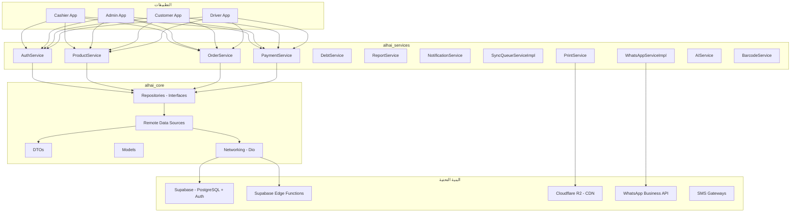
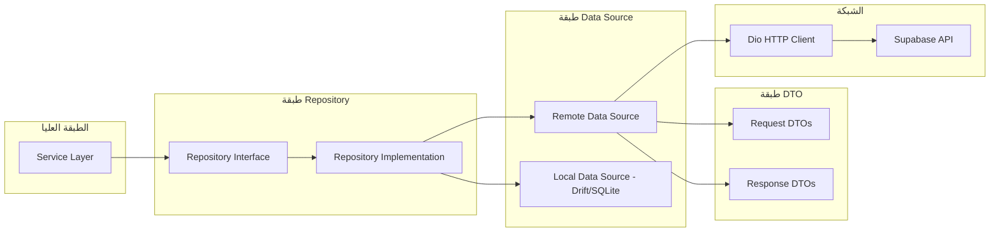
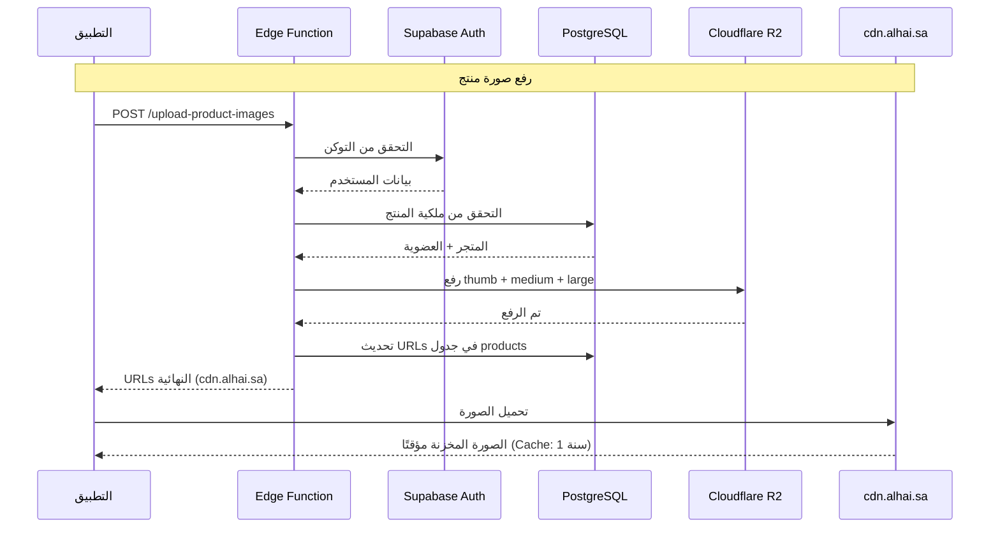
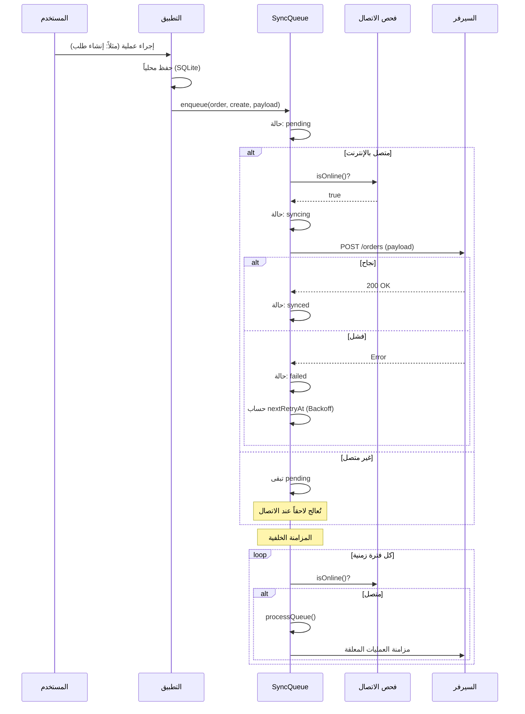
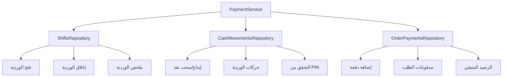
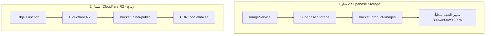
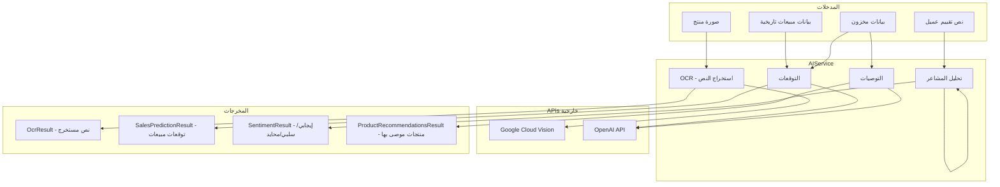

# الخدمات و API - توثيق شامل

> هذا المستند يوثق جميع الخدمات (Services)، مصادر البيانات البعيدة (Remote Data Sources)،
> نقاط الـ API (Edge Functions)، ونظام المزامنة في مشروع الهاي (Alhai).

---

## جدول المحتويات

1. [نظرة عامة على الخدمات](#1-نظرة-عامة-على-الخدمات)
2. [قائمة الخدمات](#2-قائمة-الخدمات)
3. [الـ Remote Data Sources](#3-الـ-remote-data-sources)
4. [الـ API Endpoints (Supabase Edge Functions)](#4-الـ-api-endpoints-supabase-edge-functions)
5. [نظام المزامنة (Sync)](#5-نظام-المزامنة-sync)
6. [نظام الدفع والفوترة](#6-نظام-الدفع-والفوترة)
7. [تكامل ZATCA](#7-تكامل-zatca)
8. [نظام الإشعارات](#8-نظام-الإشعارات)
9. [نظام تخزين الملفات](#9-نظام-تخزين-الملفات)
10. [نظام الطباعة (ESC/POS)](#10-نظام-الطباعة-escpos)
11. [تكامل WhatsApp](#11-تكامل-whatsapp)
12. [خدمة الباركود](#12-خدمة-الباركود)
13. [خدمات الذكاء الاصطناعي](#13-خدمات-الذكاء-الاصطناعي)

---

## 1. نظرة عامة على الخدمات

طبقة الخدمات في الهاي مقسمة إلى حزمتين أساسيتين:

- **`alhai_core`** - الطبقة الأساسية: تحتوي على الـ Models، الـ Repositories (interfaces)، الـ Remote Data Sources، الـ DTOs، وإعدادات الشبكة.
- **`alhai_services`** - طبقة الأعمال: تحتوي على الـ Services التي تستخدم الـ Repositories وتضيف business logic.



### بنية الخدمات

الخدمات مقسمة إلى **خمس دفعات** حسب الأولوية:

| الدفعة | الوصف | الخدمات |
|--------|-------|---------|
| الأولى | الخدمات الأساسية | Auth, Product, Order, Payment, Debt, Report, Refund, Delivery, Supplier, Notification, Promotion |
| الأولى (إضافية) | خدمات Repository جاهز | Wholesale, Distributor, Store, Settings, Address, Analytics, ActivityLog |
| الثانية | Repositories جديدة | Transfer, Loyalty, StoreMember, Rating, Chat |
| الثالثة | خدمات مساعدة (Logic فقط) | Receipt, Print, Barcode, Export, Import, Search, Cache, Config, Backup |
| الرابعة | خدمات خارجية (APIs) | AI, GeoNotification, SMS |
| الخامسة | خدمات Offline الحرجة | PinValidationServiceImpl, SyncQueueServiceImpl, WhatsAppServiceImpl |

---

## 2. قائمة الخدمات

### 2.1 الخدمات الأساسية

| اسم الخدمة | الوظيفة | الملف | الاعتماديات |
|-------------|---------|-------|-------------|
| `AuthService` | المصادقة وإدارة الجلسات (OTP، التحقق، الصلاحيات) | `alhai_services/lib/src/services/auth_service.dart` | `AuthRepository` |
| `ProductService` | إدارة المنتجات والمخزون والفئات | `alhai_services/lib/src/services/product_service.dart` | `ProductsRepository`, `InventoryRepository`, `CategoriesRepository` |
| `OrderService` | إدارة الطلبات والسلة المحلية | `alhai_services/lib/src/services/order_service.dart` | `OrdersRepository`, `OrderPaymentsRepository` |
| `PaymentService` | المدفوعات، الورديات، حركات النقد | `alhai_services/lib/src/services/payment_service.dart` | `ShiftsRepository`, `CashMovementsRepository`, `OrderPaymentsRepository` |
| `DebtService` | إدارة الديون (عملاء/موردين) والدفعات | `alhai_services/lib/src/services/debt_service.dart` | `DebtsRepository` |
| `ReportService` | التقارير والتحليلات (يومي/أسبوعي/شهري) | `alhai_services/lib/src/services/report_service.dart` | `ReportsRepository` |
| `RefundService` | المرتجعات (إنشاء/موافقة/رفض/إكمال) | `alhai_services/lib/src/services/refund_service.dart` | `RefundsRepository` |
| `DeliveryService` | التوصيل (قبول/رفض/تتبع/تأكيد) | `alhai_services/lib/src/services/delivery_service.dart` | `DeliveryRepository` |
| `SupplierService` | الموردين وأوامر الشراء | `alhai_services/lib/src/services/supplier_service.dart` | `SuppliersRepository`, `PurchasesRepository` |
| `NotificationService` | الإشعارات (قراءة/حذف/Realtime) | `alhai_services/lib/src/services/notification_service.dart` | `NotificationsRepository` |

### 2.2 خدمات إضافية

| اسم الخدمة | الوظيفة | الملف | الاعتماديات |
|-------------|---------|-------|-------------|
| `StoreService` | إدارة المتاجر (CRUD، القريبة، الحالة) | `alhai_services/lib/src/services/store_service.dart` | `StoresRepository` |
| `SettingsService` | إعدادات المتجر (ضريبة، فاتورة، ولاء) | `alhai_services/lib/src/services/settings_service.dart` | `StoreSettingsRepository` |
| `AnalyticsService` | التحليلات الذكية (توقعات، ذروة، تنبيهات) | `alhai_services/lib/src/services/analytics_service.dart` | `AnalyticsRepository` |
| `StoreMemberService` | إدارة موظفي المتجر والصلاحيات | `alhai_services/lib/src/services/store_member_service.dart` | `StoreMembersRepository` |
| `TransferService` | نقل المخزون بين الفروع | `alhai_services/lib/src/services/transfer_service.dart` | `TransfersRepository` |
| `LoyaltyService` | نقاط الولاء والمكافآت | `alhai_services/lib/src/services/loyalty_service.dart` | `LoyaltyRepository` |
| `RatingService` | التقييمات (متجر/منتج/سائق) | `alhai_services/lib/src/services/rating_service.dart` | `RatingsRepository` |
| `ChatService` | الدردشة بين المتجر والعميل | `alhai_services/lib/src/services/chat_service.dart` | `ChatsRepository` |

### 2.3 خدمات مساعدة (Logic فقط - بدون Repository)

| اسم الخدمة | الوظيفة | الملف | الاعتماديات |
|-------------|---------|-------|-------------|
| `ReceiptService` | توليد محتوى الفاتورة (نص + HTML) | `alhai_services/lib/src/services/receipt_service.dart` | `Order`, `Store`, `StoreSettings` |
| `PrintService` | الطباعة الحرارية (ESC/POS) | `alhai_services/lib/src/services/print_service.dart` | لا يوجد (Platform-specific) |
| `BarcodeService` | توليد والتحقق من الباركود | `alhai_services/lib/src/services/barcode_service.dart` | لا يوجد |
| `ExportService` | تصدير البيانات (CSV/JSON/HTML) عبر Isolates | `alhai_services/lib/src/services/export_service.dart` | `Product`, `Order`, `Debt` |
| `ImportService` | استيراد البيانات من CSV/JSON | `alhai_services/lib/src/services/import_service.dart` | `Product` |
| `SearchService` | البحث الموحد (منتجات/طلبات/ديون) | `alhai_services/lib/src/services/search_service.dart` | `ProductsRepository`, `OrdersRepository`, `DebtsRepository` |
| `CacheService` | التخزين المؤقت في الذاكرة مع TTL | `alhai_services/lib/src/services/cache_service.dart` | لا يوجد |
| `ConfigService` | إعدادات التطبيق المحلية | `alhai_services/lib/src/services/config_service.dart` | لا يوجد |
| `BackupService` | النسخ الاحتياطي (gzip + base64) | `alhai_services/lib/src/services/backup_service.dart` | لا يوجد |

### 2.4 خدمات خارجية (APIs)

| اسم الخدمة | الوظيفة | الملف | الاعتماديات |
|-------------|---------|-------|-------------|
| `AIService` | OCR، توقعات المبيعات، تحليل المشاعر | `alhai_services/lib/src/services/ai_service.dart` | Google Cloud Vision API, OpenAI API |
| `SmsService` | رسائل SMS (OTP، تذكير ديون) | `alhai_services/lib/src/services/sms_service.dart` | Unifonic/Twilio/Vonage |
| `GeoNotificationService` | إشعارات جغرافية (Geofencing) | `alhai_services/lib/src/services/geo_notification_service.dart` | Firebase Cloud Messaging |

### 2.5 خدمات Offline الحرجة

| اسم الخدمة | الوظيفة | الملف | الاعتماديات |
|-------------|---------|-------|-------------|
| `SyncQueueServiceImpl` | طابور مزامنة العمليات المعلقة | `alhai_services/lib/src/services/sync_queue_service_impl.dart` | `SyncQueueService` (interface) |
| `PinValidationServiceImpl` | التحقق من PIN المشرف (Online + TOTP Offline) | `alhai_services/lib/src/services/pin_validation_service_impl.dart` | `StoreMembersRepository`, `crypto` |
| `WhatsAppServiceImpl` | إرسال الفواتير عبر WhatsApp | `alhai_services/lib/src/services/whatsapp_service_impl.dart` | `WhatsAppService` (interface) |

---

## 3. الـ Remote Data Sources

كل Remote Data Source هو interface (abstract class) يحدد عقد الاتصال مع الـ API.
التنفيذ يستخدم `Dio` كـ HTTP client.

### 3.1 قائمة المصادر

| المصدر | الوظيفة | الملف | العمليات |
|--------|---------|-------|----------|
| `AuthRemoteDataSource` | المصادقة | `auth_remote_datasource.dart` | sendOtp, verifyOtp, refreshToken |
| `ProductsRemoteDataSource` | المنتجات | `products_remote_datasource.dart` | getProducts, getProduct, getByBarcode, createProduct, updateProduct, deleteProduct |
| `OrdersRemoteDataSource` | الطلبات | `orders_remote_datasource.dart` | createOrder, getOrder, getOrders, updateStatus, cancelOrder |
| `InventoryRemoteDataSource` | المخزون | `inventory_remote_datasource.dart` | getAdjustments, getStoreAdjustments, adjustStock, getLowStockProducts, getOutOfStockProductIds |
| `AnalyticsRemoteDataSource` | التحليلات | `analytics_remote_datasource.dart` | getSlowMovingProducts, getSalesForecast, getSmartAlerts, getReorderSuggestions, getPeakHoursAnalysis, getCustomerPatterns, getDashboardSummary |
| `DebtsRemoteDataSource` | الديون | `debts_remote_datasource.dart` | getDebts, getDebt, getPartyDebts, createDebt, recordPayment, getPayments, getDebtSummary |
| `SuppliersRemoteDataSource` | الموردين | `suppliers_remote_datasource.dart` | getSuppliers, getSupplier, createSupplier, updateSupplier, deleteSupplier, getSuppliersWithBalance |
| `PurchasesRemoteDataSource` | المشتريات | `purchases_remote_datasource.dart` | getPurchaseOrders, getPurchaseOrder, createPurchaseOrder, updatePurchaseOrder, cancelPurchaseOrder, receiveItems, recordPayment |
| `StoresRemoteDataSource` | المتاجر | `stores_remote_datasource.dart` | getStore, getCurrentStore, getStores, getNearbyStores, updateStore, isStoreOpen |
| `ReportsRemoteDataSource` | التقارير | `reports_remote_datasource.dart` | getDailySummary, getSalesSummaries, getTopProducts, getCategorySales, getInventoryValue, getHourlySales, getMonthlyComparison |
| `DeliveryRemoteDataSource` | التوصيل | `delivery_remote_datasource.dart` | عمليات التوصيل والتتبع |
| `CategoriesRemoteDataSource` | الفئات | `categories_remote_datasource.dart` | عمليات CRUD للفئات |
| `AddressesRemoteDataSource` | العناوين | `addresses_remote_datasource.dart` | إدارة عناوين العملاء |

### 3.2 مخطط تدفق البيانات



### 3.3 نقاط الـ API المركزية

جميع الـ endpoints معرفة في `alhai_core/lib/src/config/app_endpoints.dart`:

```dart
class AppEndpoints {
  static const String apiVersion = 'v1';
  static const String apiBase = 'https://api.alhai.app';
  static const String apiBaseVersioned = '$apiBase/$apiVersion';

  // النقاط الرئيسية
  static const String products   = '$apiBaseVersioned/products';
  static const String orders     = '$apiBaseVersioned/orders';
  static const String customers  = '$apiBaseVersioned/customers';
  static const String stores     = '$apiBaseVersioned/stores';
  static const String inventory  = '$apiBaseVersioned/inventory';
  static const String reports    = '$apiBaseVersioned/reports';
  static const String sync       = '$apiBaseVersioned/sync';

  // خدمات خارجية
  static const String whatsAppGraph  = 'https://graph.facebook.com/v17.0';
  static const String unifonicBase   = 'https://el.cloud.unifonic.com';
  static const String twilioBase     = 'https://api.twilio.com/2010-04-01/Accounts';
  static const String nexmoBase      = 'https://rest.nexmo.com';
  static const String aiProduction   = 'https://ai.alhai.app';
}
```

---

## 4. الـ API Endpoints (Supabase Edge Functions)

### 4.1 Edge Functions الموجودة

يوجد حاليًا **دالتان** (Edge Functions) في `supabase/functions/`:

#### 4.1.1 `public-products` - جلب المنتجات العامة

| الخاصية | القيمة |
|---------|--------|
| **المسار** | `/functions/v1/public-products` |
| **الطريقة** | `GET` |
| **المصادقة** | غير مطلوبة (عامة) |
| **الوصف** | جلب المنتجات النشطة لمتجر معين - تُستخدم من customer_app |

**المدخلات (Query Parameters):**

| المعامل | النوع | مطلوب | الوصف |
|---------|-------|-------|-------|
| `store_id` | `string` | نعم | معرف المتجر |
| `page` | `int` | لا | رقم الصفحة (افتراضي: 1) |
| `limit` | `int` | لا | عدد النتائج (افتراضي: 20، أقصى: 50) |
| `category_id` | `string` | لا | فلترة حسب الفئة |
| `search` | `string` | لا | بحث في الاسم أو الباركود أو SKU |

**المخرجات:**

```json
{
  "data": [
    {
      "id": "...",
      "name": "...",
      "sku": "...",
      "barcode": "...",
      "category_id": "...",
      "price": 10.00,
      "image_thumbnail": "...",
      "stock_qty": 50,
      "min_qty": 5,
      "is_active": true,
      "created_at": "..."
    }
  ],
  "meta": {
    "page": 1,
    "limit": 20,
    "total": 100,
    "hasMore": true,
    "storeId": "...",
    "storeName": "...",
    "timestamp": "..."
  }
}
```

**الأمان:**
- Rate limiting: 100 طلب/دقيقة لكل IP + store
- تنظيف المدخلات: حذف الرموز الخاصة من حقل البحث لمنع PostgREST injection
- التحقق من أن المتجر نشط (`is_active = true`)
- CORS: النطاقات المسموحة فقط (`app.alhai.sa`, `admin.alhai.sa`, `cashier.alhai.sa`, `portal.alhai.sa`)

#### 4.1.2 `upload-product-images` - رفع صور المنتجات

| الخاصية | القيمة |
|---------|--------|
| **المسار** | `/functions/v1/upload-product-images` |
| **الطريقة** | `POST` |
| **المصادقة** | مطلوبة (Bearer Token) |
| **الوصف** | رفع صور المنتجات بثلاثة أحجام إلى Cloudflare R2 |

**المدخلات (JSON Body):**

| المعامل | النوع | مطلوب | الوصف |
|---------|-------|-------|-------|
| `product_id` | `string` | نعم | معرف المنتج |
| `hash` | `string` | لا | هاش الصورة للتحكم بالإصدار |
| `images` | `object` | نعم | كائن يحتوي thumb/medium/large بصيغة base64 |

**المخرجات:**

```json
{
  "success": true,
  "urls": {
    "imageThumbnail": "https://cdn.alhai.sa/products/{id}_thumb_{hash}.webp",
    "imageMedium": "https://cdn.alhai.sa/products/{id}_medium_{hash}.webp",
    "imageLarge": "https://cdn.alhai.sa/products/{id}_large_{hash}.webp",
    "imageHash": "abc12345"
  }
}
```

**الأمان:**
- التحقق من المصادقة عبر Supabase Auth
- التحقق من ملكية المنتج (عضوية المستخدم في المتجر)
- حد أقصى 5MB لكل صورة
- الأحجام المسموحة: `thumb`, `medium`, `large` فقط
- اكتشاف تلقائي لصيغة الصورة من magic bytes (JPEG/PNG/WebP)

### 4.2 مخطط تدفق الـ API



### 4.3 نقاط API الـ REST الأساسية

الجدول التالي يوضح نقاط الـ API التي تستخدمها Remote Data Sources عبر Dio:

| المسار | الطريقة | الوصف | المصدر |
|--------|---------|-------|--------|
| `/auth/send-otp` | POST | إرسال رمز OTP | `AuthRemoteDataSource` |
| `/auth/verify-otp` | POST | التحقق من OTP | `AuthRemoteDataSource` |
| `/auth/refresh` | POST | تحديث التوكن | `AuthRemoteDataSource` |
| `/orders` | GET | جلب الطلبات (مع pagination) | `OrdersRemoteDataSource` |
| `/orders` | POST | إنشاء طلب جديد | `OrdersRemoteDataSource` |
| `/orders/{id}` | GET | جلب طلب بالمعرف | `OrdersRemoteDataSource` |
| `/orders/{id}/status` | PATCH | تحديث حالة الطلب | `OrdersRemoteDataSource` |
| `/orders/{id}/cancel` | POST | إلغاء الطلب | `OrdersRemoteDataSource` |
| `/v1/products` | GET | جلب المنتجات | `ProductsRemoteDataSource` |
| `/v1/products/{id}` | GET | جلب منتج بالمعرف | `ProductsRemoteDataSource` |
| `/v1/stores/{id}` | GET | جلب متجر بالمعرف | `StoresRemoteDataSource` |
| `/v1/inventory` | GET/POST | عمليات المخزون | `InventoryRemoteDataSource` |
| `/v1/reports` | GET | التقارير | `ReportsRemoteDataSource` |
| `/v1/sync` | POST | المزامنة | طابور المزامنة |
| `/v1/receipt/{orderId}` | GET | رابط الفاتورة العامة | `WhatsAppServiceImpl` |

---

## 5. نظام المزامنة (Sync)

### 5.1 نظرة عامة

نظام المزامنة يعمل بنمط **Offline-First** مع طابور عمليات (Queue).
الخدمة الأساسية هي `SyncQueueServiceImpl` في `alhai_services`.

**الملف:** `alhai_services/lib/src/services/sync_queue_service_impl.dart`

### 5.2 كيف يعمل

1. **إضافة للطابور (`enqueue`):** عند إجراء أي عملية (إنشاء/تحديث/حذف)، تُضاف العملية للطابور المحلي مع حالة `pending`.
2. **المعالجة (`processQueue`):** عند توفر الاتصال، يتم معالجة العمليات المعلقة بالترتيب الزمني (الأقدم أولاً).
3. **إعادة المحاولة (`retryItem`):** العمليات الفاشلة تُعاد تلقائيًا مع Exponential Backoff.
4. **حل التعارضات (`resolveConflict`):** عند وجود تعارض بين البيانات المحلية والسحابية.

### 5.3 حالات العملية

```
pending → syncing → synced
                  ↘ failed → pending (retry)
```

| الحالة | الوصف |
|--------|-------|
| `pending` | في انتظار المعالجة |
| `syncing` | قيد المزامنة حاليًا |
| `synced` | تمت المزامنة بنجاح |
| `failed` | فشلت المزامنة (ستُعاد المحاولة) |

### 5.4 أنواع الكيانات القابلة للمزامنة

تُحدد بـ `SyncEntityType` وتشمل: المنتجات، الطلبات، العملاء، المخزون، الديون، الإعدادات.

### 5.5 أنواع العمليات

تُحدد بـ `SyncOperationType` وتشمل: `create`، `update`، `delete`.

### 5.6 نظام حل التعارضات

عند اكتشاف تعارض بين القيمة المحلية والقيمة على السيرفر:

| الحل | الوصف |
|------|-------|
| `acceptLocal` | اعتماد القيمة المحلية وإعادة رفعها |
| `acceptServer` | اعتماد قيمة السيرفر (لا حاجة لعمل إضافي) |
| `merge` | دمج القيمتين (الأولوية للمحلي) |
| `createAdjustment` | إنشاء سجل تعديل (للمخزون) |

### 5.7 Exponential Backoff

عند الفشل، يتم حساب وقت المحاولة التالية:

```
الانتظار = 2^(رقم_المحاولة - 1) دقيقة (بحد أقصى 60 دقيقة)
```

| المحاولة | الانتظار |
|----------|----------|
| 1 | 1 دقيقة |
| 2 | 2 دقيقة |
| 3 | 4 دقائق |
| 4 | 8 دقائق |
| 5 | 16 دقيقة |
| 6+ | 60 دقيقة (الحد الأقصى) |

### 5.8 مخطط التسلسل



### 5.9 ملخص الطابور

يُمكن الحصول على ملخص حالة الطابور عبر `getSummary()`:

```dart
class SyncQueueSummary {
  final int pendingCount;    // عدد العمليات المعلقة
  final int syncingCount;    // عدد العمليات قيد المزامنة
  final int syncedCount;     // عدد العمليات المتزامنة
  final int failedCount;     // عدد العمليات الفاشلة
  final int conflictCount;   // عدد التعارضات
  final DateTime? lastSyncAt; // آخر وقت مزامنة
}
```

---

## 6. نظام الدفع والفوترة

### 6.1 نظرة عامة

نظام الدفع يُدار عبر `PaymentService` ويتكامل مع ثلاثة Repositories:



### 6.2 إدارة الورديات

| العملية | الوصف | المعاملات |
|---------|-------|----------|
| `openShift` | فتح وردية جديدة | storeId, cashierId, openingCash, notes |
| `closeShift` | إغلاق الوردية | closingCash, notes |
| `getCurrentShift` | جلب الوردية الحالية | cashierId |
| `getShiftSummary` | ملخص الوردية | shiftId |

### 6.3 طرق الدفع

```dart
enum PaymentMethod {
  cash,         // نقدي
  card,         // بطاقة
  wallet,       // محفظة إلكترونية
  bankTransfer, // تحويل بنكي
}
```

### 6.4 حركات النقد

| العملية | الوصف |
|---------|-------|
| إيداع | إضافة نقد للصندوق |
| سحب | سحب نقد من الصندوق |
| تأكيد PIN | مطلوب لعمليات السحب (يحتاج supervisorId + supervisorPin) |

### 6.5 الدفعات

- **إضافة دفعة:** ربط دفعة بطلب مع تحديد الطريقة والمبلغ
- **الدفع المختلط:** يمكن إضافة عدة دفعات لنفس الطلب (نقدي + بطاقة)
- **الرصيد المتبقي:** يتم حسابه تلقائيًا: `إجمالي الطلب - مجموع الدفعات`

---

## 7. تكامل ZATCA

### 7.1 نظرة عامة

خدمة ZATCA توفر التوافق مع متطلبات هيئة الزكاة والضريبة والجمارك السعودية
للفوترة الإلكترونية (المرحلة الأولى - الإصدار).

**الملف:** `packages/alhai_pos/lib/src/services/zatca_service.dart`

### 7.2 توليد QR Code

يتم ترميز بيانات الفاتورة وفق معيار **TLV (Tag-Length-Value)** ثم تحويلها إلى Base64:

| العلامة (Tag) | الحقل | الوصف |
|---------------|-------|-------|
| 1 | `sellerName` | اسم البائع |
| 2 | `vatNumber` | الرقم الضريبي (15 رقم يبدأ بـ 3) |
| 3 | `timestamp` | التاريخ والوقت (ISO 8601) |
| 4 | `totalWithVat` | الإجمالي شامل الضريبة |
| 5 | `vatAmount` | مبلغ الضريبة |

### 7.3 استخدام الخدمة

```dart
// توليد بيانات QR Code
final qrData = ZatcaService.generateQrData(
  sellerName: 'متجر الهاي',
  vatNumber: '300000000000003',
  timestamp: DateTime.now(),
  totalWithVat: 115.00,
  vatAmount: 15.00,
);

// أو من الإجمالي مباشرة (حساب تلقائي للضريبة 15%)
final invoice = ZatcaInvoiceData.fromTotal(
  sellerName: 'متجر الهاي',
  vatNumber: '300000000000003',
  timestamp: DateTime.now(),
  totalWithVat: 115.00,
  vatRate: 0.15, // نسبة الضريبة
);
// invoice.qrCode يحتوي على Base64 string
```

### 7.4 التحقق من الرقم الضريبي

```dart
ZatcaService.isValidVatNumber('300000000000003'); // true
ZatcaService.isValidVatNumber('123');              // false - ليس 15 رقم
ZatcaService.isValidVatNumber('400000000000003'); // false - لا يبدأ بـ 3

// تنسيق للعرض
ZatcaService.formatVatNumber('300000000000003');
// النتيجة: "300 000 000 000 003"
```

### 7.5 مخطط توليد الـ QR


---

## 8. نظام الإشعارات

### 8.1 نظرة عامة

نظام الإشعارات يعمل عبر خدمتين:

1. **`NotificationService`** - الإشعارات داخل التطبيق (In-App)
2. **`GeoNotificationService`** - الإشعارات الجغرافية (Geofencing + FCM)

### 8.2 NotificationService

**الملف:** `alhai_services/lib/src/services/notification_service.dart`

| العملية | الوصف |
|---------|-------|
| `getNotifications` | جلب الإشعارات (مع pagination) - يمكن فلترة المقروءة |
| `markAsRead` | تحديد إشعار كمقروء |
| `markAllAsRead` | تحديد جميع الإشعارات كمقروءة |
| `deleteNotification` | حذف إشعار |
| `getUnreadCount` | عدد الإشعارات غير المقروءة |
| `watchNotifications` | Stream لمشاهدة الإشعارات الجديدة (Realtime) |

### 8.3 GeoNotificationService

**الملف:** `alhai_services/lib/src/services/geo_notification_service.dart`

| العملية | الوصف |
|---------|-------|
| `addGeoFence` | إضافة سياج جغرافي |
| `removeGeoFence` | إزالة سياج جغرافي |
| `sendNotificationToArea` | إرسال إشعار لمستخدمين في منطقة معينة |
| `sendNotificationToDistrict` | إرسال إشعار لمستخدمين في حي معين |
| `isWithinDeliveryRadius` | التحقق من الموقع داخل نطاق التوصيل |
| `calculateDistance` | حساب المسافة بين نقطتين (Haversine) |

### 8.4 نظام التنبيهات الذكية

عبر `AnalyticsService` يتم الحصول على تنبيهات ذكية مبنية على التحليلات:

- منتجات على وشك النفاد
- منتجات بطيئة الحركة
- اقتراحات إعادة الطلب
- أنماط شراء العملاء
- ساعات الذروة

---

## 9. نظام تخزين الملفات

### 9.1 نظرة عامة

النظام يستخدم مسارين لتخزين الملفات:



### 9.2 ImageService (alhai_core)

**الملف:** `alhai_core/lib/src/services/image_service.dart`

| العملية | الوصف |
|---------|-------|
| `uploadProductImage` | رفع صورة من ملف (Native) |
| `uploadProductImageFromBytes` | رفع صورة من bytes (Web) |
| `deleteProductImages` | حذف جميع صور المنتج |

### 9.3 أحجام الصور

| الحجم | العرض | الجودة | الاستخدام |
|-------|-------|--------|----------|
| `thumb` | 300px | 80% | القوائم والبحث |
| `medium` | 600px | 85% | تفاصيل المنتج |
| `large` | 1200px | 90% | العرض الكامل |

### 9.4 صيغ الصور

- **WebP** (افتراضي): أصغر بـ 25-35% مقارنة بـ JPEG
- **JPEG** (fallback): في حالة فشل ترميز WebP
- الكشف التلقائي عن الصيغة من magic bytes في Edge Function

### 9.5 الحد الأقصى لحجم الملف

- **ImageService (محلي):** 10 MB
- **Edge Function (سحابي):** 5 MB لكل حجم

### 9.6 مسار التخزين

```
Supabase: {storeId}/{productId}/thumb_{hash}.{ext}
R2:       products/{productId}_thumb_{hash}.{ext}
CDN:      https://cdn.alhai.sa/products/{productId}_thumb_{hash}.{ext}
```

### 9.7 التخزين المؤقت (Caching)

```
Cache-Control: public, max-age=31536000, immutable
```

الصور تُخزن مؤقتًا لمدة **سنة واحدة**. عند تحديث الصورة يتغير الـ `hash` فيتم تجاوز الكاش.

---

## 10. نظام الطباعة (ESC/POS)

### 10.1 نظرة عامة

نظام الطباعة مكون من خدمتين:

1. **`PrintService`** - الاتصال بالطابعة الحرارية وإرسال الأوامر
2. **`ReceiptService`** - توليد محتوى الفاتورة

### 10.2 PrintService

**الملف:** `alhai_services/lib/src/services/print_service.dart`

#### أنواع الاتصال

| النوع | الوصف |
|-------|-------|
| `bluetooth` | طابعات بلوتوث محمولة |
| `usb` | طابعات USB |
| `network` | طابعات شبكة (TCP/IP على المنفذ 9100) |
| `sunmi` | طابعات Sunmi المدمجة |

#### حالات الطابعة

```
disconnected → connecting → connected → printing → connected
                          ↘ error
```

#### العمليات المدعومة

| العملية | الوصف |
|---------|-------|
| `scanForPrinters` | البحث عن الطابعات المتاحة |
| `connect` | الاتصال بطابعة |
| `disconnect` | قطع الاتصال |
| `printText` | طباعة نص |
| `printReceipt` | طباعة فاتورة مع تنسيق ESC/POS |
| `printBarcode` | طباعة باركود |
| `printImage` | طباعة صورة (raster) |
| `openCashDrawer` | فتح درج النقود |
| `printTestPage` | طباعة صفحة اختبار |

#### EscPosCommandBuilder

أداة بناء أوامر ESC/POS متوافقة مع معيار Epson TM:

```dart
final commands = EscPosCommandBuilder()
  ..initialize()                           // ESC @ (تهيئة)
  ..setAlignment(EscPosAlignment.center)   // ESC a n (المحاذاة)
  ..setBold(true)                          // ESC E n (خط عريض)
  ..addText('نص الفاتورة')                 // إضافة نص
  ..addSeparator()                         // خط فاصل
  ..addBarcode('6281234567890', 67)         // GS k m (باركود EAN-13)
  ..feedLines(3)                           // ESC d n (تغذية أسطر)
  ..cut();                                 // GS V m (قص الورق)

final bytes = commands.build(); // Uint8List جاهز للإرسال
```

### 10.3 ReceiptService

**الملف:** `alhai_services/lib/src/services/receipt_service.dart`

#### توليد الفاتورة النصية

تُستخدم للطباعة الحرارية (عرض 32 حرف):

```
================================
        اسم المتجر
         العنوان
     هاتف: 05XXXXXXXX

================================
رقم الفاتورة: INV-0001
التاريخ: 2026/02/28
الوقت: 14:30
الكاشير: أحمد
--------------------------------
الصنف                    المبلغ
--------------------------------
منتج 1
  2 x 10.00 = 20.00
منتج 2
  1 x 15.50 = 15.50
--------------------------------
المجموع الفرعي:          35.50
الضريبة:                   5.33
================================
الإجمالي:                 40.83
================================
طريقة الدفع: نقدي

     شكراً لزيارتكم
   نتمنى لكم يوماً سعيداً
```

#### توليد الفاتورة HTML

تُستخدم للعرض على الشاشة والإرسال عبر WhatsApp:
- اتجاه RTL
- تنسيق CSS للطباعة (عرض 80mm)
- XSS protection عبر `_escapeHtml()`

---

## 11. تكامل WhatsApp

### 11.1 نظرة عامة

خدمة WhatsApp تُرسل الفواتير والإشعارات للعملاء عبر WhatsApp Business API.

**الملف:** `alhai_services/lib/src/services/whatsapp_service_impl.dart`

### 11.2 الإعداد

```dart
final whatsapp = WhatsAppServiceImpl(
  accessToken: 'YOUR_ACCESS_TOKEN',
  phoneNumberId: 'YOUR_PHONE_NUMBER_ID',
  baseUrl: 'https://graph.facebook.com/v17.0', // افتراضي
);

// إعداد خاص بمتجر
whatsapp.configureStore(
  storeId: 'store_001',
  accessToken: 'STORE_TOKEN',
  phoneNumberId: 'STORE_PHONE_ID',
  dailyLimit: 500,
);
```

### 11.3 العمليات

| العملية | الوصف |
|---------|-------|
| `sendReceipt` | إرسال فاتورة عبر WhatsApp |
| `checkStatus` | فحص حالة الرسالة |
| `isValidWhatsAppNumber` | التحقق من صحة الرقم |
| `getReceiptUrl` | توليد رابط الفاتورة |
| `isConfigured` | هل الخدمة مُعدة لهذا المتجر؟ |
| `getRemainingDailyLimit` | الحد اليومي المتبقي |
| `sendTemplateMessage` | إرسال رسالة قالب (معتمدة) |

### 11.4 تنسيقات الأرقام المدعومة

| التنسيق | مثال | مدعوم |
|---------|------|-------|
| دولي سعودي | `966501234567` | نعم |
| محلي سعودي | `0501234567` | نعم |
| مع + | `+966501234567` | نعم |
| دولي عام | `+44XXXXXXXXX` | نعم (10+ أرقام) |

### 11.5 حالات الرسالة

```dart
enum WhatsAppMessageStatus {
  sent,       // تم الإرسال
  delivered,  // تم التوصيل
  read,       // تم القراءة
  failed,     // فشل الإرسال
}
```

### 11.6 الحد اليومي

- الحد الافتراضي: **1,000 رسالة/يوم** لكل متجر
- قابل للتخصيص عند إعداد المتجر
- العداد يُصفر يوميًا

### 11.7 رسالة الفاتورة

```
مرحباً {اسم العميل}،

شكراً لتسوقك معنا!

يمكنك مراجعة فاتورتك من هنا:
https://api.alhai.app/v1/receipt/{orderId}

نتطلع لخدمتك مرة أخرى!
```

---

## 12. خدمة الباركود

### 12.1 نظرة عامة

خدمة الباركود توفر توليد والتحقق من صحة عدة أنواع باركود.

**الملف:** `alhai_services/lib/src/services/barcode_service.dart`

### 12.2 الأنواع المدعومة

| النوع | الوصف | الاستخدام |
|-------|-------|----------|
| `ean13` | 13 رقم (الأكثر شيوعًا عالميًا) | منتجات التجزئة |
| `ean8` | 8 أرقام | منتجات صغيرة الحجم |
| `upcA` | 12 رقم (أمريكي) | منتجات أمريكية |
| `code39` | أبجدي رقمي | تطبيقات صناعية |
| `code128` | أبجدي رقمي متقدم | شحن ولوجستيات |
| `qrCode` | ثنائي الأبعاد | بيانات مهيكلة |

### 12.3 العمليات

| العملية | الوصف | المثال |
|---------|-------|--------|
| `generateEan13` | توليد باركود EAN-13 (يبدأ بـ 628 - كود السعودية) | `628XXXXXXXXX + check digit` |
| `generateEan8` | توليد باركود EAN-8 | `628XXXX + check digit` |
| `generateSku` | توليد SKU داخلي | `SKU-XXXXXXX-XXXX` |
| `generateCode128` | توليد باركود Code128 | `XXXXXXXXXX` |
| `validateEan13` | التحقق من صحة EAN-13 (check digit) | `true/false` |
| `validateEan8` | التحقق من صحة EAN-8 | `true/false` |
| `detectFormat` | تحديد نوع الباركود تلقائيًا | `BarcodeFormat.ean13` |
| `generateQrCodeData` | توليد بيانات QR من Map | JSON string |
| `parseQrCodeData` | تحليل بيانات QR إلى Map | `Map<String, dynamic>` |

### 12.4 خوارزمية Check Digit (EAN-13)

```
1. اجمع الأرقام في المواقع الفردية (1, 3, 5, ...) × 1
2. اجمع الأرقام في المواقع الزوجية (2, 4, 6, ...) × 3
3. اجمع المجموعين
4. Check digit = (10 - (المجموع % 10)) % 10
```

---

## 13. خدمات الذكاء الاصطناعي

### 13.1 نظرة عامة

خدمات الذكاء الاصطناعي تعمل عبر مستويين:

1. **`AIService`** (alhai_services) - خدمات OCR والتوقعات والتوصيات
2. **`AnalyticsService`** (alhai_services) - تحليلات ذكية عبر الـ API

### 13.2 AIService

**الملف:** `alhai_services/lib/src/services/ai_service.dart`

#### OCR - التعرف على النص

| العملية | الوصف | API |
|---------|-------|-----|
| `extractText` | استخراج النص من صورة | Google Cloud Vision API |
| `extractProductInfo` | استخراج معلومات المنتج (اسم، باركود، سعر) | Google Cloud Vision API |
| `extractBarcode` | استخراج الباركود من البيانات النصية | محلي (Regex) |

#### أنواع الباركود القابلة للاستخراج عبر OCR

- **EAN-13:** 13 رقم مع التحقق من check digit (يشمل 628 للسعودية)
- **EAN-8:** 8 أرقام مع التحقق من check digit
- **UPC-A:** 12 رقم مع التحقق من check digit
- **Code 39:** أبجدي رقمي بين علامات `*`
- **ISBN-13:** يبدأ بـ 978 أو 979

#### التوقعات

| العملية | الوصف | API |
|---------|-------|-----|
| `predictSales` | توقع المبيعات لعدد أيام قادمة | OpenAI API |
| `predictInventoryNeeds` | توقع المخزون المطلوب لمنتج معين | OpenAI API |
| `getProductRecommendations` | توصيات منتجات للعميل | OpenAI API |

#### تحليل المشاعر

خدمة تحليل مشاعر محلية تعتمد على الكلمات المفتاحية (عربي + إنجليزي):

```dart
final result = await aiService.analyzeSentiment('الخدمة ممتازة جداً');
// result.sentiment = Sentiment.positive
// result.score = 0.85 (مقياس 0.0-1.0)
// result.confidence = 0.7
```

**آليات التحليل:**
- **40+ كلمة إيجابية** (عربي وإنجليزي) مع أوزان مختلفة
- **40+ كلمة سلبية** مع أوزان مختلفة
- **كشف النفي:** "ليس"، "لا"، "مو"، "not" - يعكس القطبية بنسبة 50%
- **كشف التضخيم:** "جداً"، "للغاية"، "very" - يضاعف النتيجة بـ 1.5

### 13.3 AnalyticsService

**الملف:** `alhai_services/lib/src/services/analytics_service.dart`

| العملية | الوصف |
|---------|-------|
| `getSlowMovingProducts` | المنتجات بطيئة الحركة (عتبة: 30 يوم) |
| `getReorderSuggestions` | اقتراحات إعادة الطلب (7 أيام قادمة) |
| `getSalesForecast` | توقعات المبيعات (7 أيام) |
| `getPeakHoursAnalysis` | تحليل ساعات الذروة |
| `getCustomerPatterns` | أنماط شراء العملاء |
| `getSmartAlerts` | التنبيهات الذكية (مقروءة/غير مقروءة) |
| `getDashboardSummary` | ملخص لوحة التحكم |

### 13.4 مخطط معمارية AI



---

## الملاحق

### ملحق أ: خدمة SMS

**الملف:** `alhai_services/lib/src/services/sms_service.dart`

#### مزودي الخدمة المدعومون

| المزود | المنطقة | الـ API |
|--------|---------|---------|
| Unifonic | سعودي | `https://el.cloud.unifonic.com/rest/Messages/Send` |
| Twilio | دولي | `https://api.twilio.com/2010-04-01/Accounts/{sid}/Messages.json` |
| Vonage (Nexmo) | دولي | `https://rest.nexmo.com/sms/json` |

#### أنواع الرسائل الجاهزة

| النوع | الاستخدام |
|-------|----------|
| `sendOtp` | رمز التحقق (OTP) - صالح 5 دقائق |
| `sendDebtReminder` | تذكير بالمبلغ المستحق |
| `sendOrderConfirmation` | تأكيد استلام الطلب |
| `sendOrderStatusUpdate` | تحديث حالة الطلب |
| `sendTrackingLink` | رابط تتبع الطلب |
| `sendBulkSms` | إرسال مجمع لعدة أرقام (تأخير 100ms بين الرسائل) |

### ملحق ب: خدمة النسخ الاحتياطي

**الملف:** `alhai_services/lib/src/services/backup_service.dart`

#### أنواع النسخ الاحتياطي

| النوع | الوصف |
|-------|-------|
| `full` | جميع البيانات |
| `products` | المنتجات فقط |
| `orders` | الطلبات فقط |
| `customers` | العملاء فقط |
| `settings` | الإعدادات فقط |

#### ضغط البيانات

- **Native (Android/iOS):** gzip ثم base64 (تقليل 60-70%)
- **Web:** base64 فقط (زيادة ~33%)
- البادئة `gz:` تميز البيانات المضغوطة عن غير المضغوطة

### ملحق ج: خدمة التحقق من PIN

**الملف:** `alhai_services/lib/src/services/pin_validation_service_impl.dart`

#### وضعي التشغيل

1. **Online:** التحقق من PIN عبر السيرفر
2. **Offline (TOTP):** التحقق المحلي باستخدام رمز زمني (Time-based OTP)
   - يعتمد على SHA-256
   - خطوة زمنية: 30 ثانية
   - تحمل انحراف الساعة: +-1 خطوة

#### نظام الأمان

| الخاصية | القيمة |
|---------|--------|
| الحد الأقصى للمحاولات | 3 محاولات |
| مدة القفل | 15 دقيقة |
| صلاحية رمز الطوارئ | 24 ساعة |
| صلاحية بيانات TOTP المخزنة | 24 ساعة |
| حجم سجل المراجعة | آخر 1000 سجل |

#### الإجراءات التي تتطلب PIN

| الإجراء | الصلاحيات |
|---------|----------|
| `refund` | `refund.create`, `refund.approve` |
| `discount` | `discount.apply`, `discount.override` |
| `voidSale` | `sale.void` |
| `cashOut` | `cash.withdraw` |
| `priceOverride` | `product.price_override` |
| `shiftClose` | `shift.close` |

### ملحق د: إعدادات CORS

**الملف:** `supabase/functions/_shared/cors.ts`

```
النطاقات المسموحة:
  - https://app.alhai.sa
  - https://admin.alhai.sa
  - https://cashier.alhai.sa
  - https://portal.alhai.sa
  - http://localhost:3000  (تطوير فقط)
  - http://localhost:5173  (تطوير فقط)

الترويسات المسموحة:
  - authorization
  - x-client-info
  - apikey
  - content-type
  - x-correlation-id

الطرق المسموحة:
  - GET, POST, PUT, PATCH, DELETE, OPTIONS
```

### ملحق هـ: خدمة التصدير

**الملف:** `alhai_services/lib/src/services/export_service.dart`

| الصيغة | الاستخدام | Isolate |
|--------|----------|---------|
| CSV | المنتجات، الطلبات، الديون | نعم (Native) |
| JSON | بيانات عامة | نعم (Native) |
| HTML | تقارير بجداول | نعم (Native) |

التصدير يتم في Isolate منفصل على المنصات الأصلية لعدم حجب الـ UI.
على الويب يعمل في الـ main thread (الويب لا يدعم Isolates).

---

> **آخر تحديث:** 2026-02-28
>
> **المصادر:**
> - `alhai_services/lib/src/services/` - جميع ملفات الخدمات
> - `alhai_core/lib/src/datasources/remote/` - مصادر البيانات البعيدة
> - `alhai_core/lib/src/config/app_endpoints.dart` - إعدادات الـ API
> - `alhai_core/lib/src/services/image_service.dart` - خدمة الصور
> - `supabase/functions/` - Supabase Edge Functions
> - `packages/alhai_pos/lib/src/services/zatca_service.dart` - خدمة ZATCA
