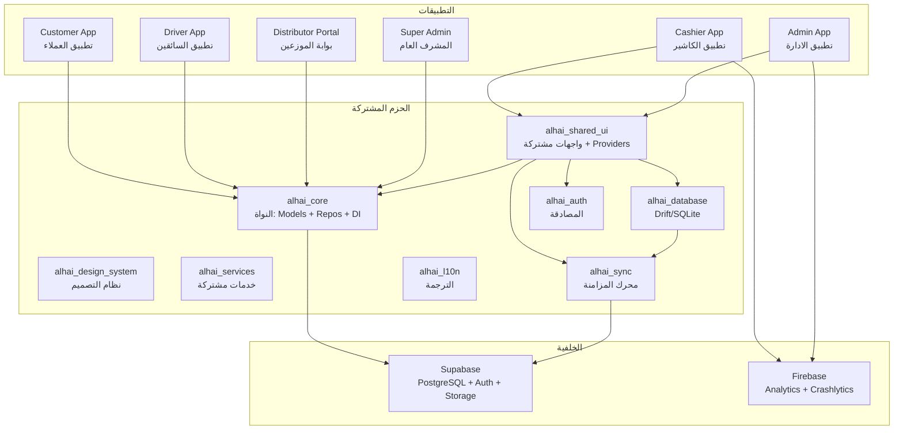
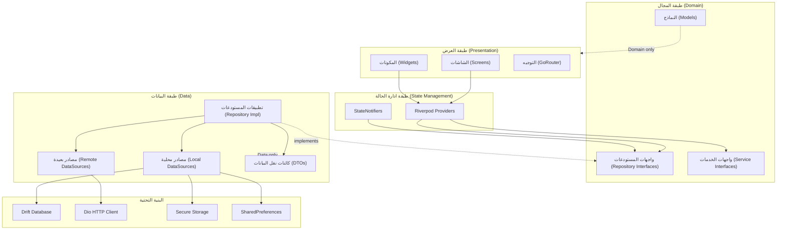
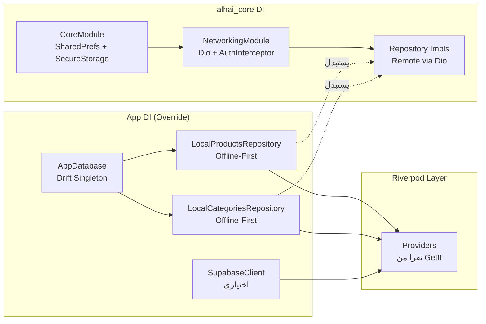
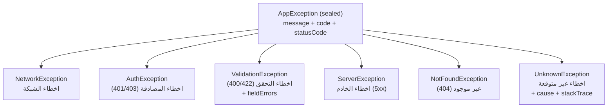
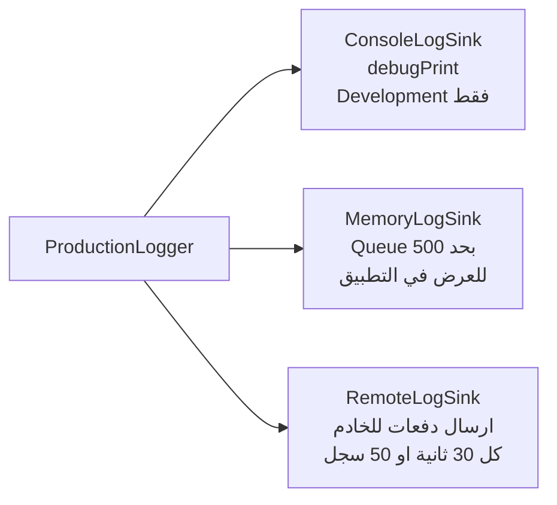
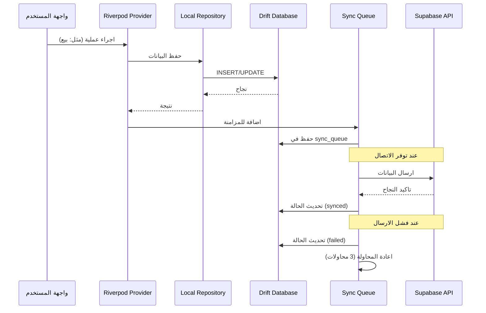
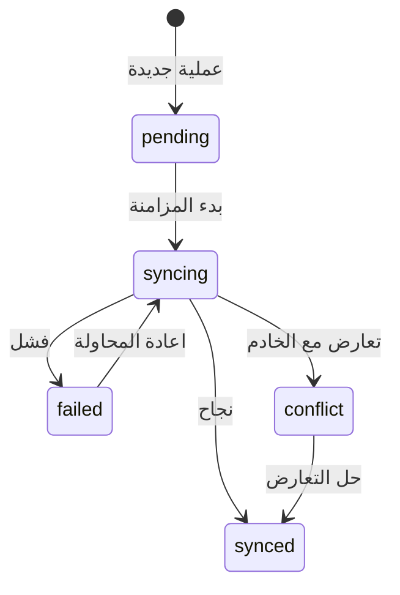
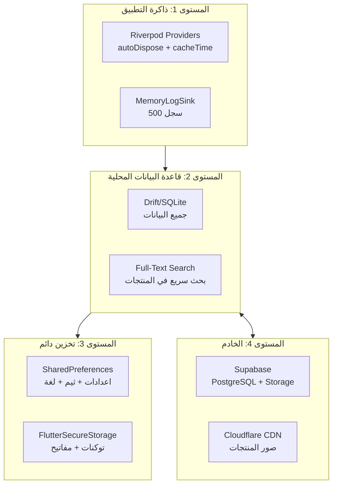

# البنية المعمارية لمنصة الحي (Al-HAI Architecture)

## جدول المحتويات

1. [نظرة عامة على البنية المعمارية](#1-نظرة-عامة-على-البنية-المعمارية)
2. [البنية المعمارية - الطبقات](#2-البنية-المعمارية---الطبقات)
3. [إدارة الحالة (Riverpod)](#3-إدارة-الحالة-riverpod)
4. [نظام حقن التبعيات (DI)](#4-نظام-حقن-التبعيات-di)
5. [نمط المستودع (Repository Pattern)](#5-نمط-المستودع-repository-pattern)
6. [مصادر البيانات](#6-مصادر-البيانات)
7. [نظام معالجة الاخطاء](#7-نظام-معالجة-الاخطاء)
8. [نظام التسجيل (Logging)](#8-نظام-التسجيل-logging)
9. [استراتيجية العمل بدون انترنت (Offline-First)](#9-استراتيجية-العمل-بدون-انترنت-offline-first)
10. [نظام الكاش والتخزين المؤقت](#10-نظام-الكاش-والتخزين-المؤقت)

---

## 1. نظرة عامة على البنية المعمارية

منصة الحي هي منظومة متكاملة لادارة نقاط البيع مبنية على Flutter، تتكون من عدة تطبيقات مستقلة تتشارك في حزم اساسية (Shared Packages). النظام يتبع نمط **Clean Architecture** مع استراتيجية **Offline-First** لضمان عمل التطبيق بدون اتصال بالانترنت.

### التطبيقات الرئيسية

| التطبيق | المسار | الوصف |
|---------|--------|-------|
| Cashier App | `apps/cashier/` | تطبيق الكاشير - نقطة البيع الرئيسية |
| Admin App | `apps/admin/` | تطبيق الادارة - ادارة المتجر والتقارير |
| Admin Lite | `apps/admin_lite/` | نسخة مبسطة من تطبيق الادارة |
| Customer App | `customer_app/` | تطبيق العملاء - الطلب والتوصيل |
| Driver App | `driver_app/` | تطبيق السائقين - ادارة التوصيل |
| Distributor Portal | `distributor_portal/` | بوابة الموزعين |
| Super Admin | `super_admin/` | لوحة تحكم المشرف العام |

### الحزم المشتركة (Shared Packages)

| الحزمة | المسار | الوصف |
|--------|--------|-------|
| alhai_core | `alhai_core/` | النواة: النماذج، الواجهات، الاستثناءات، الشبكات، DI |
| alhai_database | `packages/alhai_database/` | قاعدة البيانات المحلية (Drift/SQLite) |
| alhai_shared_ui | `packages/alhai_shared_ui/` | واجهات وعناصر مشتركة، مزودات Riverpod |
| alhai_design_system | `alhai_design_system/` | نظام التصميم: الالوان، الخطوط، المكونات |
| alhai_services | `alhai_services/` | خدمات مشتركة: طباعة، تصدير، باركود |
| alhai_sync | `packages/alhai_sync/` (ضمني) | محرك المزامنة بين Local و Supabase |
| alhai_l10n | (ضمني) | الترجمة والتعريب (7 لغات) |
| alhai_auth | (ضمني) | المصادقة وادارة الجلسات |

### مخطط عام للبنية المعمارية



---

## 2. البنية المعمارية - الطبقات

يتبع النظام نمط **Clean Architecture** مع فصل واضح بين الطبقات. كل طبقة لها مسؤوليات محددة ولا تعتمد على تفاصيل الطبقة التي تليها.

### مخطط الطبقات



### 2.1 طبقة العرض (Presentation Layer)

تشمل الشاشات والمكونات المرئية. تستخدم `ConsumerWidget` و `ConsumerStatefulWidget` من Riverpod للوصول للحالة.

**الملفات الرئيسية:**
- `apps/cashier/lib/screens/` - شاشات الكاشير (مبيعات، ورديات، مخزون، اعدادات)
- `apps/admin/lib/screens/` - شاشات الادارة (تقارير، منتجات، موظفين، اعدادات)
- `packages/alhai_shared_ui/lib/src/screens/` - شاشات مشتركة (عملاء، فواتير، مصروفات)
- `packages/alhai_shared_ui/lib/src/widgets/` - مكونات مشتركة (layout، dashboard، common)

**نظام التوجيه (Router):**
- كل تطبيق له Router مستقل يستخدم GoRouter
- `apps/cashier/lib/router/cashier_router.dart` - توجيه الكاشير
- `apps/admin/lib/router/admin_router.dart` - توجيه الادارة

**نظام التصميم:**
- `alhai_design_system/` - نظام تصميم متكامل يشمل: الالوان، الخطوط، المكونات
- `packages/alhai_shared_ui/lib/src/core/theme/app_theme.dart` - ثيم التطبيق (فاتح/مظلم)

### 2.2 طبقة المنطق (Business Logic Layer)

تتم ادارة الحالة عبر **Riverpod** مع مزودات مشتركة في `alhai_shared_ui` ومزودات خاصة في كل تطبيق.

**الموقع:**
- `packages/alhai_shared_ui/lib/src/providers/` - مزودات مشتركة بين التطبيقات
- `apps/admin/lib/providers/` - مزودات خاصة بتطبيق الادارة
- `apps/cashier/lib/` - منطق خاص بالكاشير (مضمّن في الشاشات)

### 2.3 طبقة المجال (Domain Layer)

تحتوي على النماذج (Models) وواجهات المستودعات (Repository Interfaces) فقط. لا تعتمد على اي تقنية محددة.

**الموقع:** `alhai_core/lib/src/`

```
alhai_core/lib/src/
  models/           # نماذج المجال (Freezed)
    product.dart
    order.dart
    user.dart
    category.dart
    supplier.dart
    debt.dart
    ...
  repositories/     # واجهات المستودعات (abstract classes)
    products_repository.dart
    orders_repository.dart
    auth_repository.dart
    categories_repository.dart
    ...
  services/         # واجهات الخدمات
    sync_queue_service.dart
    whatsapp_service.dart
    pin_validation_service.dart
    image_service.dart
  exceptions/       # الاستثناءات المخصصة
    app_exception.dart
    error_mapper.dart
```

### 2.4 طبقة البيانات (Data Layer)

تحتوي على تطبيقات المستودعات، مصادر البيانات (Remote و Local)، وكائنات نقل البيانات (DTOs).

**الموقع:** `alhai_core/lib/src/` (Remote) و `packages/alhai_database/` (Local)

```
alhai_core/lib/src/
  repositories/impl/        # تطبيقات المستودعات (Remote)
    auth_repository_impl.dart
    products_repository_impl.dart
    orders_repository_impl.dart
    ...
  datasources/
    remote/                 # مصادر البيانات البعيدة
      auth_remote_datasource.dart
      products_remote_datasource.dart
      orders_remote_datasource.dart
      ...
    local/                  # مصادر البيانات المحلية
      auth_local_datasource.dart
      entities/
        auth_tokens_entity.dart
        user_entity.dart
  dto/                      # كائنات نقل البيانات
    products/
      product_response.dart
      create_product_request.dart
      update_product_request.dart
    orders/
      order_response.dart
      create_order_request.dart
    auth/
      auth_response.dart
      auth_tokens_response.dart
    ...
```

---

## 3. ادارة الحالة (Riverpod)

يستخدم النظام **flutter_riverpod** لادارة الحالة. المزودات مقسمة بين حزمة `alhai_shared_ui` (مشتركة) وداخل كل تطبيق (خاصة).

### 3.1 مزودات لوحة التحكم (Dashboard)

| الاسم | النوع | الوظيفة | الملف |
|-------|-------|---------|-------|
| `dashboardDataProvider` | `FutureProvider.autoDispose<DashboardData>` | بيانات لوحة التحكم الشاملة (مبيعات اليوم، المخزون المنخفض، العملاء الجدد) | `packages/alhai_shared_ui/.../dashboard_providers.dart` |
| `todaySalesStreamProvider` | `StreamProvider.autoDispose<List<SalesTableData>>` | مراقبة مبيعات اليوم بشكل مباشر | `packages/alhai_shared_ui/.../dashboard_providers.dart` |

### 3.2 مزودات المنتجات (Products)

| الاسم | النوع | الوظيفة | الملف |
|-------|-------|---------|-------|
| `productsRepositoryProvider` | `Provider<ProductsRepository>` | مزود مستودع المنتجات من GetIt | `packages/alhai_shared_ui/.../products_providers.dart` |
| `categoriesRepositoryProvider` | `Provider<CategoriesRepository>` | مزود مستودع التصنيفات من GetIt | `packages/alhai_shared_ui/.../products_providers.dart` |
| `productsStateProvider` | `StateNotifierProvider` | حالة المنتجات (قائمة + تحميل + بحث) | `packages/alhai_shared_ui/.../products_providers.dart` |
| `productsListProvider` | `Provider<List<Product>>` | قائمة المنتجات الحالية | `packages/alhai_shared_ui/.../products_providers.dart` |
| `productByIdProvider` | `Provider.family<Product?, String>` | منتج واحد بواسطة المعرف | `packages/alhai_shared_ui/.../products_providers.dart` |
| `productsMapProvider` | `Provider<Map<String, Product>>` | خريطة المنتجات (ID -> Product) | `packages/alhai_shared_ui/.../products_providers.dart` |
| `lowStockProductsProvider` | `Provider<List<Product>>` | المنتجات منخفضة المخزون | `packages/alhai_shared_ui/.../products_providers.dart` |
| `outOfStockProductsProvider` | `Provider<List<Product>>` | المنتجات المنتهية من المخزون | `packages/alhai_shared_ui/.../products_providers.dart` |
| `categoriesProvider` | `FutureProvider.autoDispose<List<Category>>` | قائمة التصنيفات | `packages/alhai_shared_ui/.../products_providers.dart` |
| `categoriesMapProvider` | `Provider<Map<String, Category>>` | خريطة التصنيفات | `packages/alhai_shared_ui/.../products_providers.dart` |
| `categoryByIdProvider` | `Provider.family<Category?, String>` | تصنيف واحد بواسطة المعرف | `packages/alhai_shared_ui/.../products_providers.dart` |
| `barcodeProductProvider` | `FutureProvider.autoDispose.family` | البحث عن منتج بالباركود | `packages/alhai_shared_ui/.../products_providers.dart` |
| `searchSuggestionsProvider` | `FutureProvider.autoDispose.family` | اقتراحات البحث | `packages/alhai_shared_ui/.../products_providers.dart` |

### 3.3 مزودات الطلبات (Orders)

| الاسم | النوع | الوظيفة | الملف |
|-------|-------|---------|-------|
| `ordersListProvider` | `FutureProvider.autoDispose<List<OrdersTableData>>` | قائمة جميع الطلبات | `packages/alhai_shared_ui/.../orders_providers.dart` |
| `ordersByStatusProvider` | `FutureProvider.autoDispose.family` | الطلبات حسب الحالة | `packages/alhai_shared_ui/.../orders_providers.dart` |
| `pendingOrdersProvider` | `FutureProvider.autoDispose` | الطلبات المعلقة | `packages/alhai_shared_ui/.../orders_providers.dart` |
| `ordersStatsProvider` | `FutureProvider.autoDispose<Map<String, int>>` | احصائيات حالات الطلبات | `packages/alhai_shared_ui/.../orders_providers.dart` |
| `pendingOrdersCountProvider` | `FutureProvider.autoDispose<int>` | عدد الطلبات المعلقة | `packages/alhai_shared_ui/.../orders_providers.dart` |
| `todayOrdersTotalProvider` | `FutureProvider.autoDispose<double>` | اجمالي طلبات اليوم | `packages/alhai_shared_ui/.../orders_providers.dart` |
| `orderDetailProvider` | `FutureProvider.autoDispose.family` | تفاصيل طلب واحد | `packages/alhai_shared_ui/.../orders_providers.dart` |
| `ordersDetailedStatsProvider` | `FutureProvider.autoDispose` | احصائيات الطلبات التفصيلية | `packages/alhai_shared_ui/.../orders_providers.dart` |

### 3.4 مزودات الفواتير (Invoices)

| الاسم | النوع | الوظيفة | الملف |
|-------|-------|---------|-------|
| `invoicesListProvider` | `FutureProvider.autoDispose<List<SalesTableData>>` | قائمة جميع الفواتير | `packages/alhai_shared_ui/.../invoices_providers.dart` |
| `invoicesStatsProvider` | `FutureProvider.autoDispose` | احصائيات الفواتير | `packages/alhai_shared_ui/.../invoices_providers.dart` |
| `paymentMethodStatsProvider` | `FutureProvider.autoDispose` | احصائيات طرق الدفع | `packages/alhai_shared_ui/.../invoices_providers.dart` |
| `invoiceDetailProvider` | `FutureProvider.autoDispose.family` | تفاصيل فاتورة واحدة | `packages/alhai_shared_ui/.../invoices_providers.dart` |
| `invoiceStatusCountsProvider` | `FutureProvider.autoDispose` | عدد الفواتير حسب الحالة | `packages/alhai_shared_ui/.../invoices_providers.dart` |

### 3.5 مزودات العملاء (Customers)

| الاسم | النوع | الوظيفة | الملف |
|-------|-------|---------|-------|
| `customerDetailProvider` | `FutureProvider.autoDispose.family` | تفاصيل حساب عميل | `packages/alhai_shared_ui/.../customers_providers.dart` |
| `customerTransactionsProvider` | `FutureProvider.autoDispose.family` | معاملات العميل | `packages/alhai_shared_ui/.../customers_providers.dart` |
| `receivableAccountsProvider` | `FutureProvider.autoDispose` | حسابات العملاء المدينة | `packages/alhai_shared_ui/.../customers_providers.dart` |
| `totalReceivableProvider` | `FutureProvider.autoDispose<double>` | اجمالي المبالغ المستحقة | `packages/alhai_shared_ui/.../customers_providers.dart` |

### 3.6 مزودات الموردين (Suppliers)

| الاسم | النوع | الوظيفة | الملف |
|-------|-------|---------|-------|
| `suppliersListProvider` | `FutureProvider.autoDispose` | قائمة جميع الموردين | `packages/alhai_shared_ui/.../suppliers_providers.dart` |
| `activeSuppliersProvider` | `FutureProvider.autoDispose` | الموردون النشطون | `packages/alhai_shared_ui/.../suppliers_providers.dart` |
| `supplierDetailProvider` | `FutureProvider.autoDispose.family` | تفاصيل مورد | `packages/alhai_shared_ui/.../suppliers_providers.dart` |
| `supplierSearchProvider` | `FutureProvider.autoDispose.family` | البحث في الموردين | `packages/alhai_shared_ui/.../suppliers_providers.dart` |

### 3.7 مزودات الورديات (Shifts)

| الاسم | النوع | الوظيفة | الملف |
|-------|-------|---------|-------|
| `openShiftProvider` | `FutureProvider.autoDispose` | الوردية المفتوحة حاليا | `packages/alhai_shared_ui/.../shifts_providers.dart` |
| `todayShiftsProvider` | `FutureProvider.autoDispose` | ورديات اليوم | `packages/alhai_shared_ui/.../shifts_providers.dart` |
| `shiftMovementsProvider` | `FutureProvider.autoDispose.family` | حركات الصندوق لوردية | `packages/alhai_shared_ui/.../shifts_providers.dart` |
| `openShiftActionProvider` | `Provider` | فتح وردية جديدة | `packages/alhai_shared_ui/.../shifts_providers.dart` |
| `closeShiftActionProvider` | `Provider` | اغلاق الوردية | `packages/alhai_shared_ui/.../shifts_providers.dart` |
| `addCashMovementProvider` | `Provider` | اضافة حركة صندوق | `packages/alhai_shared_ui/.../shifts_providers.dart` |

### 3.8 مزودات المصروفات (Expenses)

| الاسم | النوع | الوظيفة | الملف |
|-------|-------|---------|-------|
| `expensesStreamProvider` | `StreamProvider.autoDispose` | مراقبة المصروفات | `packages/alhai_shared_ui/.../expenses_providers.dart` |
| `expensesListProvider` | `FutureProvider.autoDispose` | قائمة المصروفات | `packages/alhai_shared_ui/.../expenses_providers.dart` |
| `todayExpensesTotalProvider` | `FutureProvider.autoDispose` | اجمالي مصروفات اليوم | `packages/alhai_shared_ui/.../expenses_providers.dart` |
| `expenseCategoriesProvider` | `FutureProvider.autoDispose` | تصنيفات المصروفات | `packages/alhai_shared_ui/.../expenses_providers.dart` |
| `allExpenseCategoriesProvider` | `FutureProvider.autoDispose` | جميع تصنيفات المصروفات | `packages/alhai_shared_ui/.../expenses_providers.dart` |
| `expenseCategoriesStreamProvider` | `StreamProvider.autoDispose` | مراقبة تصنيفات المصروفات | `packages/alhai_shared_ui/.../expenses_providers.dart` |

### 3.9 مزودات الثيم والعرض (Theme & UI)

| الاسم | النوع | الوظيفة | الملف |
|-------|-------|---------|-------|
| `themeProvider` | `StateNotifierProvider<ThemeNotifier, ThemeState>` | ادارة الثيم (فاتح/مظلم/نظام) | `packages/alhai_shared_ui/.../theme_provider.dart` |
| `themeModeProvider` | `Provider<ThemeMode>` | وضع الثيم الحالي | `packages/alhai_shared_ui/.../theme_provider.dart` |
| `isDarkModeProvider` | `Provider<bool>` | هل الوضع المظلم مفعّل | `packages/alhai_shared_ui/.../theme_provider.dart` |
| `cashierModeProvider` | `StateNotifierProvider<CashierModeNotifier, CashierModeState>` | وضع الكاشير | `packages/alhai_shared_ui/.../cashier_mode_provider.dart` |

### 3.10 مزودات المزامنة (Sync)

| الاسم | النوع | الوظيفة | الملف |
|-------|-------|---------|-------|
| `appDatabaseProvider` | `Provider<AppDatabase>` | مزود قاعدة البيانات من GetIt | `packages/alhai_shared_ui/.../sync_providers.dart` |
| `connectivityServiceProvider` | `Provider<ConnectivityService>` | خدمة الاتصال بالانترنت | `packages/alhai_shared_ui/.../sync_providers.dart` |
| `isOnlineProvider` | `StreamProvider<bool>` | حالة الاتصال (Stream) | `packages/alhai_shared_ui/.../sync_providers.dart` |
| `syncServiceProvider` | `Provider<SyncService>` | خدمة المزامنة الاساسية | `packages/alhai_shared_ui/.../sync_providers.dart` |
| `syncApiServiceProvider` | `Provider<SyncApiService?>` | خدمة API المزامنة | `packages/alhai_shared_ui/.../sync_providers.dart` |
| `orgSyncServiceProvider` | `Provider<OrgSyncService?>` | مزامنة المؤسسة | `packages/alhai_shared_ui/.../sync_providers.dart` |
| `syncManagerProvider` | `Provider<SyncManager>` | مدير المزامنة الشامل | `packages/alhai_shared_ui/.../sync_providers.dart` |
| `syncStatusTrackerProvider` | `Provider<SyncStatusTracker>` | متتبع حالة المزامنة | `packages/alhai_shared_ui/.../sync_providers.dart` |
| `syncEngineProvider` | `Provider<SyncEngine?>` | محرك المزامنة الجديد | `packages/alhai_shared_ui/.../sync_providers.dart` |
| `realtimeListenerProvider` | `Provider<RealtimeListener?>` | مستمع Realtime من Supabase | `packages/alhai_shared_ui/.../sync_providers.dart` |
| `initialSyncProvider` | `Provider<InitialSync?>` | المزامنة الاولية | `packages/alhai_shared_ui/.../sync_providers.dart` |
| `syncEngineProgressProvider` | `StreamProvider<SyncProgress>` | تقدم محرك المزامنة | `packages/alhai_shared_ui/.../sync_providers.dart` |
| `syncOverviewProvider` | `StreamProvider<SyncOverview>` | نظرة عامة على المزامنة | `packages/alhai_shared_ui/.../sync_providers.dart` |
| `pendingSyncCountProvider` | `StreamProvider<int>` | عدد العناصر المعلقة | `packages/alhai_shared_ui/.../sync_providers.dart` |
| `syncStatusProvider` | `StreamProvider<SyncStatus>` | حالة المزامنة | `packages/alhai_shared_ui/.../sync_providers.dart` |
| `syncNowProvider` | `FutureProvider.autoDispose<SyncResult>` | تنفيذ المزامنة يدويا | `packages/alhai_shared_ui/.../sync_providers.dart` |
| `pendingSyncItemsProvider` | `StreamProvider<List<SyncQueueTableData>>` | العناصر المعلقة | `packages/alhai_shared_ui/.../sync_providers.dart` |
| `conflictSyncItemsProvider` | `StreamProvider<List<SyncQueueTableData>>` | العناصر المتعارضة | `packages/alhai_shared_ui/.../sync_providers.dart` |
| `conflictSyncCountProvider` | `StreamProvider<int>` | عدد التعارضات | `packages/alhai_shared_ui/.../sync_providers.dart` |

### 3.11 مزودات الاداء (Performance)

| الاسم | النوع | الوظيفة | الملف |
|-------|-------|---------|-------|
| `performanceProvider` | `StateNotifierProvider<PerformanceNotifier, PerformanceStats>` | احصائيات الاداء | `packages/alhai_shared_ui/.../performance_provider.dart` |
| `avgSaleTimeProvider` | `Provider<double>` | متوسط وقت البيع | `packages/alhai_shared_ui/.../performance_provider.dart` |
| `salesPerHourProvider` | `Provider<double>` | المبيعات في الساعة | `packages/alhai_shared_ui/.../performance_provider.dart` |
| `errorRateProvider` | `Provider<double>` | معدل الاخطاء | `packages/alhai_shared_ui/.../performance_provider.dart` |
| `completedSalesCountProvider` | `Provider<int>` | عدد المبيعات المكتملة | `packages/alhai_shared_ui/.../performance_provider.dart` |

### 3.12 مزودات الاشعارات (Notifications)

| الاسم | النوع | الوظيفة | الملف |
|-------|-------|---------|-------|
| `dbNotificationsListProvider` | `FutureProvider.autoDispose` | قائمة الاشعارات | `packages/alhai_shared_ui/.../notifications_providers.dart` |
| `dbUnreadNotificationsProvider` | `FutureProvider.autoDispose` | الاشعارات غير المقروءة | `packages/alhai_shared_ui/.../notifications_providers.dart` |
| `dbUnreadCountProvider` | `FutureProvider.autoDispose<int>` | عدد الاشعارات غير المقروءة | `packages/alhai_shared_ui/.../notifications_providers.dart` |
| `notificationsProvider` | `StateNotifierProvider` | ادارة الاشعارات المحلية | `packages/alhai_shared_ui/.../notifications_provider.dart` |
| `unreadNotificationsCountProvider` | `Provider<int>` | عدد غير المقروءة | `packages/alhai_shared_ui/.../notifications_provider.dart` |
| `printQueueProvider` | `StateNotifierProvider` | طابور الطباعة | `packages/alhai_shared_ui/.../print_providers.dart` |
| `pendingPrintCountProvider` | `Provider<int>` | عدد الطباعات المعلقة | `packages/alhai_shared_ui/.../print_providers.dart` |

### 3.13 مزودات تطبيق الادارة (Admin-specific)

| الاسم | النوع | الوظيفة | الملف |
|-------|-------|---------|-------|
| `purchasesListProvider` | `FutureProvider.autoDispose` | قائمة المشتريات | `apps/admin/lib/providers/purchases_providers.dart` |
| `purchasesByStatusProvider` | `FutureProvider.autoDispose.family` | المشتريات حسب الحالة | `apps/admin/lib/providers/purchases_providers.dart` |
| `purchaseDetailProvider` | `FutureProvider.autoDispose.family` | تفاصيل عملية شراء | `apps/admin/lib/providers/purchases_providers.dart` |
| `discountsListProvider` | `FutureProvider.autoDispose` | قائمة الخصومات | `apps/admin/lib/providers/marketing_providers.dart` |
| `activeDiscountsProvider` | `FutureProvider.autoDispose` | الخصومات النشطة | `apps/admin/lib/providers/marketing_providers.dart` |
| `couponsListProvider` | `FutureProvider.autoDispose` | قائمة الكوبونات | `apps/admin/lib/providers/marketing_providers.dart` |
| `promotionsListProvider` | `FutureProvider.autoDispose` | قائمة العروض | `apps/admin/lib/providers/marketing_providers.dart` |
| `activePromotionsProvider` | `FutureProvider.autoDispose` | العروض النشطة | `apps/admin/lib/providers/marketing_providers.dart` |
| `storeSettingsProvider` | `FutureProvider.autoDispose<Map<String, String>>` | اعدادات المتجر | `apps/admin/lib/providers/settings_db_providers.dart` |
| `settingsByPrefixProvider` | `FutureProvider.autoDispose.family` | اعدادات حسب البادئة | `apps/admin/lib/providers/settings_db_providers.dart` |
| `singleSettingProvider` | `FutureProvider.autoDispose.family` | اعداد واحد | `apps/admin/lib/providers/settings_db_providers.dart` |

### 3.14 مزودات المخزون المتقدم (Inventory Advanced)

| الاسم | النوع | الوظيفة | الملف |
|-------|-------|---------|-------|
| `stockTransfersListProvider` | `FutureProvider.autoDispose` | قائمة نقل المخزون | `packages/alhai_shared_ui/.../inventory_advanced_providers.dart` |
| `stockTakesListProvider` | `FutureProvider.autoDispose` | قائمة الجرد | `packages/alhai_shared_ui/.../inventory_advanced_providers.dart` |
| `expiryTrackingProvider` | `FutureProvider.autoDispose` | تتبع تواريخ الانتهاء | `packages/alhai_shared_ui/.../inventory_advanced_providers.dart` |
| `expiringSoonProvider` | `FutureProvider.autoDispose` | المنتجات قريبة الانتهاء | `packages/alhai_shared_ui/.../inventory_advanced_providers.dart` |

### 3.15 مزودات التقارير والاعدادات (Reports & Settings)

| الاسم | النوع | الوظيفة | الملف |
|-------|-------|---------|-------|
| `salesAnalyticsProvider` | `FutureProvider.autoDispose` | تحليلات المبيعات | `packages/alhai_shared_ui/.../settings_providers.dart` |
| `hourlySalesProvider` | `FutureProvider.autoDispose` | المبيعات بالساعة | `packages/alhai_shared_ui/.../settings_providers.dart` |
| `dailySalesProvider` | `FutureProvider.autoDispose` | المبيعات اليومية | `packages/alhai_shared_ui/.../settings_providers.dart` |
| `paymentReportProvider` | `FutureProvider.autoDispose` | تقارير الدفع | `packages/alhai_shared_ui/.../settings_providers.dart` |
| `usersListProvider` | `FutureProvider.autoDispose` | قائمة المستخدمين | `packages/alhai_shared_ui/.../settings_providers.dart` |
| `rolesListProvider` | `FutureProvider.autoDispose` | قائمة الادوار | `packages/alhai_shared_ui/.../settings_providers.dart` |
| `activityLogProvider` | `FutureProvider.autoDispose` | سجل الانشطة | `packages/alhai_shared_ui/.../settings_providers.dart` |

---

## 4. نظام حقن التبعيات (DI)

يستخدم النظام **GetIt** مع **Injectable** لحقن التبعيات. التصميم يعمل على مستويين:

### 4.1 المستوى الاول: alhai_core (الاساسي)

يسجل التبعيات الاساسية المشتركة بين جميع التطبيقات:

**الملف:** `alhai_core/lib/src/di/injection.dart`

```dart
final getIt = GetIt.instance;

@InjectableInit()
Future<void> configureDependencies({String? environment}) async {
  await getIt.init(environment: environment);
}
```

**الوحدات المسجلة:**

1. **CoreModule** (`alhai_core/lib/src/di/modules/core_module.dart`):
   - `SharedPreferences` - تخزين مؤقت (async initialization)
   - `FlutterSecureStorage` - تخزين امن (lazy singleton)

2. **NetworkingModule** (`alhai_core/lib/src/di/modules/networking_module.dart`):
   - `ApiDioHolder` - حامل Dio لكسر التبعية الدائرية
   - `refreshDio` (Named) - Dio بدون interceptors لتجديد التوكن
   - `AuthInterceptor` - اعتراض الطلبات لاضافة التوكن
   - `apiDio` (Named) - Dio الرئيسي مع AuthInterceptor + LogInterceptor

### 4.2 المستوى الثاني: التطبيقات (Override)

كل تطبيق يستدعي `core.configureDependencies()` اولا ثم يسجل تبعياته الخاصة مع امكانية استبدال التبعيات الاساسية.

**مثال - تطبيق الكاشير** (`apps/cashier/lib/di/injection.dart`):

```dart
final getIt = core.getIt; // نفس instance من alhai_core

Future<void> configureDependencies({String? environment}) async {
  getIt.allowReassignment = true;

  // 1. تهيئة التبعيات الاساسية
  await core.configureDependencies(environment: environment);

  // 2. تسجيل قاعدة البيانات المحلية
  if (!getIt.isRegistered<AppDatabase>()) {
    getIt.registerSingleton<AppDatabase>(AppDatabase());
  }

  // 3. استبدال المستودعات البعيدة بمستودعات محلية (Offline-First)
  final db = getIt<AppDatabase>();
  getIt.registerLazySingleton<core.ProductsRepository>(
    () => LocalProductsRepository(db),
  );
  getIt.registerLazySingleton<core.CategoriesRepository>(
    () => LocalCategoriesRepository(db),
  );

  // 4. تسجيل Supabase Client (اختياري)
  try {
    final supabase = Supabase.instance.client;
    if (!getIt.isRegistered<SupabaseClient>()) {
      getIt.registerSingleton<SupabaseClient>(supabase);
    }
  } catch (_) {
    // Offline mode - Supabase غير متاح
  }

  getIt.allowReassignment = false;
}
```

**مثال - تطبيق الادارة** (`apps/admin/lib/di/injection.dart`):
- نفس النمط مع فرق ان تطبيق الادارة **online-first** لكن يحتفظ بنسخة محلية كـ fallback

### 4.3 مخطط تدفق حقن التبعيات



---

## 5. نمط المستودع (Repository Pattern)

يستخدم النظام نمط المستودع لفصل طبقة المجال عن تفاصيل التنفيذ. الواجهات معرّفة في `alhai_core` والتطبيقات تنفذها محليا او بعيدا.

### 5.1 واجهات المستودعات (Interfaces)

**الموقع:** `alhai_core/lib/src/repositories/`

| الواجهة | الوظيفة | العمليات الرئيسية |
|---------|---------|-------------------|
| `ProductsRepository` | ادارة المنتجات | `getProducts`, `getProduct`, `getByBarcode`, `createProduct`, `updateProduct`, `deleteProduct` |
| `CategoriesRepository` | ادارة التصنيفات | `getCategories`, `getCategory`, `getRootCategories`, `getChildCategories` |
| `OrdersRepository` | ادارة الطلبات | `createOrder`, `getOrder`, `getOrders`, `updateStatus`, `cancelOrder` |
| `AuthRepository` | المصادقة | `sendOtp`, `verifyOtp`, `refreshToken`, `logout`, `getCurrentUser`, `isAuthenticated` |
| `StoresRepository` | ادارة المتاجر | `getStore`, `getCurrentStore`, `getStores`, `getNearbyStores`, `updateStore` |
| `InventoryRepository` | ادارة المخزون | `getAdjustments`, `adjustStock`, `getLowStockProducts`, `getOutOfStockProductIds` |
| `SuppliersRepository` | ادارة الموردين | `getSuppliers`, `getSupplier`, `createSupplier`, `updateSupplier`, `deleteSupplier` |
| `PurchasesRepository` | ادارة المشتريات | `getPurchaseOrders`, `createPurchaseOrder`, `receiveItems`, `recordPayment` |
| `DebtsRepository` | ادارة الديون | `getDebts`, `createDebt`, `recordPayment`, `getDebtSummary` |
| `ReportsRepository` | التقارير | `getDailySummary`, `getTopProducts`, `getCategorySales`, `getInventoryValue` |
| `AnalyticsRepository` | التحليلات الذكية | `getSlowMovingProducts`, `getSalesForecast`, `getSmartAlerts`, `getDashboardSummary` |
| `DeliveryRepository` | ادارة التوصيل | `getMyDeliveries`, `updateStatus`, `acceptDelivery`, `markDelivered` |
| `AddressesRepository` | ادارة العناوين | `getAddresses`, `createAddress`, `setDefaultAddress` |

### 5.2 التطبيق المحلي (Local Implementation - Drift)

**الموقع:** `apps/cashier/lib/data/repositories/` و `apps/admin/lib/data/repositories/`

يستخدم قاعدة بيانات Drift (SQLite) للعمل بدون انترنت:

```dart
class LocalProductsRepository implements ProductsRepository {
  final AppDatabase _db;

  LocalProductsRepository(this._db);

  @override
  Future<Paginated<Product>> getProducts(String storeId, {...}) async {
    // استعلام مباشر من قاعدة البيانات المحلية
    final data = await _db.productsDao.getProductsPaginated(storeId, ...);
    final products = data.map(_toProduct).toList();
    return Paginated(items: products, ...);
  }

  // تحويل من Drift Data -> Domain Model
  Product _toProduct(ProductsTableData data) {
    return Product(id: data.id, name: data.name, price: data.price, ...);
  }
}
```

### 5.3 التطبيق البعيد (Remote Implementation - Supabase API)

**الموقع:** `alhai_core/lib/src/repositories/impl/`

يستخدم Dio لاستدعاء API ويحول DTOs الى Domain Models:

```dart
class ProductsRepositoryImpl implements ProductsRepository {
  final ProductsRemoteDataSource _remote;

  @override
  Future<Paginated<Product>> getProducts(String storeId, {...}) async {
    try {
      final responses = await _remote.getProducts(storeId, ...);
      final items = responses.map((r) => r.toDomain()).toList();
      return Paginated(items: items, ...);
    } on DioException catch (e) {
      throw ErrorMapper.fromDioError(e);  // تحويل خطا Dio -> AppException
    }
  }
}
```

### 5.4 التحويل بين الطبقات

| الطبقة | الكائن | الاتجاه |
|--------|--------|---------|
| Remote DataSource | DTO (Response/Request) | API <-> DataSource |
| Repository Impl | Domain Model | DataSource -> UI |
| Local Repository | Drift Data -> Domain Model | DB -> UI |

**القاعدة الذهبية:** التحويل بين DTO و Domain يتم فقط في طبقة المستودع. لا تتسرب DTOs الى طبقة العرض ابدا.

---

## 6. مصادر البيانات

### 6.1 المصادر المحلية (Local - Drift/SQLite)

**الحزمة:** `packages/alhai_database/`

قاعدة البيانات المحلية مبنية على **Drift** (الاصدار الجديد من Moor) وتدعم:
- SQLite على Android/iOS/Desktop
- sql.js (WASM) على الويب
- تشفير قاعدة البيانات عبر مفتاح محفوظ في Secure Storage

**الجداول (55+ جدول):**

| المجموعة | الجداول |
|----------|---------|
| الاساسية | `products`, `sales`, `sale_items`, `inventory_movements`, `accounts`, `sync_queue`, `transactions`, `orders`, `order_items`, `audit_log`, `categories`, `loyalty` |
| الاولوية العالية | `stores`, `users`, `customers`, `suppliers`, `shifts`, `returns`, `expenses` |
| الاولوية المتوسطة | `purchases`, `discounts`, `held_invoices`, `notifications`, `stock_transfers`, `settings` |
| الاولوية المنخفضة | `stock_takes`, `product_expiry`, `drivers`, `daily_summaries`, `order_status_history`, `favorites` |
| واتساب | `whatsapp_messages`, `whatsapp_templates` |
| متعددة المستاجرين | `organizations`, `org_members`, `pos_terminals` |
| المزامنة | `sync_metadata`, `stock_deltas` |

**كائنات الوصول للبيانات (DAOs):**

كل مجموعة من الجداول لها DAO مخصص مع عمليات CRUD واستعلامات متقدمة:
- `ProductsDao` - بحث FTS، فلترة بالتصنيف، مخزون منخفض
- `SalesDao` - احصائيات المبيعات، مراقبة Stream
- `CategoriesDao` - تصنيفات هرمية مع Stream
- `OrdersDao` - فلترة بالحالة، احصائيات
- `ShiftsDao` - فتح/اغلاق الورديات، حركات الصندوق
- `PurchasesDao` - المشتريات مع البنود
- `DiscountsDao` - الخصومات، الكوبونات، العروض
- `InventoryDao` - حركات المخزون
- `AccountsDao` - حسابات العملاء والموردين
- `TransactionsDao` - المعاملات المالية
- `SyncQueueDao` - طابور المزامنة
- `SyncMetadataDao` - بيانات تعريف المزامنة
- `AuditLogDao` - سجل المراجعة

**تشفير قاعدة البيانات:**

```dart
Future<String> _getOrCreateDbKey() async {
  if (kIsWeb) {
    // الويب: SharedPreferences (لا يوجد keychain اصلي)
    final prefs = await SharedPreferences.getInstance();
    var key = prefs.getString('secure_storage_$keyName');
    if (key == null) {
      key = base64Url.encode(List<int>.generate(32, (_) => Random.secure().nextInt(256)));
      await prefs.setString('secure_storage_$keyName', key);
    }
    return key;
  } else {
    // اصلي: FlutterSecureStorage (keychain مشفر)
    const storage = FlutterSecureStorage(
      aOptions: AndroidOptions(encryptedSharedPreferences: true),
      iOptions: IOSOptions(accessibility: KeychainAccessibility.first_unlock_this_device),
    );
    // ...
  }
}
```

**بذر البيانات (Database Seeding):**

عند اول تشغيل، يتم تحميل بيانات المتجر الافتراضية من ملفات CSV:

```dart
Future<void> _seedDatabaseFromCsv() async {
  final db = getIt<AppDatabase>();
  final seeder = DatabaseSeeder(db);

  if (await seeder.isDatabaseEmpty()) {
    final categoriesCsv = await rootBundle.loadString('assets/data/categories.csv');
    final productsCsv = await rootBundle.loadString('assets/data/products.csv');

    // تحليل CSV في isolate منفصل لتجنب حجب واجهة المستخدم
    final parsedData = await compute(_parseCsvInBackground, ...);
    await seeder.seedFromCsv(categoriesCsv: ..., productsCsv: ...);
  }
}
```

### 6.2 المصادر البعيدة (Remote - Supabase)

**الحزمة:** `alhai_core/lib/src/datasources/remote/`

المصادر البعيدة تتعامل مع API عبر Dio وترجع DTOs فقط:

| المصدر | الوظيفة |
|--------|---------|
| `AuthRemoteDataSource` | مصادقة OTP، تجديد التوكن |
| `ProductsRemoteDataSource` | CRUD المنتجات، بحث بالباركود |
| `CategoriesRemoteDataSource` | قراءة التصنيفات |
| `OrdersRemoteDataSource` | ادارة الطلبات |
| `StoresRemoteDataSource` | بيانات المتاجر |
| `InventoryRemoteDataSource` | تعديلات المخزون |
| `SuppliersRemoteDataSource` | ادارة الموردين |
| `PurchasesRemoteDataSource` | ادارة المشتريات |
| `DebtsRemoteDataSource` | ادارة الديون |
| `ReportsRemoteDataSource` | التقارير |
| `AnalyticsRemoteDataSource` | التحليلات الذكية |
| `DeliveryRemoteDataSource` | ادارة التوصيل |
| `AddressesRemoteDataSource` | ادارة العناوين |

### 6.3 المصادر المحلية للمصادقة

**الملف:** `alhai_core/lib/src/datasources/local/auth_local_datasource.dart`

يخزن بيانات المصادقة محليا:
- **التوكنات** (`AuthTokensEntity`) -> `FlutterSecureStorage` (مشفر)
- **بيانات المستخدم** (`UserEntity`) -> `SharedPreferences` (غير حساس)

```dart
abstract class AuthLocalDataSource {
  Future<void> saveTokens(AuthTokensEntity tokens);
  Future<AuthTokensEntity?> getTokens();
  Future<void> clearTokens();
  Future<void> saveUser(UserEntity user);
  Future<UserEntity?> getUser();
  Future<void> clearUser();
}
```

---

## 7. نظام معالجة الاخطاء

### 7.1 هيكل الاستثناءات

**الملف:** `alhai_core/lib/src/exceptions/app_exception.dart`

يستخدم النظام تسلسل هرمي مختوم (`sealed class`) للاستثناءات:



**تفاصيل كل نوع:**

| الاستثناء | رمز HTTP | الوصف | الحقول الاضافية |
|-----------|----------|-------|------------------|
| `NetworkException` | - | انقطاع اتصال، timeout، شهادة خاطئة | - |
| `AuthException` | 401, 403 | غير مصرح، غير مصادق | - |
| `ValidationException` | 400, 422 | بيانات غير صالحة | `fieldErrors: Map<String, List<String>>` |
| `ServerException` | 500-504 | خطا في الخادم | - |
| `NotFoundException` | 404 | مورد غير موجود | - |
| `UnknownException` | - | خطا غير متوقع | `cause: Object?`, `stackTrace: StackTrace?` |

### 7.2 محوّل الاخطاء (ErrorMapper)

**الملف:** `alhai_core/lib/src/exceptions/error_mapper.dart`

يحوّل اخطاء Dio الى `AppException` المناسبة:

```dart
class ErrorMapper {
  static AppException fromDioError(DioException error) {
    switch (error.type) {
      case DioExceptionType.connectionTimeout:
      case DioExceptionType.sendTimeout:
      case DioExceptionType.receiveTimeout:
        return const NetworkException('Request timeout', code: 'TIMEOUT');

      case DioExceptionType.connectionError:
        return const NetworkException('No internet connection', code: 'NO_INTERNET');

      case DioExceptionType.badResponse:
        return _handleBadResponse(error.response);
      // ...
    }
  }
}
```

**ميزات المحوّل:**
- يستخرج الرسالة من عدة اشكال: `String`، `Map` مع `message/error/msg/detail`، `List`
- يدعم الرسائل المترجمة (`ar`/`en`) في حقل `message`
- يستخرج `fieldErrors` من `errors`/`fieldErrors`/`field_errors`
- يدعم اخطاء الحقول المتداخلة (localized per field)

### 7.3 معالجة الاخطاء في المستودعات

كل عملية في المستودع البعيد تلتقط `DioException` وتحولها:

```dart
@override
Future<Product> getProduct(String id) async {
  try {
    final response = await _remote.getProduct(id);
    return response.toDomain();
  } on DioException catch (e) {
    throw ErrorMapper.fromDioError(e);
  }
}
```

### 7.4 معالجة الاخطاء العامة (Global Error Handling)

في `main()` لكل تطبيق، يتم تسجيل معالجات اخطاء شاملة:

```dart
void main() {
  runZonedGuarded(() async {
    WidgetsFlutterBinding.ensureInitialized();

    // 1. اخطاء Flutter Framework
    FlutterError.onError = (details) {
      FlutterError.presentError(details);
      debugPrint('FlutterError: ${details.exceptionAsString()}');
    };

    // 2. اخطاء Platform (Dart runtime)
    PlatformDispatcher.instance.onError = (error, stack) {
      debugPrint('PlatformError: $error\n$stack');
      return true;
    };

    // ... تهيئة التطبيق ...

  }, (error, stack) {
    // 3. اخطاء غير ملتقطة (runZonedGuarded)
    debugPrint('Uncaught error: $error\n$stack');
  });
}
```

### 7.5 استثناءات الخدمات

بالاضافة للاستثناءات الاساسية، توجد استثناءات متخصصة:

| الاستثناء | الحزمة | الوصف |
|-----------|--------|-------|
| `ImageProcessingException` | `alhai_core` | فشل معالجة الصورة |
| `UploadException` | `alhai_core` | فشل رفع الملف |

---

## 8. نظام التسجيل (Logging)

### 8.1 ProductionLogger

**الملف:** `alhai_core/lib/src/monitoring/production_logger.dart`

نظام تسجيل متعدد المستويات مع حماية البيانات الحساسة:

**مستويات التسجيل:**

| المستوى | الوصف | التطبيق |
|---------|-------|---------|
| `LogLevel.debug` | معلومات التطوير فقط | Development فقط |
| `LogLevel.info` | معلومات عامة | Development + Production |
| `LogLevel.warning` | تحذيرات | Development + Production |
| `LogLevel.error` | اخطاء | Development + Production |
| `LogLevel.fatal` | اخطاء قاتلة | Development + Production |

**انواع الـ Sinks (وجهات التسجيل):**



1. **ConsoleLogSink** - يطبع في console اثناء التطوير فقط
2. **MemoryLogSink** - يخزن اخر 500 سجل في الذاكرة (Queue) للعرض داخل التطبيق
3. **RemoteLogSink** - يرسل السجلات للخادم دفعات (batch) كل 30 ثانية او عند تجاوز 50 سجل مع اعادة المحاولة عند الفشل

### 8.2 حماية البيانات الحساسة

يخفي تلقائيا البيانات الحساسة من السجلات:

```dart
static final Set<String> _sensitiveKeys = {
  'password', 'pin', 'token', 'secret', 'key', 'auth',
  'credit_card', 'card_number', 'cvv', 'ssn', 'phone',
};

static Map<String, dynamic>? _sanitizeContext(Map<String, dynamic>? context) {
  return context?.map((key, value) {
    if (_sensitiveKeys.any((s) => key.toLowerCase().contains(s))) {
      return MapEntry(key, '***REDACTED***');
    }
    return MapEntry(key, value);
  });
}
```

### 8.3 AppLogger (بديل خفيف)

```dart
class AppLogger {
  static void debug(String message, {String? tag}) {
    if (kDebugMode) {
      debugPrint('${tag != null ? '[$tag] ' : ''}$message');
    }
  }
  // error يُسجّل دائما (لـ Crashlytics) لكن يُطبع فقط في debug
}
```

### 8.4 Extension للتسجيل السريع

```dart
extension LoggerExtension on Object {
  void logDebug(String message) => ProductionLogger.debug(message, tag: runtimeType.toString());
  void logInfo(String message) => ProductionLogger.info(message, tag: runtimeType.toString());
  void logWarning(String message) => ProductionLogger.warning(message, tag: runtimeType.toString());
  void logError(String message, {Object? error}) => ProductionLogger.error(message, tag: runtimeType.toString(), error: error);
}
```

---

## 9. استراتيجية العمل بدون انترنت (Offline-First)

### 9.1 المبدا الاساسي

تطبيق الكاشير يتبع استراتيجية **Offline-First**:
- جميع العمليات تتم على قاعدة البيانات المحلية اولا
- التغييرات تُضاف الى طابور المزامنة (`sync_queue`)
- عند توفر الاتصال، تتم المزامنة تلقائيا مع الخادم

تطبيق الادارة يتبع استراتيجية **Online-First with Offline Fallback**:
- يحاول الاتصال بالخادم اولا
- يستخدم البيانات المحلية كبديل عند انقطاع الاتصال

### 9.2 مخطط تدفق البيانات



### 9.3 طابور المزامنة (Sync Queue)

**الملف:** `alhai_core/lib/src/services/sync_queue_service.dart`

يدير قائمة العمليات المعلقة للمزامنة:

**عناصر الطابور (`SyncQueueItem`):**

| الحقل | النوع | الوصف |
|-------|-------|-------|
| `id` | `String` | معرف فريد |
| `entityType` | `SyncEntityType` | نوع الكيان (sale, order, inventory, customer, product, shift, cashMovement, refund) |
| `entityId` | `String` | معرف الكيان |
| `operation` | `SyncOperationType` | نوع العملية (CREATE, UPDATE, DELETE) |
| `status` | `SyncStatus` | الحالة (pending, syncing, synced, failed, conflict) |
| `payload` | `String` | البيانات (JSON) |
| `attempts` | `int` | عدد المحاولات |
| `maxAttempts` | `int` | الحد الاقصى (3) |
| `lastError` | `String?` | اخر خطا |
| `createdAt` | `DateTime` | تاريخ الانشاء |
| `syncedAt` | `DateTime?` | تاريخ المزامنة |
| `nextRetryAt` | `DateTime?` | موعد اعادة المحاولة |

**حالات المزامنة:**



### 9.4 محرك المزامنة (Sync Engine)

يتكون محرك المزامنة من عدة استراتيجيات:

| الاستراتيجية | الوظيفة | الاتجاه |
|-------------|---------|---------|
| `PullStrategy` | جلب البيانات من الخادم | Server -> Local |
| `PushStrategy` | دفع البيانات للخادم | Local -> Server |
| `BidirectionalStrategy` | مزامنة ثنائية الاتجاه | Server <-> Local |
| `StockDeltaSync` | مزامنة فروقات المخزون | Delta-based |

**المكونات الاضافية:**
- `ConnectivityService` - مراقبة حالة الاتصال
- `SyncStatusTracker` - تتبع حالة المزامنة الشاملة
- `RealtimeListener` - الاستماع لتغييرات Supabase Realtime
- `InitialSync` - المزامنة الاولية عند اول اتصال
- `SyncManager` - المنسق العام للمزامنة

### 9.5 حل التعارضات

```dart
enum ConflictResolution {
  acceptLocal,         // قبول النسخة المحلية
  acceptServer,        // قبول النسخة من الخادم
  merge,               // دمج البيانات
  createAdjustment,    // انشاء تسوية
}
```

### 9.6 نمط العمل في المزودات

كل عملية كتابة في المزودات تتبع نفس النمط:

```dart
// 1. حفظ محلي
await db.purchasesDao.insertPurchase(companion);

// 2. اضافة لطابور المزامنة (اختياري - لا يوقف العملية عند الفشل)
try {
  await ref.read(syncServiceProvider).enqueueCreate(
    tableName: 'purchases',
    recordId: id,
    data: {...},
  );
} catch (e) {
  debugPrint('فشل اضافة المشتريات لطابور المزامنة: $e');
}

// 3. تحديث الحالة (invalidate providers)
ref.invalidate(purchasesListProvider);
```

---

## 10. نظام الكاش والتخزين المؤقت

### 10.1 طبقات التخزين المؤقت



### 10.2 كاش Riverpod

- `autoDispose` - يتم التخلص من المزود عندما لا يكون مُراقبا
- المزودات تُحدّث عبر `ref.invalidate()` بعد كل عملية كتابة
- `StreamProvider` يوفر تحديث تلقائي من قاعدة البيانات

### 10.3 كاش الصور

**الملف:** `alhai_core/lib/src/services/image_service.dart`

النظام يدعم 3 احجام للصور مع تجزئة (hash) للتحكم بالكاش:

| الحجم | الابعاد | الجودة | الاستخدام |
|-------|---------|--------|----------|
| Thumbnail | 300px | 80% | القوائم والشبكات |
| Medium | 600px | 85% | العرض السريع |
| Large | 1200px | 90% | صفحة التفاصيل والتكبير |

- الصور تُحفظ بصيغة WebP (اصغر 25-35% من JPEG) مع fallback لـ JPEG
- كل صورة لها `hash` فريد لادارة الكاش (cache versioning)
- المسار: `{storeId}/{productId}/thumb_{hash}.webp`

### 10.4 كاش SharedPreferences

| المفتاح | الوظيفة |
|---------|---------|
| `app_theme_mode` | وضع الثيم (dark/light/system) |
| `app_locale` | اللغة المختارة |
| `onboarding_seen` | هل تم عرض شاشة الترحيب |
| `secure_storage_db_encryption_key` | مفتاح تشفير DB (ويب فقط) |
| `auth_user` | بيانات المستخدم (JSON) |

### 10.5 كاش FlutterSecureStorage

| المفتاح | الوظيفة |
|---------|---------|
| `auth_tokens` | توكنات المصادقة (access + refresh + expires) |
| `db_encryption_key` | مفتاح تشفير قاعدة البيانات |
| `selected_store_id` | معرف المتجر المحدد |

### 10.6 استراتيجية تحميل التطبيق

عند بدء التطبيق، يتم تحميل البيانات بالتوازي لتسريع الاقلاع:

```dart
// تهيئة بالتوازي (M87 fix)
final results = await Future.wait([
  Firebase.initializeApp(),           // Firebase
  Supabase.initialize(...),           // Supabase
  _getOrCreateDbKey(),                // مفتاح التشفير
  SharedPreferences.getInstance(),    // التفضيلات
]);

// ثم DI
await configureDependencies();

// ثم بذر البيانات (اول تشغيل فقط)
await _seedDatabaseFromCsv();

// ثم تحميل الثيم من SharedPreferences
final savedTheme = prefs.getString('app_theme_mode');
final initialThemeMode = switch (savedTheme) {
  'dark' => ThemeMode.dark,
  'light' => ThemeMode.light,
  _ => ThemeMode.system,
};

// تشغيل التطبيق مع override للثيم
runApp(ProviderScope(
  overrides: [
    themeProvider.overrideWith((ref) => ThemeNotifier(initialThemeMode)),
  ],
  child: const CashierApp(),
));
```

---

## ملخص التقنيات المستخدمة

| المكون | التقنية |
|--------|---------|
| اطار العمل | Flutter (Web + Mobile + Desktop) |
| ادارة الحالة | Riverpod (flutter_riverpod) |
| حقن التبعيات | GetIt + Injectable |
| قاعدة البيانات | Drift (SQLite + WASM) |
| الشبكات | Dio + AuthInterceptor |
| الخلفية | Supabase (PostgreSQL + Auth + Storage + Realtime) |
| التحليلات | Firebase Analytics + Crashlytics |
| التوجيه | GoRouter |
| النماذج | Freezed + json_serializable |
| الترجمة | ARB files (7 لغات) |
| التخزين الامن | FlutterSecureStorage |
| التخزين المؤقت | SharedPreferences |
| معالجة الصور | image package + WebP |
| التخزين السحابي | Supabase Storage (Cloudflare CDN) |

---

> تم انشاء هذا المستند بناء على قراءة مباشرة للكود المصدري لمنصة الحي.
> اخر تحديث: 2026-02-28
