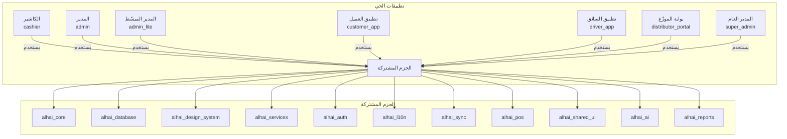

# توثيق منصة الحي (Alhai Platform)

> توثيق شامل ومفصّل لمنصة الحي - نظام نقاط البيع والتجارة الإلكترونية المتكامل للبقالات والمتاجر في المملكة العربية السعودية

---

## نظرة سريعة على المشروع

| البند | التفاصيل |
|-------|----------|
| **اسم المشروع** | منصة الحي (Alhai Platform) |
| **النوع** | نظام SaaS متعدد المستأجرين (Multi-tenant) |
| **التقنية** | Flutter + Dart (Monorepo) |
| **قاعدة البيانات** | Drift/SQLite (محلي) + Supabase/PostgreSQL (سحابي) |
| **إدارة الحالة** | Riverpod |
| **عدد التطبيقات** | 7 تطبيقات |
| **عدد الحزم المشتركة** | 11 حزمة |
| **اللغات المدعومة** | 7 لغات (العربية، الإنجليزية، الأردو، الهندية، البنغالية، الفلبينية، الإندونيسية) |
| **عدد جداول قاعدة البيانات** | 40+ جدول |
| **إجمالي أسطر التوثيق** | 10,036+ سطر |

---

## فهرس الملفات

### 1. البنية العامة للمشروع
**الملف:** [01-project-structure.md](./01-project-structure.md) (1,797 سطر)

يتضمن:
- اسم المشروع ووصفه وهدفه
- التطبيقات السبعة مع وصف تفصيلي لكل واحد
- الحزم المشتركة الـ 11 مع بنيتها الداخلية
- شجرة المجلدات الرئيسية (مقروءة من المشروع الفعلي)
- التقنيات المستخدمة مع مخطط Mermaid
- طريقة تشغيل المشروع وأوامر Melos
- متطلبات البيئة والخدمات الخارجية
- مخطط العلاقات بين الحزم
- نظام الترجمة والتصميم
- إحصائيات المنصة

---

### 2. قاعدة البيانات
**الملف:** [02-database.md](./02-database.md) (1,588 سطر)

يتضمن:
- نظرة عامة على البنية المزدوجة (Drift محلي + Supabase سحابي)
- توثيق 40+ جدول مع الأعمدة والأنواع والقيود
- العلاقات بين الجداول مع مخطط ER بـ Mermaid
- جميع الفهارس (Indexes) المُعرّفة
- توثيق 27 DAO مع دوالها
- البحث النصي الكامل (FTS5)
- دوال RPC من Supabase
- الـ Triggers والـ Enum Types
- سياسات RLS (Row Level Security)
- حاويات التخزين (Storage Buckets)

---

### 3. الصلاحيات والمصادقة
**الملف:** [03-auth-permissions.md](./03-auth-permissions.md) (1,295 سطر)

يتضمن:
- نظام المصادقة عبر Supabase Auth (OTP عبر SMS/WhatsApp)
- أنواع المستخدمين والأدوار (5 أدوار نظام + أدوار لكل متجر)
- مصفوفة الصلاحيات التفصيلية لكل دور
- نظام الحماية (Guards) والـ Middleware
- نظام التوكنات (JWT) مع التجديد التلقائي
- نظام PIN (PBKDF2-HMAC-SHA256) للكاشير
- سياسات RLS لكل جدول حسب الصلاحية
- مخططات تسلسلية (Sequence Diagrams) لتدفق المصادقة
- إدارة الجلسات
- الإجراءات الأمنية (SSL Pinning, CSRF, Audit Logging)

---

### 4. الشاشات والواجهات
**الملف:** [04-screens-ui.md](./04-screens-ui.md) (1,254 سطر)

يتضمن:
- قائمة شاملة بكل شاشة في كل تطبيق (جداول مفصّلة)
  - الكاشير (~80 مسار)
  - المدير (~120 مسار)
  - المدير المبسّط (~55 مسار)
  - تطبيق العميل (20 مسار)
  - تطبيق السائق (18 مسار)
  - بوابة الموزّع (7 مسارات)
  - المدير العام (9 مسارات)
- تدفقات المستخدم (User Flows) بمخططات Mermaid:
  - عملية البيع، إضافة منتج، إدارة المخزون
  - تسجيل عميل، عملية التوصيل، عملية الدفع
- نظام التنقل (GoRouter) مع الحماية
- نظام التصميم (الألوان، الخطوط، المكونات، الاستجابة)
- دعم RTL والوضع الداكن

---

### 5. الخدمات والـ API
**الملف:** [05-services-api.md](./05-services-api.md) (1,244 سطر)

يتضمن:
- قائمة بـ 40+ خدمة مع وصف كل واحدة
- مصادر البيانات البعيدة (13 Remote DataSource)
- الـ Edge Functions (3 دوال Supabase)
- نظام المزامنة (Sync) مع مخطط تسلسلي
- نظام الدفع والفوترة مع إدارة الورديات
- تكامل ZATCA (الفوترة الإلكترونية السعودية)
- نظام الإشعارات
- نظام تخزين الملفات (Supabase Storage + Cloudflare R2)
- نظام الطباعة (ESC/POS)
- تكامل WhatsApp API
- خدمة الباركود (EAN-13, UPC-A, QR, etc.)
- خدمات الذكاء الاصطناعي (OCR, التنبؤات, تحليل المشاعر)

---

### 6. البنية المعمارية وإدارة الحالة
**الملف:** [06-architecture.md](./06-architecture.md) (1,243 سطر)

يتضمن:
- نظرة عامة مع مخطط Mermaid للبنية الكاملة
- طبقات Clean Architecture (العرض، المنطق، البيانات، البنية التحتية)
- توثيق جميع الـ Providers (100+) مصنّفة في 15 فئة
- نظام حقن التبعيات (GetIt + Injectable)
- نمط المستودع (Repository Pattern) مع التنفيذ المحلي والبعيد
- مصادر البيانات (55+ جدول Drift، 13+ DAO، 13 Remote DataSource)
- نظام معالجة الأخطاء (AppException hierarchy)
- نظام التسجيل (ProductionLogger) مع 5 مستويات و3 أنواع مخرجات
- استراتيجية العمل بدون إنترنت (Offline-First) مع مخطط تسلسلي
- نظام الكاش والتخزين المؤقت (4 طبقات)

---

### 7. دليل المطور الجديد
**الملف:** [07-developer-guide.md](./07-developer-guide.md) (1,615 سطر)

يتضمن:
- خطوات إعداد البيئة من الصفر (Flutter, Dart, IDE, Melos)
- كيفية تشغيل كل تطبيق (Web, Android, iOS)
- دليل خطوة بخطوة: إضافة شاشة جديدة
- دليل خطوة بخطوة: إضافة جدول Drift جديد
- دليل خطوة بخطوة: إضافة خدمة جديدة
- دليل خطوة بخطوة: إضافة ترجمة جديدة
- جميع أوامر Melos المهمة (15+ أمر)
- بناء الإنتاج (Web, Android, iOS) مع CI/CD
- قواعد الكود وأنماط Lint
- كيفية كتابة الاختبارات (Unit, Widget, Golden, ARB)
- 10 أخطاء شائعة وحلولها
- قائمة المتغيرات البيئية (.env)
- أوامر Drift/build_runner
- نصائح وأفضل الممارسات

---

## التطبيقات السبعة

---

## كيف تبدأ؟

إذا كنت مطوراً جديداً في الفريق، اتبع هذا الترتيب:

1. **ابدأ بـ** [دليل المطور الجديد](./07-developer-guide.md) - لإعداد بيئتك وتشغيل المشروع
2. **اقرأ** [البنية العامة](./01-project-structure.md) - لفهم هيكل المشروع والتطبيقات
3. **اطّلع على** [البنية المعمارية](./06-architecture.md) - لفهم أنماط الكود وإدارة الحالة
4. **راجع** [قاعدة البيانات](./02-database.md) - لفهم الجداول والعلاقات
5. **استكشف** [الشاشات والواجهات](./04-screens-ui.md) - لفهم تدفقات المستخدم
6. **اطّلع على** [الخدمات والـ API](./05-services-api.md) - لفهم الخدمات المتاحة
7. **راجع** [الصلاحيات والمصادقة](./03-auth-permissions.md) - لفهم نظام الأمان

---

## إحصائيات التوثيق

| الملف | عدد الأسطر | الموضوع |
|-------|-----------|---------|
| `01-project-structure.md` | 1,797 | البنية العامة |
| `02-database.md` | 1,588 | قاعدة البيانات |
| `03-auth-permissions.md` | 1,295 | الصلاحيات والمصادقة |
| `04-screens-ui.md` | 1,254 | الشاشات والواجهات |
| `05-services-api.md` | 1,244 | الخدمات والـ API |
| `06-architecture.md` | 1,243 | البنية المعمارية |
| `07-developer-guide.md` | 1,615 | دليل المطور |
| **المجموع** | **10,036+** | **توثيق شامل** |

---

## ملاحظات مهمة

- جميع الملفات مكتوبة **بالعربية بالكامل**
- التوثيق مبني على **قراءة الكود الفعلي** من المشروع (ليس تخميناً)
- تم استخدام **مخططات Mermaid** للرسوم البيانية
- تم استخدام **جداول Markdown** لتنظيم البيانات
- لم يتم تعديل أي ملف من ملفات الكود المصدري

---

> **آخر تحديث:** 2026-02-28
>
> **تم إنشاؤه بواسطة:** Claude Code (Opus 4.6)
