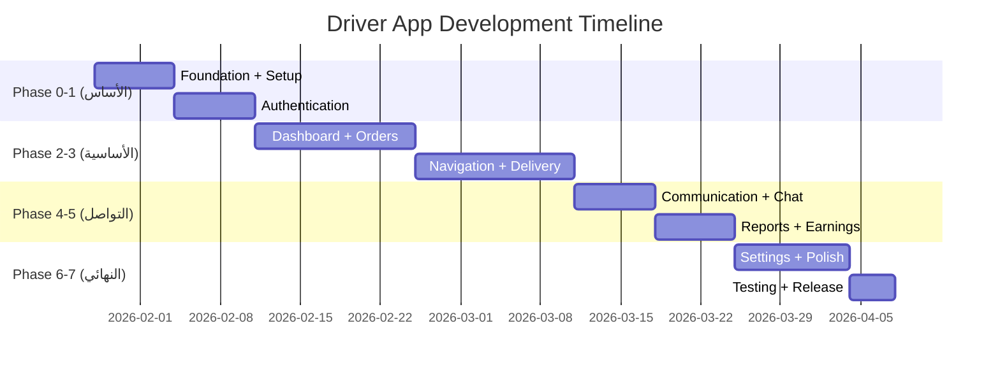

# 🚗 Driver App - Implementation Plan

> **Version:** 1.0.0 | **Date:** 2026-01-28 | **Status:** 📋 Planning Complete

---

## 📌 نظرة عامة

**التطبيق:** تطبيق المناديب لإدارة التوصيلات والأرباح  
**المنصة:** Mobile Only (iOS + Android)  
**إجمالي الشاشات:** 18 شاشة  
**إجمالي المهام:** 40 مهمة  
**المدة الإجمالية:** 10 أسابيع  
**إجمالي الساعات:** ~280 ساعة  
**اللغات:** 6 لغات (عربي، إنجليزي، أردو، هندي، إندونيسي، بنغالي)

---

## 🎯 الأهداف الرئيسية

1. ✅ قبول/رفض الطلبات (صوت/نص)
2. ✅ تتبع GPS وملاحة
3. ✅ إثبات التسليم (4 طبقات: كود + صورة + توقيع + GPS)
4. ✅ محادثة مع ترجمة تلقائية (6 لغات)
5. ✅ تتبع الأرباح والتقارير
6. ✅ إدارة الورديات

---

## 📅 الجدول الزمني

---

## 🔢 تفاصيل المراحل

### Phase 0: Foundation + Setup (الأسبوع 1)
**الساعات:** 32h | **الأولوية:** P0

| المهمة | الساعات |
|--------|---------|
| Project setup + DI + Router | 6h |
| Supabase + Models | 6h |
| Multi-language setup (6 lang) | 8h |
| Google Maps SDK | 8h |
| FCM + APNs | 4h |

---

### Phase 1: Authentication (الأسبوع 2)
**الساعات:** 24h | **الأولوية:** P0

| المهمة | الساعات | Route |
|--------|---------|-------|
| Language Selection | 4h | `/language` |
| Login + OTP | 8h | `/login` |
| Profile Setup | 6h | `/setup` |
| Biometric auth | 4h | - |
| Auth state | 2h | - |

---

### Phase 2: Dashboard + Orders (الأسبوع 3-4)
**الساعات:** 48h | **الأولوية:** P0

| المهمة | الساعات | Route |
|--------|---------|-------|
| Home Dashboard | 12h | `/home` |
| Active Deliveries | 8h | `/deliveries/active` |
| Shift Schedule | 8h | `/shifts` |
| Earnings Summary | 8h | `/earnings` |
| New Order | 10h | `/orders/new/:id` |
| Order Details | 6h | `/orders/:id` |
| Bottom Navigation | 4h | - |
| Real-time notifications | 6h | - |

---

### Phase 3: Navigation + Delivery (الأسبوع 5-6)
**الساعات:** 48h | **الأولوية:** P0

| المهمة | الساعات | Route |
|--------|---------|-------|
| Navigation screen | 16h | `/navigate/:orderId` |
| GPS tracking service | 8h | - |
| Delivery Proof | 16h | `/deliver/:orderId` |
| Photo capture | 4h | - |
| Signature pad | 4h | - |
| Location updates | 6h | - |

---

### Phase 4: Communication + Chat (الأسبوع 7)
**الساعات:** 32h | **الأولوية:** P0/P1

| المهمة | الساعات | Route |
|--------|---------|-------|
| Chat screen | 14h | `/chat/:orderId` |
| Quick Messages | 4h | `/messages/quick` |
| Voice recording | 6h | - |
| Auto-translation | 8h | - |

---

### Phase 5: Reports + Earnings (الأسبوع 8)
**الساعات:** 32h | **الأولوية:** P0/P1

| المهمة | الساعات | Route |
|--------|---------|-------|
| Daily Summary | 8h | `/reports/daily` |
| Weekly Report | 8h | `/reports/weekly` |
| Monthly Earnings | 8h | `/reports/monthly` |
| PDF export | 6h | - |

---

### Phase 6: Settings + Polish (الأسبوع 9-10)
**الساعات:** 40h | **الأولوية:** P1

| المهمة | الساعات | Route |
|--------|---------|-------|
| Profile & Preferences | 8h | `/settings/profile` |
| Help & Support | 6h | `/settings/help` |
| Notification settings | 4h | - |
| Design System polish | 6h | - |
| Dark mode | 4h | - |

---

### Phase 7: Testing + Release (الأسبوع 10)
**الساعات:** 24h | **الأولوية:** P1

| المهمة | الساعات |
|--------|---------|
| Unit tests | 6h |
| Integration tests | 8h |
| Performance testing | 4h |
| Final polish | 6h |

---

## 📱 قائمة الشاشات

| # | الشاشة | Route | الأولوية |
|---|--------|-------|----------|
| 1 | Language Selection | `/language` | P0 |
| 2 | Login | `/login` | P0 |
| 3 | Profile Setup | `/setup` | P0 |
| 4 | Home Dashboard | `/home` | P0 |
| 5 | Active Deliveries | `/deliveries/active` | P0 |
| 6 | Shift Schedule | `/shifts` | P1 |
| 7 | Earnings Summary | `/earnings` | P0 |
| 8 | New Order | `/orders/new/:id` | P0 |
| 9 | Order Details | `/orders/:id` | P0 |
| 10 | Navigation | `/navigate/:orderId` | P0 |
| 11 | Delivery Proof | `/deliver/:orderId` | P0 |
| 12 | Chat | `/chat/:orderId` | P0 |
| 13 | Quick Messages | `/messages/quick` | P1 |
| 14 | Daily Summary | `/reports/daily` | P0 |
| 15 | Weekly Report | `/reports/weekly` | P1 |
| 16 | Monthly Earnings | `/reports/monthly` | P1 |
| 17 | Profile & Preferences | `/settings/profile` | P0 |
| 18 | Help & Support | `/settings/help` | P1 |

---

## 💰 نماذج الدفع

| النموذج | الراتب الثابت | العمولة | المكافآت |
|---------|--------------|---------|----------|
| **Salary** | 3,000 ر.س/شهر | 5 ر.س/توصيلة | - |
| **Commission** | - | 15 ر.س/توصيلة | نفس اليوم +5, On-time +5, 5⭐ +10 |
| **Hybrid** ⭐ | 2,000 ر.س/شهر | 10 ر.س/توصيلة | On-time +5, 5⭐ +10 |

---

## 🌐 اللغات المدعومة

| اللغة | الاتجاه | الحالة |
|-------|---------|--------|
| 🇸🇦 العربية | RTL | ✅ |
| 🇬🇧 English | LTR | ✅ |
| 🇵🇰 اردو | RTL | ⏳ |
| 🇮🇳 हिंदी | LTR | ⏳ |
| 🇮🇩 Indonesia | LTR | ⏳ |
| 🇧🇩 বাংলা | LTR | ⏳ |

---

## 🔗 نقاط التكامل

| الخدمة | الاستخدام |
|--------|----------|
| Supabase | Auth, DB, Realtime |
| Google Maps SDK | خرائط، ملاحة |
| Google Directions API | اتجاهات |
| Google Cloud Translation | ترجمة تلقائية |
| Google Speech-to-Text | تحويل صوت لنص |
| Cloudflare R2 | صور، رسائل صوتية |
| FCM + APNs | الإشعارات |

---

## ✅ معايير الأداء

| المعيار | الهدف |
|---------|-------|
| App Launch | < 2 ثانية |
| GPS Accuracy | ± 10 متر |
| Battery Usage | < 5%/ساعة |
| Network | يعمل على 3G+ |

---

## 📚 المراجع

- [PRD_FINAL.md](./PRD_FINAL.md) - 18 شاشة
- [DRIVER_SPEC.md](./DRIVER_SPEC.md) - المواصفات التقنية
- [DRIVER_UX_WIREFRAMES.md](./DRIVER_UX_WIREFRAMES.md) - التصميمات
- [COMPLETE.md](./COMPLETE.md) - Checklist
- [PROD.json](./PROD.json) - قائمة المهام

---

**آخر تحديث:** 2026-01-28
