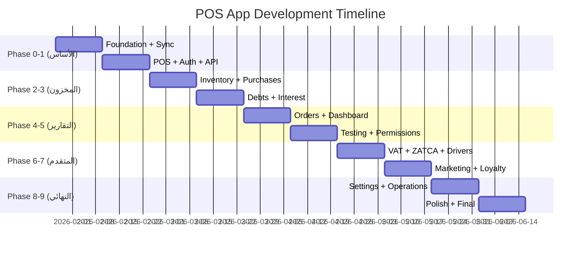

# 🛒 POS App - Implementation Plan

> **Version:** 1.0.0 | **Date:** 2026-01-28 | **Status:** 📋 Planning Complete

---

## 📌 نظرة عامة

**التطبيق:** نظام نقاط البيع (POS) لمتاجر البقالة  
**المنصة:** Desktop + Tablet (Flutter)  
**إجمالي الشاشات:** 79 شاشة  
**إجمالي المهام:** 90+ مهمة  
**المدة الإجمالية:** 20 أسبوع  
**إجمالي الساعات:** ~542 ساعة  

---

## 🎯 الأهداف الرئيسية

1. ✅ نظام بيع سريع وسهل الاستخدام
2. ✅ العمل بدون إنترنت (Offline-first)
3. ✅ إدارة الديون والفوائد
4. ✅ استيراد الفواتير بالذكاء الاصطناعي
5. ✅ التوافق مع ZATCA (الفوترة الإلكترونية)
6. ✅ التكامل مع تطبيق العملاء والسائقين

---

## 📅 الجدول الزمني

---

## 🔢 تفاصيل المراحل

### Phase 0: Foundation (الأسبوع 1-2)
**الساعات:** 48h | **الأولوية:** P0

| المهمة | الساعات | الاعتماديات |
|--------|---------|--------------|
| Project setup + DI + Router | 8h | - |
| Drift setup + Models | 8h | Setup |
| Sync Queue skeleton | 8h | Drift |
| POS Screen layout | 8h | Setup |
| Products Grid + Categories | 8h | Drift, Layout |
| Cart Panel | 8h | Layout |

---

### Phase 1: POS + Auth (الأسبوع 3-4)
**الساعات:** 52h | **الأولوية:** P0

| المهمة | الساعات | الاعتماديات |
|--------|---------|--------------|
| Splash Screen | 2h | Setup |
| Login with OTP | 5h | Splash |
| Store Select | 3h | Login |
| Basic Push/Pull Sync | 8h | Sync Queue |
| Home Dashboard | 5h | Auth |
| Payment + Customer | 8h | Cart |
| Sale + Inventory deduct | 8h | Payment |
| Receipt printing | 6h | Sale |
| Printer settings | 4h | Receipt |
| Products CRUD | 10h | Drift |

---

### Phase 2: Inventory + Purchases (الأسبوع 5-6)
**الساعات:** 64h | **الأولوية:** P1

| المهمة | الساعات |
|--------|---------|
| Inventory view + adjust | 8h |
| Suppliers CRUD | 8h |
| Manual purchase invoice | 12h |
| AI Invoice import (UI) | 8h |
| AI Backend integration | 16h |
| Review & matching screen | 12h |

---

### Phase 3: Debts + Interest (الأسبوع 7-8)
**الساعات:** 44h | **الأولوية:** P1

| المهمة | الساعات |
|--------|---------|
| Customers list | 6h |
| Customer account (Ledger) | 12h |
| Payment recording | 6h |
| Interest settings | 8h |
| Monthly close + periodKey | 12h |

---

### Phase 4: Orders + Dashboard (الأسبوع 9-10)
**الساعات:** 56h | **الأولوية:** P1

| المهمة | الساعات |
|--------|---------|
| Orders list + details | 12h |
| Order status + Reservation | 12h |
| Dashboard | 12h |
| Sales report | 8h |
| Debts report | 6h |
| PDF export | 6h |

---

### Phase 5: Testing + Permissions (الأسبوع 11-12)
**الساعات:** 60h | **الأولوية:** P1

| المهمة | الساعات |
|--------|---------|
| Sync improvements | 12h |
| Background sync | 6h |
| Role-based permissions | 8h |
| Audit log | 6h |
| Unit tests | 12h |
| Widget tests | 8h |
| Bug fixes | 8h |

---

### Phase 6: Advanced Features (الأسبوع 13-14)
**الساعات:** 54h | **الأولوية:** P1

| المهمة | الساعات |
|--------|---------|
| VAT Report | 8h |
| ZATCA Integration | 12h |
| Drivers management | 12h |
| Driver assignment | 6h |
| Smart Reorder | 16h |

---

### Phase 7: Marketing + Loyalty (الأسبوع 15-16)
**الساعات:** 60h | **الأولوية:** P2

| المهمة | الساعات |
|--------|---------|
| WhatsApp Integration | 12h |
| Smart Promotions | 12h |
| Geo-Fencing | 12h |
| Loyalty Program | 16h |
| Supplier Marketplace | 8h |

---

### Phase 8: Settings + Operations (الأسبوع 17-18)
**الساعات:** 52h | **الأولوية:** P2

| المهمة | الساعات |
|--------|---------|
| General Settings | 8h |
| Store Settings | 8h |
| Payment Devices | 16h |
| Hold Invoice | 8h |
| Returns | 12h |

---

### Phase 9: Final Polish (الأسبوع 19-20)
**الساعات:** 52h | **الأولوية:** P2

| المهمة | الساعات |
|--------|---------|
| Cash Drawer | 12h |
| Expiry Tracking | 12h |
| Expiry Alerts | 8h |
| Integration tests | 12h |
| Final polish | 8h |

---

## 📱 قائمة الشاشات حسب الأولوية

### P0 - الأساسيات (17 شاشة)

| # | الشاشة | المسار | الـ Phase |
|---|--------|--------|-----------|
| 1 | Splash | `/splash` | 1 |
| 2 | Login | `/login` | 1 |
| 3 | Store Select | `/store-select` | 1 |
| 4 | Home Dashboard | `/home` | 1 |
| 5 | POS Screen | `/pos` | 0 |
| 6 | Product Search | `/pos/search` | 1 |
| 7 | Cart | `/pos/cart` | 0 |
| 8 | Payment | `/pos/payment` | 1 |
| 9 | Receipt | `/pos/receipt` | 1 |
| 10 | Products List | `/products` | 1 |
| 11 | Product Detail | `/products/:id` | 1 |
| 12 | Add Product | `/products/add` | 1 |
| 13 | Offline Indicator | (global) | 1 |
| 14 | Print Queue | `/print-queue` | 1 |
| 15 | General Settings | `/settings/general` | 8 |
| 16 | Store Settings | `/settings/store` | 8 |
| 17 | ZATCA Settings | `/settings/zatca` | 6 |

### P1 - الوظائف الكاملة (29 شاشة)

| # | الشاشة | التصنيف |
|---|--------|---------|
| 1-5 | Suppliers CRUD + Purchase | Purchases |
| 6-10 | Customers + Debts | CRM |
| 11-12 | Orders | Orders |
| 13-17 | Reports | Reports |
| 18-22 | Settings | Settings |
| 23-29 | Drivers + Shifts | Operations |

### P2-P3 - ميزات إضافية (33 شاشة)

- Promotions (4)
- Loyalty (2)
- WhatsApp (2)
- Hardware Integration (5)
- Advanced Reports (6)
- User Management (4)
- Backup (2)
- Expenses (2)
- Inventory Count (2)
- Other (4)

---

## 🔗 نقاط التكامل

### مع الحزم المشتركة

| الحزمة | المهام المرتبطة |
|--------|-----------------|
| `alhai_core` | Models, Utils, Constants |
| `alhai_services` | APIs, Supabase, Storage |
| `alhai_design_system` | UI Components, Theme |

### مع التطبيقات الأخرى

| التطبيق | نقاط التكامل |
|---------|--------------|
| `customer_app` | Orders sync, Stock availability |
| `driver_app` | Driver assignment, Delivery status |
| `admin_pos` | Reports sync, User management |
| `super_admin` | Store management, Permissions |

### مع الخدمات الخارجية

| الخدمة | الاستخدام |
|--------|----------|
| Supabase | Auth, DB, Realtime |
| Cloudflare R2 | Images storage |
| WhatsApp API | Digital receipts, Notifications |
| ZATCA | E-invoicing |
| mada/STC Pay | Payment terminals |

---

## ⚠️ المخاطر والتحديات

### تقنية

| المخاطر | التخفيف |
|---------|---------|
| Offline sync conflicts | Conflict resolution UI + clear rules |
| Printer compatibility | Abstract printer interface |
| ZATCA compliance | Early integration + testing |

### عملية

| المخاطر | التخفيف |
|---------|---------|
| WhatsApp API approval | Start Meta verification early |
| Payment terminal integration | Phased rollout per provider |

---

## ✅ معايير القبول

### MVP (Phase 0-5)
- [ ] إتمام عملية بيع كاملة
- [ ] العمل بدون إنترنت
- [ ] طباعة الفواتير
- [ ] إدارة المخزون
- [ ] إدارة الديون

### Full Release (Phase 6-9)
- [ ] ZATCA QR codes
- [ ] تقارير الضريبة
- [ ] نقاط الولاء
- [ ] WhatsApp integration

---

## 📝 ملاحظات للتنفيذ

1. **Offline-first:** كل عملية تُحفظ محلياً أولاً
2. **Sync Queue:** جميع التغييرات تمر عبر queue موحد
3. **Permissions:** التحقق في الـ UI + الـ API
4. **Audit Log:** تسجيل كل العمليات الحساسة
5. **Error Handling:** رسائل واضحة + retry logic

---

## 📚 المراجع

- [POS_APP_SPEC.md](./POS_APP_SPEC.md) - المواصفات التفصيلية
- [POS_BACKLOG.md](./POS_BACKLOG.md) - قصص المستخدم
- [POS_SITEMAP.md](./POS_SITEMAP.md) - خريطة الشاشات
- [POS_API_CONTRACT.md](./POS_API_CONTRACT.md) - عقد الـ API
- [PROD.json](./PROD.json) - قائمة المهام JSON

---

**آخر تحديث:** 2026-01-28
