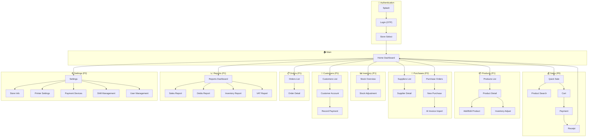
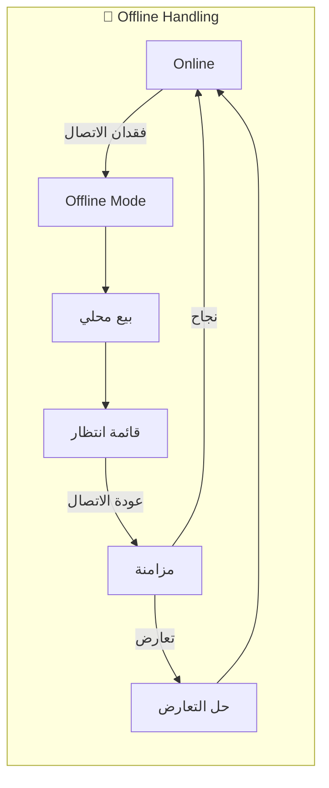
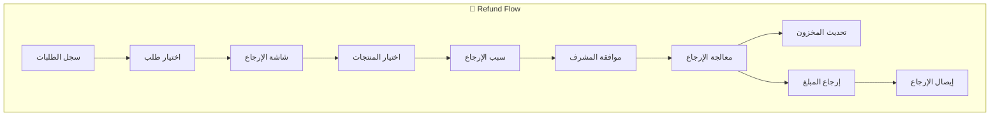
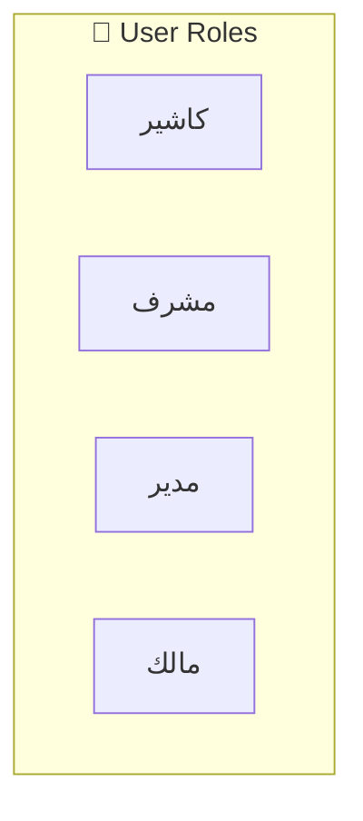
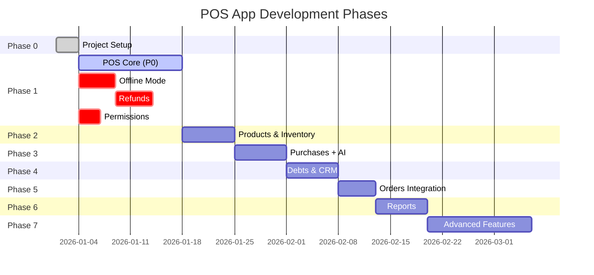

# POS App Sitemap

**Version:** 1.5.0 (Synced with Backlog v1.3.1)  
**Date:** 2026-01-20  
**Total Screens:** 92 (Sprint A: 18 stories, Sprint B: 16 stories)  
**Source:** POS_BACKLOG.md v1.3.1

---

## 🗺️ Visual Sitemap



---

## 📱 Screens by Priority

### P0 - الأساسيات (13 شاشة)

| # | Screen | Flow |
|---|--------|------|
| 1 | Splash | Entry |
| 2 | Login (OTP) | Auth |
| 3 | Store Select | Auth |
| 4 | Home Dashboard | Navigation |
| 5 | Quick Sale | Sales |
| 6 | Product Search | Sales |
| 7 | Cart | Sales |
| 8 | Payment | Sales |
| 9 | Receipt | Sales |
| 10 | Products List | Inventory |
| 11 | Product Detail | Inventory |
| 12 | Add/Edit Product | Inventory |
| 13 | Inventory Adjust | Inventory |

---

### P1 - الوظائف الكاملة (29 شاشة)

| # | Screen | Category |
|---|--------|----------|
| 1 | Suppliers List | Purchases |
| 2 | Supplier Detail | Purchases |
| 3 | Add Supplier | Purchases |
| 4 | Purchase Order | Purchases |
| 5 | AI Import | Purchases |
| 6 | Customers List | CRM |
| 7 | Customer Account | CRM |
| 8 | Record Payment | CRM |
| 9 | Interest Settings | CRM |
| 10 | Month Close | CRM |
| 11 | Orders List | Orders |
| 12 | Order Detail | Orders |
| 13 | Reports Dashboard | Reports |
| 14 | Sales Report | Reports |
| 15 | Debts Report | Reports |
| 16 | Inventory Report | Reports |
| 17 | Settings | Settings |
| 18 | Store Info | Settings |
| 19 | Printer Settings | Settings |
| + | ... (11 more) | Various |

---

### P2 - ميزات إضافية (18 شاشة)

| Category | Screens |
|----------|---------|
| VAT & Compliance | VAT Report, ZATCA Settings |
| Promotions | Promotions List, Add Promotion |
| Loyalty | Points Dashboard, Customer Points |
| Shift Management | Shift Open/Close, Cashier Switch |
| Hardware | Scale Connect, Cash Drawer |

---

### P3 - ميزات متقدمة (5 شاشات)

- Receipt Designer
- Activity Logs
- Performance Reports
- Referral Settings
- Advanced Analytics

---

## ⚠️ Critical Features (Consultant Review)

> **تم إضافة هذا القسم بناءً على تقييم استشاري لأنظمة نقاط البيع**

### 🔌 Offline Mode (P0 - حرج)



**الشاشات المطلوبة:**

| # | Screen | Priority | Description |
|---|--------|----------|-------------|
| 1 | Offline Indicator | P0 | شريط علوي يوضح حالة الاتصال |
| 2 | Pending Transactions | P0 | قائمة العمليات المعلقة |
| 3 | Sync Status | P0 | حالة المزامنة مع السيرفر |
| 4 | Conflict Resolution | P1 | معالجة تعارضات البيانات |

**السلوك:**
- البيع يستمر محلياً (SQLite)
- الإيصال يُطبع مع علامة "غير متزامن"
- عند عودة الاتصال: مزامنة تلقائية مع retry

---

### 🔄 Refunds & Returns (P0 - حرج)



**الشاشات المطلوبة:**

| # | Screen | Priority | Description |
|---|--------|----------|-------------|
| 1 | Orders History | P0 | سجل الطلبات مع بحث |
| 2 | Refund Request | P0 | طلب إرجاع منتج |
| 3 | Refund Reason | P0 | اختيار سبب الإرجاع |
| 4 | Manager Approval | P0 | موافقة المشرف (PIN) |
| 5 | Refund Receipt | P0 | إيصال الإرجاع |
| 6 | Void Transaction | P1 | إلغاء عملية كاملة |

**أسباب الإرجاع:**
- منتج تالف
- خطأ في الطلب
- تغيير رأي العميل
- منتج منتهي الصلاحية

---

### 🔐 Permissions Matrix (P0 - حرج)



**مصفوفة الصلاحيات:**

| الشاشة / العملية | كاشير | مشرف | مدير | مالك |
|------------------|:------:|:----:|:----:|:----:|
| **البيع** | ✅ | ✅ | ✅ | ✅ |
| تطبيق خصم | ❌ | ✅ | ✅ | ✅ |
| خصم > 20% | ❌ | ❌ | ✅ | ✅ |
| **الإرجاع** | ❌ | ✅ | ✅ | ✅ |
| إلغاء عملية | ❌ | ✅ | ✅ | ✅ |
| **المخزون** | 👁️ | ✅ | ✅ | ✅ |
| تعديل المخزون | ❌ | ❌ | ✅ | ✅ |
| **الموردين** | ❌ | 👁️ | ✅ | ✅ |
| **التقارير** | ❌ | 👁️ | ✅ | ✅ |
| تقرير الديون | ❌ | ❌ | ✅ | ✅ |
| **الإعدادات** | ❌ | ❌ | ⚙️ | ✅ |
| إدارة المستخدمين | ❌ | ❌ | ❌ | ✅ |
| **الوردية** | 🔓 | ✅ | ✅ | ✅ |
| إغلاق وردية غيره | ❌ | ✅ | ✅ | ✅ |
| فتح درج الكاش | ❌ | ✅ | ✅ | ✅ |

**الرموز:** ✅ = كامل، 👁️ = قراءة فقط، ⚙️ = جزئي، 🔓 = ورديته فقط، ❌ = ممنوع

**آلية التنفيذ:**
```dart
enum UserRole { cashier, supervisor, manager, owner }

extension RolePermissions on UserRole {
  bool canApplyDiscount(double percent) { ... }
  bool canProcessRefund() { ... }
  bool canAccessReports() { ... }
}
```

---

### ⚡ Edge Cases & Error Handling (P1)

**حالات الفشل الموثقة:**

| الحالة | السلوك | الشاشة |
|--------|--------|--------|
| فشل الدفع | إعادة محاولة + حفظ السلة | Payment Retry Dialog |
| تعطل الطابعة | إرسال للطابعة لاحقاً + استمرار | Print Queue |
| نفاد مخزون أثناء البيع | تنبيه + خيار الاستمرار | Stock Warning Dialog |
| انتهاء الجلسة | حفظ السلة + إعادة تسجيل | Session Expired |
| فشل المزامنة | Retry مع exponential backoff | Sync Error |

**Global Error Handling:**
```dart
class ErrorHandler {
  void handleError(AppError error) {
    switch (error.type) {
      case ErrorType.network:
        showRetryDialog();
        break;
      case ErrorType.auth:
        redirectToLogin(preserveCart: true);
        break;
      case ErrorType.validation:
        showFieldErrors();
        break;
    }
  }
}
```

---

## 🔄 Navigation Flows

### Sales Flow (Core)
```
Home → Quick Sale → Scan/Search → Add to Cart → Payment → Receipt → Home
```

### Refund Flow (NEW)
```
Home → Orders → Select Order → Refund → Select Items → Reason → Approval → Process → Receipt
```

### Debt Collection Flow
```
Home → Customers → Account → Record Payment → Receipt → Account
```

### Inventory Flow
```
Home → Products → Detail → Adjust Stock → Confirm → Detail
```

### Purchase Flow
```
Home → Suppliers → New Purchase → [Manual / AI Import] → Review → Confirm
```

### Shift Flow
```
Login → Open Shift → [Sales Operations] → Close Shift → Summary → Logout
```

### Offline Flow (NEW)
```
[Connection Lost] → Offline Mode → Local Sales → [Connection Restored] → Sync → Resolve Conflicts
```

---

## 🏠 Home Dashboard (محسّن)

**العناصر المطلوبة:**

| العنصر | النوع | الأولوية |
|--------|-------|----------|
| مبيعات اليوم | رقم | P0 |
| حالة الوردية | حالة | P0 |
| تنبيه نقص مخزون | badge | P0 |
| عمليات معلقة | badge | P0 |
| حالة الاتصال | indicator | P0 |

**اختصارات سريعة:**
- 🛒 بيع جديد
- 📷 مسح منتج
- � فتح درج الكاش (بصلاحية)
- 🔍 بحث موحد

---

## �📊 Updated Summary

| Category | Count | % |
|----------|-------|---|
| Sales (POS) | 8 | 11% |
| Products & Inventory | 11 | 15% |
| Purchases & Suppliers | 7 | 10% |
| Customers & Debts | 5 | 7% |
| Orders | 2 | 3% |
| Reports | 11 | 15% |
| Settings | 15 | 21% |
| Admin & Security | 6 | 8% |
| **Offline Mode (NEW)** | 4 | 5% |
| **Refunds (NEW)** | 6 | 8% |

**Total: 75 شاشة** (كانت 71)

---

## 🎯 Development Phases (Updated)



---

## ✅ Consultant Checklist

- [x] تدفق البيع الأساسي ✅
- [x] فصل المخزون عن المشتريات ✅
- [x] إدارة الورديات ✅
- [x] AI Invoice Import ✅
- [x] **Offline Mode** ✅ (NEW)
- [x] **Refunds & Returns** ✅ (NEW)
- [x] **Permissions Matrix** ✅ (NEW)
- [x] **Edge Cases Handling** ✅ (NEW)

---

## 📋 Implementation Notes (Final Review)

### 🔧 1. توحيد مصادر الحقيقة (Source of Truth)

**المشكلة:** الطلبات بعد Offline + Refunds قد تتكرر

**الحل:**
```dart
// كل عملية لها UUID فريد
final orderId = Uuid().v4();

// Idempotency key في السيرفر
headers: {
  'Idempotency-Key': orderId,
}
```

**القاعدة:**
- كل Order/Payment/Refund له UUID يُولّد محلياً
- السيرفر يرفض العمليات المكررة بنفس الـ key
- الـ Sync يعتمد على الـ UUID وليس الوقت

---

### 🔧 2. التقارير بعد Offline

**السياسة:**
```
Local (Provisional) → Server (Authoritative)
```

| التقرير | Offline | Online |
|---------|---------|--------|
| مبيعات اليوم | ✅ محلي (تقريبي) | ✅ سيرفر (دقيق) |
| المخزون | ✅ محلي (قد يختلف) | ✅ سيرفر (نهائي) |
| الديون | ❌ غير متاح | ✅ سيرفر فقط |

**السلوك:**
- علامة ⚠️ على التقارير أثناء Offline
- رسالة "البيانات غير محدثة"
- تحديث تلقائي عند عودة الاتصال

---

### 🔧 3. ترتيب Home Dashboard

**الأولوية البصرية (من الأعلى للأسفل):**

```
┌─────────────────────────────────────┐
│ 🔴/🟢 حالة الاتصال (Offline/Online) │  ← الأهم
├─────────────────────────────────────┤
│ 🕐 الوردية: مفتوحة (3 ساعات)        │
├─────────────────────────────────────┤
│ ⚠️ 3 عمليات معلقة                   │  ← تنبيه
├─────────────────────────────────────┤
│ 💰 مبيعات اليوم: 1,250 ر.س          │
│     📦 23 طلب                       │
├─────────────────────────────────────┤
│ [🛒 بيع] [📷 مسح] [💵 درج] [🔍 بحث] │  ← Quick Actions
└─────────────────────────────────────┘
```

---

### 🔧 4. ضبط العدد النهائي للشاشات

**القاعدة الذهبية:**
> **لا تُضاف أي شاشة جديدة قبل الإطلاق الأول**

| الفئة | العدد | ملاحظة |
|-------|-------|--------|
| P0 (حرج) | 17 | يشمل Offline + Refunds |
| P1 (أساسي) | 29 | وظائف كاملة |
| P2 (إضافي) | 18 | بعد الإطلاق |
| P3 (متقدم) | 11 | مستقبلي |
| **الإجمالي** | **75** | مُثبّت |

**إدارة الطلبات الجديدة:**
- أي طلب شاشة جديدة → Backlog
- مراجعة بعد MVP
- لا إضافات قبل Sprint 4

---

## � Critical Pre-Implementation Notes (v1.3.0)

> **يجب تثبيت هذه الملاحظات قبل بدء التنفيذ**

---

### 📝 1. تعريفات الكيانات (Entity Definitions)

| الكيان | التعريف | الحالات |
|--------|---------|---------|
| **Order** | فاتورة/سلة نهائية (items + totals) | created, confirmed, completed, cancelled, refunded |
| **Payment Transaction** | عملية دفع منفصلة | pending, completed, failed, refunded |
| **Receipt** | مخرجات طباعة/عرض | draft, printed, reprinted |
| **Refund** | عملية إرجاع مرتبطة بـ Order | requested, approved, processed |
| **Shift** | وردية كاشير | open, closed |
| **Cash Movement** | إدخال/إخراج نقدي من الصندوق | in, out |

**العلاقات:**
```
Shift (1) ──→ (N) Orders
Shift (1) ──→ (N) Cash Movements
Order (1) ──→ (N) Payment Transactions
Order (1) ──→ (1) Receipt
Order (1) ──→ (N) Refunds
Refund (1) ──→ (1) Refund Receipt
```

**Shift Model:**
```dart
class Shift {
  String id;
  String storeId;
  String cashierId;
  double openingCash;
  double? closingCash;
  double? expectedCash;    // calculated from sales
  double? cashDifference;
  ShiftStatus status;      // open, closed
  DateTime openedAt;
  DateTime? closedAt;
}
```

**Cash Movement (P0):**
```dart
class CashMovement {
  String id;
  String shiftId;
  CashMovementType type;  // in, out
  double amount;
  String reason;          // e.g., "فكة", "صرفيات", "تزويد"
  String? approvedBy;     // supervisor PIN
  DateTime createdAt;
}
```

**Mixed Payment (P0):**
> مسموح: Cash + Card في نفس الفاتورة

```dart
// Order can have multiple payments
Order order = await createOrder(items);
await addPayment(orderId, PaymentMethod.cash, 50.0);
await addPayment(orderId, PaymentMethod.card, 75.0);
// Total paid = 125.0
```

---

### 📦 2. سياسة المخزون Offline

**القاعدة:**
> اسمح بالبيع حتى لو المخزون المحلي سالب (ضمن حد حسب الفئة)

| فئة المنتج | الحد السالب | السلوك |
|------------|------------|--------|
| Grocery (عادي) | -5 | تحذير + بيع مسموح |
| High-Value (سجائر/إلكترونيات) | 0 | منع مطلق عند الصفر |
| Perishable (قابل للتلف) | -2 | تحذير قوي |

| الحالة (Grocery) | السلوك |
|------------------|--------|
| المخزون ≥ 1 | ✅ بيع عادي |
| المخزون = 0 | ⚠️ تحذير + بيع مسموح |
| المخزون = -1 إلى -5 | ⚠️ تحذير قوي + بيع مسموح |
| المخزون < -5 | 🚫 منع البيع + تنبيه المدير |

```dart
enum ProductRiskCategory { grocery, highValue, perishable }

int getNegativeLimit(ProductRiskCategory cat) {
  switch (cat) {
    case ProductRiskCategory.grocery: return -5;
    case ProductRiskCategory.highValue: return 0;
    case ProductRiskCategory.perishable: return -2;
  }
}

bool canSell(int localStock, int quantity, ProductRiskCategory cat) {
  return (localStock - quantity) >= getNegativeLimit(cat);
}
```

---

### ⚔️ 3. قواعد حل التعارض (Conflict Resolution)

> **القاعدة الذهبية:** التعارضات تُعرض للمشرف/المدير فقط. الكاشير يتابع البيع بدون تدخل.

| نوع البيانات | القاعدة | المعالج |
|--------------|---------|--------|
| **المبيعات** | لا تُلغى أبداً | تلقائي |
| **المخزون** | السيرفر = المرجع | المدير (تسوية) |
| **الأسعار** | آخر manager/owner ينتصر | المدير |
| **العملاء/الديون** | سيرفر فقط | - |
| **الورديات** | محلي ثم سيرفر confirms | تلقائي |

**سلوك الكاشير:**
- يرى فقط "✓ تمت المزامنة" أو "⏳ يُعالج"
- لا تظهر له تفاصيل التعارض
- يستمر في البيع بدون انتظار

**سلوك المشرف/المدير:**
- يرى قائمة التعارضات في Dashboard
- يقرر الحل لكل تعارض
- Badge يظهر عدد التعارضات المعلقة

```dart
class ConflictHandler {
  void handleConflict(Conflict c, UserRole role) {
    if (role == UserRole.cashier) {
      // Queue for supervisor, continue selling
      conflictQueue.add(c);
      return;
    }
    // Show resolution UI for supervisor/manager
    showConflictResolutionDialog(c);
  }
}
```

---

### 🔄 4. أنواع الإرجاع (Refund Types)

| النوع | التعريف | التأثير على المخزون | P |
|-------|---------|---------------------|---|
| **Return** | إرجاع صنف | +1 (اختياري) | P0 |
| **Exchange** | إرجاع + بيع جديد | ±0 | P0 |
| **Void** | إلغاء كامل قبل الإغلاق | لا تأثير | P0 |
| **Partial Refund** | إرجاع جزء من المبلغ | 0 | P1 |

**Exchange Flow (مدمج في Refund Request):**
```
Refund Request → [Return | Exchange | Void]
              ↓
         Exchange → Add New Items → Net Payment/Refund
```

---

### 🖨️ 5. Print Queue (مرفوع إلى P0)

**السبب:** تعطل الطابعة يحدث يومياً

**المكونات:**
| العنصر | الوصف | P |
|--------|-------|---|
| Print Queue | قائمة الطباعة المعلقة | P0 |
| Reprint | إعادة طباعة إيصال | P0 |
| Print Status | حالة الطابعة | P0 |
| Print Settings | إعدادات الطابعة | P1 |

**السلوك:**
- فشل الطباعة → حفظ في Queue
- Receipt تظهر حتى بدون طباعة
- زر "إعادة طباعة" متاح دائماً

---

### 📅 6. Month Close Policy (معدّل)

**القواعد:**

| القاعدة | القيمة |
|---------|--------|
| تنفيذ Month Close | Server-only |
| تعديل فواتير شهر مقفول | ممنوع |
| Interest Settings | Server-only |

**Late Sync (مُصحح):**
> العملية تُسجل **بتاريخ الحدث الحقيقي** (وقت البيع) وليس تاريخ المزامنة

```
عمليات Offline بتاريخ شهر مقفول →
  ├─ تُسجل بتاريخ الحدث الأصلي
  ├─ حالة الترحيل: "late_posted"
  └─ تظهر في تقرير "Late Posted Transactions"
```

**الفائدة:**
- لا تشوه في الأرقام الشهرية
- سهولة المراجعة المحاسبية
- توافق ضريبي (ZATCA)

---

### 📆 7. إعادة هيكلة Phase 1 (Sprint A + B)

**Phase 1 قبل (14 يوم):**
```
POS Core + Offline + Refunds + Permissions (متداخلة)
```

**Phase 1 بعد (Sprint A + B):**

#### Sprint A (7 أيام) - الأساسيات
| المهمة | الأولوية |
|--------|----------|
| Sales Flow (Quick Sale → Cart → Payment → Receipt) | P0 |
| Permissions (Role-based navigation) | P0 |
| Print Queue + Reprint | P0 |
| Offline Indicator (basic) | P0 |
| Basic Audit Log (price/stock/refund) | P0 |

#### Sprint B (7 أيام) - المتانة
| المهمة | الأولوية |
|--------|----------|
| Pending Queue + Sync | P0 |
| Refunds (Return + Exchange + Void) | P0 |
| Conflict Resolution | P0 |
| Retry/Errors (Global Handler) | P0 |
| Device Time Lock | P0 |

---

### 🔒 إضافات أمنية (Security Additions)

#### A) Audit Log المبكر (P0)

| الحدث | يُسجل |
|-------|-------|
| تعديل السعر | من + متى + القيمة القديمة/الجديدة |
| Refund | من + السبب + المبلغ |
| تعديل المخزون | من + النوع + الكمية |
| فتح درج الكاش | من + متى |
| تسجيل دخول/خروج | من + الجهاز |

#### B) Device Time Lock (P0)

```dart
class TimeValidator {
  DateTime? lastServerTime;
  
  bool isDeviceTimeValid() {
    if (lastServerTime == null) return true;
    final drift = DateTime.now().difference(lastServerTime!);
    return drift.abs() < Duration(minutes: 5);
  }
  
  void syncServerTime(DateTime serverTime) {
    lastServerTime = serverTime;
  }
}
```

**السلوك:**
- عند الاتصال: sync server time
- انحراف > 5 دقائق: تحذير + طلب تصحيح
- انحراف > 1 ساعة: منع العمليات

---

## 📊 إعادة تصنيف الأولويات (Final)

### مرفوع إلى P0:
- ✅ Print Queue / Reprint
- ✅ Exchange (ضمن Refunds)
- ✅ Basic Audit Log
- ✅ Device Time Lock

### Server-Only (لا يعمل Offline):
- ❌ Debts Report
- ❌ Month Close
- ❌ Interest Settings
- ❌ User Management

### P0 النهائي (19 شاشة):
| الفئة | العدد |
|-------|-------|
| Auth | 3 |
| Sales | 5 |
| Receipt + Print | 3 |
| Refunds | 4 |
| Offline | 4 |

---

## 🚀 الخطوات التالية المقترحة

| # | الخيار | الوصف | الحالة |
|---|--------|-------|--------|
| 1 | **Backlog تنفيذي** | Epics → Stories (Sprint A + B) | ✅ مكتمل |
| 2 | **Data Model** | ERD مع Order/Payment/Refund/Sync | ⏳ متاح |
| 3 | **UX Review** | تحليل 30 ثانية ذروة | ⏳ متاح |

> **ملف الـ Backlog:** [POS_BACKLOG.md](./POS_BACKLOG.md)

---

**Version:** 1.4.0 (Final + Backlog Ready)  
**Date:** 2026-01-20  
*Generated from POS_APP_SPEC.md v2.0 and POS_FLOW_SPEC.md v1.0.0*
