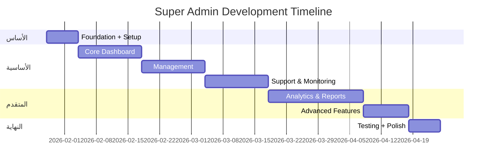

# 👑 Super Admin - Implementation Plan

> **Version:** 1.0.0 | **Date:** 2026-01-28 | **Status:** 📋 Planning Complete

---

## 📌 نظرة عامة

**التطبيق:** God Mode Dashboard لإدارة منصة Alhai كاملة  
**المنصة:** Web Only (Desktop Browser)  
**إجمالي الشاشات:** 52 شاشة (+7 B2B)  
**إجمالي المهام:** 50+ مهمة  
**المدة الإجمالية:** 12 أسبوع  
**إجمالي الساعات:** ~400 ساعة  

---

## 🎯 المفهوم الأساسي

**Super Admin = عينك على كل شيء، تحكمك بكل شيء**

```
أنت ترى في مكان واحد:
├── كم بقالة مشتركة؟ (Real-time)
├── كم عميل نشط؟
├── كم طلب اليوم؟
├── كم أرباحك؟
├── من المسوق الأنشط؟
├── أي بقالة تحتاج دعم؟
└── هل في مشاكل تقنية؟
```

---

## 📅 الجدول الزمني



---

## 📱 قائمة الشاشات (52)

### Phase 1: Core Dashboard (12 شاشة)

| P0 (10) | P1 (2) |
|---------|--------|
| Main Dashboard | Real-time Map |
| Platform Analytics | Quick Actions |
| Revenue Dashboard | |
| Subscriptions | |
| Stores Directory | |
| Store Details | |
| Users Directory | |
| User Profile | |
| Alerts | |
| System Health | |

### Phase 2: Management (10 شاشات)

| P0 (5) | P1 (5) |
|--------|--------|
| Marketers | Promotions |
| Approvals | Feature Flags |
| Plans Editor | Content |
| Payments | Permissions |
| Commissions | API Keys |

### Phase 3: Support & Monitoring (8 شاشات)

| P0 (3) | P1 (5) |
|--------|--------|
| Tickets | Live Chat |
| Ticket Details | Logs |
| Security | Database |
| | API Usage |
| | Backups |

### Phase 4: Analytics & Reports (10 شاشات)

| P0 (2) | P1 (8) |
|--------|--------|
| Executive Dashboard | Cohorts |
| Financial Reports | Funnels |
| | Geographic |
| | Products |
| | Drivers |
| | Compare |
| | Custom Reports |
| | Export |

### Phase 5: Advanced (5 شاشات)

| P0 (1) | P2 (4) |
|--------|--------|
| Settings | AI Insights |
| | Automation |
| | Integrations |
| | Experiments |

---

## 👥 مستويات الوصول

| المستوى | الصلاحيات |
|---------|----------|
| **Owner (أنت)** | كل شيء |
| **Tech Lead** | System + Database (لا مالية) |
| **Support Manager** | Tickets + Refunds محدود |
| **Finance Manager** | Reports + Payments |

---

## 💰 تتبع الإيرادات

| المقياس | القيمة |
|---------|-------|
| MRR | ~66,358 ر.س/شهر |
| ARR | ~796,296 ر.س/سنة |
| Net Profit | ~43,208 ر.س/شهر |
| Target Churn | <5% |

---

## 🔗 يتحكم في

- admin_pos (106 شاشة)
- admin_pos_lite (20 شاشة)
- customer_app (80 شاشة)
- driver_app (18 شاشة)
- pos_app (79 شاشة)

**Total Platform: ~303 شاشة**

---

## ✅ المعالم (Milestones)

| الأسبوع | المعلم |
|---------|--------|
| Week 3 | Core Dashboard + Revenue ✓ |
| Week 5 | Management + Marketers ✓ |
| Week 7 | Support + Security ✓ |
| Week 10 | Analytics + Reports ✓ |
| Week 12 | Testing + Release ✓ |

---

**آخر تحديث:** 2026-01-28
